# Capítulo VII: Product Implementation, Validation & Deployment

## 7.1. Software Configuration Management.

### 7.1.1. Software Development Environment Configuration.

### 7.1.2. Source Code Management.

### 7.1.3. Source Code Style Guide & Conventions.

### 7.1.4. Software Deployment Configuration.

## 7.2. Solution Implementation.

### 7.2.1. Sprint 1

#### 7.2.1.1. Sprint Planning 1.

#### 7.2.1.2. Sprint Backlog 1

Durante este sprint, se trabajó en las funcionalidades base de acceso al ecosistema, la capa de infraestructura distribuida y en el módulo de asistencia inteligente del MVP. Específicamente, se segmentó el flujo de registro de identidades de modo que en la aplicación web solo se permita la creación de cuentas para municipalidades y en la aplicación móvil se limite exclusivamente a ciudadanos. Asimismo, se desarrolló y desplegó el microservicio de chatbot con procesamiento de lenguaje natural (NLP) integrado en la aplicación móvil, y se consolidaron los servicios core de enrutamiento, mapas analíticos, reportes comunitarios y flujos síncronos de emergencia SOS.

**Tabla de control de estado del Sprint**

| Sprint # | **Sprint 1** | | | | | | |
| :--- | :--- | :--- | :--- | :--- | :--- | :--- | :--- |
| **User Story** | | **Work-Item / Task** | | | | | |
| **Id** | **Title** | **Id** | **Title** | **Description** | **Est. (h)** | **Assigned To** | **Status** |
| **US04** | Registro de Usuarios | US04-MO-01 | Form registro ciudadano | UI en Flutter/Mobile; captura de datos personales obligatorios y DNI civil. | 4 | **Noriega Suschenko Anatoly** | Done |
| | | US04-FE-01 | Form registro municipio | UI en React/Web; campos de distrito, provincia y teléfono de contacto. | 5 | **Noriega Suschenko Anatoly** | Done |
| **US05** | Iniciar Sesión | US05-MO-01 | Login móvil ciudadano | Pantalla de inicio de sesión en Flutter; manejo de estados y persistencia local. | 3 | **Arroyo Ormeño André** | Done |
| | | US05-FE-01 | Login web municipal | Pantalla de inicio de sesión en React para autoridades; redirección al Dashboard. | 3 | **Reyes Trujillano Fabian** | Done |
| **US11** | Editar Información de Perfil | US11-MO-01 | Formulario editar perfil ciudadano | UI móvil para modificar datos telefónicos y residencia; validación en cliente. | 3 | **Guia Carrasco Pedro** | Done |
| | | US11-FE-01 | Gestión perfil municipalidad | Vista web interactiva para auditar y actualizar datos institucionales del serenazgo. | 3 | **Reyes Trujillano Fabian** | Done |
| **US12** | Recuperar Contraseña | US12-FE-01 | Interfaz recuperación email | Pantalla web para solicitar el enlace mediante el ingreso de correo electrónico. | 3 | **Arroyo Ormeño André** | Done |
| | | US12-FE-02 | Formulario nueva contraseña | Vista web transaccional para definir y confirmar la clave de acceso de forma segura. | 3 | **Arroyo Ormeño André** | Done |
| **US13** | Acceder a Mapa con Reportes | US13-FE-01 | Lienzo cartográfico central web | Integración del mapa de calor interactivo basado en Mapbox en el dashboard. | 5 | **Reyes Trujillano Fabian** | Done |
| **US14** | Acceder al Perfil de Usuario | US14-MO-01 | Vista de cuenta móvil | Renderizado de datos del ciudadano autenticado y acciones de personalización. | 2 | **Guia Carrasco Pedro** | Done|
| **US15** | Filtrar Reportes | US15-FE-01 | Controles de filtrado web | Componentes UI en consola web para clasificar incidentes por tipo, fecha y estado. | 3 | **Reyes Trujillano Fabian** | Done |
| **US16** | Buscar Ubicación en el Mapa | US16-FE-01 | Buscador predictivo web | Caja de geocodificación en el mapa web para localizar direcciones y avenidas. | 3 | **Reyes Trujillano Fabian** | Done |
| **US18** | Notificación de Éxito al Reportar | US18-MO-01 | Modal confirmación reporte | Cuadro de diálogo ilustrativo en Flutter tras registrar un incidente comunitario. | 2 | **Santillan Alvarado Melina** | Done |
| **US21** | Estado Vacío en “Mis Reportes” | US21-MO-01 | UI empty state reportes | Vista condicional y amigable si el ciudadano aún no ha aportado incidentes. | 2 | **Guia Carrasco Pedro** | Done |
| **US25** | Ver Detalles Rápidos en Mapa | US25-FE-01 | Popups informativos web | Tooltips contextuales sobre los marcadores del mapa web para ver un resumen. | 3 | **Arroyo Ormeño André** | Done |
| **US31** | Acceso como Municipalidad | US31-FE-01 | Enrutamiento Dashboard web | Restricción y renderizado de la consola web limitado a la sesión del municipio. | 4 | **Noriega Suschenko Anatoly** | Done |
| **US32** | Visualizar Reportes en Dashboard | US32-FE-01 | Gráficos analíticos web | Distribución de componentes visuales de incidencias tabuladas por distrito. | 4 | **Reyes Trujillano Fabian** | Done |
| **US35** | Ver Detalle Completo del Reporte | US35-FE-01 | Modal expandido incidente | Interfaz web que muestra la descripción, evidencias y autoría completa. | 3 | **Arroyo Ormeño André** | Done |
| **US38** | Enviar Alerta de Emergencia | US38-MO-01 | SOS Pánico síncrono móvil | Botón crítico en app móvil para gatillar el envío inmediato de coordenadas. | 4 | **Guia Carrasco Pedro** | Done |
| | | US38-MO-02 | Pantalla SOS fuera cobertura | Interfaz adaptativa ante fallo de red móvil para derivar emergencias vía SMS. | 3 | **Guia Carrasco Pedro** | Done |
| **US39** | Confirmación de Envío de Emergencia | US39-MO-01 | UI de confirmación SOS | Pantalla transaccional móvil de envío exitoso de auxilio hacia serenazgo. | 2 | **Guia Carrasco Pedro** | Done |
| **US42** | Consultar Nivel de Seguridad mediante Chatbot | US42-MO-01 | Interfaz de chat móvil | Componente de chat síncrono embebido en Flutter para la interacción ciudadana. | 4 | **Santillan Alvarado Melina** | Done |
| **US43** | Asistencia del Chatbot para Crear Reportes | US43-MO-01 | Workflow de asistencia móvil | Lógica conversacional en app móvil para recolectar datos y armar el borrador. | 4 | **Santillan Alvarado Melina** | Done |
| **US48** | Acceder al Soporte Externo de PeaceApp | US48-MO-01 | Enrutamiento de soporte | Menú interactivo móvil para desviar consultas técnico-operativas al bot. | 2 | **Santillan Alvarado Melina** | Done |
| **TS01** | Autenticación JWT mediante RESTful API | TS01-BE-01 | Configuración Spring Security | Filtros de seguridad, validación asimétrica y protección de endpoints privados. | 5 | **Reyes Trujillano Fabian** | Done |
| **TS02** | Crear Nuevo Usuario mediante RESTful API | TS02-BE-01 | Sign-up REST Endpoints | Implementación de `POST /api/v1/auth/register` en `IAMService` segregado por rol. | 4 | **Noriega Suschenko Anatoly** | Done |
| **TS03** | Editar Perfil de Usuario mediante RESTful API | TS03-BE-01 | Endpoint update profile | Desarrollo de controladores Spring PATCH en `UserService` para mutar perfiles. | 3 | **Noriega Suschenko Anatoly** | Done |
| **TS04** | Crear Reporte de Incidente mediante RESTful API | TS04-BE-01 | Endpoint creación reportes | Endpoints en `ReportService` para registrar incidentes ciudadanos en estado pendiente. | 4 | **Arroyo Ormeño André** | Done |
| **TS05** | Obtener Lista de Reportes mediante RESTful API | TS05-BE-01 | GET list endpoints reportes | Lógica de negocio para servir colecciones de incidentes filtradas por rol. | 4 | **Arroyo Ormeño André** | Done |
| **TS06** | Obtener Reporte por ID mediante RESTful API | TS06-BE-01 | GET report by ID endpoint | Implementación de búsquedas controladas y seguras de un incidente específico. | 3 | **Arroyo Ormeño André** | Done |
| **TS07** | Crear Coordenadas de Ubicación al Generar un Reporte | TS07-BE-01 | Persistencia espacial inicial | Lógica en `LocationService` para acoplar latitud y longitud a los agregados. | 3 | **Guia Carrasco Pedro** | Done |
| **TS08** | Obtener Ubicaciones para Renderizar Reportes en el Mapa | TS08-BE-01 | Endpoint JSON marcadores | Servicio web encargado de retornar las coordenadas para el renderizado del mapa. | 3 | **Guia Carrasco Pedro** | Done |
| **TS09** | Crear Alerta al Acercarse a una Zona de Peligro | TS09-BE-01 | Lógica proximidad de alertas | Componentes en `AlertService` para inicializar alarmas ante cruce de perímetros. | 4 | **Guia Carrasco Pedro** | Done |
| **TS10** | Obtener Alertas por Usuario | TS10-BE-01 | GET alerts endpoint | Endpoint para servir las notificaciones históricas de peligro de una identidad. | 3 | **Guia Carrasco Pedro** | Done |
| **TS11** | Eliminar Alertas al Recargar el Mapa | TS11-BE-01 | Limpieza caché de alertas | Lógica backend para prevenir el envío de elementos duplicados o desactualizados. | 3 | **Guia Carrasco Pedro** | Done |
| **TS12** | Obtener Detalles de Alerta por ID | TS12-BE-01 | GET alert details API | Consulta atómica de infraestructura para recuperar el detalle de una alerta. | 3 | **Guia Carrasco Pedro** | Done |
| **TS13** | Obtener Datos de Usuario por Email | TS13-BE-01 | Query filter by email | Método optimizado en `UserService` para validar identidades durante la autenticación. | 3 | **Noriega Suschenko Anatoly** | Done |
| **TS14** | Manejo de Roles de Usuario | TS14-BE-01 | Interceptor de Autorización | Lógica en `IAMService` (HTTP 403) para bloquear accesos y registros cruzados. | 3 | **Noriega Suschenko Anatoly** | Done |
| **TS15** | Crear Alerta de Emergencia mediante RESTful API | TS15-BE-01 | POST emergency endpoint | API en `AlertService` para registrar la señal inmediata de pánico ciudadana. | 4 | **Guia Carrasco Pedro** | Done |
| **TS16** | Obtener Lista de Emergencias mediante RESTful API | TS16-BE-01 | GET emergencies list | Servicio web para recuperar incidentes activos prioritarios para el municipio. | 3 | **Guia Carrasco Pedro** | Done |
| **TS17** | Actualizar Estado de Emergencia mediante RESTful API | TS17-BE-01 | PATCH status emergency | Endpoint transaccional para actualizar el ciclo de vida de la alerta (`ATTENDED`). | 3 | **Guia Carrasco Pedro** | Done |
| **TS18** | Envío de Notificaciones de Emergencia | TS18-BE-01 | Orquestador eventos SOS | Despachador encargado de derivar las emergencias registradas en tiempo real. | 3 | **Guia Carrasco Pedro** | Done |
| **TS20** | Implementar Microservicio de Chatbot mediante NLP | TS20-BE-01 | Despliegue de servicio NLP | Microservicio independiente en `AIService` para procesar y clasificar texto conversacional. | 6 | **Santillan Alvarado Melina** | Done |
| **TS23** | Orquestación de Servicios de IA en el API Gateway | TS23-BE-01 | Enrutamiento proxy Gateway | Configuración en `GatewayService` para redirigir tráfico de IA aplicando filtros JWT. | 3 | **Guia Carrasco Pedro** | Done |

#### 7.2.1.3. Development Evidence for Sprint Review.
Los avances específicos son:

- **Web Application / Mobile Application:**
  - Segmentación y despliegue del formulario de registro móvil exclusivo para el rol de ciudadanos.
  - Implementación de la interfaz web adaptada para la creación de cuentas de entidades municipales.
  - Integración de la ventana de chat conversacional del asistente en la aplicación móvil.
  - Maquetación inicial de los componentes del Frontend Web corporativo y resolución de estilos responsive.

- **Web Services (Microservices & Infrastructure):**
  - **IAMService & UserService:** Configuración de Spring Security, aprovisionamiento de endpoints para el ciclo de vida de cuentas y control estricto de roles mediante interceptores (JWT).
  - **AIService:** Creación y despliegue del microservicio inteligente de asistencia basado en procesamiento de lenguaje natural (NLP) con soporte e integración oficial de OpenAI.
  - **GatewayService & EurekaServer:** Implementación del servidor de descubrimiento Eureka y configuración de rutas e interceptación en el API Gateway para orquestar la comunicación del ecosistema distribuido.
  - **ReportService, AlertService, LocationService & MessageBroker:** Cimentación de la base de datos estructural del dominio y configuraciones iniciales para soportar el flujo reactivo de mensajería, localización e incidentes.

| Repository | Branch | Commit Id | Commit Message | Commit Message Body | Commited on (Date) |
| :---: | :---: | :---: | :--- | :--- | :---: |
| AIService | main | da5b1020d10030922d0e47a686deaa0e276b2cbf | chore: remove target folder | | 20/06/2026 |
| AIService | main | b39aac09b46e2735b9603466d5b3be5e86390f4d | chore: add gitignore file | | 20/06/2026 |
| AIService | main | 5d04966bdc90fa6a9c5c48c93257aad3541914a5 | feat: integrate OpenAI support in AI service | | 20/06/2026 |
| AIService | main | 8d9e678763c389436838684dc5e8b6a51a276b88 | Initial commit | | 20/06/2026 |
| PeaceApp-Web | main | c8ba68a4f958ef77babf250014ec83e0bc57735c | refactor: fix things | | 20/06/2026 |
| PeaceApp-Web | main | 5ff76ff97746676ef5f56747ec794027fbc01f54 | feat: add web additions | | 16/06/2026 |
| PeaceApp-Web | main | 578932264c740759a651659246541e5eb5948017 | feat: add initial web app implementation | | 13/05/2026 |
| GatewayService | main | 6ef70bbdae10479cd610d12ff08bccc7a5b68896 | refactor: add missing lines | | 20/06/2026 |
| GatewayService | main | 8471388581798deb6242752ad290aec88435fb29 | feat: add gateway additions | | 16/06/2026 |
| GatewayService | main | d4c30a83f746424514060dacfe8010ed49d97831 | feat: add initial service implementation | | 13/05/2026 |
| UserService | main | c7b84b080862c3fa58099f3230e0c7a8a9fbf92d | feat: add users additions | | 16/06/2026 |
| UserService | main | cf2a207d7149a181b2a100054ee32c0ac1ab3b67 | feat: add initial service implementation | | 13/05/2026 |
| ReportService | main | 01a44a4e8f3b1e12a21926c3156e300364281430 | feat: add report additions | | 16/06/2026 |
| ReportService | main | 7abeb6690f97eea0292bdb352f1f4cdc903a1670 | feat: add initial service implementation | | 13/05/2026 |
| IAMService | main | 834c538a10b5418f24b394de15f81576bb205290 | feat: add iam additions | | 16/06/2026 |
| IAMService | main | 48a0801518770bf6c3d5da1620764ccd76312490 | feat: add initial service implementation | | 13/05/2026 |
| AlertService | main | 618b4d2acb6a73f1bc72386d0b2d242cbe9fde79 | feat: add alert service additions | | 16/06/2026 |
| AlertService | main | 847ec1a00e0e506c9948dfb59126a831fc3b056c | feat: add initial service implementation | | 13/05/2026 |
| MessageBroker | main | 1bc5a7dbb7983e71af4ca865a41aaf54a8b9478c | feat: add initial service implementation | | 13/05/2026 |
| LocationService | main | 441016116577520acfcde7e291ef7b6356e83620 | feat: add initial service implementation | | 13/05/2026 |
| EurekaServer | main | a48415bb921918604d8733857689fddeea973def | feat: add initial service implementation | | 13/05/2026 |

#### 7.2.1.4. Testing Suite Evidence for Sprint Review.
No aplica para esta entrega

#### 7.2.1.5. Execution Evidence for Sprint Review.
Se trabajó en el despliegue del núcleo transaccional, los servicios distribuidos y las interfaces interactivas para este primer sprint. En la aplicación web se completó la maquetación y lógica de los formularios de registro municipal, inicio de sesión, recuperación de contraseña, componentes cartográficos y el dashboard analítico de control distrital. Por su parte, la aplicación móvil consolidó la experiencia del ciudadano común, integrando el asistente chatbot, el sistema de reportes comunitarios con IA, la gestión de alertas, la sincronización de contactos de confianza y los flujos críticos de emergencia SOS. Finalmente, la infraestructura de backend validó de forma exitosa el registro y descubrimiento de los microservicios mediante Eureka Server, garantizando una operación integral y conectada de todo el ecosistema distribuido.

**Web Application:**

- **Crear Cuenta Municipalidad:** Formulario estructurado para el alta e inscripción de gobiernos locales en la plataforma web, solicitando datos de contacto institucionales, el distrito de operaciones de serenazgo y los identificadores requeridos para su correcta asignación jurisdiccional.
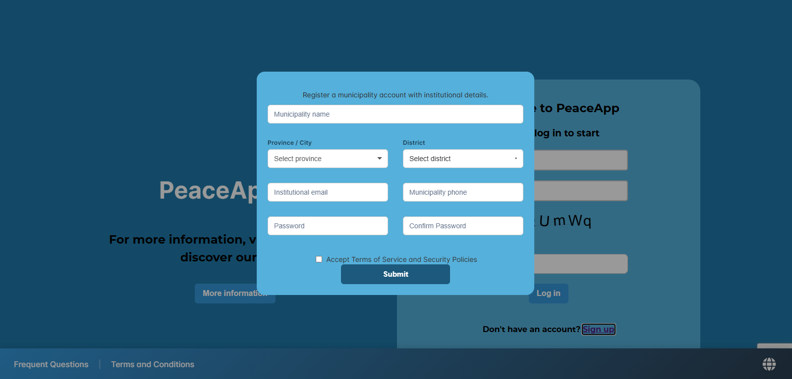

- **Inicio de Sesión (Login):** Pantalla de acceso seguro al sistema web mediante el ingreso de correo electrónico y contraseña corporativa, protegida con interceptores de seguridad basados en roles.
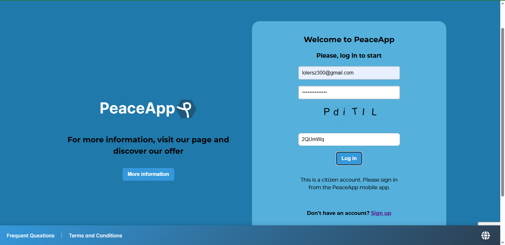

- **Recuperar Cuenta (Email):** Primer paso del flujo de recuperación de contraseña en la web, donde el usuario ingresa su correo electrónico registrado para solicitar el envío del token o enlace de validación.
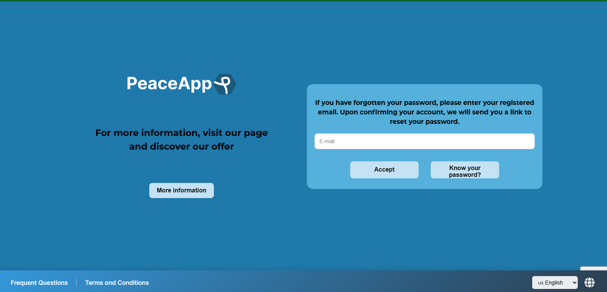

- **Recuperar Cuenta (Nueva Contraseña):** Formulario final del flujo de recuperación que permite al usuario establecer y confirmar su nueva clave de acceso de forma segura.
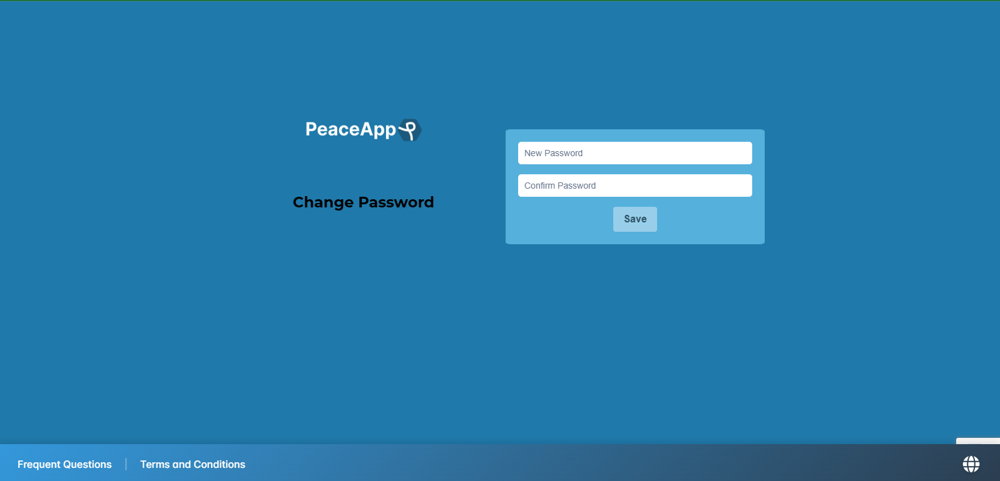

- **Dashboard Municipal:** Panel principal de analítica visual que recopila gráficos estadísticos, métricas e indicadores clave de rendimiento sobre los incidentes reportados en el distrito para optimizar la toma de decisiones del serenazgo.
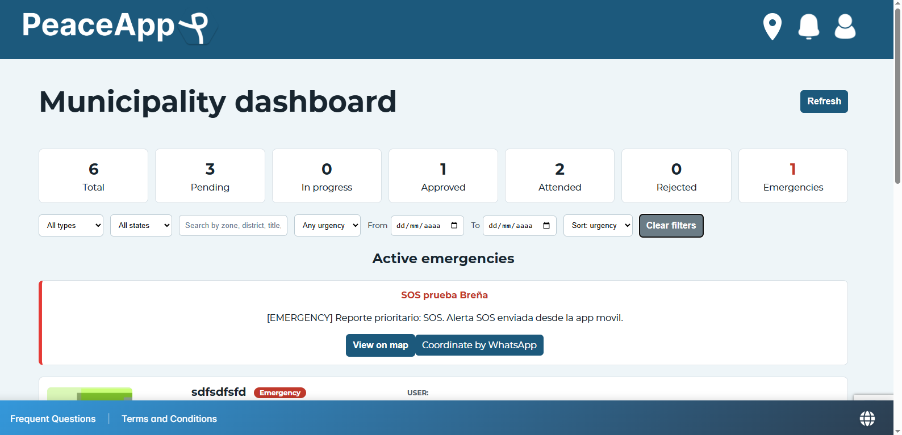

- **Mapa con Reportes:** Interfaz cartográfica interactiva central que renderiza en tiempo real los marcadores geolocalizados de los incidentes ciudadanos y las zonas identificadas con gradientes de peligro dentro del distrito.

- **Buscador en el Mapa:** Barra de herramientas de geocodificación que permite a los operadores municipales realizar búsquedas directas de direcciones o intersecciones específicas para centrar el lienzo del mapa de forma ágil.

- **Detalle de Reporte:** Modal informativo desplegable que presenta la descripción minuciosa del delito, los datos del usuario emisor, la fecha exacta del suceso y el estado actual del ciclo de vida del reporte.

- **Reporte de Emergencia:** Consola integrada para la visualización y alerta de señales síncronas de auxilio de alta prioridad despachadas de forma asíncrona hacia la central de serenazgo distrital.
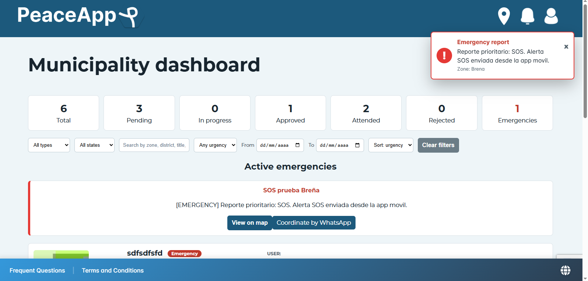

- **Perfil Municipalidad:** Sección dedicada a la gestión de datos institucionales de la municipalidad federada, permitiendo auditar y actualizar los teléfonos de contacto de las unidades de campo.
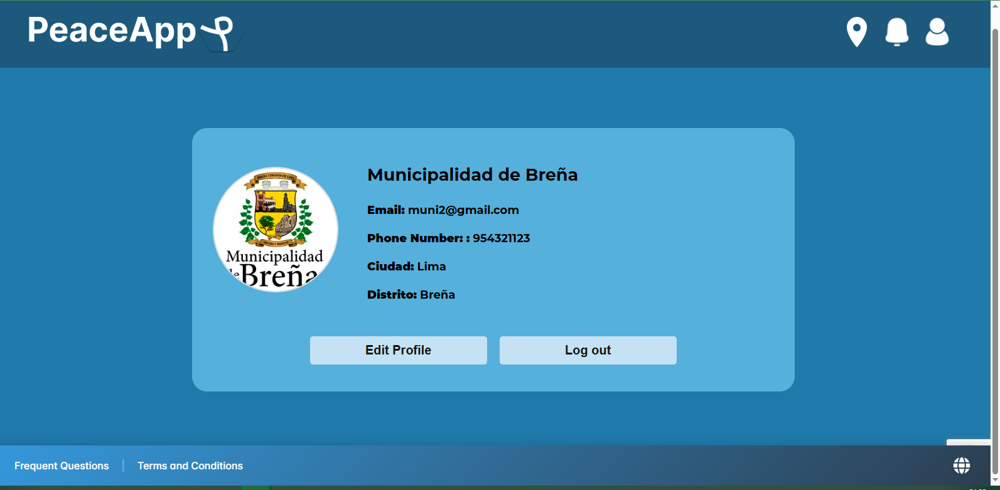

- **Términos y Condiciones:** Vista informativa legal integrada en la plataforma web que detalla las políticas de privacidad y el tratamiento de datos alineado estrictamente a la legislación peruana vigente.
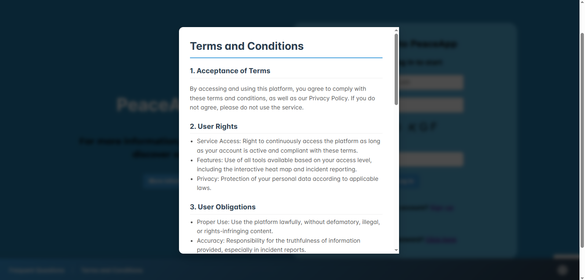

- **Preguntas Frecuentes:** Módulo de autoayuda dinámico con respuestas estructuradas orientadas a facilitar la inducción y el manejo operativo inicial de la consola web por parte de los operadores.
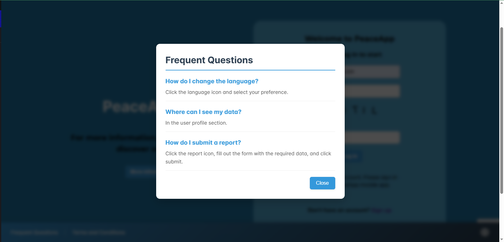

**Mobile Application:**

- **Perfil Ciudadano:** Interfaz donde el usuario civil puede visualizar sus datos personales de cuenta, credenciales de contacto y gestionar la personalización o cierre de su sesión móvil actual.
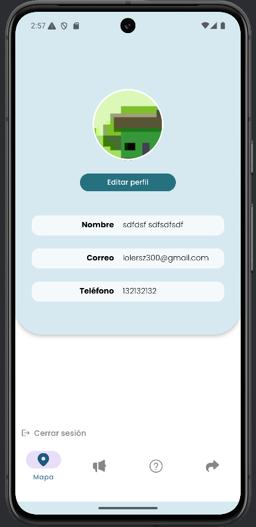

- **Editar Perfil Ciudadano:** Pantalla interna de edición que faculta al ciudadano a modificar y poner al día sus datos de contacto (teléfono, distrito, residencia), validando en el cliente campos obligatorios vacíos.
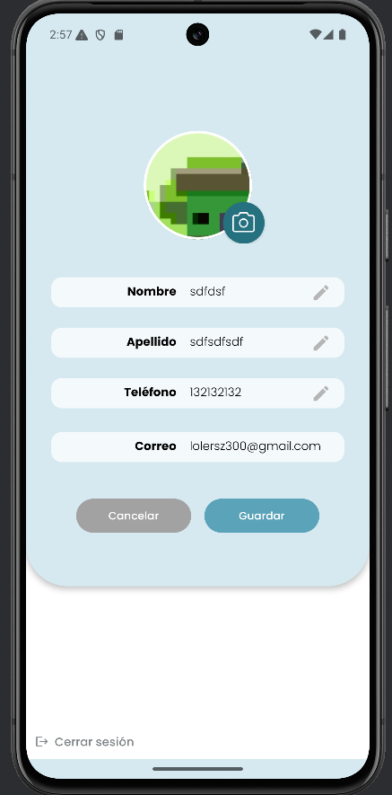

- **Chatbot - Indicaciones de Reporte:** Pantalla inicial de bienvenida del asistente inteligente interactivo, ofreciendo pautas de orientación contextuales al ciudadano sobre el estado de la seguridad.
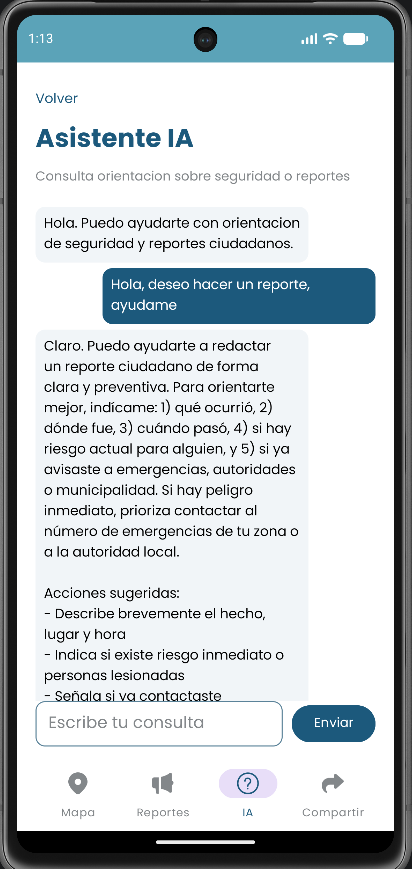

- **Chatbot - Apoyo para Crear Reporte:** Interfaz del flujo conversacional guiado donde el chatbot asiste activamente al ciudadano recopilando la descripción del incidente para estructurar un borrador de reporte de forma rápida.
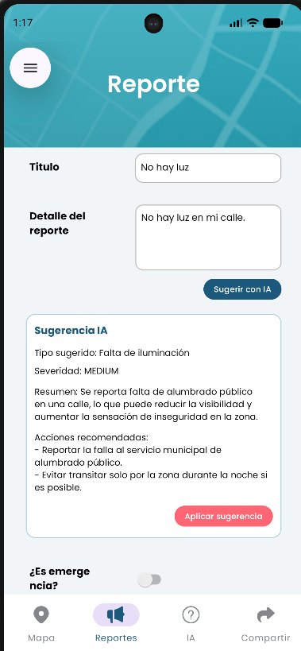

- **Indicar Dirección en Reporte:** Componente interactivo que asiste al ciudadano en la captura y geolocalización exacta del incidente mediante un cuadro de texto predictivo de direcciones.
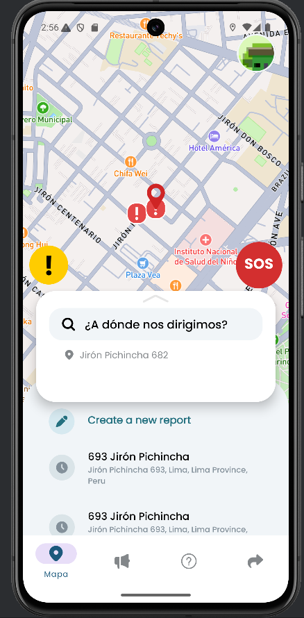

- **Formulario de Reporte:** Pantalla estructurada para registrar incidentes manuales, permitiendo al ciudadano ingresar el título del suceso, la descripción contextual y adjuntar las evidencias requeridas.
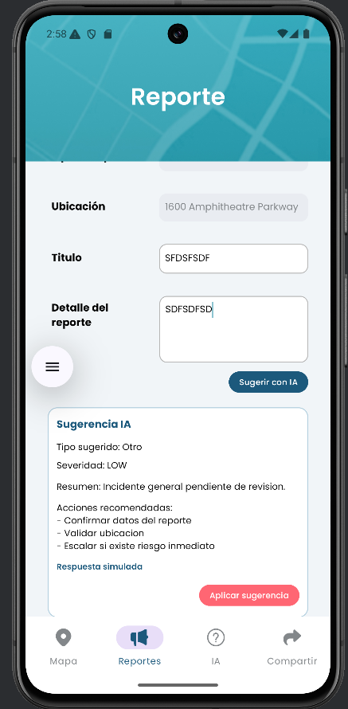

- **Autocompletado de Tipo por IA:** Pantalla del flujo de creación de reportes donde el microservicio de IA analiza la descripción de los hechos para sugerir y autocompletar de forma predictiva la categoría del delito (ej. Hurto).
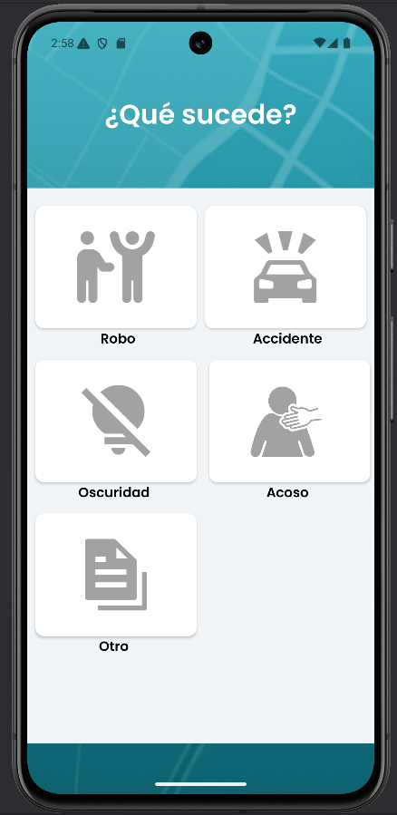

- **Notificación de Éxito al Reportar:** Cuadro de diálogo modal e ilustrativo que confirma al ciudadano que el reporte de incidente fue registrado en las bases de datos de forma satisfactoria.
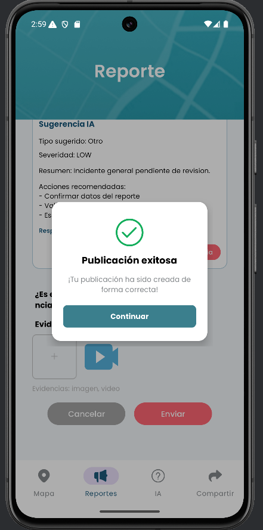

- **Visualización de Reporte Creado:** Pantalla de auditoría individual que permite al ciudadano revisar los datos finales estructurados de su reporte antes o después de la aprobación de la jurisdicción.
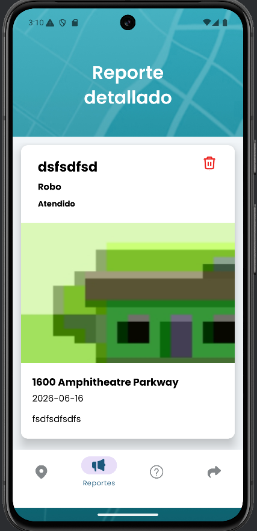

- **Mis Reportes:** Sección personalizada que compila de forma tabular e individual el historial histórico de todos los incidentes que el propio usuario ha aportado a la comunidad.
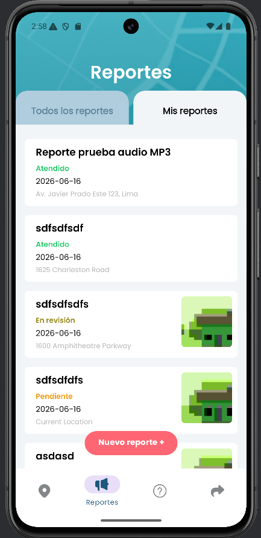

- **Todos los Reportes de Usuarios:** Vista de exploración comunitaria en formato de lista secuencial cronológica que permite al ciudadano revisar los incidentes generales alertados por otros usuarios de la plataforma.
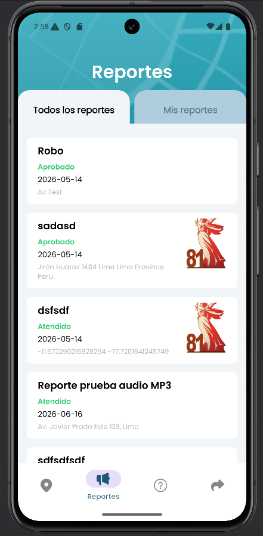

- **Todas las Alertas de Zona:** Interfaz dedicada que compila las alertas preventivas vigentes de su entorno actual de acuerdo con el radio de proximidad geoespacial.
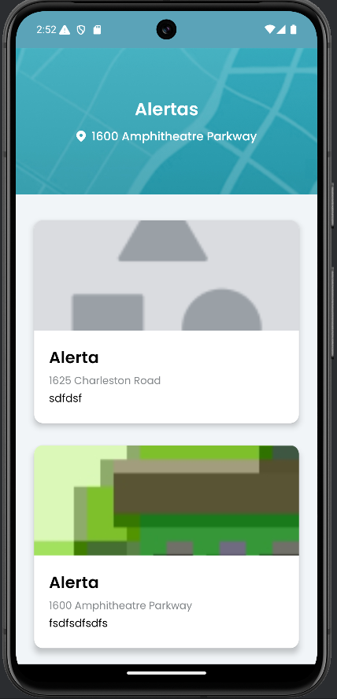

- **Alerta Detectada:** Pantalla de aviso inmediato que irrumpe en la pantalla de la aplicación móvil para advertir de forma visual que el ciudadano se encuentra dentro del radio de influencia de un incidente de peligro.
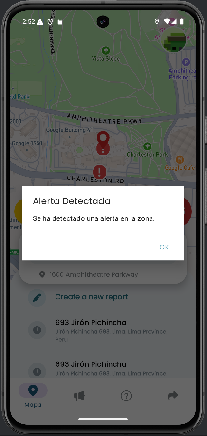

- **Compartir Ubicación con Contactos:** Interfaz dedicada para enlazar, encender o apagar la transmisión geoespacial síncrona con los contactos de confianza agregados a la libreta personal.
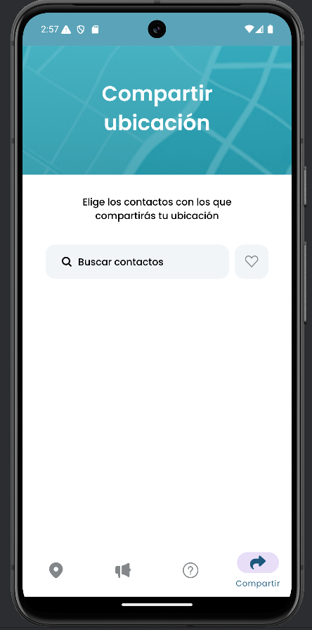

- **SOS - Alerta de Emergencia Enviada:** Pantalla interactiva crítica que confirma al ciudadano el envío y recepción exitosa de su señal de auxilio geoespacial hacia la central de serenazgo (Escenario exitoso de la US39).
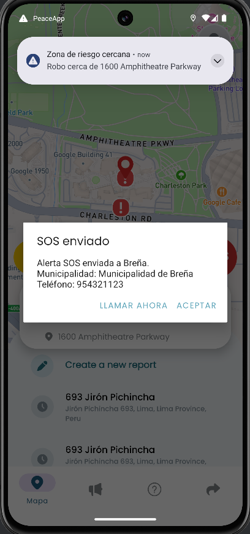

- **SOS - Fuera de Cobertura de Datos:** Interfaz de resiliencia del sistema de pánico que se activa de forma automática ante la ausencia de internet móvil, desplegando el mecanismo alternativo para enrutar el auxilio mediante llamadas directas y pasarelas SMS (Capa de Infraestructura ACL).
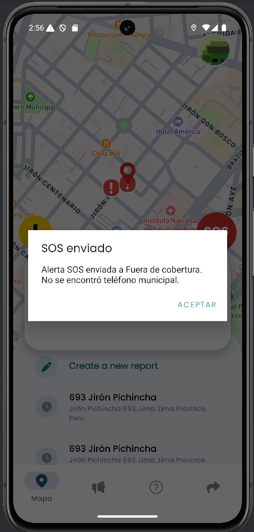

**Web Services & Infrastructure:**

- **Servidor de Descubrimiento Eureka:** Consola de administración de Netflix Eureka Server que evidencia el registro exitoso, el estado de salud (UP) y el mapeo dinámico de red de las instancias de los microservicios core del sistema distribuido.
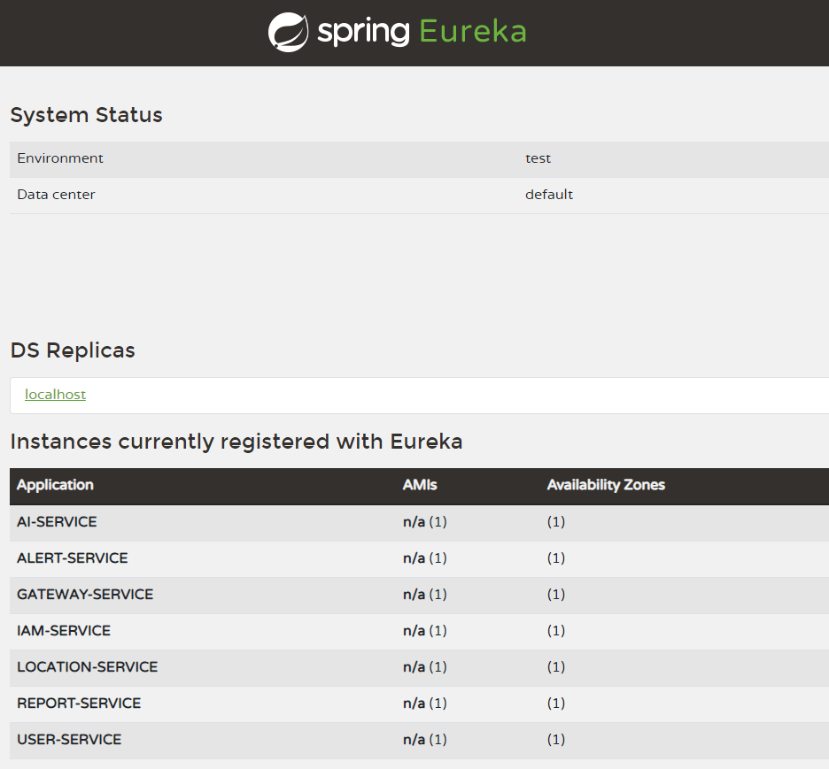

#### 7.2.1.6. Services Documentation Evidence for Sprint Review.

#### 7.2.1.7. Software Deployment Evidence for Sprint Review.

#### 7.2.1.8. Team Collaboration Insights during Sprint.

## 7.3. Validation Interviews.

### 7.3.1. Diseño de Entrevistas.

### 7.3.2. Registro de Entrevistas.

### 7.3.3. Evaluaciones según heurísticas.

## 7.4. Video About-the-Product.