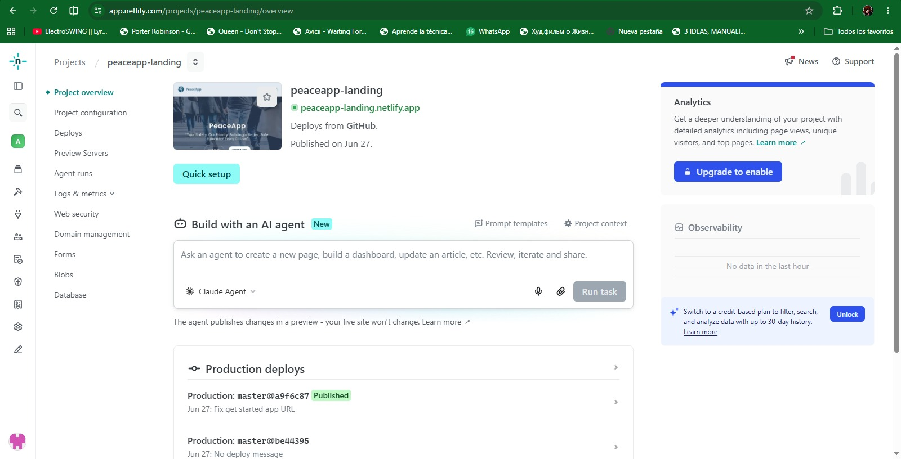
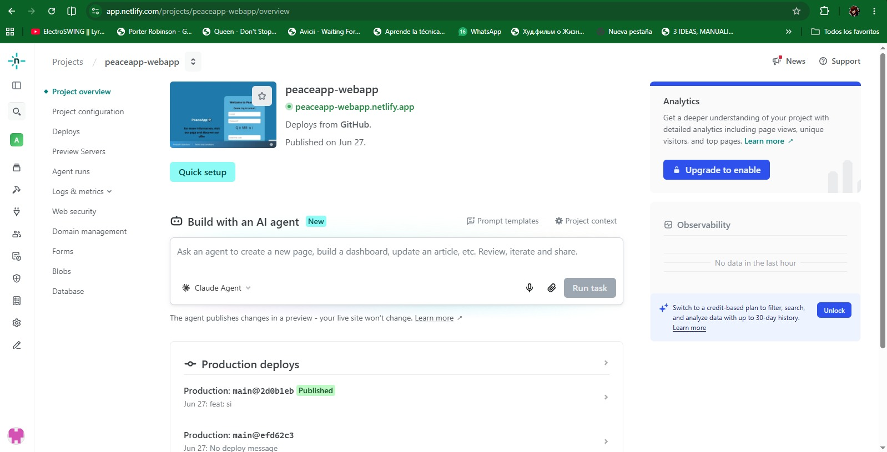
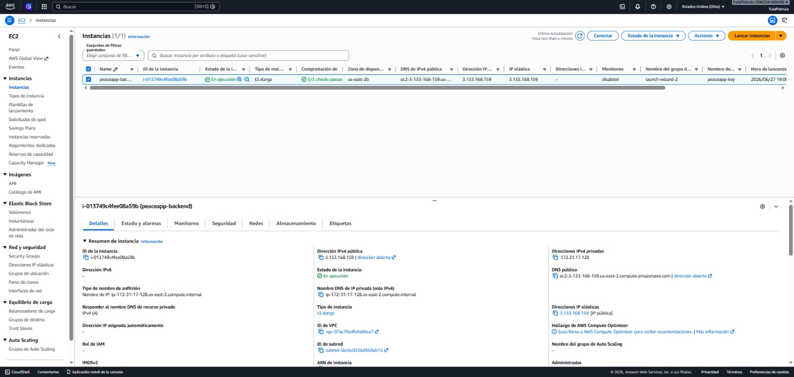
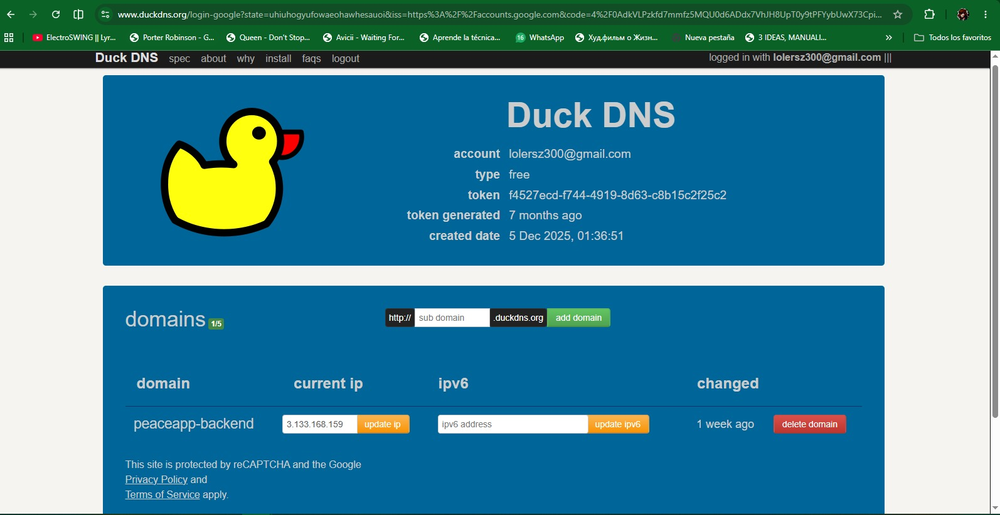
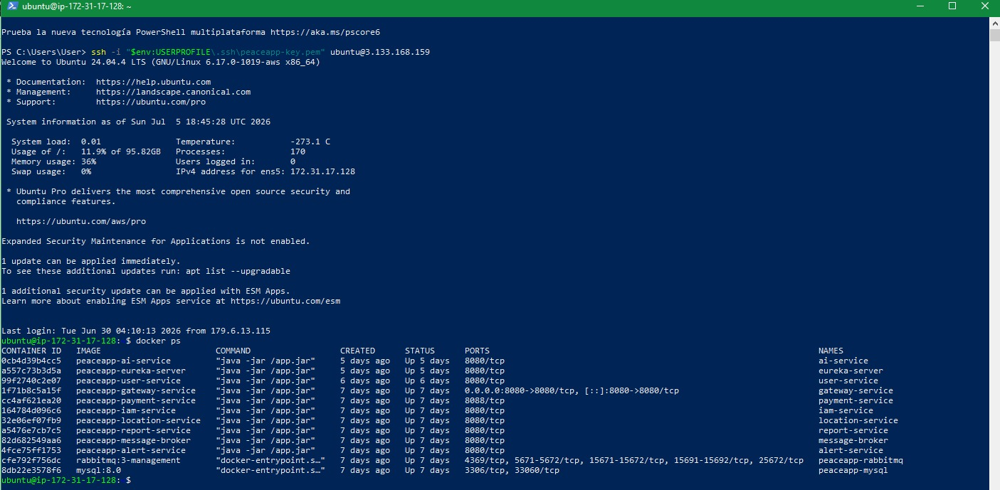
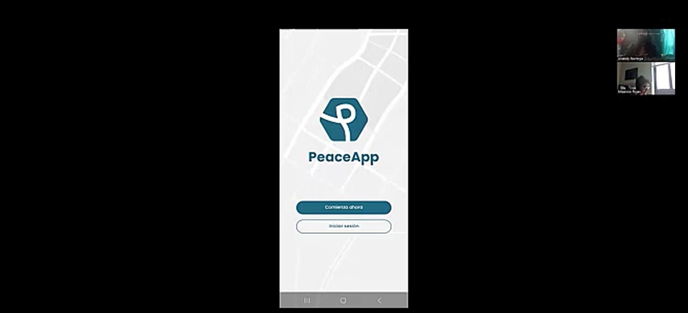
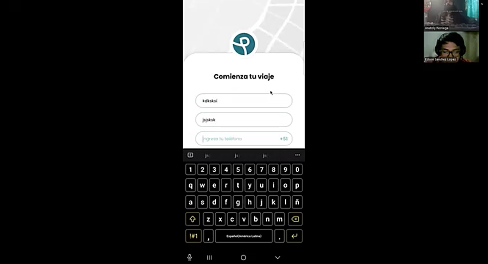
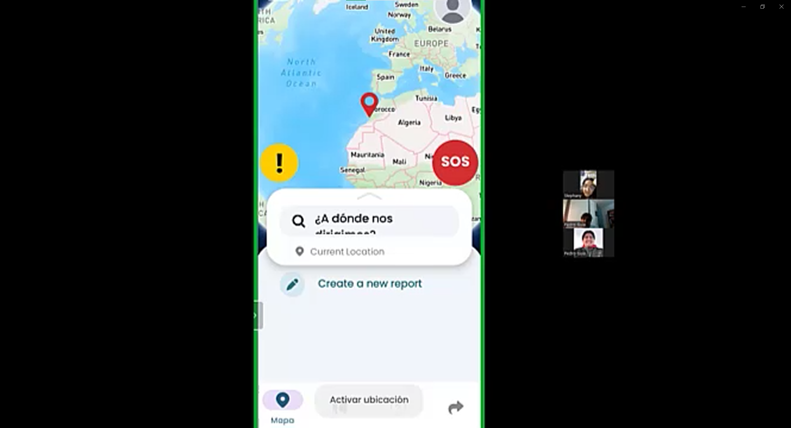
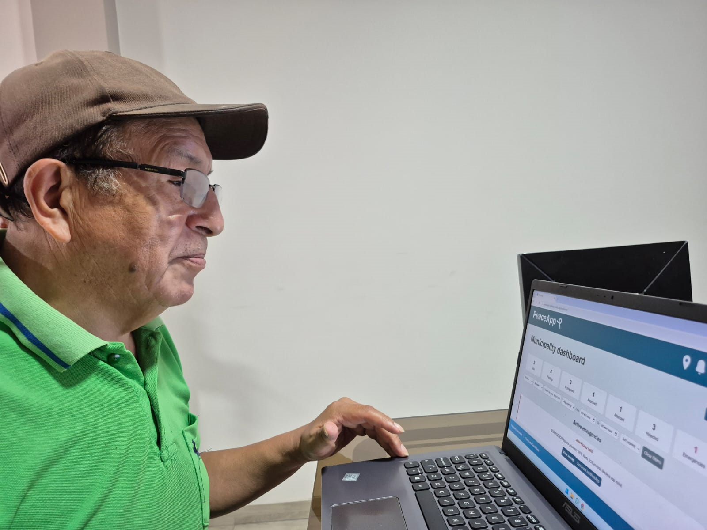

# Capítulo VII: Product Implementation, Validation & Deployment

## 7.1. Software Configuration Management.
En esta sección se resume toda la información recopilada, analizando que pasos que se realizaran y como se siente.

### 7.1.1. Software Development Environment Configuration.
En la siguiente sección se describe la ruta de referencia de cada uno de los productos de software para que cualquier miembro del equipo pueda desarrollar cada punto del trabajo:

**Figma:** Herramienta colaborativa que nos permitirá desarrollar wireframes y mockups.

**Vertabelo:** Plataforma colaborativa que nos permitirá crear nuestro diagrama de base de datos.

**GitHub:** Repositorio colaborativo en la nube

**IntelliJ:** es un entorno de desarrollo para trabajar con Java y otros lenguajes que se ejecutan en JVM, como Kotlin.

### 7.1.2. Source Code Management.
Trabajamos con 3 ramas principales:

**Main:** nuestra rama principal donde presentaremos nuestras publicaciones oficiales.

**Development:** Es nuestra rama de desarrollo, en donde probaremos e integraremos las funcionalidades trabajadas.

**Feature:** Se descompone en ramas por cada feature trabajado.

### 7.1.3. Source Code Style Guide & Conventions.
Para desarrollar nuestro proyecto hemos requerido de algunas nomenclaturas, referencias y lenguajes para esta solución.

Tecnologías: Utilizamos algunas de estas tecnologías para el desarrollo de nuestra aplicación como: HTML5, CSS, JS, Java.

Herramientas: Nos apoyamos de las tecnologías más utilizadas y recomendadas para el desarrollo de nuestra aplicación como: GitHub, Figma, IntelliJ

Convenciones de idioma: Uso del idioma inglés para elaborar nuestro código

### 7.1.4. Software Deployment Configuration.
Para desplegar nuestra landing page en la plataforma de GitHub, seguimos los siguientes pasos:

**Creación del Repositorio Remoto en GitHub:**

- Creamos un nuevo repositorio en GitHub de nuestro proyecto, el cual se utilizará para el desarrollo y deployment.

**Inicialización del Repositorio:**

- Se utiliza el comando git init para inicializar el repositorio.

**Subida de Archivos al Repositorio Remoto:**

- Añadimos los archivos de nuestra landing page al repositorio local.

- Subimos los archivos al repositorio de GitHub con el comando git push -u origin master o utilizando GitHub Desktop.

**Configuración de Netlify:**

- Nos dirigimos a Netlify y creamos una nueva cuenta o iniciamos sesión.

- En Netlify, seleccionamos la opción de importar el proyecto desde GitHub.

- Autorizamos a Netlify para acceder a nuestro repositorio de GitHub.

- Elegimos el repositorio que contiene nuestra landing page y configuramos las opciones de despliegue.

**Despliegue:**

- Netlify se encargará de desplegar automáticamente nuestra landing page.

- Accedemos a la URL proporcionada por Vercel para verificar que nuestra landing page se haya desplegado correctamente.

De este modo, nuestra landing page estará disponible utilizando Vercel y podrá ser visible para cualquier usuario que tenga el enlace. 

**Enlace del landing page:** <https://peaceapp-landingpage.netlify.app/>

## 7.2. Solution Implementation.

### 7.2.1. Sprint 1

#### 7.2.1.1. Sprint Planning 1.

El Sprint Planning 1 definió el alcance inicial de PeaceApp para sentar las bases del ecosistema web, móvil y de microservicios. En esta reunión se priorizaron las historias orientadas al acceso seguro por roles, la asistencia conversacional inicial para el ciudadano y la configuración de la infraestructura mínima para soportar autenticación, descubrimiento de servicios e integración del chatbot.

| Sprint # | Sprint 1 |
| :--- | :--- |
| Sprint Planning Background | Reunión de arranque del primer sprint para alinear el MVP, distribuir responsabilidades y asegurar que el trabajo cubra las funciones base del sistema PeaceApp. |
| Date | 13/05/2026 |
| Time | 12:00 AM |
| Location | Discord (Reunión virtual) |
| Prepared By | Equipo de desarrollo de PeaceApp |
| Attendees (to planning meeting) | Noriega Suschenko Anatoly, Arroyo Ormeño André, Reyes Trujillano Fabian, Santillan Alvarado Melina, Guia Carrasco Pedro |
| Sprint Goal & User Stories | Entregar la base funcional del MVP con acceso diferenciado por rol, chatbot de apoyo al ciudadano e infraestructura backend lista para integrar los servicios del sistema.   Historias priorizadas: registro de usuarios, inicio de sesión, consulta de seguridad mediante chatbot, asistencia para crear reportes, acceso al soporte externo, autenticación JWT, alta de usuarios, control de roles, microservicio NLP y orquestación en el API Gateway. |
| Sprint 1 Goal | Construir una primera versión operativa de PeaceApp que permita registrar y autenticar usuarios, separar correctamente los flujos web y móvil, e integrar la capa inicial de asistencia inteligente para consultas y creación guiada de reportes. |
| Sprint 1 Velocity | Pendiente de medir |
| Sum of Story Points | 49 |

#### 7.2.1.2. Sprint Backlog 1

Durante este sprint, se trabajó en las funcionalidades base de acceso al ecosistema, la capa de infraestructura distribuida y en el módulo de asistencia inteligente del MVP. Específicamente, se segmentó el flujo de registro de identidades de modo que en la aplicación web solo se permita la creación de cuentas para municipalidades y en la aplicación móvil se limite exclusivamente a ciudadanos. Asimismo, se desarrolló y desplegó el microservicio de chatbot con procesamiento de lenguaje natural (NLP) integrado en la aplicación móvil, y se consolidaron los servicios core de enrutamiento, mapas analíticos, reportes comunitarios y flujos síncronos de emergencia SOS.

**Tabla de control de estado del Sprint**

| Sprint # | **Sprint 1** | | | | | | |
| :--- | :--- | :--- | :--- | :--- | :--- | :--- | :--- |
| **User Story** | | **Work-Item / Task** | | | | | |
| **Id** | **Title** | **Id** | **Title** | **Description** | **Est. (h)** | **Assigned To** | **Status** |
| **US04** | Registro de Usuarios | US04-MO-01 | Form registro ciudadano | UI en Flutter/Mobile; captura de datos personales obligatorios y DNI civil. | 4 | **Noriega Suschenko Anatoly** | Done |
| | | US04-FE-01 | Form registro municipio | UI en React/Web; campos de distrito, provincia y teléfono de contacto. | 5 | **Noriega Suschenko Anatoly** | Done |
| **US05** | Iniciar Sesión | US05-MO-01 | Login móvil ciudadano | Pantalla de inicio de sesión en Flutter; manejo de estados y persistencia local. | 3 | **Arroyo Ormeño André** | Done |
| | | US05-FE-01 | Login web municipal | Pantalla de inicio de sesión en React para autoridades; redirección al Dashboard. | 3 | **Reyes Trujillano Fabian** | Done |
| **US11** | Editar Información de Perfil | US11-MO-01 | Formulario editar perfil ciudadano | UI móvil para modificar datos telefónicos y residencia; validación en cliente. | 3 | **Guia Carrasco Pedro** | Done |
| | | US11-FE-01 | Gestión perfil municipalidad | Vista web interactiva para auditar y actualizar datos institucionales del serenazgo. | 3 | **Reyes Trujillano Fabian** | Done |
| **US12** | Recuperar Contraseña | US12-FE-01 | Interfaz recuperación email | Pantalla web para solicitar el enlace mediante el ingreso de correo electrónico. | 3 | **Arroyo Ormeño André** | Done |
| | | US12-FE-02 | Formulario nueva contraseña | Vista web transaccional para definir y confirmar la clave de acceso de forma segura. | 3 | **Arroyo Ormeño André** | Done |
| **US13** | Acceder a Mapa con Reportes | US13-FE-01 | Lienzo cartográfico central web | Integración del mapa de calor interactivo basado en Mapbox en el dashboard. | 5 | **Reyes Trujillano Fabian** | Done |
| **US14** | Acceder al Perfil de Usuario | US14-MO-01 | Vista de cuenta móvil | Renderizado de datos del ciudadano autenticado y acciones de personalización. | 2 | **Guia Carrasco Pedro** | Done|
| **US15** | Filtrar Reportes | US15-FE-01 | Controles de filtrado web | Componentes UI en consola web para clasificar incidentes por tipo, fecha y estado. | 3 | **Reyes Trujillano Fabian** | Done |
| **US16** | Buscar Ubicación en el Mapa | US16-FE-01 | Buscador predictivo web | Caja de geocodificación en el mapa web para localizar direcciones y avenidas. | 3 | **Reyes Trujillano Fabian** | Done |
| **US18** | Notificación de Éxito al Reportar | US18-MO-01 | Modal confirmación reporte | Cuadro de diálogo ilustrativo en Flutter tras registrar un incidente comunitario. | 2 | **Santillan Alvarado Melina** | Done |
| **US21** | Estado Vacío en “Mis Reportes” | US21-MO-01 | UI empty state reportes | Vista condicional y amigable si el ciudadano aún no ha aportado incidentes. | 2 | **Guia Carrasco Pedro** | Done |
| **US25** | Ver Detalles Rápidos en Mapa | US25-FE-01 | Popups informativos web | Tooltips contextuales sobre los marcadores del mapa web para ver un resumen. | 3 | **Arroyo Ormeño André** | Done |
| **US31** | Acceso como Municipalidad | US31-FE-01 | Enrutamiento Dashboard web | Restricción y renderizado de la consola web limitado a la sesión del municipio. | 4 | **Noriega Suschenko Anatoly** | Done |
| **US32** | Visualizar Reportes en Dashboard | US32-FE-01 | Gráficos analíticos web | Distribución de componentes visuales de incidencias tabuladas por distrito. | 4 | **Reyes Trujillano Fabian** | Done |
| **US35** | Ver Detalle Completo del Reporte | US35-FE-01 | Modal expandido incidente | Interfaz web que muestra la descripción, evidencias y autoría completa. | 3 | **Arroyo Ormeño André** | Done |
| **US38** | Enviar Alerta de Emergencia | US38-MO-01 | SOS Pánico síncrono móvil | Botón crítico en app móvil para gatillar el envío inmediato de coordenadas. | 4 | **Guia Carrasco Pedro** | Done |
| | | US38-MO-02 | Pantalla SOS fuera cobertura | Interfaz adaptativa ante fallo de red móvil para derivar emergencias vía SMS. | 3 | **Guia Carrasco Pedro** | Done |
| **US39** | Confirmación de Envío de Emergencia | US39-MO-01 | UI de confirmación SOS | Pantalla transaccional móvil de envío exitoso de auxilio hacia serenazgo. | 2 | **Guia Carrasco Pedro** | Done |
| **US42** | Consultar Nivel de Seguridad mediante Chatbot | US42-MO-01 | Interfaz de chat móvil | Componente de chat síncrono embebido en Flutter para la interacción ciudadana. | 4 | **Santillan Alvarado Melina** | Done |
| **US43** | Asistencia del Chatbot para Crear Reportes | US43-MO-01 | Workflow de asistencia móvil | Lógica conversacional en app móvil para recolectar datos y armar el borrador. | 4 | **Santillan Alvarado Melina** | Done |
| **US48** | Acceder al Soporte Externo de PeaceApp | US48-MO-01 | Enrutamiento de soporte | Menú interactivo móvil para desviar consultas técnico-operativas al bot. | 2 | **Santillan Alvarado Melina** | Done |
| **TS01** | Autenticación JWT mediante RESTful API | TS01-BE-01 | Configuración Spring Security | Filtros de seguridad, validación asimétrica y protección de endpoints privados. | 5 | **Reyes Trujillano Fabian** | Done |
| **TS02** | Crear Nuevo Usuario mediante RESTful API | TS02-BE-01 | Sign-up REST Endpoints | Implementación de `POST /api/v1/auth/register` en `IAMService` segregado por rol. | 4 | **Noriega Suschenko Anatoly** | Done |
| **TS03** | Editar Perfil de Usuario mediante RESTful API | TS03-BE-01 | Endpoint update profile | Desarrollo de controladores Spring PATCH en `UserService` para mutar perfiles. | 3 | **Noriega Suschenko Anatoly** | Done |
| **TS04** | Crear Reporte de Incidente mediante RESTful API | TS04-BE-01 | Endpoint creación reportes | Endpoints en `ReportService` para registrar incidentes ciudadanos en estado pendiente. | 4 | **Arroyo Ormeño André** | Done |
| **TS05** | Obtener Lista de Reportes mediante RESTful API | TS05-BE-01 | GET list endpoints reportes | Lógica de negocio para servir colecciones de incidentes filtradas por rol. | 4 | **Arroyo Ormeño André** | Done |
| **TS06** | Obtener Reporte por ID mediante RESTful API | TS06-BE-01 | GET report by ID endpoint | Implementación de búsquedas controladas y seguras de un incidente específico. | 3 | **Arroyo Ormeño André** | Done |
| **TS07** | Crear Coordenadas de Ubicación al Generar un Reporte | TS07-BE-01 | Persistencia espacial inicial | Lógica en `LocationService` para acoplar latitud y longitud a los agregados. | 3 | **Guia Carrasco Pedro** | Done |
| **TS08** | Obtener Ubicaciones para Renderizar Reportes en el Mapa | TS08-BE-01 | Endpoint JSON marcadores | Servicio web encargado de retornar las coordenadas para el renderizado del mapa. | 3 | **Guia Carrasco Pedro** | Done |
| **TS09** | Crear Alerta al Acercarse a una Zona de Peligro | TS09-BE-01 | Lógica proximidad de alertas | Componentes en `AlertService` para inicializar alarmas ante cruce de perímetros. | 4 | **Guia Carrasco Pedro** | Done |
| **TS10** | Obtener Alertas por Usuario | TS10-BE-01 | GET alerts endpoint | Endpoint para servir las notificaciones históricas de peligro de una identidad. | 3 | **Guia Carrasco Pedro** | Done |
| **TS11** | Eliminar Alertas al Recargar el Mapa | TS11-BE-01 | Limpieza caché de alertas | Lógica backend para prevenir el envío de elementos duplicados o desactualizados. | 3 | **Guia Carrasco Pedro** | Done |
| **TS12** | Obtener Detalles de Alerta por ID | TS12-BE-01 | GET alert details API | Consulta atómica de infraestructura para recuperar el detalle de una alerta. | 3 | **Guia Carrasco Pedro** | Done |
| **TS13** | Obtener Datos de Usuario por Email | TS13-BE-01 | Query filter by email | Método optimizado en `UserService` para validar identidades durante la autenticación. | 3 | **Noriega Suschenko Anatoly** | Done |
| **TS14** | Manejo de Roles de Usuario | TS14-BE-01 | Interceptor de Autorización | Lógica en `IAMService` (HTTP 403) para bloquear accesos y registros cruzados. | 3 | **Noriega Suschenko Anatoly** | Done |
| **TS15** | Crear Alerta de Emergencia mediante RESTful API | TS15-BE-01 | POST emergency endpoint | API en `AlertService` para registrar la señal inmediata de pánico ciudadana. | 4 | **Guia Carrasco Pedro** | Done |
| **TS16** | Obtener Lista de Emergencias mediante RESTful API | TS16-BE-01 | GET emergencies list | Servicio web para recuperar incidentes activos prioritarios para el municipio. | 3 | **Guia Carrasco Pedro** | Done |
| **TS17** | Actualizar Estado de Emergencia mediante RESTful API | TS17-BE-01 | PATCH status emergency | Endpoint transaccional para actualizar el ciclo de vida de la alerta (`ATTENDED`). | 3 | **Guia Carrasco Pedro** | Done |
| **TS18** | Envío de Notificaciones de Emergencia | TS18-BE-01 | Orquestador eventos SOS | Despachador encargado de derivar las emergencias registradas en tiempo real. | 3 | **Guia Carrasco Pedro** | Done |
| **TS20** | Implementar Microservicio de Chatbot mediante NLP | TS20-BE-01 | Despliegue de servicio NLP | Microservicio independiente en `AIService` para procesar y clasificar texto conversacional. | 6 | **Santillan Alvarado Melina** | Done |
| **TS23** | Orquestación de Servicios de IA en el API Gateway | TS23-BE-01 | Enrutamiento proxy Gateway | Configuración en `GatewayService` para redirigir tráfico de IA aplicando filtros JWT. | 3 | **Guia Carrasco Pedro** | Done |

#### 7.2.1.3. Development Evidence for Sprint Review.
Los avances específicos son:

- **Web Application / Mobile Application:**
  - Segmentación y despliegue del formulario de registro móvil exclusivo para el rol de ciudadanos.
  - Implementación de la interfaz web adaptada para la creación de cuentas de entidades municipales.
  - Integración de la ventana de chat conversacional del asistente en la aplicación móvil.
  - Maquetación inicial de los componentes del Frontend Web corporativo y resolución de estilos responsive.

- **Web Services (Microservices & Infrastructure):**
  - **IAMService & UserService:** Configuración de Spring Security, aprovisionamiento de endpoints para el ciclo de vida de cuentas y control estricto de roles mediante interceptores (JWT).
  - **AIService:** Creación y despliegue del microservicio inteligente de asistencia basado en procesamiento de lenguaje natural (NLP) con soporte e integración oficial de OpenAI.
  - **GatewayService & EurekaServer:** Implementación del servidor de descubrimiento Eureka y configuración de rutas e interceptación en el API Gateway para orquestar la comunicación del ecosistema distribuido.
  - **ReportService, AlertService, LocationService & MessageBroker:** Cimentación de la base de datos estructural del dominio y configuraciones iniciales para soportar el flujo reactivo de mensajería, localización e incidentes.

| Repository | Branch | Commit Id | Commit Message | Commit Message Body | Commited on (Date) |
| :---: | :---: | :---: | :--- | :--- | :---: |
| AIService | main | da5b1020d10030922d0e47a686deaa0e276b2cbf | chore: remove target folder | | 20/06/2026 |
| AIService | main | b39aac09b46e2735b9603466d5b3be5e86390f4d | chore: add gitignore file | | 20/06/2026 |
| AIService | main | 5d04966bdc90fa6a9c5c48c93257aad3541914a5 | feat: integrate OpenAI support in AI service | | 20/06/2026 |
| AIService | main | 8d9e678763c389436838684dc5e8b6a51a276b88 | Initial commit | | 20/06/2026 |
| PeaceApp-Web | main | c8ba68a4f958ef77babf250014ec83e0bc57735c | refactor: fix things | | 20/06/2026 |
| PeaceApp-Web | main | 5ff76ff97746676ef5f56747ec794027fbc01f54 | feat: add web additions | | 16/06/2026 |
| PeaceApp-Web | main | 578932264c740759a651659246541e5eb5948017 | feat: add initial web app implementation | | 13/05/2026 |
| GatewayService | main | 6ef70bbdae10479cd610d12ff08bccc7a5b68896 | refactor: add missing lines | | 20/06/2026 |
| GatewayService | main | 8471388581798deb6242752ad290aec88435fb29 | feat: add gateway additions | | 16/06/2026 |
| GatewayService | main | d4c30a83f746424514060dacfe8010ed49d97831 | feat: add initial service implementation | | 13/05/2026 |
| UserService | main | c7b84b080862c3fa58099f3230e0c7a8a9fbf92d | feat: add users additions | | 16/06/2026 |
| UserService | main | cf2a207d7149a181b2a100054ee32c0ac1ab3b67 | feat: add initial service implementation | | 13/05/2026 |
| ReportService | main | 01a44a4e8f3b1e12a21926c3156e300364281430 | feat: add report additions | | 16/06/2026 |
| ReportService | main | 7abeb6690f97eea0292bdb352f1f4cdc903a1670 | feat: add initial service implementation | | 13/05/2026 |
| IAMService | main | 834c538a10b5418f24b394de15f81576bb205290 | feat: add iam additions | | 16/06/2026 |
| IAMService | main | 48a0801518770bf6c3d5da1620764ccd76312490 | feat: add initial service implementation | | 13/05/2026 |
| AlertService | main | 618b4d2acb6a73f1bc72386d0b2d242cbe9fde79 | feat: add alert service additions | | 16/06/2026 |
| AlertService | main | 847ec1a00e0e506c9948dfb59126a831fc3b056c | feat: add initial service implementation | | 13/05/2026 |
| MessageBroker | main | 1bc5a7dbb7983e71af4ca865a41aaf54a8b9478c | feat: add initial service implementation | | 13/05/2026 |
| LocationService | main | 441016116577520acfcde7e291ef7b6356e83620 | feat: add initial service implementation | | 13/05/2026 |
| EurekaServer | main | a48415bb921918604d8733857689fddeea973def | feat: add initial service implementation | | 13/05/2026 |

#### 7.2.1.4. Testing Suite Evidence for Sprint Review.
Para esta sección del proyecto se hizo uso de la herramienta Visual Studio Code empleando el lenguaje Gherkin.
Se mostrarán a continuación los Acceptance Test según el enfoque de DDD (Domain Driven Desgin)

- Registro de Usuarios

- Iniciar Sesión

- Generar Reporte de Incidentes

- Subir Evidencia Multimedia

- Visualización de Reportes

- Monitoreo de Proximidad a Zonas de Riesgo

- Notificación de Alerta de Riesgo

- Selección de Contactos de Monitoreo

- Compartición de Ubicación en Tiempo Real

- Editar Perfil

- Recuperar Contraseña

- Acceder a Mapa con Reportes

- Acceder al Perfil

- Filtrar Reportes

- Buscar Ubicación en el Mapa

- Formulario de Reporte

- Validación y errores

- Actualización del mapa/heatmap

- Footer Informativo

#### 7.2.1.5. Execution Evidence for Sprint Review.
Se trabajó en el despliegue del núcleo transaccional, los servicios distribuidos y las interfaces interactivas para este primer sprint. En la aplicación web se completó la maquetación y lógica de los formularios de registro municipal, inicio de sesión, recuperación de contraseña, componentes cartográficos y el dashboard analítico de control distrital. Por su parte, la aplicación móvil consolidó la experiencia del ciudadano común, integrando el asistente chatbot, el sistema de reportes comunitarios con IA, la gestión de alertas, la sincronización de contactos de confianza y los flujos críticos de emergencia SOS. Finalmente, la infraestructura de backend validó de forma exitosa el registro y descubrimiento de los microservicios mediante Eureka Server, garantizando una operación integral y conectada de todo el ecosistema distribuido.

**Web Application:**

- **Crear Cuenta Municipalidad:** Formulario estructurado para el alta e inscripción de gobiernos locales en la plataforma web, solicitando datos de contacto institucionales, el distrito de operaciones de serenazgo y los identificadores requeridos para su correcta asignación jurisdiccional.

- **Inicio de Sesión (Login):** Pantalla de acceso seguro al sistema web mediante el ingreso de correo electrónico y contraseña corporativa, protegida con interceptores de seguridad basados en roles.

- **Recuperar Cuenta (Email):** Primer paso del flujo de recuperación de contraseña en la web, donde el usuario ingresa su correo electrónico registrado para solicitar el envío del token o enlace de validación.

- **Recuperar Cuenta (Nueva Contraseña):** Formulario final del flujo de recuperación que permite al usuario establecer y confirmar su nueva clave de acceso de forma segura.

- **Dashboard Municipal:** Panel principal de analítica visual que recopila gráficos estadísticos, métricas e indicadores clave de rendimiento sobre los incidentes reportados en el distrito para optimizar la toma de decisiones del serenazgo.

- **Mapa con Reportes:** Interfaz cartográfica interactiva central que renderiza en tiempo real los marcadores geolocalizados de los incidentes ciudadanos y las zonas identificadas con gradientes de peligro dentro del distrito.

- **Buscador en el Mapa:** Barra de herramientas de geocodificación que permite a los operadores municipales realizar búsquedas directas de direcciones o intersecciones específicas para centrar el lienzo del mapa de forma ágil.

- **Detalle de Reporte:** Modal informativo desplegable que presenta la descripción minuciosa del delito, los datos del usuario emisor, la fecha exacta del suceso y el estado actual del ciclo de vida del reporte.

- **Reporte de Emergencia:** Consola integrada para la visualización y alerta de señales síncronas de auxilio de alta prioridad despachadas de forma asíncrona hacia la central de serenazgo distrital.

- **Perfil Municipalidad:** Sección dedicada a la gestión de datos institucionales de la municipalidad federada, permitiendo auditar y actualizar los teléfonos de contacto de las unidades de campo.

- **Términos y Condiciones:** Vista informativa legal integrada en la plataforma web que detalla las políticas de privacidad y el tratamiento de datos alineado estrictamente a la legislación peruana vigente.

- **Preguntas Frecuentes:** Módulo de autoayuda dinámico con respuestas estructuradas orientadas a facilitar la inducción y el manejo operativo inicial de la consola web por parte de los operadores.

**Mobile Application:**

- **Perfil Ciudadano:** Interfaz donde el usuario civil puede visualizar sus datos personales de cuenta, credenciales de contacto y gestionar la personalización o cierre de su sesión móvil actual.

- **Editar Perfil Ciudadano:** Pantalla interna de edición que faculta al ciudadano a modificar y poner al día sus datos de contacto (teléfono, distrito, residencia), validando en el cliente campos obligatorios vacíos.

- **Chatbot - Indicaciones de Reporte:** Pantalla inicial de bienvenida del asistente inteligente interactivo, ofreciendo pautas de orientación contextuales al ciudadano sobre el estado de la seguridad.

- **Chatbot - Apoyo para Crear Reporte:** Interfaz del flujo conversacional guiado donde el chatbot asiste activamente al ciudadano recopilando la descripción del incidente para estructurar un borrador de reporte de forma rápida.

- **Indicar Dirección en Reporte:** Componente interactivo que asiste al ciudadano en la captura y geolocalización exacta del incidente mediante un cuadro de texto predictivo de direcciones.

- **Formulario de Reporte:** Pantalla estructurada para registrar incidentes manuales, permitiendo al ciudadano ingresar el título del suceso, la descripción contextual y adjuntar las evidencias requeridas.

- **Autocompletado de Tipo por IA:** Pantalla del flujo de creación de reportes donde el microservicio de IA analiza la descripción de los hechos para sugerir y autocompletar de forma predictiva la categoría del delito (ej. Hurto).

- **Notificación de Éxito al Reportar:** Cuadro de diálogo modal e ilustrativo que confirma al ciudadano que el reporte de incidente fue registrado en las bases de datos de forma satisfactoria.

- **Visualización de Reporte Creado:** Pantalla de auditoría individual que permite al ciudadano revisar los datos finales estructurados de su reporte antes o después de la aprobación de la jurisdicción.

- **Mis Reportes:** Sección personalizada que compila de forma tabular e individual el historial histórico de todos los incidentes que el propio usuario ha aportado a la comunidad.

- **Todos los Reportes de Usuarios:** Vista de exploración comunitaria en formato de lista secuencial cronológica que permite al ciudadano revisar los incidentes generales alertados por otros usuarios de la plataforma.

- **Todas las Alertas de Zona:** Interfaz dedicada que compila las alertas preventivas vigentes de su entorno actual de acuerdo con el radio de proximidad geoespacial.

- **Alerta Detectada:** Pantalla de aviso inmediato que irrumpe en la pantalla de la aplicación móvil para advertir de forma visual que el ciudadano se encuentra dentro del radio de influencia de un incidente de peligro.

- **Compartir Ubicación con Contactos:** Interfaz dedicada para enlazar, encender o apagar la transmisión geoespacial síncrona con los contactos de confianza agregados a la libreta personal.

- **SOS - Alerta de Emergencia Enviada:** Pantalla interactiva crítica que confirma al ciudadano el envío y recepción exitosa de su señal de auxilio geoespacial hacia la central de serenazgo (Escenario exitoso de la US39).

- **SOS - Fuera de Cobertura de Datos:** Interfaz de resiliencia del sistema de pánico que se activa de forma automática ante la ausencia de internet móvil, desplegando el mecanismo alternativo para enrutar el auxilio mediante llamadas directas y pasarelas SMS (Capa de Infraestructura ACL).

**Web Services & Infrastructure:**

- **Servidor de Descubrimiento Eureka:** Consola de administración de Netflix Eureka Server que evidencia el registro exitoso, el estado de salud (UP) y el mapeo dinámico de red de las instancias de los microservicios core del sistema distribuido.

#### 7.2.1.6. Services Documentation Evidence for Sprint Review.

- **Links de repositorios (Ecosistema Microservicios):**
  - **AIService:** https://github.com/PeaceApp-Emergentes/AIService
  - **UserService:** https://github.com/PeaceApp-Emergentes/UserService
  - **ReportService:** https://github.com/PeaceApp-Emergentes/ReportService
  - **IAMService:** https://github.com/PeaceApp-Emergentes/IAMService
  - **AlertService:** https://github.com/PeaceApp-Emergentes/AlertService
  - **LocationService:** https://github.com/PeaceApp-Emergentes/LocationService

| Endpoint | Details |
| :---: | :--- |
| **IAM** | Registro de nuevos usuarios y aprovisionamiento del ciclo de inicio de sesión con emisión de tokens JWT. |
| **Profiles (Municipalities)** | Administración de la información detallada e imágenes de perfil institucionales para los municipios distritales. |
| **Users** | Gestión CRUD básica y verificación de existencia de los datos de cuentas asociadas a ciudadanos y personal operativo. |
| **Reports** | Creación, gestión del estado de revisión (Aprobado, Atendido, Rechazado) e historial de incidentes distritales. |
| **Locations** | Gestión y persistencia geográfica de ubicaciones y coordenadas ligadas a reportes de zonas peligrosas. |
| **Alerts** | Generación y consulta de avisos preventivos geolocalizados y señales críticas SOS por usuario o reporte. |
| **AI** | Características de asistencia inteligente que integran la clasificación automática de incidentes, análisis conversacional del chatbot y validación de evidencias. |

| Endpoint | Operaciones | Parámetros | URL |
| :--- | :---: | :--- | :--- |
| **Authentication: Change Password** | PUT | body: `username`, `password` | `/api/v1/authentication/change-password` |
| **Authentication: Sign Up** | POST | body: `username`, `password`, `roles` (List<String>) | `/api/v1/authentication/sign-up` |
| **Authentication: Sign In** | POST | body: `username`, `password` | `/api/v1/authentication/sign-in` |
| **Profiles: Update municipality profile** | PUT | `id` (path), body: `municipalityName`, `city`, `district`, `institutionalEmail`, `phone`, `userId`, `profileImage` | `/api/v1/profiles/municipalities/{id}` |
| **Profiles: Create municipality profile** | POST | body: `municipalityName`, `city`, `district`, `institutionalEmail`, `phone`, `userId`, `profileImage` | `/api/v1/profiles/municipalities` |
| **Profiles: Get municipality by user ID** | GET | `userId` (path) | `/api/v1/profiles/municipalities/{userId}` |
| **Profiles: Check if municipality profile exists** | GET | `userId` (path) | `/api/v1/profiles/municipalities/{userId}/exists` |
| **Profiles: Get municipalities by district** | GET | `district` (path) | `/api/v1/profiles/municipalities/district/{district}` |
| **Users: Get user by ID** | GET | `id` (path) | `/api/v1/users/{id}` |
| **Users: Update user data** | PUT | `id` (path), body: `name`, `lastname`, `email`, `phonenumber`, `userId`, `profileImage` | `/api/v1/users/{id}` |
| **Users: Delete user by ID** | DELETE | `id` (path) | `/api/v1/users/{id}` |
| **Users: Create a new user account** | POST | body: `name`, `email`, `lastname`, `phonenumber`, `userId`, `profileImage` | `/api/v1/users` |
| **Users: Check if user exists** | GET | `id` (path) | `/api/v1/users/{id}/exists` |
| **Users: Get user data by email** | GET | `email` (path) | `/api/v1/users/email/{email}` |
| **Reports: Mark as In Review** | PUT | `id` (path) | `/api/v1/reports/{id}/review` |
| **Reports: Reject a report** | PUT | `id` (path), body: `reason` | `/api/v1/reports/{id}/reject` |
| **Reports: Flag as emergency** | PUT | `id` (path), body: `isEmergency` (boolean) | `/api/v1/reports/{id}/emergency` |
| **Reports: Mark as attended** | PUT | `id` (path) | `/api/v1/reports/{id}/attend` |
| **Reports: Approve a report** | PUT | `id` (path) | `/api/v1/reports/{id}/approve` |
| **Reports: Get all reports** | GET | – | `/api/v1/reports` |
| **Reports: Create a new report** | POST | body: `title`, `description`, `location`, `district`, `type`, `userId`, `imageUrl`, `videoUrl`, `audioUrl`, `latitude`, `longitude`, `isEmergency` | `/api/v1/reports` |
| **Reports: Get report by ID** | GET | `id` (path) | `/api/v1/reports/{id}` |
| **Reports: Delete report by ID** | DELETE | `id` (path) | `/api/v1/reports/{id}` |
| **Reports: Check if report exists** | GET | `id` (path) | `/api/v1/reports/{id}/exists` |
| **Reports: Get reports by user ID** | GET | `userId` (path) | `/api/v1/reports/user/{userId}` |
| **Reports: Get all public reports** | GET | – | `/api/v1/reports/public` |
| **Reports: Get reports by district** | GET | `district` (path) | `/api/v1/reports/district/{district}` |
| **Locations: Get all locations** | GET | – | `/api/v1/locations` |
| **Locations: Create a new location** | POST | body: `latitude`, `longitude`, `idReport` | `/api/v1/locations` |
| **Locations: Get dangerous locations** | GET | query: `quantityReports` (default: 5) | `/api/v1/locations/dangerous` |
| **Locations: Delete locations by report ID** | DELETE | `reportId` (path) | `/api/v1/locations/report/{reportId}` |
| **Alerts: Get all alerts** | GET | – | `/api/v1/alerts` |
| **Alerts: Create a new alert** | POST | body: `location`, `district`, `type`, `description`, `userId`, `imageUrl`, `reportId` | `/api/v1/alerts` |
| **Alerts: Get alert by ID** | GET | `id` (path) | `/api/v1/alerts/{id}` |
| **Alerts: Get alerts by user ID** | GET | `userId` (path) | `/api/v1/alerts/user/{userId}` |
| **Alerts: Delete alerts by user ID** | DELETE | `userId` (path) | `/api/v1/alerts/user/{userId}` |
| **Alerts: Delete alerts by report ID** | DELETE | `reportId` (path) | `/api/v1/alerts/report/{reportId}` |
| **AI: Classify incident report** | POST | body: `description`, `location`, `district` | `/api/v1/ai/classify-incident` |
| **AI: Chatbot safety assistance** | POST | body: `message`, `context`, `userId` | `/api/v1/ai/chatbot` |
| **AI: Analyze evidence metadata** | POST | body: `evidenceUrl`, `evidenceType`, `description` | `/api/v1/ai/analyze-evidence` |

#### 7.2.1.7. Software Deployment Evidence for Sprint Review

**Landing Page:**

- Ingresamos a la plataforma de [Netlify](https://www.netlify.com/), seleccionamos la opción de importar un proyecto existente y vinculamos el repositorio oficial donde se encuentra alojada la Landing Page institucional de PeaceApp.

**Web Services (Microservicios):**

- Los microservicios del ecosistema distribuido junto con los componentes de infraestructura compartidos fueron empaquetados en imágenes independientes y desplegados de forma exitosa mediante contenedores Docker, garantizando el aislamiento de contextos, alta disponibilidad y la correcta orquestación de red en el clúster local y de nube.

#### 7.2.1.8. Team Collaboration Insights during Sprint.

### 7.2.2. Sprint 2
#### 7.2.2.1. Sprint Planning 2.
#### 7.2.2.2. Sprint Backlog 2

Durante este sprint, se trabajó en la maduración de las capacidades analíticas de la plataforma y en la implementación del flujo de monetización B2G del MVP. Específicamente, se integró el motor de visión computacional en el ecosistema para automatizar la categorización predictiva y la verificación de archivos multimedia adjuntos, implementando estas herramientas de asistencia en la aplicación web para optimizar la gestión de reportes por parte de las municipalidades. Paralelamente, se desarrolló y desplegó la infraestructura del módulo de facturación y suscripciones gubernamentales a través de la API externa de Stripe, asegurando que el acceso al dashboard de monitoreo web quede estrictamente vinculado al estado financiero y de suscripción de cada entidad municipal.

**Tabla de control de estado del Sprint**

| Sprint # | **Sprint 2** | | | | | | |
| :--- | :--- | :--- | :--- | :--- | :--- | :--- | :--- |
| **User Story** | | **Work-Item / Task** | | | | | |
| **Id** | **Title** | **Id** | **Title** | **Description** | **Est. (h)** | **Assigned To** | **Status** |
| **US44** | Autocompletado de Tipo de Incidente por IA | US44-FE-01 | Sugerencia automatizada en Web | Módulo en la aplicación web (React) para mostrar y aplicar la categoría del delito sugerida automáticamente por la IA al revisar un reporte municipal. | 4 | **Arroyo Ormeño André** | Done |
| **US45** | Validación Preliminar de Evidencia Visual por IA | US45-FE-01 | Alertas de validez en Dashboard | Interfaz web que despliega advertencias e indicadores visuales si la foto o video adjunto no guarda relación con el incidente reportado. | 3 | **Santillan Alvarado Melina** | Done |
| | | US45-FE-02 | Panel de control de evidencias | Consola en la app web donde el operador municipal visualiza el desglose y puntaje de coincidencia calculado por la IA antes de auditar. | 4 | **Reyes Trujillano Fabian** | Done |
| **US46** | Contratar Plan Municipal | US46-FE-01 | Interfaz de selección de planes | Pasarela en React web que presenta la cuadrícula de planes institucionales y redirige a la pasarela de pago. | 5 | **Noriega Suschenko Anatoly** | Done |
| **US47** | Consultar Estado de Suscripción Municipal | US47-FE-01 | Panel de estado financiero | Vista dentro del perfil municipal que renderiza si la cuenta se encuentra Activa, Pendiente o Vencida. | 3 | **Noriega Suschenko Anatoly** | Done |
| **TS21** | Clasificación de Evidencia Visual mediante Microservicio de IA | TS21-BE-01 | Modelo de visión artificial | Implementación del motor de inferencia en `AIService` para procesar frames e imágenes y retornar métricas de confianza. | 6 | **Santillan Alvarado Melina** | Done |
| **TS22** | Integrar Validación Visual de IA al Servicio de Reportes | TS22-BE-01 | Orquestador de análisis visual | Middleware en Spring Boot para acoplar las respuestas del motor de IA visual al flujo síncrono del `ReportService`. | 4 | **Arroyo Ormeño André** | Done |
| **TS26** | Implementar Billing Service para Municipalidades | TS26-BE-01 | Arquitectura core de facturación | Cimentación y base de datos relacional para el microservicio `BillingService` encargado de rastrear planes y suscripciones. | 5 | **Guia Carrasco Pedro** | Done |
| **TS27** | Integrar Stripe como Proveedor Externo de Pagos | TS27-BE-01 | API Stripe Checkout Session | Conector backend en `BillingService` para instanciar sesiones de pago seguras y delegar transacciones críticas a Stripe. | 4 | **Guia Carrasco Pedro** | Done |
| **TS28** | Procesar Webhooks de Stripe | TS28-BE-01 | Endpoint reactivo e idempotente | Implementación del receptor asíncrono para escuchar eventos de Stripe y actualizar estados de cuenta (`charge.failed`, `invoice.paid`). | 4 | **Guia Carrasco Pedro** | Done |
| **TS29** | Controlar Acceso Municipal según Suscripción | TS29-BE-01 | Interceptor de pasarela | Lógica en el API Gateway para interceptar peticiones del dashboard e impedir la gestión de reportes a municipios vencidos. | 3 | **Reyes Trujillano Fabian** | Done |

#### 7.2.2.3. Development Evidence for Sprint Review

Los avances específicos son:

- **Web Application / Mobile Application / Landing Page:**
  - **PeaceApp-Web:** Implementación de las interfaces adaptadas para la visualización del chatbot inteligente y el soporte transaccional de pagos (Stripe) dentro de la consola, corrección de redirecciones institucionales hacia la Landing Page y configuraciones de despliegue en entornos de producción (Netlify).
  - **PeaceApp-Mobile:** Despliegue de actualizaciones críticas para el consumo de servicios de backend optimizados y reajustes finos sobre los flujos de sugerencias e intenciones del asistente inteligente.
  - **Landing-Page:** Corrección formal de los hipervínculos de acción del botón "Get Started" para asegurar el enrutamiento correcto hacia las plataformas de descarga del aplicativo móvil.

- **Web Services (Microservices & Infrastructure):**
  - **PaymentService:** Inicialización y configuración estructural del nuevo microservicio encargado de centralizar la facturación, los planes municipales y la pasarela de pagos.
  - **AIService:** Desarrollo y despliegue del modelo predictivo para la detección de imágenes e inteligencia visual, y posterior refactorización de algoritmos de clasificación de evidencia.
  - **GatewayService:** Ingesta de nuevas rutas semánticas seguras y mapeo de proxies en el API Gateway para orquestar los flujos transaccionales e inteligentes agregados.
  - **ReportService, AlertService & UserService:** Implementación de filtros transaccionales avanzados para la verificación y auditoría de cobertura jurisdiccional de las municipalidades, optimizando la persistencia objeto-relacional de las entidades del dominio.

| Repository | Branch | Commit Id | Commit Message | Commit Message Body | Commited on (Date) |
| :---: | :---: | :---: | :--- | :--- | :---: |
| AlertService | main | 2692cb7465f8cc37cedfecdd2984b60ed7f85fac | refactor: que cambio | | 29/06/2026 |
| UserService | main | 031fd48f904730cbd97e7077268622769fbec06f | refactor: porque | | 29/06/2026 |
| AIService | main | f5a8e30b52bf046cf77bd4a3a61300c4cbd5aa21 | refactor: la ia haciendo cosas chistosas | | 29/06/2026 |
| PaymentService | main | 396de6004019d8d1f8e6fe9e898a814cd732fcbe | first commit | | 27/06/2026 |
| ReportService | main | 6a46d3bfabb2a25bc89a0e02333e9096962e2d5e | feat: add municipality coverage verification | | 27/06/2026 |
| PeaceApp-Mobile | main | 94e2f24e84d9b37ccb5a8fc8a007e90cb84877dc | feat: bacjend deployado lol | | 27/06/2026 |
| PeaceApp-Mobile | main | 46c540abd9c2d44f6509cbb665dee36cb7fca99d | refactor: update ai suggestions | | 27/06/2026 |
| Landing-Page | main | a9f6c87bd9a42a9dcd464e8a870a1181568a0edd | Fix get started app URL | | 27/06/2026 |
| GatewayService | main | cfbe82a52976207e9e5e207d0107c9b46482eba7 | feat: oh dios mio | | 27/06/2026 |
| GatewayService | main | a6fbfca7528eb37d5d140c44e63d883a1b7b2e75 | feat: add more routes | | 27/06/2026 |
| PeaceApp-Web | main | 2d0b1ebdd7f51bfd491af862fed4e5b1fe0188a8 | feat: si | | 27/06/2026 |
| PeaceApp-Web | main | efd62c3467faed0439c76caa84a36b8ae2e5f490 | Fix landing page info URL | | 27/06/2026 |
| PeaceApp-Web | main | 3a87a4b3705c08bbbc436e81ec5dcbc41c4e10a6 | feat: i'm a landing page | | 27/06/2026 |
| PeaceApp-Web | main | 9b923e8162000b864727a75ce51773c25cff23b2 | feat: netlify n backend stuff | | 27/06/2026 |
| PeaceApp-Web | main | 5159d962062c64eccd178e367ff2ccb6b74fd447 | feat: add chatbot and payments | | 27/06/2026 |
| UserService | main | 230d538c6144c8fb1d8e53e52b32f41da37f5b68 | feat: add municipality stuff or smth | | 27/06/2026 |
| AlertService | main | 85538971c2225441d1f5baa525c755c067c733eb | refactor: add municipality coverage verification | | 27/06/2026 |
| AIService | main | bddc157a84520fa5da021c1c781fc901ad9aca93 | feat: image detection ai | | 27/06/2026 |

#### 7.2.2.4. Testing Suite Evidence for Sprint Review.
#### 7.2.2.5. Execution Evidence for Sprint Review.

Se trabajó en la maduración de las capacidades analíticas del ecosistema y en la implementación del flujo transaccional B2G para este segundo sprint. En la aplicación web se completó la integración de los componentes analíticos inteligentes, habilitando paneles interactivos para la auditoría de evidencias y un asistente conversacional IA integrado para la resolución de consultas directas de los operadores. Paralelamente, se desplegó la infraestructura del módulo de facturación mediante Stripe Checkout, permitiendo la contratación automatizada de planes institucionales, la gestión activa del ciclo de vida de las suscripciones y dotando al sistema de flujos robustos de resiliencia ante la cancelación o fallas en el procesamiento de transacciones financieras.

**Web Application:**

- **Pago de Suscripción al Crear Cuenta:** Formulario de pasarela de pago institucional integrado oficialmente con Stripe Checkout, donde el representante municipal ingresa los datos de contacto y el método de pago por tarjeta para activar la suscripción mensual del distrito.

- **Flujo de Pago Cancelado:** Pantalla interactiva de resiliencia del sistema que se activa de forma automática si la pasarela de Stripe detecta una cancelación o interrupción en la transacción, impidiendo la persistencia de la cuenta municipal y ofreciendo un retorno seguro al formulario de registro.

- **Gestión de Suscripción:** Panel administrativo interno que permite a las autoridades consultar en tiempo real el estado actual de su cuenta ("Active"), validar el costo del plan mensual contratado, auditar la fecha programada para el siguiente cobro recurrente y proveer mecanismos para cancelar o refrescar la suscripción.

- **Análisis IA del Reporte:** Modal transaccional inteligente donde el operador municipal audita un incidente comunitario; el microservicio de IA evalúa de forma asíncrona la coherencia del título, la descripción textual y la validez de la foto o video adjunto como evidencia física, retornando categorías sugeridas y niveles de severidad predictivos.

- **Asistente IA (Chatbot Municipal):** Ventana de chat conversacional embebida dentro de la consola del dashboard web, la cual asiste y orienta a los operadores respondiendo dudas técnico-operativas sobre el significado y el estado dinámico de los marcadores cartográficos.

#### 7.2.2.6. Services Documentation Evidence for Sprint Review.

- **Links de repositorios (Ecosistema Microservicios):**
  - **AIService:** https://github.com/PeaceApp-Emergentes/AIService
  - **UserService:** https://github.com/PeaceApp-Emergentes/UserService
  - **ReportService:** https://github.com/PeaceApp-Emergentes/ReportService
  - **IAMService:** https://github.com/PeaceApp-Emergentes/IAMService
  - **AlertService:** https://github.com/PeaceApp-Emergentes/AlertService
  - **LocationService:** https://github.com/PeaceApp-Emergentes/LocationService
  - **PaymentService:** https://github.com/PeaceApp-Emergentes/PaymentService

| Endpoint | Details |
| :---: | :--- |
| **IAM** | Registro de nuevos usuarios y aprovisionamiento del ciclo de inicio de sesión con emisión de tokens JWT. |
| **Profiles (Municipalities)** | Administración de la información detallada e imágenes de perfil institucionales para los municipios distritales. |
| **Users** | Gestión CRUD básica y verificación de existencia de los datos de cuentas asociadas a ciudadanos y personal operativo. |
| **Reports** | Creación, gestión del estado de revisión (Aprobado, Atendido, Rechazado) e historial de incidentes distritales. |
| **Locations** | Gestión y persistencia geográfica de ubicaciones y coordenadas ligadas a reportes de zonas peligrosas. |
| **Alerts** | Generación y consulta de avisos preventivos geolocalizados y señales críticas SOS por usuario o reporte. |
| **AI** | Características de asistencia inteligente que integran la clasificación automática de incidentes, análisis conversacional del chatbot y validación de evidencias. |
| **Payments** | Gestión del proceso de monetización B2G, creación de sesiones de pago con Stripe y control del estado de suscripciones municipales. |

| Endpoint | Operaciones | Parámetros | URL |
| :--- | :---: | :--- | :--- |
| **Authentication: Change Password** | PUT | body: `username`, `password` | `/api/v1/authentication/change-password` |
| **Authentication: Sign Up** | POST | body: `username`, `password`, `roles` (List<String>) | `/api/v1/authentication/sign-up` |
| **Authentication: Sign In** | POST | body: `username`, `password` | `/api/v1/authentication/sign-in` |
| **Profiles: Update municipality profile** | PUT | `id` (path), body: `municipalityName`, `city`, `district`, `institutionalEmail`, `phone`, `userId`, `profileImage` | `/api/v1/profiles/municipalities/{id}` |
| **Profiles: Create municipality profile** | POST | body: `municipalityName`, `city`, `district`, `institutionalEmail`, `phone`, `userId`, `profileImage` | `/api/v1/profiles/municipalities` |
| **Profiles: Get municipality by user ID** | GET | `userId` (path) | `/api/v1/profiles/municipalities/{userId}` |
| **Profiles: Check if municipality profile exists** | GET | `userId` (path) | `/api/v1/profiles/municipalities/{userId}/exists` |
| **Profiles: Get municipalities by district** | GET | `district` (path) | `/api/v1/profiles/municipalities/district/{district}` |
| **Profiles: Check if district municipality exists** | GET | `district` (path) | `/api/v1/profiles/municipalities/district/{district}/exists` |
| **Users: Get user by ID** | GET | `id` (path) | `/api/v1/users/{id}` |
| **Users: Update user data** | PUT | `id` (path), body: `name`, `lastname`, `email`, `phonenumber`, `userId`, `profileImage` | `/api/v1/users/{id}` |
| **Users: Delete user by ID** | DELETE | `id` (path) | `/api/v1/users/{id}` |
| **Users: Create a new user account** | POST | body: `name`, `email`, `lastname`, `phonenumber`, `userId`, `profileImage` | `/api/v1/users` |
| **Users: Check if user exists** | GET | `id` (path) | `/api/v1/users/{id}/exists` |
| **Users: Get user data by email** | GET | `email` (path) | `/api/v1/users/email/{email}` |
| **Reports: Mark as In Review** | PUT | `id` (path) | `/api/v1/reports/{id}/review` |
| **Reports: Reject a report** | PUT | `id` (path), body: `reason` | `/api/v1/reports/{id}/reject` |
| **Reports: Flag as emergency** | PUT | `id` (path), body: `isEmergency` (boolean) | `/api/v1/reports/{id}/emergency` |
| **Reports: Mark as attended** | PUT | `id` (path) | `/api/v1/reports/{id}/attend` |
| **Reports: Approve a report** | PUT | `id` (path) | `/api/v1/reports/{id}/approve` |
| **Reports: Get all reports** | GET | – | `/api/v1/reports` |
| **Reports: Create a new report** | POST | body: `title`, `description`, `location`, `district`, `type`, `userId`, `imageUrl`, `videoUrl`, `audioUrl`, `latitude`, `longitude`, `isEmergency` | `/api/v1/reports` |
| **Reports: Get report by ID** | GET | `id` (path) | `/api/v1/reports/{id}` |
| **Reports: Delete report by ID** | DELETE | `id` (path) | `/api/v1/reports/{id}` |
| **Reports: Check if report exists** | GET | `id` (path) | `/api/v1/reports/{id}/exists` |
| **Reports: Get reports by user ID** | GET | `userId` (path) | `/api/v1/reports/user/{userId}` |
| **Reports: Get all public reports** | GET | – | `/api/v1/reports/public` |
| **Reports: Get reports by district** | GET | `district` (path) | `/api/v1/reports/district/{district}` |
| **Locations: Get all locations** | GET | – | `/api/v1/locations` |
| **Locations: Create a new location** | POST | body: `latitude`, `longitude`, `idReport` | `/api/v1/locations` |
| **Locations: Get dangerous locations** | GET | query: `quantityReports` (default: 5) | `/api/v1/locations/dangerous` |
| **Locations: Delete locations by report ID** | DELETE | `reportId` (path) | `/api/v1/locations/report/{reportId}` |
| **Alerts: Get all alerts** | GET | – | `/api/v1/alerts` |
| **Alerts: Create a new alert** | POST | body: `location`, `district`, `type`, `description`, `userId`, `imageUrl`, `reportId` | `/api/v1/alerts` |
| **Alerts: Get alert by ID** | GET | `id` (path) | `/api/v1/alerts/{id}` |
| **Alerts: Get alerts by user ID** | GET | `userId` (path) | `/api/v1/alerts/user/{userId}` |
| **Alerts: Delete alerts by user ID** | DELETE | `userId` (path) | `/api/v1/alerts/user/{userId}` |
| **Alerts: Delete alerts by report ID** | DELETE | `reportId` (path) | `/api/v1/alerts/report/{reportId}` |
| **AI: Classify incident report** | POST | body: `description`, `location`, `district` | `/api/v1/ai/classify-incident` |
| **AI: Chatbot safety assistance** | POST | body: `message`, `context`, `userId` | `/api/v1/ai/chatbot` |
| **AI: Analyze evidence metadata** | POST | body: `evidenceUrl`, `evidenceType`, `description` | `/api/v1/ai/analyze-evidence` |
| **Payments: Reactivate subscription** | POST | body: `email` | `/api/v1/payments/subscription/reactivate` |
| **Payments: Cancel subscription** | POST | body: `email` | `/api/v1/payments/subscription/cancel` |
| **Payments: Create checkout session** | POST | body: `institutionalEmail`, `municipalityName`, `successUrl`, `cancelUrl` | `/api/v1/payments/checkout-session` |
| **Payments: Get subscription by email** | GET | query: `email` (string) | `/api/v1/payments/subscription` |
| **Payments: Get checkout session by ID** | GET | `sessionId` (path) | `/api/v1/payments/session/{sessionId}` |

#### 7.2.2.7. Software Deployment Evidence for Sprint Review

**Landing Page:**

- Ingresamos a la consola de administración de [Netlify](https://www.netlify.com/), donde se vinculó el repositorio oficial para automatizar el pipeline de Integración y Despliegue Continuo (CI/CD), publicando con éxito la versión actualizada de la Landing Page corporativa de PeaceApp bajo una URL pública y accesible.

**Web Application:**

- De igual manera, se configuró y desplegó el panel de control web (`peaceapp-webapp`) en la plataforma de Netlify a partir del código de producción de GitHub, habilitando de manera global el dashboard interactivo que consumirá los microservicios de analítica inteligente de reportes y pasarela de suscripciones.

**Web Services (Infraestructura de Nube & Microservicios):**

- Para soportar el ecosistema distribuido en producción, se aprovisionó una instancia virtual de cómputo en **Amazon Web Services (AWS EC2)** bajo el entorno de ejecución Linux Ubuntu. La máquina virtual aloja toda la infraestructura core del backend, asignándole una dirección IP pública fija para el enrutamiento seguro de las peticiones.

- Con el fin de evitar el uso de direcciones IP expuestas directamente en los clientes frontend y mobile, se integró el proveedor de DNS dinámico **Duck DNS**. Se configuró con éxito el subdominio de red `peaceapp-backend.duckdns.org`, apuntando directamente hacia la IP pública de la instancia de AWS para asegurar un enrutamiento de red amigable y centralizado en el API Gateway.

- Dentro del servidor remoto de AWS EC2, se procedió a realizar la conexión vía SSH para desplegar y orquestar los microservicios mediante contenedores independientes en Docker. Se validó mediante consola el estado activo ("Up") del clúster que incluye el nuevo `payment-service`, `ai-service`, `gateway-service`, el servidor de descubrimiento Eureka, las bases de datos relacionales MySQL y el bróker de mensajería RabbitMQ.

#### 7.2.2.8. Team Collaboration Insights during Sprint.

## 7.3. Validation Interviews.

### 7.3.1. Diseño de Entrevistas.

A continuación, se presentan las preguntas que se utilizarán en las entrevistas de validación de PeaceApp. Estas preguntas tienen como finalidad evaluar la facilidad de uso, claridad de navegación, comprensión de funcionalidades, confianza en el sistema y valor percibido por los usuarios luego de interactuar con la aplicación implementada. Las entrevistas se aplicarán a los dos segmentos objetivo del proyecto: ciudadanos preocupados por su seguridad en espacios públicos y gestores u operadores de seguridad municipal.

#### Segmento Objetivo: Ciudadanos preocupados por su seguridad en espacios públicos

1. **Después de registrarse o iniciar sesión en la app móvil, ¿qué tan claro le resultó entender qué acciones podía realizar como ciudadano?**  
   *Objetivo:* Evaluar la claridad inicial de la interfaz, el acceso y la comprensión del rol ciudadano dentro de la aplicación.

2. **Al crear un reporte de incidente, ¿qué tan sencillo fue seleccionar el tipo de incidente, completar la información y adjuntar evidencia multimedia?**  
   *Objetivo:* Validar la facilidad de uso del flujo principal de creación de reportes y la comprensión de los campos requeridos.

3. **¿La opción de marcar un reporte como emergencia o normal le pareció clara y adecuada para comunicar el nivel de urgencia del incidente?**  
   *Objetivo:* Evaluar si el usuario comprende la diferencia entre reporte regular y emergencia al momento de registrar un incidente.

4. **¿Qué percepción tuvo sobre la sugerencia con IA para mejorar el título, la descripción o clasificar el tipo de incidente?**  
   *Objetivo:* Identificar si la asistencia con IA aporta claridad, rapidez y confianza durante la creación del reporte.

5. **Al usar el mapa, ¿qué tan fácil fue identificar reportes cercanos, zonas de riesgo y detalles de los incidentes mediante los marcadores?**  
   *Objetivo:* Validar la comprensión visual del mapa, los íconos y la utilidad de la información georreferenciada.

6. **¿Las notificaciones o alertas de proximidad le parecieron útiles para tomar mejores decisiones al desplazarse por espacios públicos?**  
   *Objetivo:* Evaluar el valor percibido de las alertas cercanas como mecanismo preventivo de seguridad.

7. **Al utilizar el botón SOS, ¿el proceso de confirmación antes de enviar la emergencia le pareció claro y seguro?**  
   *Objetivo:* Verificar si el flujo SOS transmite control, evita envíos accidentales y genera confianza en situaciones críticas.

8. **¿Qué tan útil le resultó la opción de compartir su ubicación mediante WhatsApp o SMS con familiares o contactos de confianza?**  
   *Objetivo:* Medir el interés del usuario en funciones de acompañamiento y comunicación rápida en situaciones de riesgo.

9. **¿El chatbot ciudadano respondió de forma comprensible y útil para resolver dudas sobre seguridad o uso de la aplicación?**  
   *Objetivo:* Validar la utilidad del asistente IA como canal de orientación dentro del contexto de PeaceApp.

10. **Después de usar la aplicación, ¿qué elementos le harían confiar en PeaceApp para utilizarla de manera frecuente?**  
    *Objetivo:* Identificar factores de adopción relacionados con privacidad, facilidad de uso, precisión de alertas, rapidez y confiabilidad del sistema.

#### Segmento Objetivo: Gestores y Operadores de Seguridad Municipal

1. **Durante el registro municipal y el proceso de suscripción, ¿qué tan claro le resultó el flujo para crear una cuenta institucional y completar el pago mensual?**  
   *Objetivo:* Validar la comprensión del proceso de onboarding municipal, incluyendo el registro, pago y habilitación de acceso.

2. **Al ingresar al sistema web, ¿qué tan clara fue la diferencia entre una cuenta municipal activa, cancelada o pendiente de renovación?**  
   *Objetivo:* Evaluar la comprensión del estado de suscripción y su relación con el acceso al dashboard y al mapa.

3. **Al revisar el dashboard, ¿qué tan fácil fue identificar los reportes y emergencias correspondientes a su distrito?**  
   *Objetivo:* Validar la claridad del panel de monitoreo y la correcta comprensión del filtrado por jurisdicción.

4. **¿Los filtros por tipo, ubicación, fecha y urgencia le ayudaron a priorizar los reportes de manera eficiente?**  
   *Objetivo:* Evaluar la utilidad de los filtros para apoyar la toma de decisiones operativas.

5. **Al gestionar un reporte, ¿qué tan claro fue el proceso para aprobarlo, rechazarlo, marcarlo como atendido o modificar su estado de emergencia?**  
   *Objetivo:* Validar la comprensión del flujo de gestión y control municipal sobre los reportes ciudadanos.

6. **¿La recepción de emergencias en tiempo real le pareció adecuada para mejorar la capacidad de respuesta del equipo municipal?**  
   *Objetivo:* Medir el valor operativo del WebSocket y del respaldo por sondeo para la atención oportuna de emergencias.

7. **Al usar la opción “Analizar con IA” en un reporte, ¿qué tan útil fue el resultado para interpretar la información, evidencia e importancia del caso?**  
   *Objetivo:* Evaluar si el análisis con IA aporta soporte a la priorización, validación y comprensión del incidente.

8. **¿El chatbot municipal brindó orientación útil para tareas como priorizar reportes, revisar emergencias, gestionar la suscripción o resolver dudas del sistema?**  
   *Objetivo:* Validar la utilidad del asistente IA como soporte operativo para usuarios municipales.

9. **¿La plataforma transmite confianza respecto a la privacidad, seguridad de datos y aislamiento de información entre municipalidades?**  
   *Objetivo:* Evaluar la percepción de seguridad, multitenancy y protección de datos ciudadanos e institucionales.

10. **Después de utilizar PeaceApp, ¿qué tan viable considera su adopción dentro de una municipalidad y qué mejoras serían necesarias para implementarla en un entorno real?**  
    *Objetivo:* Identificar barreras de adopción, necesidades de capacitación, ajustes técnicos y valor institucional percibido.

### 7.3.2. Registro de Entrevistas.

**URL de todas las entrevistas:** <https://upcedupe-my.sharepoint.com/:v:/g/personal/u202211813_upc_edu_pe/IQCaHH4lVs08RLZKKCXmt4rgAUttUT43RjsMhhC5fXgYBzQ?nav=eyJyZWZlcnJhbEluZm8iOnsicmVmZXJyYWxBcHAiOiJPbmVEcml2ZUZvckJ1c2luZXNzIiwicmVmZXJyYWxBcHBQbGF0Zm9ybSI6IldlYiIsInJlZmVycmFsTW9kZSI6InZpZXciLCJyZWZlcnJhbFZpZXciOiJNeUZpbGVzTGlua0NvcHkifX0&e=HlOlzm>

#### **Segmento 1: Ciudadano**
##### Entrevista 1

**Timing:*00:05***

**Nombre:** Mauricio Rojas

**Edad:** 22 años

**Pasatiempos:** Salir con amigos y con mascotas.

**Ocupación:** Estudiante Universitario (Ingeniería de Software)

Mauricio considera que PeaceApp es una aplicación clara, intuitiva y sencilla de utilizar. El proceso de registro le resultó familiar y pudo identificar rápidamente las acciones disponibles. También señaló que la creación de reportes requiere pocos pasos y poco tiempo.

Destacó la utilidad de la inteligencia artificial para mejorar el título, la descripción y la clasificación de los incidentes, especialmente cuando el ciudadano no sabe cómo redactar la información. Asimismo, valoró los marcadores del mapa, las alertas de proximidad, el botón SOS, el envío de la ubicación mediante WhatsApp o SMS y el chatbot orientado a temas de seguridad.

En general, considera que la aplicación cubre la mayoría de las funcionalidades necesarias y que puede ser útil para los ciudadanos. Como mejoras, recomendó ampliar los tipos de incidentes disponibles y mostrar información más detallada en el mapa.

##### Entrevista 2

**Timing:*12:12***

**Nombre:** Edson Sanchez

Edad: 21 años

Pasatiempos: Salir con amigos y jugar fútbol.

Ocupación: Estudiante Universitario (Psicología)

Edson considera que PeaceApp es intuitiva y fácil de comprender, ya que sus opciones se encuentran claramente identificadas. El proceso para crear un reporte, seleccionar el tipo de incidente, completar la información y adjuntar evidencias le resultó sencillo.

Valoró la posibilidad de diferenciar entre un reporte normal y una emergencia. También destacó la inteligencia artificial para mejorar reportes redactados de manera poco clara, así como el mapa y las alertas de proximidad para reconocer zonas de riesgo y evitar transitar por ellas.

Además, consideró importantes el botón SOS, la ubicación compartida con familiares y la orientación proporcionada por el chatbot. Indicó que utilizaría PeaceApp con mayor frecuencia al comprobar que los reportes publicados sean relevantes, estén correctamente redactados y brinden información útil, especialmente durante viajes o visitas a lugares desconocidos.

##### Entrevista 3

**Timing:*28:26***

**Nombre**: Stephanie Maldonado

**Edad:** 25 años

**Pasatiempos:** Dibujar, ver series animadas, cantar, estudiar educacion especial.

**Ocupación:** Estudiante universitaria (Educacion Infantil)

Stephanie considera que PeaceApp es clara, rápida y fácil de utilizar. Comprendió las funciones presentadas y señaló que los pasos para crear un reporte y diferenciar entre una incidencia normal y una emergencia se encuentran bien definidos.

Destacó la inteligencia artificial porque permite mejorar la redacción de los reportes y ahorrar tiempo. También valoró los marcadores del mapa, las alertas de proximidad para prevenir riesgos, el botón SOS con confirmación para evitar envíos accidentales y la posibilidad de compartir la ubicación con familiares mediante WhatsApp o SMS.

Asimismo, consideró que el chatbot respondió claramente y resolvió sus dudas con rapidez. Los elementos que le generarían confianza para utilizar PeaceApp frecuentemente serían la precisión de las alertas, la facilidad de uso, la rapidez del sistema y la protección de sus datos personales.

#### **Segmento 2: Municipalidad**
##### Entrevista 1

**Timing:*38:33***

**Nombre:** Mauricio Oliveira Paucar 

**Edad:** 27 años

**Pasatiempos:** Salir con amigos y con mascotas.

**Ocupación:** Coordinador de Operaciones de Seguridad Ciudadana Municipal

Mauricio, Coordinador de Operaciones de Seguridad Ciudadana Municipal con experiencia en la gestión de centrales de monitoreo, participó en una entrevista de validación para probar el ecosistema web de PeaceApp orientado a la administración de incidentes locales. Comentó que su experiencia inicial con la plataforma fue sumamente positiva, destacando la agilidad y simplicidad del proceso de suscripción institucional mediante Stripe, lo cual contrasta positivamente con la típica burocracia de los sistemas gubernamentales tradicionales.

Consideró que el aislamiento automático de reportes por geolocalización distrital y las alertas SOS de emergencia recibidas en tiempo real a través de popups globales son las herramientas de mayor valor operativo para los turnos de alta carga, permitiendo reaccionar en segundos y evitar el ruido visual de zonas limítrofes. Asimismo, elogió la utilidad de la opción “Analizar con IA” como un excelente filtro de calidad preliminar, capaz de traducir jergas o descripciones vagas generadas por el pánico de los ciudadanos y auditar automáticamente la validez de la evidencia multimedia adjunta antes de despachar una unidad de serenazgo a campo.

Mauricio señaló que el flujo de control de estados de los reportes es altamente intuitivo y que la plataforma transmite total confianza respecto a la seguridad y aislamiento multitenant de los datos de su jurisdicción. Como sugerencia para futuras iteraciones de desarrollo, recomendó agregar un módulo complementario que permita asignar de manera directa los incidentes al identificador específico de la patrulla o motorizado que se encuentre patrullando en la calle. Finalmente, ratificó que la adopción de PeaceApp es totalmente viable en entornos reales gracias a su capacidad de conectar tecnológicamente al vecino con la central municipal.

##### Entrevista 2

**Timing:*51:12***

**Nombre:** Victor Gutierrez

**Edad:** 64 años

**Pasatiempos:** Actividades comunitarias y caminatas.

**Ocupación:** Presidente en el distrito de San Martín de Porres, con experiencia en serenazgo y seguridad ciudadana.

Víctor considera que la plataforma municipal de PeaceApp es accesible y fácil de comprender. Señaló que los estados de la suscripción están claramente diferenciados y que el dashboard permite identificar con facilidad los reportes y emergencias correspondientes al distrito. También valoró los filtros por tipo, ubicación, fecha y urgencia, ya que permiten mantener las incidencias organizadas y detalladas.

El proceso para aprobar, rechazar, atender o modificar el estado de un reporte le pareció adecuado. Asimismo, destacó la recepción de emergencias en tiempo real, debido a que permite actuar inmediatamente ante una situación de riesgo. Consideró útiles tanto el análisis mediante inteligencia artificial como el chatbot municipal, pues ayudan a resolver consultas, interpretar la información y tomar decisiones.

Finalmente, Víctor manifestó confianza en la privacidad de la plataforma al considerar que la información se comparte únicamente entre el ciudadano y la municipalidad correspondiente. Considera que PeaceApp es una solución importante y viable para un entorno real, ya que mejoraría la comunicación entre los ciudadanos y el área de seguridad ciudadana, superando las limitaciones de los canales telefónicos tradicionales.

##### Entrevista 3

**Timing:*56:08***

**Nombre:** Massiel Gutarra

**Edad:** 24 años

**Pasatiempos:** Tecnología y actividades comunitarias.

**Ocupación:** Analista del área de Seguridad de la Municipalidad del Callao.

Massiel considera que el registro institucional de PeaceApp es claro e intuitivo. Sin embargo, señala que el pago mensual con tarjeta no se ajusta completamente a los procesos administrativos de las municipalidades, que suelen utilizar presupuestos anuales, órdenes de servicio y contratos. Por ello, recomienda incorporar facturación institucional, contratos anuales y avisos anticipados antes del vencimiento de la suscripción.

Destacó que el dashboard, el mapa y los marcadores permiten identificar rápidamente las incidencias correspondientes a cada distrito. También valoró los filtros por tipo, fecha, ubicación y urgencia, así como la facilidad para aprobar, rechazar o marcar reportes como atendidos. Considera que las alertas en tiempo real mejoran la capacidad de respuesta y que el análisis con inteligencia artificial ayuda a resumir reportes desordenados, reconocer su prioridad y tomar decisiones con mayor rapidez.

Asimismo, señaló que el chatbot sería útil para orientar y capacitar a los operadores nuevos. La separación de la información entre municipalidades le transmite confianza, debido a que protege los datos sensibles de los ciudadanos. Finalmente, considera viable implementar PeaceApp en un entorno municipal real, siempre que se adapte el modelo de contratación pública y se optimice la plataforma para funcionar correctamente en computadoras con especificaciones básicas.

### 7.3.3. Evaluaciones según heurísticas.

## 7.4. Video About-the-Product.

**Duración:** 55 s  **Formato:** MP4

Se presenta de manera concisa la propuesta de valor y las principales funcionalidades logradas para el MVP de **PeaceApp**. El video expone las interfaces interactivas de la aplicación web destinadas al control y visualización de incidentes por parte de las municipalidades, así como el flujo en la aplicación móvil que permite a los ciudadanos interactuar de forma intuitiva con el chatbot de asistencia inteligente y las alertas de seguridad distritales.

**Enlaces:** https://www.youtube.com/watch?v=oqUSiRLa8lI
