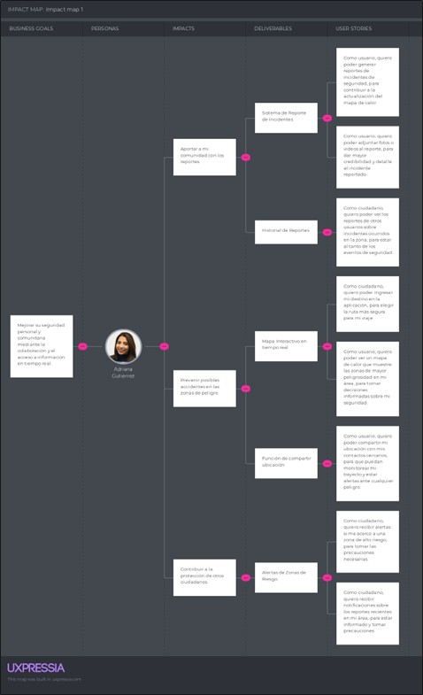

# Capítulo III: Requirements Specification
## 3.1. To-be Scenario Mapping

### Segmento 1: Ciudadano

### Segmento 2: Municipalidad

Enlace del To-Be Scenario Mapping: https://lucid.app/lucidchart/9c2329c4-fd90-4760-9ce3-d2e30cbe1b86/edit?viewport_loc=-433%2C56%2C1791%2C836%2C0_0&invitationId=inv_3a88d771-9c52-4f43-8aef-2c234eea78d6

## 3.2. User Stories
| User/Technical Story ID | Título | Descripción | Criterios de Aceptación | Relacionado con (Epic ID) |
|-------------------------|--------|-------------|--------------------------|----------------------------|
| EP01 | Interfaz de Usuario y Navegación | Como usuario, quiero interactuar con una interfaz clara y fácil de navegar, para acceder a las funciones de la aplicación sin complicaciones. | No corresponde. | No corresponde. |
| EP02 | Registro, Inicio de Sesión y Perfil | Como usuario, quiero poder registrarme, iniciar sesión y personalizar mi perfil, para gestionar mi cuenta y preferencias dentro de la aplicación. | No corresponde. | No corresponde. |
| EP03 | Mapa Interactivo y Reportes | Como usuario, quiero acceder a un mapa interactivo que muestre rutas seguras y zonas peligrosas, y poder enviar reportes de incidentes, para contribuir a la seguridad de mi comunidad. | No corresponde. | No corresponde. |
| EP04 | Diseño y Accesibilidad de la Landing Page | Como visitante de la landing page, quiero acceder a una página bien diseñada y fácil de navegar, para obtener rápidamente información sobre PeaceApp y cómo descargarla. | No corresponde. | No corresponde. |
| EP05 | Información y Contacto | Como visitante de la landing page, quiero encontrar información clara sobre los servicios y beneficios de la aplicación y tener la opción de contactar al equipo, para resolver cualquier duda o preocupación que tenga. | No corresponde. | No corresponde. |
| EP06 | Gestión Municipal de Incidentes | Como usuario municipal, quiero acceder a un sistema de gestión de reportes ciudadanos, para monitorear, priorizar y actuar ante incidentes de seguridad. | No corresponde. | No corresponde. |
| EP07 | Sistema de Emergencias en Tiempo Real | Como usuario, quiero poder enviar y recibir alertas de emergencia en tiempo real, para actuar rápidamente ante situaciones críticas. | No corresponde. | No corresponde. |
| EP08 | Asistencia Inteligente y Validación con IA | Como usuario, quiero contar con funcionalidades basadas en inteligencia artificial que me ayuden a consultar información de seguridad, crear reportes más fácilmente y validar evidencias, para mejorar la rapidez, confiabilidad y precisión del sistema. | No corresponde. | No corresponde. |
| US01 | Contactar con la Startup | Como visitante de la Landing Page, quiero encontrar un formulario de contacto funcional y accesible, para poder comunicarme con el startup. | Escenario 1: Enviar un mensaje a los desarrolladores Dado que el visitante tiene una consulta o comentario relacionado con la aplicación, Cuando redacte un mensaje para contactar a los desarrolladores, Entonces el sistema enviará el mensaje a la dirección de correo electrónico del startup. | EP05 |
| US02 | Navegar en la Landing Page | Como visitante de la Landing Page, quiero encontrar las secciones bien definidas para comprender fácilmente la información mostrada. | Escenario 1: Visualizar información Dado que el visitante está recorriendo la landing page, Cuando acceda a una sección de la landing page, Entonces podrá comprender la información, ya que, cada sección estará organizada.  Escenario 2: Navegación a través del menú principal Dado que el visitante está en la landing page, Cuando hace clic en una opción del menú principal (como "About Us", "Services", entre otros), Entonces es redirigido a la sección correspondiente y la información se muestra claramente. | EP04 |
| US03 | Diseño Responsivo | Como usuario, quiero que la aplicación se adapte bien a diferentes tamaños de pantalla, para poder usarla cómodamente en cualquier dispositivo, ya sea móvil, tablet o escritorio. | Escenario 1: Adaptación a dispositivos móviles Dado que el usuario accede a la aplicación desde un smartphone, Cuando la aplicación se carga en el dispositivo, Entonces la interfaz se ajusta automáticamente para proporcionar una experiencia de uso óptima en una pantalla pequeña.  Escenario 2: Adaptación a tablets Dado que el usuario accede a la aplicación desde una tablet, Cuando la aplicación se carga en el dispositivo, Entonces la interfaz muestra un diseño responsivo adecuado para la pantalla más grande, utilizando el espacio de manera eficiente. | EP01 |
| US04 | Registro de Usuarios | Como usuario, quiero poder registrarme en la aplicación, para acceder a las funcionalidades de PeaceApp. | Escenario 1: Registro exitoso Dado que el usuario ha completado todos los campos del formulario de registro, Cuando hace clic en "Crear cuenta", Entonces la cuenta se crea y el usuario accede a la aplicación.  Escenario 2: Registro incompleto Dado que el usuario intenta registrarse sin completar todos los campos obligatorios, Cuando hace clic en "Crear cuenta", Entonces el sistema muestra un mensaje de error indicando qué campos faltan por completar.  Escenario 3: Registro con credenciales ya utilizadas Dado que el usuario intenta registrarse utilizando un correo electrónico ya registrado en la base de datos, Cuando hace clic en "Crear cuenta", Entonces el sistema muestra un mensaje de error indicando que el correo electrónico ya está en uso y sugiere recuperar la contraseña. | EP02 |
| US05 | Iniciar Sesión | Como usuario registrado, quiero poder iniciar sesión con mi correo y contraseña, para acceder a mi cuenta. | Escenario 1: Inicio de sesión exitoso Dado que el usuario ha ingresado su correo y contraseña correctamente, Cuando hace clic en "Iniciar sesión", Entonces el usuario accede a su cuenta en la aplicación.  Escenario 2: Inicio de sesión con credenciales incorrectas Dado que el usuario ingresa un correo electrónico o contraseña incorrectos, Cuando hace clic en "Iniciar sesión", Entonces el sistema muestra un mensaje de error indicando que las credenciales son incorrectas. | EP02 |
| US06 | Generar Reporte de Incidentes | Como ciudadano, quiero generar reportes de incidentes de seguridad, para contribuir a la actualización del mapa de calor. | Escenario 1: Reporte exitoso Dado que el usuario ha presenciado un incidente, Cuando completa el formulario de reporte en la aplicación, Entonces el incidente se registra y el mapa de calor se actualiza.  Escenario 2: Reporte con datos incompletos Dado que el usuario intenta enviar un reporte sin completar toda la información requerida, Cuando hace clic en "Enviar reporte", Entonces el sistema muestra un mensaje de error indicando los campos faltantes.  Escenario 3: Cancelación del reporte Dado que el usuario ha comenzado a llenar un reporte de incidente, Cuando decide cancelar el envío antes de completar el formulario, Entonces el sistema le pregunta si está seguro de que desea cancelar y descartar los datos ingresados. | EP03 |
| US07 | Adjuntar Evidencia al Reporte | Como usuario, quiero poder adjuntar fotos o videos al reporte, para dar mayor credibilidad y detalle al incidente reportado. | Escenario 1: Adjuntar evidencia Dado que el usuario está completando un reporte, Cuando adjunta una foto o video desde su dispositivo, Entonces el reporte se envía con la evidencia adjunta.  Escenario 2: Error al subir evidencia Dado que el usuario intenta subir una imagen o video de gran tamaño que excede el límite permitido, Cuando hace clic en "Subir evidencia", Entonces el sistema muestra un mensaje de error indicando que el archivo es demasiado grande. | EP03 |
| US08 | Visualización de Reportes | Como ciudadano, quiero ver los reportes de otros usuarios sobre incidentes ocurridos en la zona, para estar al tanto de los eventos de seguridad. | Escenario 1: Visualización de reportes recientes Dado que el ciudadano está navegando por la aplicación, Cuando accede a la opción de "Ver reportes", Entonces la aplicación muestra los reportes más recientes en la zona del ciudadano.  Escenario 2: Visualización de reportes en el mapa Dado que el ciudadano está utilizando el mapa interactivo en la aplicación, Cuando activa la opción de mostrar reportes en el mapa, Entonces la aplicación superpone los reportes relevantes en el mapa, mostrando la ubicación exacta de cada incidente. | EP03 |
| US09 | Recibir Alertas de Zonas de Riesgo | Como ciudadano, quiero recibir alertas al acceso a una zona de alto riesgo, para tomar las precauciones necesarias. | Escenario 1: Alerta de riesgo mientras está en una zona peligrosa Dado que el ciudadano está caminando en una zona peligrosa según la aplicación, Cuando la aplicación detecta que el ciudadano está en esa zona, Entonces la aplicación envía una alerta al ciudadano. | EP03 |
| US10 | Compartir Ubicación con Contactos | Como usuario de la aplicación móvil, quiero poder compartir mi ubicación con mis contactos cercanos, para que puedan monitorear mi trayecto y estar alertas ante cualquier peligro. | Escenario 1: Compartir ubicación con éxito Dado que un usuario desea compartir su ubicación desde la aplicación móvil, Cuando activa la opción de compartir ubicación, Entonces los contactos seleccionados reciben la ubicación en tiempo real.  Escenario 2: Error al compartir ubicación Dado que un usuario intenta compartir su ubicación con sus contactos cercanos desde la aplicación móvil, Cuando la misma no puede acceder a la ubicación del usuario, Entonces se muestra un mensaje de error indicando que no se puede compartir la ubicación. | EP03 |
| US11 | Editar Información de Perfil | Como usuario, quiero poder editar mi información de perfil, para corregir o actualizar mis datos personales. | Escenario 1: Editar información de perfil exitosa Dado que el usuario está en la pantalla de edición de su perfil, Cuando el usuario actualiza su información personal y hace clic en el botón "Guardar cambios", Entonces la información actualizada debe guardarse correctamente y mostrarse en el perfil del usuario, con un mensaje de confirmación indicando que los cambios se realizaron con éxito.  Escenario 2: Error al guardar información de perfil Dado que el usuario está en la pantalla de edición de su perfil, Cuando el usuario intenta guardar los cambios con un campo obligatorio vacío o con un formato incorrecto, Entonces el sistema debe mostrar un mensaje de error indicando que la información no es válida, resaltando los campos que necesitan corrección y no debe guardar los cambios hasta que toda la información esté correctamente completada. | EP02 |
| US12 | Recuperar Contraseña | Como usuario, quiero poder recuperar mi contraseña si la olvido, para poder acceder nuevamente a mi cuenta. | Escenario 1: Edición exitosa Dado que el usuario accede a la configuración de su perfil, Cuando cambia la información deseada, Entonces la información se actualiza correctamente.  Escenario 2: Fallo en la edición de perfil Dado que el usuario intenta guardar los cambios en su perfil, Cuando hay un problema de conectividad o error del servidor, Entonces el sistema muestra un mensaje de error indicando que los cambios no se han podido guardar. | EP02 |
| US13 | Acceder a Mapa con Reportes | Como ciudadano, quiero poder ver un mapa interactivo con los reportes de incidentes en mi área, para tomar decisiones informadas sobre mi seguridad. | Escenario 1: Acceso al mapa con reportes Dado que el usuario está en la página principal de la aplicación, Cuando selecciona el mapa, Entonces se muestra un mapa interactivo con marcadores que representan los reportes de incidentes según su ubicación.  Escenario 2: Mapa sin reportes disponibles Dado que el usuario está en una zona sin reportes registrados, Cuando accede al mapa desde la aplicación, Entonces el sistema muestra el mapa sin marcadores y con un mensaje indicando que no hay reportes disponibles en la zona seleccionada. | EP03 |
| US14 | Acceder al Perfil de Usuario | Como usuario, quiero acceder a mi perfil desde el menú principal, para visualizar mi información personal y configuraciones. | Escenario 1: Usuario sin imagen de perfil Dado que el usuario ha iniciado sesión y accede a la sección "Perfil", Cuando no tiene una imagen de perfil configurada, Entonces el sistema muestra una imagen por defecto y la opción de subir una. Y puede visualizar su información ingresada en el sistema.  Escenario 2: Usuario con imagen de perfil Dado que el usuario ha iniciado sesión y accede a la sección "Perfil", Cuando ya tiene una imagen de perfil configurada, Entonces el sistema muestra la foto de perfil y le permite visualizar su información ingresada en el sistema. | EP02 |
| US15 | Filtrar Reportes | Como ciudadano, quiero poder filtrar los reportes para ver todos los reportes o solo los que yo he creado, para gestionar mejor la información relevante según mis intereses. | Escenario 1: Ver solo mis reportes Dado que el usuario está en la sección de reportes, Cuando selecciona la opción "Mis reportes", Entonces el sistema muestra únicamente los reportes generados por ese usuario.  Escenario 2: Ver todos los reportes Dado que el usuario está en la sección de reportes, Cuando selecciona la opción "Todos los reportes", Entonces el sistema muestra la lista completa de reportes disponibles en la base de datos. | EP03 |
| US16 | Buscar Ubicación en el Mapa | Como ciudadano, quiero poder explorar reportes de seguridad en diferentes zonas del mapa, para tomar decisiones informadas sobre mis desplazamientos. | Escenario 1: Buscar ubicación por dirección Dado que el usuario está en la sección de mapa, Cuando ingresa una dirección en el buscador, Entonces el mapa se centra en esa ubicación y muestra los reportes disponibles en esa zona.  Escenario 2: Mover el mapa manualmente Dado que el usuario está navegando el mapa, Cuando arrastra o aleja el mapa hacia otra zona, Entonces los reportes visibles se actualizan automáticamente según la nueva área mostrada. | EP03 |
| US17 | Cambiar Foto de Perfil | Como usuario, quiero poder subir y cambiar mi foto de perfil, para personalizar mi cuenta. | Escenario 1: Éxito al cambiar foto. Dado que el usuario está en "Editar Perfil", Cuando selecciona "Cambiar foto" y elige una imagen válida (JPG, PNG), Entonces la imagen se sube y se actualiza en el perfil y el menú de navegación.  Escenario 2: Archivo inválido. Dado que el usuario sube un archivo no compatible (ej. un PDF) o muy pesado (> 5MB), Entonces se muestra el mensaje "Formato de archivo no válido" o "Archivo demasiado grande". | EP02 |
| US18 | Notificación de Éxito al Reportar | Como usuario, quiero recibir una confirmación visual (mensaje "toast"), para saber que mi reporte se envió correctamente. | Escenario 1: Ver notificación. Dado que el usuario presiona "Enviar" en un formulario de reporte válido, Entonces el sistema oculta el formulario y muestra un mensaje "Reporte enviado con éxito" por 3 segundos. | EP03 |
| US19 | Manejo de Permisos de Ubicación | Como usuario, quiero que la app me pida permiso para usar mi ubicación, para entender por qué lo necesita. | Escenario 1: Aceptar permisos. Dado que el usuario abre el mapa por primera vez, Cuando la app solicita permisos de ubicación y el usuario acepta, Entonces el mapa se centra en su ubicación actual.  Escenario 2: Denegar permisos. Dado que el usuario deniega los permisos de ubicación, Entonces el mapa se muestra en una ubicación predeterminada con un mensaje indicando que la geolocalización está desactivada. | EP03 |
| US20 | Visualización de Contraseña | Como usuario, quiero un ícono de "mostrar/ocultar" contraseña, para verificar que la escribí bien al registrarme o iniciar sesión. | Escenario 1: Mostrar contraseña. Dado que el usuario escribe en el campo de contraseña, Cuando presiona el ícono "mostrar", Entonces los caracteres se vuelven visibles.  Escenario 2: Ocultar contraseña. Dado que la contraseña es visible, Cuando presiona el ícono "ocultar", Entonces los caracteres vuelven a enmascararse. | EP02 |
| US21 | Estado Vacío en "Mis Reportes" | Como usuario, si no he creado reportes, quiero ver un mensaje que me lo indique, para no ver una pantalla en blanco. | Escenario 1: Ver mensaje de estado vacío. Dado que el usuario ha iniciado sesión y navega a "Mis Reportes", Cuando no tiene reportes creados, Entonces el sistema muestra un mensaje "Aún no has creado reportes. ¡Anímate a reportar!". | EP03 |
| US22 | Notificación de Pérdida de Conexión | Como usuario, quiero ver un aviso si pierdo la conexión a internet, para saber por qué la app no funciona. | Escenario 1: Detectar pérdida de conexión. Dado que el usuario pierde conexión, Entonces se muestra un banner "Sin conexión. Reintentando...".  Escenario 2: Recuperar conexión. Dado que la conexión se restablece, Entonces el banner desaparece automáticamente. | EP01 |
| US23 | Centrar Mapa en mi Ubicación | Como usuario, quiero un botón para centrar el mapa en mi ubicación actual con un solo toque, para orientarme rápidamente. | Escenario 1: Centrar mapa. Dado que el usuario está navegando el mapa y presiona el botón "Mi Ubicación" (y los permisos están concedidos), Entonces el mapa se anima y centra la vista en su posición actual. | EP03 |
| US24 | Persistencia de Sesión | Como usuario registrado, quiero que mi sesión se mantenga iniciada en la app, para no tener que ingresar mis datos cada vez que la abro. | Escenario 1: Sesión persistente. Dado que el usuario inició sesión y cierra la aplicación, Cuando vuelve a abrirla, Entonces ya se encuentra en la pantalla principal (Home) con su sesión activa.  Escenario 2: Cerrar sesión manual. Dado que el usuario decide cerrar sesión, Cuando presiona "Cerrar Sesión", Entonces la sesión se cierra correctamente y se redirige al login. | EP02 |
| US25 | Ver Detalles Rápidos en Mapa | Como usuario, quiero tocar un pin en el mapa y ver un resumen del reporte, para decidir si quiero ver el detalle completo. | Escenario 1: Ver pop-up de reporte. Dado que el usuario está en el mapa, Cuando toca un marcador (pin) de incidente, Entonces se abre una pequeña tarjeta (pop-up) que muestra el título, tipo de incidente y un botón "Ver más". | EP03 |
| US26 | Compatibilidad Lector de Pantalla | Como usuario con discapacidad visual, quiero que la app sea compatible con lectores de pantalla (TalkBack/VoiceOver), para poder usarla. | Escenario 1: Navegación por voz. Dado que el usuario activa TalkBack/VoiceOver, Cuando toca botones, íconos y textos, Entonces el lector de pantalla anuncia la descripción y función de cada elemento (ej. "Botón, Reportar Incidente"). | EP01 |
| US27 | Texto y Contraste Legibles | Como usuario, quiero que el texto y los contrastes cumplan con estándares de accesibilidad, para leer sin dificultad. | Escenario 1: Contraste adecuado. Todos los textos sobre fondos tienen un ratio de contraste mínimo de 4.5:1.  Escenario 2: Texto escalable. Dado que el usuario aumenta el tamaño de fuente en su dispositivo, Entonces el texto en la app se ajusta sin romperse. | EP01 |
| US28 | CTA Claros en Landing Page | Como visitante de la Landing Page, quiero que los botones de descarga sean evidentes, para instalar la app. | Escenario 1: Visualizar botones de tienda. Dado que el visitante está en la Landing Page, Cuando carga la página, Entonces los botones "Descargar en App Store" y "Descargar en Google Play" son prominentes y fáciles de identificar en la sección principal. | EP04 |
| US29 | Indicadores de Carga (Loading) | Como usuario, quiero ver indicadores de carga (spinners/skeletons) al cargar el mapa o reportes, para saber que la app está trabajando. | Escenario 1: Carga de reportes. Dado que el usuario entra a la lista de reportes, Cuando los datos se están obteniendo del servidor, Entonces se muestran "tarjetas esqueleto" (placeholders).  Escenario 2: Carga del mapa. Dado que el usuario abre el mapa, Cuando los pines de incidentes se están cargando, Entonces se muestra un indicador de carga (spinner) en el centro. | EP01 |
| US30 | Mensaje Error de Formato de Archivo | Como usuario, al adjuntar evidencia, si el archivo es inválido, quiero un error claro, para saber qué corregir. | Escenario 1: Subir archivo no soportado. Dado que el usuario intenta adjuntar un archivo .zip al reporte, Cuando selecciona el archivo, Entonces el sistema muestra el mensaje "Error: Solo se permiten imágenes (JPG, PNG) o videos (MP4)". | EP03 |
| US31 | Acceso como Municipalidad | Como usuario municipal, quiero iniciar sesión con permisos diferenciados, para acceder a un panel administrativo. | Escenario 1: Inicio de sesión exitoso. Dado que el usuario municipal ingresa credenciales válidas, Cuando hace clic en "Iniciar sesión", Entonces accede al dashboard municipal.  Escenario 2: Acceso denegado. Dado que el usuario no tiene permisos municipales, Cuando intenta iniciar sesión, Entonces el sistema muestra un mensaje de error indicando acceso restringido. | EP06 |
| US32 | Visualizar Reportes en Dashboard | Como usuario municipal, quiero visualizar reportes en un dashboard con herramientas de gestión, para monitorear incidentes. | Escenario 1: Visualización de reportes. Dado que existen reportes en el sistema, Cuando el usuario accede al dashboard, Entonces se muestran en una lista y en el mapa.  Escenario 2: Sin reportes disponibles. Dado que no hay reportes registrados, Cuando el usuario accede al dashboard, Entonces se muestra un mensaje indicando que no hay reportes disponibles. | EP06 |
| US33 | Filtrar y Priorizar Reportes | Como usuario municipal, quiero filtrar reportes por tipo, zona, estado o prioridad, para gestionar mejor los incidentes. | Escenario 1: Filtrar por tipo. Dado que el usuario está en el dashboard, Cuando selecciona un tipo de incidente, Entonces el sistema muestra solo los reportes correspondientes.  Escenario 2: Filtrar por estado. Dado que el usuario selecciona un estado (pendiente, en proceso, resuelto), Cuando aplica el filtro, Entonces se actualiza la lista de reportes según el criterio seleccionado. | EP06 |
| US34 | Gestionar Estado de Reportes | Como usuario municipal, quiero cambiar el estado de un reporte (pendiente, en proceso, resuelto), para llevar control de atención. | Escenario 1: Cambio de estado exitoso. Dado que el usuario selecciona un reporte, Cuando cambia su estado, Entonces el sistema guarda el cambio correctamente.  Escenario 2: Error al actualizar. Dado que ocurre un problema en el sistema, Cuando el usuario intenta cambiar el estado, Entonces se muestra un mensaje de error y no se guarda el cambio. | EP06 |
| US35 | Ver Detalle Completo del Reporte | Como usuario municipal, quiero ver toda la información del reporte, incluyendo evidencia, para tomar decisiones informadas. | Escenario 1: Visualizar detalle completo. Dado que el usuario selecciona un reporte, Cuando accede a su detalle, Entonces se muestra la descripción, ubicación y evidencia adjunta.  Escenario 2: Reporte sin evidencia. Dado que el reporte no contiene archivos adjuntos, Cuando el usuario accede al detalle, Entonces el sistema muestra un mensaje indicando que no hay evidencia disponible. | EP06 |
| US36 | Recibir Emergencias en Tiempo Real | Como usuario municipal, quiero recibir y visualizar alertas de emergencia en tiempo real, para actuar rápidamente. | Escenario 1: Recepción de emergencia. Dado que un ciudadano envía una alerta de emergencia, Cuando el sistema la recibe, Entonces se muestra inmediatamente en el dashboard.  Escenario 2: Sin emergencias activas. Dado que no existen alertas activas, Cuando el usuario accede al sistema, Entonces no se muestran emergencias en pantalla. | EP07 |
| US37 | Botón de Emergencia | Como ciudadano, quiero tener un botón de emergencia visible y accesible en todo momento, para poder solicitar ayuda inmediata en situaciones críticas. | Escenario 1: Visualización del botón. Dado que el usuario está dentro de la aplicación, Cuando navega por cualquier sección principal, Entonces el botón de emergencia se muestra visible y accesible.  Escenario 2: Accesibilidad del botón. Dado que el usuario necesita ayuda urgente, Cuando presiona el botón de emergencia, Entonces el sistema responde inmediatamente sin retrasos. | EP07 |
| US38 | Enviar Alerta de Emergencia | Como ciudadano, quiero que al presionar el botón de emergencia se envíe automáticamente mi ubicación, para recibir ayuda de la municipalidad. | Escenario 1: Envío exitoso. Dado que el usuario presiona el botón de emergencia, Cuando el sistema obtiene la ubicación del usuario, Entonces se envía la alerta con coordenadas, usuario y fecha.  Escenario 2: Error de ubicación. Dado que el sistema no puede acceder a la ubicación, Cuando el usuario presiona el botón, Entonces se muestra un mensaje indicando que no se pudo enviar la ubicación. | EP07 |
| US39 | Confirmación de Envío de Emergencia | Como ciudadano, quiero recibir una confirmación visual al enviar una alerta de emergencia, para saber que mi solicitud fue procesada. | Escenario 1: Confirmación exitosa. Dado que la alerta fue enviada correctamente, Cuando el sistema procesa la solicitud, Entonces se muestra un mensaje como "Alerta enviada con éxito".  Escenario 2: Error en el envío. Dado que ocurre un fallo en el envío, Cuando el sistema no logra procesar la alerta, Entonces se muestra un mensaje de error indicando el problema. | EP07 |
| US40 | Ver Emergencias en Mapa | Como usuario municipal, quiero ver emergencias en el mapa con ubicación exacta, para ubicar rápidamente el incidente. | Escenario 1: Visualización en el mapa. Dado que existe una emergencia activa, Cuando el usuario visualiza el mapa, Entonces se muestra un marcador con la ubicación exacta.  Escenario 2: Emergencia sin ubicación. Dado que la alerta no tiene coordenadas válidas, Cuando se intenta mostrar en el mapa, Entonces no se renderiza el marcador. | EP07 |
| US41 | Gestionar Emergencias | Como usuario municipal, quiero marcar emergencias como atendidas, para llevar control de respuesta. | Escenario 1: Marcar emergencia como atendida. Dado que el usuario selecciona una emergencia, Cuando cambia su estado a "atendida", Entonces el sistema guarda el cambio correctamente.  Escenario 2: Error al actualizar estado. Dado que ocurre un fallo en el sistema, Cuando el usuario intenta actualizar la emergencia, Entonces se muestra un mensaje de error. | EP07 |
| US42 | Consultar nivel de seguridad mediante Chatbot | Como ciudadano, quiero preguntarle al chatbot en lenguaje natural sobre la seguridad de una zona específica, para obtener un resumen rápido de los incidentes recientes sin tener que buscar manualmente en el mapa. | Escenario 1: Consulta exitosa sobre una zona Dado que el usuario se encuentra dentro de la aplicación Y existe información reciente de incidentes en una zona registrada, Cuando el usuario escribe al chatbot una consulta sobre la seguridad de una zona específica, Entonces el sistema procesa la consulta y muestra un resumen con el nivel de seguridad de la zona y los incidentes recientes asociados.  Escenario 2: Zona sin información disponible Dado que el usuario consulta una zona para la cual no existen reportes recientes, Cuando el chatbot procesa la solicitud, Entonces el sistema muestra un mensaje indicando que no hay suficiente información reciente para evaluar esa zona.  Escenario 3: Consulta ambigua Dado que el usuario ingresa una consulta incompleta o ambigua, Cuando el chatbot no logra identificar la zona solicitada, Entonces el sistema solicita al usuario más detalle para completar la consulta. | EP08 |
| US43 | Asistencia del Chatbot para crear reportes | Como usuario en situación de estrés, quiero dictarle o escribirle al chatbot lo que acaba de pasar, para que el sistema llene el formulario de reporte de incidente automáticamente por mí. | Escenario 1: Generación automática de reporte desde texto Dado que el usuario se encuentra en la sección de reportes, Cuando escribe o dicta al chatbot una descripción de lo ocurrido, Entonces el sistema interpreta la información ingresada y autocompleta los campos principales del formulario, como tipo de incidente, descripción y ubicación aproximada si está disponible.  Escenario 2: Información insuficiente para completar el reporte Dado que el usuario ingresa una descripción incompleta, Cuando el chatbot procesa el mensaje, Entonces el sistema completa solo los campos que puede inferir con seguridad y solicita al usuario los datos faltantes antes de enviar el reporte.  Escenario 3: Confirmación antes del envío Dado que el sistema generó automáticamente un borrador del reporte, Cuando el usuario revisa la información sugerida, Entonces puede editarla, confirmarla o cancelarla antes de enviarla. | EP08 |
| US44 | Autocompletado de tipo de incidente por IA | Como usuario, quiero que la aplicación sugiera automáticamente el tipo de incidente (robo, accidente, etc.) al momento de subir la foto de evidencia, para agilizar el proceso de reporte. | Escenario 1: Sugerencia automática exitosa Dado que el usuario sube una imagen como evidencia, Cuando el sistema analiza la foto mediante el servicio de IA, Entonces se muestra una sugerencia automática del tipo de incidente detectado.  Escenario 2: Baja confianza en la clasificación Dado que la imagen no permite una clasificación clara, Cuando el sistema obtiene un puntaje de confianza bajo, Entonces muestra una sugerencia tentativa y solicita al usuario seleccionar manualmente el tipo de incidente.  Escenario 3: Confirmación o cambio de categoría sugerida Dado que el sistema propone un tipo de incidente, Cuando el usuario revisa la sugerencia, Entonces puede aceptarla o cambiarla antes de enviar el reporte. | EP08 |
| US45 | Validación de evidencia fotográfica | Como ciudadano, quiero que la comunidad esté protegida de reportes falsos, por lo que espero que el sistema analice y valide automáticamente si las fotos subidas contienen contenido inapropiado o no relacionado con seguridad. | Escenario 1: Evidencia válida Dado que el usuario sube una imagen al sistema, Cuando la IA analiza el contenido de la evidencia, Entonces el sistema determina que la imagen es apta y permite continuar con el proceso de reporte.  Escenario 2: Evidencia no relacionada con seguridad Dado que el usuario sube una imagen que no guarda relación con incidentes de seguridad, Cuando el sistema analiza la fotografía, Entonces muestra una alerta indicando que la evidencia podría no ser válida y solicita al usuario reemplazarla o confirmar manualmente el envío.  Escenario 3: Contenido inapropiado o restringido Dado que la imagen contiene contenido inapropiado o no permitido, Cuando el sistema la analiza, Entonces bloquea su uso como evidencia y muestra un mensaje explicando que no cumple con las políticas del sistema.  Escenario 4: Validación incierta Dado que la IA no puede determinar con suficiente certeza si la imagen es válida, Cuando finaliza el análisis, Entonces el sistema marca la evidencia para revisión adicional y permite continuar bajo validación posterior, según la política del sistema. | EP08 |
| TS01 | Autenticación JWT mediante RESTful API | Como desarrollador, quiero autenticar a los usuarios a través de un token JWT para que puedan acceder a la plataforma de manera segura. | Escenario 1: Inicio de sesión exitoso Dado que el endpoint /api/v1/login está disponible, Cuando se envía un POST request con nombre de usuario y contraseña correctos, Entonces se recibe un response con un status 200 Y un token JWT es generado y enviado en el body del response.  Escenario 2: Fallo en inicio de sesión Dado que el endpoint /api/v1/login está disponible, Cuando se envía un POST request con credenciales incorrectas, Entonces se recibe un response con un status 401 Y un mensaje en el body dice "Credenciales incorrectas." | No corresponde |
| TS02 | Crear nuevo usuario mediante RESTful API | Como desarrollador, quiero permitir la creación de nuevos usuarios para que puedan acceder al sistema. | Escenario 1: Crear usuario con datos válidos Dado que el endpoint /api/v1/users está disponible, Cuando se envía un POST request con nombre, correo y contraseña, Entonces se recibe un response con un status 201 Y el usuario es creado, y se devuelve un body con el ID del usuario y los datos ingresados.  Escenario 2: Crear usuario con correo duplicado Dado que el endpoint /api/v1/users está disponible, Cuando se envía un POST request con un correo que ya existe, Entonces se recibe un response con un status 400 Y un mensaje en el body del response dice "El correo ya está en uso." | No corresponde |
| TS03 | Editar perfil de usuario mediante RESTful API | Como desarrollador, quiero que los usuarios puedan actualizar su información personal para mantener sus perfiles al día. | Escenario 1: Actualizar nombre y correo del perfil Dado que el endpoint /api/v1/users/{id} está disponible, Cuando se envía un PUT request con datos actualizados, Entonces se recibe un response con un status 200 Y la información del perfil es actualizada en el sistema. | No corresponde |
| TS04 | Crear reporte de incidente mediante RESTful API | Como desarrollador, quiero crear reportes de incidentes para compartir información sobre zonas peligrosas. | Escenario 1: Crear reporte de incidente válido Dado que el endpoint /api/v1/reports está disponible, Cuando se envía un POST request con los detalles del incidente (ubicación, descripción, tipo), Entonces se recibe un response con un status 201 Y el reporte es creado y registrado en el sistema.  Escenario 2: Intentar crear reporte con datos faltantes Dado que el endpoint /api/v1/reports está disponible, Cuando se envía un POST request sin todos los detalles necesarios (como la ubicación), Entonces se recibe un response con un status 400 Y un mensaje en el body dice "Datos insuficientes para crear el reporte." | No corresponde |
| TS05 | Obtener lista de reportes mediante RESTful API | Como desarrollador, quiero que los usuarios puedan obtener una lista de reportes para ver incidentes recientes en su área. | Escenario 1: Obtener reportes existentes Dado que el endpoint /api/v1/reports está disponible, Cuando se envía un GET request, Entonces se recibe un response con un status 200 Y una lista de reportes es devuelta en el body del response.  Escenario 2: No hay reportes disponibles Dado que el endpoint /api/v1/reports está disponible, Cuando se envía un GET request, Entonces se recibe un response con un status 200 Y un mensaje en el body dice "No hay reportes disponibles." | No corresponde |
| TS06 | Obtener reporte por ID mediante RESTful API | Como desarrollador, quiero que los usuarios puedan obtener los detalles de un solo reporte para consultar información específica sobre un incidente. | Escenario 1: Obtener reporte existente por ID Dado que el endpoint /api/v1/reports/{id} está disponible, Cuando se envía un GET request con un ID válido, Entonces se recibe un response con un status 200 Y los detalles del reporte son devueltos en el body del response.  Escenario 2: Intentar obtener reporte con un ID inexistente Dado que el endpoint /api/v1/reports/{id} está disponible, Cuando se envía un GET request con un ID inexistente, Entonces se recibe un response con un status 404 Y un mensaje en el body del response dice "Reporte no encontrado." | No corresponde |
| TS07 | Crear coordenadas de ubicación al generar un reporte | Como desarrollador, quiero registrar las coordenadas de una ubicación mediante un POST, para asociarlas al reporte de un incidente. | Escenario 1: Creación exitosa Dado que el endpoint /api/v1/locations/ está disponible, Cuando se envía un POST con latitude, longitude y idReport válidos, Entonces se recibe un status 200 y la ubicación queda registrada en el sistema.  Escenario 2: Faltan datos obligatorios Dado que el desarrollador omite un campo obligatorio (ej. latitude), Cuando se envía el POST, Entonces el sistema responde con un status 400 indicando "Parámetros inválidos".  Escenario 3: ID de reporte no válido Dado que se envía un idReport inexistente, Cuando se realiza la solicitud, Entonces el sistema responde con un status 404 o 400 con mensaje "Reporte no encontrado". | No corresponde |
| TS08 | Obtener ubicaciones para renderizar reportes en el mapa | Como desarrollador, quiero obtener las coordenadas mediante un GET, para mostrar los íconos de los reportes en el mapa. | Escenario 1: Obtención exitosa Dado que el endpoint /api/v1/locations/ está disponible, Cuando se envía un GET, Entonces se recibe un status 200 con la lista de ubicaciones.  Escenario 2: No hay ubicaciones registradas Dado que no existen ubicaciones en la base de datos, Cuando se hace la petición GET, Entonces el sistema responde con status 200 y una lista vacía. | No corresponde |
| TS09 | Crear alerta al acercarse a una zona de peligro | Como desarrollador, quiero crear una alerta mediante POST para notificar que un usuario está dentro del rango de un incidente. | Escenario 1: Creación exitosa Dado que el endpoint /api/v1/alerts/ está disponible, Cuando se envía un POST con location, type, description, idUser, imageUrl y idReport válidos, Entonces se recibe un status 200 y la alerta queda registrada.  Escenario 2: Faltan campos obligatorios Dado que se omite location o idUser, Cuando se realiza la solicitud, Entonces el sistema devuelve status 400 con mensaje de error.  Escenario 3: ID de usuario inválido Dado que se envía un idUser no existente, Cuando se realiza la solicitud, Entonces el sistema devuelve status 404 o 400 indicando "Usuario no encontrado". | No corresponde |
| TS10 | Obtener alertas por usuario | Como desarrollador, quiero obtener las alertas específicas de un usuario mediante GET. | Escenario 1: Obtención exitosa Dado que el endpoint /api/v1/alerts/{userId} está disponible, Cuando se envía un GET con un userId válido, Entonces se recibe un status 200 con la lista de alertas del usuario.  Escenario 2: Usuario sin alertas Dado que el usuario no ha generado alertas, Cuando se realiza la solicitud GET, Entonces el sistema responde con status 200 y una lista vacía.  Escenario 3: ID de usuario inválido Dado que se consulta un userId que no existe, Cuando se realiza la solicitud GET, Entonces se recibe un status 404. | No corresponde |
| TS11 | Eliminar alertas al recargar el mapa | Como desarrollador, quiero eliminar todas las alertas del usuario al recargar el mapa para evitar duplicaciones. | Escenario 1: Eliminación exitosa Dado que se requiere reiniciar las alertas al recargar el mapa, Cuando se envía un DELETE al endpoint /api/v1/alerts/, Entonces se recibe un status 200 confirmando que todas las alertas fueron eliminadas.  Escenario 2: No hay alertas activas Dado que no hay alertas en el sistema, Cuando se realiza la solicitud DELETE, Entonces se devuelve igualmente un status 200 o 204 indicando que no había nada que eliminar. | No corresponde |
| TS12 | Obtener detalles de alerta por ID | Como desarrollador, quiero consultar una alerta específica por su ID. | Escenario 1: Consulta exitosa Dado que se accede al endpoint /api/v1/alerts/{alertId} con un ID válido, Cuando se realiza un GET, Entonces se recibe un status 200 con los datos de la alerta.  Escenario 2: ID de alerta no encontrado Dado que se utiliza un ID que no corresponde a ninguna alerta, Cuando se realiza la solicitud, Entonces se recibe un status 404 con mensaje "Alerta no encontrada". | No corresponde |
| TS13 | Obtener datos de usuario por email | Como desarrollador, quiero obtener datos de un usuario mediante su email para fines de autenticación. | Escenario 1: Usuario encontrado Dado que el email existe, Cuando se hace un GET a /api/v1/users/{email}, Entonces se recibe un status 200 con los datos del usuario.  Escenario 2: Email no registrado Dado que el email no está en la base de datos, Cuando se realiza la solicitud GET, Entonces se recibe un status 404 con mensaje "Usuario no encontrado". | No corresponde |
| TS14 | Manejo de roles de usuario | Como desarrollador, quiero diferenciar roles de usuario (ciudadano y municipalidad), para controlar el acceso a funcionalidades específicas. | Escenario 1: Acceso con rol municipal. Dado que el endpoint /api/v1/login está disponible, Cuando el usuario inicia sesión con credenciales válidas de tipo municipal, Entonces se recibe un status 200 y el token incluye el rol "municipalidad".  Escenario 2: Acceso restringido. Dado que un usuario ciudadano intenta acceder a un endpoint administrativo, Cuando realiza la solicitud, Entonces se recibe un status 403 con mensaje "Acceso denegado". | No corresponde |
| TS15 | Crear alerta de emergencia mediante RESTful API | Como desarrollador, quiero registrar alertas de emergencia enviadas por ciudadanos, para notificar a la municipalidad. | Escenario 1: Crear emergencia válida. Dado que el endpoint /api/v1/emergencies está disponible, Cuando se envía un POST con location, idUser y timestamp válidos, Entonces se recibe un response con status 201 y la alerta es registrada.  Escenario 2: Datos incompletos. Dado que faltan campos obligatorios, Cuando se envía el POST, Entonces se recibe un status 400 con mensaje "Datos insuficientes". | No corresponde |
| TS16 | Obtener lista de emergencias mediante RESTful API | Como desarrollador, quiero obtener las alertas de emergencia registradas, para mostrarlas en el sistema municipal. | Escenario 1: Obtener emergencias existentes. Dado que el endpoint /api/v1/emergencies está disponible, Cuando se envía un GET request, Entonces se recibe un status 200 con la lista de emergencias.  Escenario 2: No hay emergencias. Dado que no existen registros, Cuando se realiza el GET, Entonces se recibe un status 200 con una lista vacía. | No corresponde |
| TS17 | Actualizar estado de emergencia mediante RESTful API | Como desarrollador, quiero actualizar el estado de una emergencia, para reflejar su atención. | Escenario 1: Actualización exitosa. Dado que el endpoint /api/v1/emergencies/{id} está disponible, Cuando se envía un PUT con un estado válido, Entonces se recibe un status 200 y la emergencia es actualizada.  Escenario 2: ID inválido. Dado que el ID no existe, Cuando se realiza la solicitud, Entonces se recibe un status 404 con mensaje "Emergencia no encontrada". | No corresponde |
| TS18 | Envío de notificaciones de emergencia | Como desarrollador, quiero enviar notificaciones en tiempo real cuando se registra una emergencia, para alertar a la municipalidad. | Escenario 1: Notificación exitosa. Dado que se crea una nueva emergencia en el sistema, Cuando el backend procesa la alerta, Entonces se envía una notificación al sistema municipal.  Escenario 2: Error en notificación. Dado que ocurre un fallo en el servicio de notificaciones, Cuando se intenta enviar la alerta, Entonces el sistema registra el error y reintenta el envío. | No corresponde |
| TS19 | Protección de endpoints mediante JWT | Como desarrollador, quiero asegurar los endpoints mediante autenticación JWT, para proteger los datos del sistema. | Escenario 1: Acceso autorizado. Dado que el endpoint requiere autenticación, Cuando se envía un request con token válido, Entonces se recibe un status 200 y acceso permitido.  Escenario 2: Token inválido o ausente. Dado que el request no contiene un token válido, Cuando se realiza la solicitud, Entonces se recibe un status 401 con mensaje "No autorizado". | No corresponde |
| TS20 | Implementar Microservicio de Chatbot mediante NLP | Como desarrollador, quiero crear un microservicio de chatbot que procese consultas en lenguaje natural, consulte la información de reportes y ubicaciones, y devuelva respuestas útiles al usuario. | Escenario 1: Consulta exitosa al chatbot Dado que el endpoint /api/v1/chatbot está disponible, Cuando se envía un POST request con una consulta válida en lenguaje natural sobre una zona, Entonces se recibe un response con un status 200 Y el body contiene una respuesta generada a partir de la información de reportes y ubicaciones.  Escenario 2: Consulta sin información suficiente Dado que el endpoint /api/v1/chatbot está disponible, Cuando se envía un POST request sobre una zona sin reportes registrados, Entonces se recibe un response con un status 200 Y un mensaje en el body indica "No hay información suficiente para esta zona".  Escenario 3: Error en la consulta Dado que el endpoint /api/v1/chatbot está disponible, Cuando se envía un POST request con un body inválido o vacío, Entonces se recibe un response con un status 400 Y un mensaje en el body dice "Consulta inválida". | No corresponde |
| TS21 | Clasificación de imágenes mediante microservicio de IA | Como desarrollador, quiero desplegar un microservicio de clasificación de imágenes para analizar evidencia fotográfica de incidentes urbanos. | Escenario 1: Predicción exitosa de imagen Dado que el endpoint /api/v1/image-classifier/predict está disponible, Cuando se envía un POST request con una imagen válida, Entonces se recibe un response con un status 200 Y el body contiene la etiqueta predicha y un puntaje de confianza.  Escenario 2: Imagen no válida o no enviada Dado que el endpoint /api/v1/image-classifier/predict está disponible, Cuando se envía un POST request sin imagen o con un formato no permitido, Entonces se recibe un response con un status 400 Y un mensaje en el body dice "Imagen inválida o no proporcionada".  Escenario 3: Error al procesar la imagen Dado que el endpoint /api/v1/image-classifier/predict está disponible, Cuando ocurre un fallo durante la inferencia del modelo, Entonces se recibe un response con un status 500 Y un mensaje en el body dice "Error al procesar la imagen". | No corresponde |
| TS22 | Integrar reconocimiento de imágenes al servicio de reportes | Como desarrollador, quiero integrar el servicio de reconocimiento de imágenes al flujo de creación de reportes, para obtener una clasificación sugerida y un puntaje de confianza antes de registrar la evidencia. | Escenario 1: Crear reporte con clasificación automática exitosa Dado que el endpoint /api/v1/reports está disponible, Cuando se envía un POST request con los datos del incidente y una imagen válida, Entonces se recibe un response con un status 201 Y el reporte es creado con una clasificación sugerida por IA y su puntaje de confianza asociado.  Escenario 2: Crear reporte con clasificador no disponible Dado que el endpoint /api/v1/reports está disponible, Cuando se envía un POST request con imagen válida y el microservicio de clasificación no responde, Entonces se recibe un response con un status 201 o 202 según la política del sistema Y el reporte se registra con estado de validación pendiente.  Escenario 3: Crear reporte con imagen inválida Dado que el endpoint /api/v1/reports está disponible, Cuando se envía un POST request con una imagen dañada o no compatible, Entonces se recibe un response con un status 400 Y un mensaje en el body dice "No se pudo procesar la evidencia". | No corresponde |
| TS23 | Orquestación de servicios de IA en el API Gateway | Como desarrollador, quiero configurar rutas seguras en el API Gateway para dirigir el tráfico hacia los microservicios de chatbot y reconocimiento de imágenes, aplicando autenticación JWT cuando corresponda. | Escenario 1: Acceso autorizado a rutas de IA Dado que las rutas /api/v1/chatbot y /api/v1/image-classifier están configuradas en el API Gateway, Cuando se envía un request con un token JWT válido, Entonces el API Gateway redirige la solicitud al microservicio correspondiente Y se recibe un response con un status 200 o el status devuelto por el servicio de destino.  Escenario 2: Acceso no autorizado a rutas protegidas de IA Dado que las rutas de IA requieren autenticación, Cuando se envía un request sin token o con un token inválido, Entonces se recibe un response con un status 401 Y un mensaje en el body dice "No autorizado".  Escenario 3: Servicio de IA no disponible Dado que el API Gateway intenta redirigir la solicitud a un microservicio de IA no disponible, Cuando se realiza la petición, Entonces se recibe un response con un status 503 Y un mensaje en el body dice "Servicio no disponible". | No corresponde |

## 3.3. Impact Mapping

## 3.4. Product Backlog

Se implementa el siguiente producto backlog a partir de las historias de
usuario elaboradas, evaluándolas en un rango de 1,2,3,5,8 (serie
Fibonacci), significando el mayor número como el más importante y
relevante.

| **ID** | **User Story / Technical Story Id** | **Título** | **Descripción** | **Story Points (1/2/3/5/8)** |
|--------|-------------------------------------|------------|-----------------|------------------------------|
| 1 | **US02** | Navegar en la Landing Page | Como visitante de la Landing Page, quiero encontrar las secciones bien definidas para comprender fácilmente la información mostrada. | 1 |
| 2 | **US01** | Contactar con la Startup | Como visitante de la Landing Page, quiero encontrar un formulario de contacto funcional y accesible, para poder comunicarme con el startup. | 1 |
| 3 | **US06** | Generar Reporte de Incidentes | Como usuario, quiero poder generar reportes de incidentes de seguridad, para contribuir a la actualización del mapa de calor. | 3 |
| 4 | **US07** | Adjuntar Evidencia al Reporte | Como usuario, quiero poder adjuntar fotos o videos al reporte, para dar mayor credibilidad y detalle al incidente reportado. | 5 |
| 5 | **US08** | Visualización de Reportes | Como ciudadano, quiero poder ver los reportes de otros usuarios sobre incidentes ocurridos en la zona, para estar al tanto de los eventos de seguridad. | 3 |
| 6 | **US13** | Acceder a Mapa con Reportes | Como usuario, quiero poder ver un mapa interactivo con los reportes de incidentes en mi área, para tomar decisiones informadas sobre mi seguridad. | 8 |
| 7 | **US16** | Buscar Ubicación en el Mapa | Como usuario, quiero poder explorar reportes de seguridad en diferentes zonas del mapa, para tomar decisiones informadas sobre mis desplazamientos. | 3 |
| 8 | **US15** | Filtrar Reportes | Como usuario, quiero poder filtrar los reportes para ver todos los reportes o solo los que yo he creado, para gestionar mejor la información. | 2 |
| 9 | **US09** | Recibir Alertas de Zonas de Riesgo | Como ciudadano, quiero recibir alertas si me acerco a una zona de alto riesgo, para tomar las precauciones necesarias. | 5 |
| 10 | **US10** | Compartir Ubicación con Contactos en la Aplicación Móvil | Como usuario de la aplicación móvil, quiero poder compartir mi ubicación con mis contactos cercanos, para que puedan monitorear mi trayecto ante cualquier peligro. | 5 |
| 11 | **US11** | Editar Información de Perfil | Como usuario, quiero poder editar mi información de perfil, para corregir o actualizar mis datos personales. | 2 |
| 12 | **US14** | Acceder al Perfil de Usuario | Como usuario, quiero acceder a mi perfil desde el menú principal, para visualizar mi información personal y configuraciones. | 2 |
| 13 | **US05** | Iniciar Sesión | Como usuario registrado, quiero poder iniciar sesión con mi correo y contraseña, para acceder a mi cuenta. | 8 |
| 14 | **US04** | Registro de Usuarios | Como usuario, quiero poder registrarme en la aplicación, para acceder a las funcionalidades de PeaceApp. | 8 |
| 15 | **US12** | Recuperar Contraseña | Como usuario, quiero poder recuperar mi contraseña si la olvido, para poder acceder nuevamente a mi cuenta. | 2 |
| 16 | **US03** | Diseño Responsivo | Como usuario, quiero que la aplicación se adapte a diferentes pantallas, para usarla cómodamente en móvil, tablet o escritorio. | 2 |
| 17 | **TS04** | Crear reporte de incidente mediante RESTful API | Como desarrollador, quiero que los usuarios puedan crear reportes de incidentes para compartir información sobre zonas peligrosas. | 5 |
| 18 | **TS07** | Crear coordenadas de ubicación al generar un reporte | Como desarrollador, quiero registrar las coordenadas de una ubicación mediante un POST, para asociarlas al reporte de un incidente. | 5 |
| 19 | **TS08** | Obtener ubicaciones para renderizar reportes en el mapa | Como desarrollador, quiero obtener las coordenadas mediante un GET, para mostrar los íconos de los reportes en el mapa. | 3 |
| 20 | **TS05** | Obtener lista de reportes mediante RESTful API | Como desarrollador, quiero que los usuarios puedan obtener una lista de reportes para ver incidentes recientes en su área. | 3 |
| 21 | **TS06** | Obtener reporte por ID mediante RESTful API | Como desarrollador, quiero que los usuarios puedan obtener los detalles de un solo reporte para consultar información específica sobre un incidente. | 3 |
| 22 | **TS09** | Crear alerta al acercarse a una zona de peligro | Como desarrollador, quiero crear una alerta mediante POST para notificar que un usuario está dentro del rango de un incidente. | 5 |
| 23 | **TS10** | Obtener alertas por usuario | Como desarrollador, quiero obtener las alertas específicas de un usuario mediante GET. | 3 |
| 24 | **TS11** | Eliminar alertas al recargar el mapa | Como desarrollador, quiero eliminar todas las alertas del usuario al recargar el mapa para evitar duplicaciones. | 2 |
| 25 | **TS12** | Obtener detalles de una alerta por ID | Como desarrollador, quiero consultar una alerta específica por su ID. | 2 |
| 26 | **TS03** | Editar perfil de usuario mediante RESTful API | Como desarrollador, quiero que los usuarios puedan actualizar su información personal para mantener sus perfiles al día. | 3 |
| 27 | **TS13** | Obtener datos de usuario por email | Como desarrollador, quiero obtener datos de un usuario mediante su email para fines de autenticación. | 2 |
| 28 | **TS01** | Autenticación JWT mediante RESTful API | Como desarrollador, quiero autenticar a los usuarios a través de un token JWT para que puedan acceder a la plataforma de manera segura. | 8 |
| 29 | **TS02** | Crear nuevo usuario mediante RESTful API | Como desarrollador, quiero permitir la creación de nuevos usuarios para que puedan acceder al sistema. | 8 |
| 30 | **US17** | Cambiar Foto de Perfil | Como usuario, quiero poder subir y cambiar mi foto de perfil, para personalizar mi cuenta. | 3 |
| 31 | **US18** | Notificación de Éxito al Reportar | Como usuario, quiero recibir una confirmación visual (mensaje "toast"), para saber que mi reporte se envió correctamente. | 1 |
| 32 | **US19** | Manejo de Permisos de Ubicación | Como usuario, quiero que la app me pida permiso para usar mi ubicación, para entender por qué lo necesita. | 3 |
| 33 | **US20** | Visualización de Contraseña | Como usuario, quiero un ícono de "mostrar/ocultar" contraseña, para verificar que la escribí bien. | 1 |
| 34 | **US21** | Estado Vacío en "Mis Reportes" | Como usuario, si no he creado reportes, quiero ver un mensaje que me lo indique, para no ver una pantalla en blanco. | 1 |
| 35 | **US22** | Notificación de Pérdida de Conexión | Como usuario, quiero ver un aviso si pierdo la conexión a internet, para saber por qué la app no funciona. | 3 |
| 36 | **US23** | Centrar Mapa en mi Ubicación | Como usuario, quiero un botón para centrar el mapa en mi ubicación actual con un solo toque, para orientarme rápidamente. | 1 |
| 37 | **US24** | Persistencia de Sesión | Como usuario registrado, quiero que mi sesión se mantenga iniciada, para no tener que ingresar mis datos cada vez que abro la app. | 2 |
| 38 | **US25** | Ver Detalles Rápidos en Mapa | Como usuario, quiero tocar un pin en el mapa y ver un resumen del reporte, para decidir si quiero ver el detalle completo. | 2 |
| 39 | **US26** | Compatibilidad Lector de Pantalla | Como usuario con discapacidad visual, quiero que la app sea compatible con lectores de pantalla (TalkBack/VoiceOver). | 5 |
| 40 | **US27** | Texto y Contraste Legibles | Como usuario, quiero que el texto y los contrastes cumplan con estándares de accesibilidad, para leer sin dificultad. | 3 |
| 41 | **US28** | CTA Claros en Landing Page | Como visitante de la Landing Page, quiero que los botones de descarga sean evidentes, para instalar la app. | 1 |
| 42 | **US29** | Indicadores de Carga (Loading) | Como usuario, quiero ver indicadores de carga (spinners/skeletons) al cargar datos, para saber que la app está trabajando. | 3 |
| 43 | **US30** | Mensaje Error de Formato de Archivo | Como usuario, al adjuntar evidencia, si el archivo es inválido, quiero un error claro, para saber qué corregir. | 2 |
| 44 | **US31** | Acceso Municipal a Reportes | Como usuario de la municipalidad, quiero visualizar todos los reportes ciudadanos, para monitorear incidentes de seguridad en la ciudad. | 5 |
| 45 | **US32** | Visualizar Reportes en Panel Administrativo | Como usuario de la municipalidad, quiero ver los reportes en un panel organizado, para analizarlos y tomar decisiones. | 5 |
| 46 | **US33** | Cambiar Estado de Reporte | Como usuario de la municipalidad, quiero actualizar el estado de un reporte (pendiente, en proceso, resuelto), para gestionar su atención. | 5 |
| 47 | **US34** | Filtrar Reportes por Prioridad y Tipo | Como usuario de la municipalidad, quiero filtrar reportes por tipo y nivel de riesgo, para priorizar la atención de incidentes. | 3 |
| 48 | **US35** | Ver Detalle Completo de Reporte | Como usuario de la municipalidad, quiero acceder al detalle completo de un reporte, para entender mejor la situación antes de actuar. | 3 |
| 49 | **US36** | Recibir Notificaciones de Nuevos Reportes | Como usuario de la municipalidad, quiero recibir notificaciones cuando se genere un nuevo reporte, para actuar rápidamente. | 5 |
| 50 | **US37** | Botón de Emergencia Ciudadano | Como usuario, quiero tener un botón de emergencia, para enviar una alerta inmediata a la municipalidad en caso de peligro. | 8 |
| 51 | **US38** | Confirmación de Envío de Emergencia | Como usuario, quiero recibir una confirmación visual cuando envío una alerta de emergencia, para saber que fue enviada correctamente. | 1 |
| 52 | **US39** | Recepción de Emergencias en Municipalidad | Como usuario de la municipalidad, quiero recibir alertas de emergencia en tiempo real, para atender situaciones críticas. | 8 |
| 53 | **US40** | Visualizar Emergencias en Mapa | Como usuario de la municipalidad, quiero ver las emergencias en el mapa, para ubicar rápidamente a los ciudadanos en riesgo. | 5 |
| 54 | **TS14** | Manejo de roles de usuario | Como desarrollador, quiero diferenciar roles de usuario (ciudadano y municipalidad), para controlar el acceso a funcionalidades específicas. | 5 |
| 55 | **TS15** | Crear alerta de emergencia mediante RESTful API | Como desarrollador, quiero registrar alertas de emergencia enviadas por ciudadanos, para notificar a la municipalidad. | 5 |
| 56 | **TS16** | Obtener lista de emergencias mediante RESTful API | Como desarrollador, quiero obtener las alertas de emergencia registradas, para mostrarlas en el sistema municipal. | 3 |
| 57 | **TS17** | Actualizar estado de emergencia mediante RESTful API | Como desarrollador, quiero actualizar el estado de una emergencia, para reflejar su atención. | 3 |
| 58 | **TS18** | Envío de notificaciones de emergencia | Como desarrollador, quiero enviar notificaciones en tiempo real cuando se registra una emergencia, para alertar a la municipalidad. | 5 |
| 59 | **TS19** | Protección de endpoints mediante JWT | Como desarrollador, quiero asegurar los endpoints mediante autenticación JWT, para proteger los datos del sistema. | 8 |
| 60 | **US41** | Gestionar Emergencias | Como usuario de la municipalidad, quiero marcar emergencias como atendidas, para llevar control de respuesta. | 3 |
| 61 | **US42** | Consultar nivel de seguridad mediante Chatbot | Como ciudadano, quiero preguntarle al chatbot en lenguaje natural sobre la seguridad de una zona específica, para obtener un resumen rápido de los incidentes recientes sin tener que buscar manualmente en el mapa. | 5 |
| 62 | **US43** | Asistencia del Chatbot para crear reportes | Como usuario en situación de estrés, quiero dictarle o escribirle al chatbot lo que acaba de pasar, para que el sistema llene el formulario de reporte de incidente automáticamente por mí. | 8 |
| 63 | **US44** | Autocompletado de tipo de incidente por IA | Como usuario, quiero que la aplicación sugiera automáticamente el tipo de incidente al momento de subir la foto de evidencia, para agilizar el proceso de reporte. | 5 |
| 64 | **US45** | Validación de evidencia fotográfica | Como ciudadano, quiero que la comunidad esté protegida de reportes falsos, por lo que espero que el sistema analice y valide automáticamente si las fotos subidas contienen contenido inapropiado o no relacionado con seguridad. | 8 |
| 65 | **TS20** | Implementar Microservicio de Chatbot mediante NLP | Como desarrollador, quiero crear un microservicio de chatbot que procese consultas en lenguaje natural, consulte la información de reportes y ubicaciones, y devuelva respuestas útiles al usuario. | 8 |
| 66 | **TS21** | Clasificación de imágenes mediante microservicio de IA | Como desarrollador, quiero desplegar un microservicio de clasificación de imágenes para analizar evidencia fotográfica de incidentes urbanos. | 8 |
| 67 | **TS22** | Integrar reconocimiento de imágenes al servicio de reportes | Como desarrollador, quiero integrar el servicio de reconocimiento de imágenes al flujo de creación de reportes, para obtener una clasificación sugerida y un puntaje de confianza antes de registrar la evidencia. | 5 |
| 68 | **TS23** | Orquestación de servicios de IA en el API Gateway | Como desarrollador, quiero configurar rutas seguras en el API Gateway para dirigir el tráfico hacia los microservicios de chatbot y reconocimiento de imágenes, aplicando autenticación JWT cuando corresponda. | 5 |
