

**Universida Peruana de Ciencias Aplicadas**  

**Ingeniería de Software**  

**2026-01**  
 

**1ASI0728 - Arquitectura de Software Emergentes**  
 

**Sección:** 11806

**Profesor:** De Los Rios Fernandez, Christian Luis
 

### Informe de Trabajo Final
 

**Startup:**

**Producto:**
 

<table>
  <tr>
    <th>Integrante</th>
    <th>Código</th>
  </tr>
  <tr>
    <td>Arroyo Ormeño, André Alonso</td>
    <td>U202114714</td>
  </tr>
  <tr>
    <td>Guia Carrasco, Pedro Andre</td>
    <td>U202212010</td>
  </tr>
  <tr>
    <td>Noriega Suschenko, Anatoly Andrey</td>
    <td>U202211813</td>
  </tr>
  <tr>
    <td>Reyes Trujillano, Fabian Alonso</td>
    <td>U202218233</td>
  </tr>
  <tr>
    <td>Santillan Alvarado, Melina Liz</td>
    <td>U202216058</td>
  </tr>
</table>
 

**Abril del 2026**  

---

# Registro de Versiones del Informe

| Versión | Fecha      | Autor                           | Descripción de modificación                     |
|---------|------------|---------------------------------|-------------------------------------------------| 
| 1.1     | 11/04/2026 | Guia Carrasco, Pedro André      | Creacion de la organizacion **PeaceApp-Mobile** |
| 1.2     | 14/04/2026 | Santillan Alvarado, Melina Liz  | Creacion del repositorio **final-report**       |
| 1.3     | 14/04/2026 | Santillan Alvarado, Melina Liz  | Creacion del branch **develop**                 |
| 1.4     | 16/04/2026 | Reyes Trujillano, Fabian Alonso    | Actualizacion de los user personas y empathy mapping **feature/capitulo2**                 |
| 1.5     | 16/04/2026 | Arroyo Ormeño, André Alonso     | Actualizacion de user stories y product backlog **feature/capitulo3**                 |
| 1.6     | 26/04/2026 | Noriega Suschenko, Anatoly Andrey     | Actualizacion de to-be scenario e impact mapping **feature/capitulo3**                 |
| 1.7     | 26/04/2026 | Guia Carrasco, Pedro André, Noriega Suschenko, Anatoly Andrey, Santillan Alvarado, Melina Liz, Reyes Trujillano, Fabian Alonso y Arroyo Ormeño, André Alonso   | Creación del Event Storming **feature/capitulo4**                 |
| 1.8     | 14/05/2026 | Guia Carrasco, Pedro André, Noriega Suschenko, Anatoly Andrey, Santillan Alvarado, Melina Liz, Reyes Trujillano, Fabian Alonso y Arroyo Ormeño, André Alonso   | Documentación de los Bounded Contexts IAM, Profile, Location, Report y Alert con sus capas de dominio, aplicación, infraestructura y diagramas **feature/capitulo5** |
| 1.9     | 15/05/2026 | Guia Carrasco, Pedro André, Noriega Suschenko, Anatoly Andrey, Santillan Alvarado, Melina Liz, Reyes Trujillano, Fabian Alonso y Arroyo Ormeño, André Alonso   | Elaboración de style guidelines, wireframes, mock-ups y prototipos de Landing Page y aplicaciones móviles **feature/capitulo6** |
| 2.0     | 20/06/2026 | Guia Carrasco, Pedro André, Noriega Suschenko, Anatoly Andrey, Santillan Alvarado, Melina Liz, Reyes Trujillano, Fabian Alonso y Arroyo Ormeño, André Alonso   | Elaboración del Primer Sprint del proyecto **feature/capitulo7** |

---

# Project Report Collaboration Insights

---

# Contenido

### [Capítulo I: Introducción](#capítulo-i-introducción)

- [1.1. Startup Profile](#11-startup-profile)
    - [1.1.1. Descripción de la Startup](#111-descripción-de-la-startup)
    - [1.1.2. Perfiles de integrantes del equipo](#112-perfiles-de-integrantes-del-equipo)

- [1.2. Solution Profile](#12-solution-profile)
    - [1.2.1. Antecedentes y problemática](#121-antecedentes-y-problemática)
    - [1.2.2. Lean UX Process](#122-lean-ux-process)
        - [1.2.2.1. Lean UX Problem Statements](#1221-lean-ux-problem-statements)
        - [1.2.2.2. Lean UX Assumptions](#1222-lean-ux-assumptions)
        - [1.2.2.3. Lean UX Hypothesis Statements](#1223-lean-ux-hypothesis-statements)
        - [1.2.2.4. Lean UX Canvas](#1224-lean-ux-canvas)

- [1.3. Segmentos Objetivo](#13-segmentos-objetivo)

### [Capítulo II: Requirements Elicitation & Analysis](#capítulo-ii-requirements-elicitation--analysis)

- [2.1. Competidores](#21-competidores)
    - [2.1.1. Análisis Competitivo](#211-análisis-competitivo)
    - [2.1.2. Estrategias y tácticas frente a competidores](#212-estrategias-y-tácticas-frente-a-competidores)

- [2.2. Entrevistas](#22-entrevistas)
    - [2.2.1. Diseño de entrevistas](#221-diseño-de-entrevistas)
    - [2.2.2. Registro de entrevistas](#222-registro-de-entrevistas)
    - [2.2.3. Análisis de entrevistas](#223-análisis-de-entrevistas)

- [2.3. Needfinding](#23-needfinding)
    - [2.3.1. User Personas](#231-user-personas)
    - [2.3.2. User Task Matrix](#232-user-task-matrix)
    - [2.3.3. Empathy Mapping](#233-empathy-mapping)
    - [2.3.4. As-is Scenario Mapping](#234-as-is-scenario-mapping)

- [2.4. Ubiquitous Language](#24-ubiquitous-language)

### [Capítulo III: Requirements Specification](#capítulo-iii-requirements-specification)

- [3.1. To-be Scenario Mapping](#31-to-be-scenario-mapping)
- [3.2. User Stories](#32-user-stories)
- [3.3. Impact Mapping](#33-impact-mapping)
- [3.4. Product Backlog](#34-product-backlog)

### [Capítulo IV: Strategic-Level Software Design](#capítulo-iv-strategic-level-software-design)

- [4.1. Strategic-Level Attribute-Driven Design](#41-strategic-level-attribute-driven-design)
    - [4.1.1. Design Purpose](#411-design-purpose)
    - [4.1.2. Attribute-Driven Design Inputs](#412-attribute-driven-design-inputs)
        - [4.1.2.1. Primary Functionality (Primary User Stories)](#4121-primary-functionality-primary-user-stories)
        - [4.1.2.2. Quality Attribute Scenarios](#4122-quality-attribute-scenarios)
        - [4.1.2.3. Constraints](#4123-constraints)
    - [4.1.3. Architectural Drivers Backlog](#413-architectural-drivers-backlog)
    - [4.1.4. Architectural Design Decisions](#414-architectural-design-decisions)
    - [4.1.5. Quality Attribute Scenario Refinements](#415-quality-attribute-scenario-refinements)

- [4.2. Strategic-Level Domain-Driven Design](#42-strategic-level-domain-driven-design)
    - [4.2.1. EventStorming](#421-eventstorming)
    - [4.2.2. Candidate Context Discovery](#422-candidate-context-discovery)
    - [4.2.3. Domain Message Flows Modeling](#423-domain-message-flows-modeling)
    - [4.2.4. Bounded Context Canvases](#424-bounded-context-canvases)
    - [4.2.5. Context Mapping](#425-context-mapping)

- [4.3. Software Architecture](#43-software-architecture)
    - [4.3.1. Software Architecture System Landscape Diagram](#431-software-architecture-system-landscape-diagram)
    - [4.3.2. Software Architecture Context Level Diagrams](#432-software-architecture-context-level-diagrams)
    - [4.3.3. Software Architecture Container Level Diagrams](#433-software-architecture-container-level-diagrams)
    - [4.3.4. Software Architecture System Deployment Diagram](#434-software-architecture-system-deployment-diagram)

### [Capítulo V: Tactical-Level Software Design](#capítulo-v-tactical-level-software-design)

- [5.1. Bounded Context: IAM](#51-bounded-context-iam)
    - [5.1.1. Domain Layer](#511-domain-layer)
    - [5.1.2. Interface Layer](#512-interface-layer)
    - [5.1.3. Application Layer](#513-application-layer)
    - [5.1.4. Infrastructure Layer](#514-infrastructure-layer)
    - [5.1.5. Bounded Context Software Architecture Component Level Diagrams](#515-bounded-context-software-architecture-component-level-diagrams)
    - [5.1.6. Bounded Context Software Architecture Code Level Diagrams](#516-bounded-context-software-architecture-code-level-diagrams)
        - [5.1.6.1. Bounded Context Domain Layer Class Diagrams](#5161-bounded-context-domain-layer-class-diagrams)
        - [5.1.6.2. Bounded Context Database Design Diagram](#5162-bounded-context-database-design-diagram)

- [5.2. Bounded Context: Profile](#52-bounded-context-profile)
    - [5.2.1. Domain Layer](#521-domain-layer)
    - [5.2.2. Interface Layer](#522-interface-layer)
    - [5.2.3. Application Layer](#523-application-layer)
    - [5.2.4. Infrastructure Layer](#524-infrastructure-layer)
    - [5.2.5. Bounded Context Software Architecture Component Level Diagrams](#525-bounded-context-software-architecture-component-level-diagrams)
    - [5.2.6. Bounded Context Software Architecture Code Level Diagrams](#526-bounded-context-software-architecture-code-level-diagrams)
        - [5.2.6.1. Bounded Context Domain Layer Class Diagrams](#5261-bounded-context-domain-layer-class-diagrams)
        - [5.2.6.2. Bounded Context Database Design Diagram](#5262-bounded-context-database-design-diagram)

- [5.3. Bounded Context: Location](#53-bounded-context-location)
    - [5.3.1. Domain Layer](#531-domain-layer)
    - [5.3.2. Interface Layer](#532-interface-layer)
    - [5.3.3. Application Layer](#533-application-layer)
    - [5.3.4. Infrastructure Layer](#534-infrastructure-layer)
    - [5.3.5. Bounded Context Software Architecture Component Level Diagrams](#535-bounded-context-software-architecture-component-level-diagrams)
    - [5.3.6. Bounded Context Software Architecture Code Level Diagrams](#536-bounded-context-software-architecture-code-level-diagrams)
        - [5.3.6.1. Bounded Context Domain Layer Class Diagrams](#5361-bounded-context-domain-layer-class-diagrams)
        - [5.3.6.2. Bounded Context Database Design Diagram](#5362-bounded-context-database-design-diagram)

- [5.4. Bounded Context: Report](#54-bounded-context-report)
    - [5.4.1. Domain Layer](#541-domain-layer)
    - [5.4.2. Interface Layer](#542-interface-layer)
    - [5.4.3. Application Layer](#543-application-layer)
    - [5.4.4. Infrastructure Layer](#544-infrastructure-layer)
    - [5.4.5. Bounded Context Software Architecture Component Level Diagrams](#545-bounded-context-software-architecture-component-level-diagrams)
    - [5.4.6. Bounded Context Software Architecture Code Level Diagrams](#546-bounded-context-software-architecture-code-level-diagrams)
        - [5.4.6.1. Bounded Context Domain Layer Class Diagrams](#5461-bounded-context-domain-layer-class-diagrams)
        - [5.4.6.2. Bounded Context Database Design Diagram](#5462-bounded-context-database-design-diagram)

- [5.5. Bounded Context: Alert](#55-bounded-context-alert)
    - [5.5.1. Domain Layer](#551-domain-layer)
    - [5.5.2. Interface Layer](#552-interface-layer)
    - [5.5.3. Application Layer](#553-application-layer)
    - [5.5.4. Infrastructure Layer](#554-infrastructure-layer)
    - [5.5.5. Bounded Context Software Architecture Component Level Diagrams](#555-bounded-context-software-architecture-component-level-diagrams)
    - [5.5.6. Bounded Context Software Architecture Code Level Diagrams](#556-bounded-context-software-architecture-code-level-diagrams)
        - [5.5.6.1. Bounded Context Domain Layer Class Diagrams](#5561-bounded-context-domain-layer-class-diagrams)
        - [5.5.6.2. Bounded Context Database Design Diagram](#5562-bounded-context-database-design-diagram)

### [Capítulo VI: Solution UX Design](#capítulo-vi-solution-ux-design)

- [6.1. Style Guidelines](#61-style-guidelines)
    - [6.1.1. General Style Guidelines](#611-general-style-guidelines)
    - [6.1.2. Web, Mobile & Devices Style Guidelines](#612-web-mobile--devices-style-guidelines)

- [6.2. Information Architecture](#62-information-architecture)
    - [6.2.1. Organization Systems](#621-organization-systems)
    - [6.2.2. Labeling Systems](#622-labeling-systems)
    - [6.2.3. Searching Systems](#623-searching-systems)
    - [6.2.4. SEO Tags and Meta Tags](#624-seo-tags-and-meta-tags)
    - [6.2.5. Navigation Systems](#625-navigation-systems)

- [6.3. Landing Page UI Design](#63-landing-page-ui-design)
    - [6.3.1. Landing Page Wireframe](#631-landing-page-wireframe)
    - [6.3.2. Landing Page Mock-up](#632-landing-page-mock-up)

- [6.4. Applications UX/UI Design](#64-applications-uxui-design)
    - [6.4.1. Applications Wireframes](#641-applications-wireframes)
        - [6.4.1.1. Web Application Wireframes](#6411-web-application-wireframes)
        - [6.4.1.2. Mobile Application Wireframes](#6412-mobile-application-wireframes)
    - [6.4.2. Applications Wireflow Diagrams](#642-applications-wireflow-diagrams)
        - [6.4.2.1. Web Applications Wireflow Diagrams](#6421-web-applications-wireflow-diagrams)
        - [6.4.2.2. Mobile Applications Wireflow Diagrams](#6422-mobile-applications-wireflow-diagrams)
    - [6.4.3. Applications Mock-ups](#643-applications-mock-ups)
        - [6.4.3.1. Web Applications Mock-ups](#6431-web-applications-mock-ups)
        - [6.4.3.2. Mobile Applications Mock-ups](#6432-mobile-applications-mock-ups)
    - [6.4.4. Applications User Flow Diagrams](#644-applications-user-flow-diagrams)
        - [6.4.4.1. Web Applications User Flow Diagrams](#6441-web-applications-user-flow-diagrams)
        - [6.4.4.2. Mobile Applications User Flow Diagrams](#6442-mobile-applications-user-flow-diagrams)

- [6.5. Applications Prototyping](#65-applications-prototyping)
    - [6.5.1. Web Applications Prototyping](#651-web-applications-prototyping)
    - [6.5.2. Mobile Applications Prototyping](#652-mobile-applications-prototyping)

# Student Outcome

ABET - EAC - Student Outcome 3

Se refiere a la capacidad de comunicarse efectivamente con un rango de audiencias.
En el siguiente cuadro se describe las acciones realizadas y enunciados de
conclusiones por parte del grupo, que permiten sustentar el haber alcanzado el logro
del ABET – EAC - Student Outcome 3.

| Criterio específico                                                     | Acciones realizadas                                                                                                                                                                                                                                                                                                                                                                                                                                                                                                                                                                                                                                                                                                                                                                                                                                                                                                                                                                                                                                                           | Conclusiones                                                                                                                                                                                                                                                                                                                               |
|-------------------------------------------------------------------------|-------------------------------------------------------------------------------------------------------------------------------------------------------------------------------------------------------------------------------------------------------------------------------------------------------------------------------------------------------------------------------------------------------------------------------------------------------------------------------------------------------------------------------------------------------------------------------------------------------------------------------------------------------------------------------------------------------------------------------------------------------------------------------------------------------------------------------------------------------------------------------------------------------------------------------------------------------------------------------------------------------------------------------------------------------------------------------|--------------------------------------------------------------------------------------------------------------------------------------------------------------------------------------------------------------------------------------------------------------------------------------------------------------------------------------------|
| Comunica oralmente con efectividad a diferentes rangos de audiencia.    | **TB1:**    **Arroyo, Andre:** Lideró la organización de reuniones del equipo, moderando las intervenciones y asegurando que todos los integrantes pudieran expresar sus ideas de forma clara. Facilitó la comunicación adaptando el nivel técnico según el contexto de la discusión.    **Guia, Pedro:** Participó activamente en las reuniones virtuales, explicando conceptos técnicos del proyecto y proponiendo mejoras en la estructura de las ideas para que sean entendidas por todo el equipo.    **Noriega, Anatoly:** Aportó claridad técnica durante las discusiones, asegurando que los conceptos fueran correctamente interpretados y comunicados entre los miembros del equipo.    **Reyes, Fabian:** Contribuyó con ejemplos prácticos durante las reuniones, facilitando la comprensión de ideas complejas y apoyando la comunicación efectiva.    **Santillan, Melina:** Brindó retroalimentación constante a sus compañeros, ayudando a mejorar la fluidez, coherencia y claridad en la comunicación oral del equipo.    **TP:**    **Santillan, Melina:** Explicó el desarrollo del bounded context IAM, detallando su rol dentro del sistema como módulo encargado de la autenticación, autorización, gestión de usuarios y control de accesos. Durante las reuniones, comunicó de forma clara cómo este contexto permite que los ciudadanos y municipalidades accedan al sistema de manera segura.    **Guia, Pedro:** Presentó el bounded context Location, explicando cómo se relaciona con los reportes aprobados y cómo permite registrar coordenadas, consultar ubicaciones y apoyar la identificación de zonas peligrosas. Su intervención ayudó a conectar la parte geográfica del sistema con el valor de negocio de PeaceApp.    **Arroyo, André:** Expuso el bounded context Profile, describiendo la gestión de perfiles de ciudadanos y municipalidades. Comunicó la importancia de diferenciar ambos tipos de usuarios, especialmente porque las municipalidades cumplen un rol institucional dentro del modelo de negocio y la validación de información.    **Reyes, Fabian:** Explicó el bounded context Alerts, enfocándose en cómo las alertas permiten notificar a los usuarios sobre zonas de riesgo o situaciones críticas. Su participación permitió aclarar que este contexto funciona como soporte del flujo de reportes y mejora la capacidad preventiva de la aplicación.    **Noriega, Anatoly:** Sustentó el bounded context Reports, explicándolo como el núcleo principal del dominio, ya que concentra la creación, gestión, validación y estado de los reportes ciudadanos. También explicó cómo este contexto alimenta a otros módulos como Location y Alerts, reforzando la lógica del negocio.    **TB2:**    **Arroyo, Andre:** Dirigió las reuniones de coordinación para la revisión de las observaciones del Trabajo Parcial, explicando al equipo de forma clara los puntos a mejorar y cómo estructurar el plan de trabajo del Capítulo 7.    **Guia, Pedro:** Participó en las sesiones de alineamiento del equipo, discutiendo las estrategias de validación y despliegue del producto para el Sprint 1 y asegurando que todos comprendieran los objetivos técnicos.    **Noriega, Anatoly:** Expuso al equipo los cambios arquitectónicos en el backend, explicando el funcionamiento y las reglas de acceso del nuevo rol de municipalidad para que el frontend pudiera consumirlo correctamente.    **Reyes, Fabian:** Facilitó la comunicación de las métricas y configuraciones del entorno de desarrollo del Capítulo 7, transmitiendo al equipo las convenciones de código y metodologías de trabajo necesarias para iniciar el Sprint 1.    **Santillan, Melina:** Presentó los avances del servicio de IA y el microservicio del chatbot, traduciendo conceptos de procesamiento de lenguaje natural a términos prácticos para la integración con el resto de los servicios. | **TB1:** Como equipo, logramos adaptar nuestra comunicación oral según el tipo de audiencia, utilizando un lenguaje claro y preciso durante las reuniones. La participación activa de todos los integrantes permitió fortalecer la comprensión de los temas y mejorar la transmisión de ideas, fomentando un ambiente colaborativo y efectivo.    **TP:** Como equipo, logramos comunicar oralmente la responsabilidad de cada bounded context de manera clara y ordenada, relacionando cada módulo con el dominio de seguridad ciudadana. La exposición individual de IAM, Location, Profile, Alerts y Reports permitió demostrar una comprensión integral del sistema, destacando cómo cada contexto aporta al funcionamiento de PeaceApp y a su propuesta de valor para ciudadanos y municipalidades.    **TB2:** Como equipo, logramos sostener reuniones técnicas efectivas donde se explicaron conceptos complejos, como la integración de IA, los cambios arquitectónicos del backend, el nuevo rol de municipalidad, la configuración del entorno de desarrollo y la planificación del Sprint 1. La comunicación oral fluida permitió levantar las observaciones del Trabajo Parcial y organizar el arranque del Sprint 1 con claridad, alineando los objetivos técnicos y funcionales del equipo. |
| Comunica por escrito con efectividad a diferentes rangos de audiencia   | **TB1:**    **Arroyo, Andre:** Se encargó de estructurar el documento, organizando las secciones principales para asegurar una correcta presentación de la información.    **Guia, Pedro:** Redactó partes clave del informe, cuidando la claridad, coherencia y adaptación del lenguaje para distintos tipos de lectores.    **Noriega, Anatoly:** Revisó la precisión técnica del contenido, asegurando que la información presentada sea correcta y consistente.    **Reyes, Fabian:** Apoyó en la mejora de la redacción y en la inclusión de ejemplos que faciliten la comprensión del contenido.    **Santillan, Melina:** Realizó la revisión final del documento, corrigiendo aspectos ortográficos, gramaticales y asegurando un lenguaje formal adecuado.    **TP:**    **Santillan, Melina:** Redactó y estructuró la documentación correspondiente al bounded context IAM, describiendo sus capas, responsabilidades, entidades, servicios y relación con la seguridad del sistema. Su trabajo permitió documentar de forma comprensible el manejo de autenticación y permisos.    **Guia, Pedro:** Elaboró la documentación del bounded context Location, incluyendo su capa de dominio, interfaz, aplicación, infraestructura y diagramas relacionados. Su aporte permitió explicar cómo el sistema gestiona ubicaciones asociadas a reportes y zonas de riesgo.    **Arroyo, André:** Desarrolló la documentación del bounded context Profile, detallando los perfiles de ciudadanos y municipalidades, sus atributos, servicios, repositorios y diagramas. Su redacción ayudó a diferenciar claramente los tipos de usuarios del sistema.    **Reyes, Fabian:** Preparó la documentación del bounded context Alerts, explicando la generación, consulta y gestión de alertas dentro del sistema. Su aporte permitió evidenciar cómo PeaceApp notifica situaciones de riesgo a partir de información generada por otros contextos.    **Noriega, Anatoly:** Redactó la documentación del bounded context Reports, definiéndolo como el contexto central del negocio. Documentó la creación, validación, aprobación, rechazo y eliminación de reportes, así como su relación con eventos, ubicaciones y alertas.    **TB2:**    **Arroyo, Andre:** Colaboró en la redacción técnica del Capítulo 7, documentando la gestión de la configuración del software y asegurando que el lenguaje empleado cumpliera con los estándares académicos y técnicos exigidos.    **Guia, Pedro:** Apoyó en la reestructuración del documento final, detallando por escrito el levantamiento de las observaciones del Trabajo Parcial de manera formal y coherente.    **Noriega, Anatoly:** Documentó las nuevas especificaciones del IAM Bounded Context y los endpoints de la API relacionados con el rol de municipalidad, utilizando un formato claro para facilitar el trabajo de los desarrolladores frontend.    **Reyes, Fabian:** Redactó la sección de planificación del Sprint 1, especificando claramente los asistentes, objetivos y el alcance inicial del MVP para dejar constancia escrita de las decisiones tomadas por el equipo.    **Santillan, Melina:** Escribió la documentación técnica correspondiente a los flujos conversacionales y la orquestación de servicios del Chatbot de IA, estructurando la información para que sea entendible tanto a nivel de desarrollo como a nivel de usuario final. | **TB1:** El equipo logró elaborar un documento claro, estructurado y comprensible, adaptando el lenguaje según el público objetivo. La colaboración en la redacción y revisión permitió mantener coherencia, precisión y calidad en el informe final, cumpliendo con los estándares académicos requeridos.    **TP:** El equipo logró elaborar una documentación escrita clara, estructurada y coherente para el Capítulo V, distribuyendo responsabilidades por bounded context. Cada integrante documentó su módulo respetando una estructura común basada en capas de dominio, interfaz, aplicación e infraestructura, lo que permitió mantener consistencia técnica y facilitar la comprensión del diseño táctico del sistema para distintos tipos de audiencia.    **TB2:** El equipo demostró una alta capacidad para plasmar cambios técnicos avanzados en la documentación del proyecto. Se logró un documento cohesivo que integra el levantamiento de observaciones del Trabajo Parcial, la gestión de configuración del software, las nuevas especificaciones del rol de municipalidad, la planificación del Sprint 1, el despliegue del producto y la integración del chatbot de IA. Esto permitió presentar información técnica de manera clara y comprensible para distintas audiencias evaluadoras. |

---

# Capítulo I: Introducción

## 1.1 Startup Profile

### 1.1.1 Descripción de la Startup

En respuesta a la creciente inseguridad ciudadana en Perú, PeaceApp nace como una solución innovadora para mejorar la seguridad en las calles. En Lima Metropolitana, el 89,9% de la población percibe su entorno como inseguro (INEI, 2024), una cifra alarmante que no podemos ignorar.

**Misión:** Nuestra misión es garantizar la seguridad de nuestros usuarios, para que puedan transitar sin miedo alguno por las distintas calles del Perú.

**Visión:** Vemos el mundo en constante cambio y buscamos ser parte de ello. Creemos que todas las personas deben poder sentirse seguras de vivir y transitar en su propio país, y que los gobiernos deben encargarse de ello. Por eso, aspiramos a ser reconocidos como líderes en el mercado de seguridad, gracias a nuestra labor en beneficio de todos nuestros usuarios.

*¿Cómo lo logramos?* PeaceApp se presenta como una herramienta esencial para cualquier ciudadano preocupado por su seguridad. Con nuestra aplicación, los usuarios pueden acceder a un mapa interactivo que muestra los niveles de seguridad en diferentes zonas, permitiendo tomar decisiones más informadas. Además, ofrecemos la posibilidad de denunciar crímenes de forma rápida y sencilla, adjuntando fotos, audios o videos, ya sea de manera pública o anónima.

Sin embargo, PeaceApp va más allá: permite a los usuarios compartir su ubicación en tiempo real con sus contactos de confianza para que puedan monitorear su trayecto, brindando tranquilidad en sus desplazamientos. Además, contamos con un sistema de marcación rápida que facilita el envío de alertas de emergencia a la Policía Nacional del Perú (PNP) y a los bomberos en situaciones críticas.

Con PeaceApp, construimos un Perú más seguro, paso a paso.

### 1.1.2. Perfiles de integrantes del equipo

| Nombres y apellidos               | Descripcion                                                                                                                                                                                                                                                                                                                                                                                | Foto                                   |
|-----------------------------------|--------------------------------------------------------------------------------------------------------------------------------------------------------------------------------------------------------------------------------------------------------------------------------------------------------------------------------------------------------------------------------------------|----------------------------------------|
| Arroyo Ormeño, André Alonso       | Soy estudiante de la carrera de Ingeniería de Software en la UPC. Me considero una persona responsable, estudioso y disciplinado. Desde pequeño siempre he tenido ese interés por la tecnología y dicha curiosidad me ha llevado a elegir esta carrera. Espero en el futuro adquirir los conocimientos necesarios de esta carrera para poder vivir de lo que me gusta                      |        |
| Guia Carrasco, Pedro Andre        | Mi nombre es Pedro Guia y soy estudiante de Ingeniería de Software, voy en mi septimo ciclo y cuento con experiencia en frontend y backend. Manejo de framework como Angular y Vue, y tengo conocimientos en bases de datos como MySQL y MongoDB. Algunos de los lenguajes de programcion que utilice son C++, Java, Python, C#, HTML, JavaScript, TypeScript, CSS, Flutter y entre otros. |          |
| Noriega Suschenko, Anatoly Andrey | Mi nombre es Anatoly Andrey Noriega Suschenko y soy muy apasionado a los videojuegos y a la programación en general. Actualmente tengo 21 años y estoy cursando el octavo ciclo de mi carrera. Tengo cierto conocimiento y habilidad con los frameworks de Angular, Kotlin y Vue. Domino lenguajes como C++, Python, Java, C#, HTML, CSS, GML, Javascript, entre otros.                    |    |
| Reyes Trujillano, Fabian Alonso   | Me llamo Fabian tengo 21 años. Soy estudiante de la carrera de ingenieria de software. Soy una persona segura de sí misma, capaz de tomar decisiones importantes y brindar ideas rápidas para solucionar un problema. Tengo conocimientos intermedios en C++, Python, HTML y Java.                                                                                                         |      |
| Santillan Alvarado, Melina Liz    | Mi nombre es Melina y tengo 22 años, soy estudiante de la carrera de Ingeniería de Software en la UPC. Me considero una persona responsable y me gusta trabajar en equipo. Tengo conocimiento en diversos lenguajes de programación.                                                                                                                                                       |      |

## 1.2. Solution Profile

### 1.2.1. Antecedentes y problemática

**What (Qué):** PeaceApp es una aplicación móvil diseñada para empoderar a los usuarios en su vida diaria, ayudándolos a navegar de manera más segura por las calles de Lima Metropolitana. Al crear una comunidad entre ciudadanos y autoridades, PeaceApp garantiza el acceso a información detallada y confiable sobre la seguridad en tiempo real, fomentando una red de colaboración que beneficia a todos.

**When (Cuándo):** PeaceApp estará disponible las 24 horas del día, los 7 días de la semana, ofreciendo asistencia continua y actualizada en cualquier momento que los usuarios lo necesiten.

**Where (Dónde):** PeaceApp puede ser utilizada en cualquier lugar y momento, siempre que el usuario cuente con una conexión a internet. La aplicación se adapta automáticamente a la ubicación del usuario, actualizando la información de seguridad local en tiempo real para brindar datos precisos y relevantes.

**Who (Quién):** PeaceApp está dirigida a los ciudadanos que transitan por las calles de Lima Metropolitana. Los usuarios no solo podrán beneficiarse de la información proporcionada, sino que también tendrán la capacidad de contribuir al bienestar de la comunidad al reportar incidentes y situaciones de riesgo, ayudando a mantener la plataforma actualizada y confiable para todos.

**Why (Por qué):** PeaceApp surge como respuesta al preocupante aumento de la delincuencia en Lima y en todo el país. Nuestro objetivo es proporcionar a los ciudadanos una herramienta que les permita estar informados sobre los sucesos más recientes en su entorno, incrementando su seguridad personal y ayudando a otros transeúntes a evitar situaciones peligrosas.

**How (Cómo):** PeaceApp se mantiene actualizada gracias al constante aporte de los usuarios, quienes reportan incidentes y colaboran con la comunidad. Además, la aplicación utiliza tecnología avanzada de geolocalización y análisis de datos para ofrecer información precisa en tiempo real.

**How Much (Cuánto):** PeaceApp implementa un modelo de negocio híbrido o de monetización mixta para equilibrar el impacto social masivo con la sostenibilidad financiera de nivel empresarial:

* **Segmento Ciudadano (B2C - Modelo Freemium/Ad-Supported):** La aplicación móvil es 100% gratuita para todos los ciudadanos de Lima Metropolitana. Esto garantiza un rápido efecto de red para acumular la masa crítica de reportes en tiempo real. Para financiar los servidores, se integra publicidad geolocalizada no intrusiva, promocionando exclusivamente "Negocios Locales Seguros" (establecimientos comerciales auditados positivamente por la comunidad) en zonas específicas del mapa, salvaguardando la UX.
* **Segmento Gubernamental/Corporativo (B2G/B2B - Modelo SaaS + Setup Fee):** El acceso al módulo web avanzado de monitoreo táctico y analítica predictiva para las Municipalidades y centrales de serenazgo se comercializa mediante contratos de Software as a Service (SaaS). Este esquema se desglosa en una tarifa única inicial de implementación (*Setup, Onboarding & Training Fee*) y una suscripción mensual escalonada según el tamaño operativo del distrito (*SaaS Tiers*), detallados a continuación:

| Componente de Cobro | Plan Municipio Estándar (Hasta 100,000 hab.) | Plan Municipio Enterprise (Más de 100,000 hab.) |
| :--- | :--- | :--- |
| **Tarifa Única Inicial (Setup & Training Fee)** | **$3,000 USD**  • Configuración de geocercas operativas del distrito. • Proceso *Batch* de migración e ingesta masiva de data histórica criminal (Excel/CSV de serenazgo legado) hacia el *Location & Report Context*. • Programa de Capacitación Técnica y Adopción Operativa de hasta 20 serenos y despachadores con emisión de la **Certificación "Operador PeaceApp"**. | **$7,000 USD**  • Todo lo del plan Estándar. • Desarrollo e implementación de una Capa de Anticorrupción (**ACL**) a medida en el *Report Context* para integrarse con sistemas de videovigilancia *legacy* o cámaras de seguridad municipales. • Capacitación certificada extendida para hasta 100 operadores y unidades de campo de Serenazgo. |
| **Suscripción Mensual (SaaS Fee)** | **$400 USD / mes**  • Licenciamiento de la Web App de Monitoreo para Central de Serenazgo. • Actualizaciones continuas de software. • Soporte Estándar. | **$1,200 USD / mes**  • Licenciamiento ilimitado de la Web App de Monitoreo. • Acceso al motor predictivo de incidentes por IA. • Soporte de Misión Crítica con Acuerdo de Nivel de Servicio (**SLA**) policial. |

### 1.2.2. Lean UX Process

#### 1.2.2.1. Lean UX Problem Statements

El propósito de nuestro servicio es empoderar a los ciudadanos ayudándolos a moverse de manera segura por su entorno. Con nuestra aplicación, los usuarios acceden a un mapa de calor que muestra la peligrosidad de las diferentes zonas de Lima Metropolitana, actualizado en tiempo real según los reportes enviados por otros usuarios. Hemos identificado una creciente insatisfacción en la población respecto a la seguridad en las calles, ya que los hurtos y delitos son una preocupación constante. Según el último resultado de la ENAPRES para el semestre móvil Ene-Jun 2024, publicado por el INEI, el 27.7% de la población mayor de 15 años en Perú ha sido víctima de algún hecho delictivo.

Ante ello, ¿cómo podemos transformar la percepción de inseguridad en Lima y ofrecer a los ciudadanos una herramienta que realmente impacte en su día a día?

#### 1.2.2.2. Lean UX Assumptions

Ahora que hemos analizado la problemática y contamos con una visión clara de cómo abordar la solución, es crucial identificar qué empresas comparten características similares a las nuestras y cómo han evolucionado con el tiempo. Esto nos permitirá aprender de su experiencia y adaptarnos mejor al mercado.

**Assumptions:**

1. **Los ciudadanos de Lima necesitan una aplicación que les ofrezca rutas seguras para moverse por la ciudad.** Con el aumento de la delincuencia, es esencial que los usuarios puedan planificar sus trayectos de manera informada y evitar zonas peligrosas.
2. **Los ciudadanos valoran sentirse parte de una comunidad que les permita reportar incidentes y ver esos reportes reflejados en un mapa interactivo.** La posibilidad de contribuir a la seguridad de su entorno genera un sentido de pertenencia y confianza en la aplicación.
3. **Actualmente, no existe una competencia relevante en el mercado que ofrezca una solución integral como la nuestra.** Esto nos posiciona como pioneros y líderes potenciales en el sector de la seguridad ciudadana en Lima.
4. **Las entidades que utilicen nuestra aplicación obtendrán datos valiosos que les ayudarán a combatir la criminalidad de manera más efectiva.** Al tener acceso a información en tiempo real sobre las zonas más conflictivas, podrán tomar decisiones informadas.
5. **Los ciudadanos comunes estarán interesados en nuestra aplicación, ya que les proporciona una herramienta práctica para mejorar su seguridad diaria.** La simplicidad y utilidad de la aplicación atraerán a un público amplio.
6. **Las entidades públicas de Perú necesitan este tipo de soluciones tecnológicas para mejorar su capacidad de respuesta ante la criminalidad.** Nuestra aplicación les permitirá actuar de manera más proactiva y estratégica.

**Business Outcomes:**

- Generar flujos de ingresos sostenibles y predecibles mediante contratos de licenciamiento SaaS a largo plazo y tarifas de implementación integral con municipalidades distritales (B2G).
- Lograr la adopción operativa del software por parte del personal de serenazgo (tasa de uso >90%), mitigando la resistencia al cambio en el sector público mediante programas de capacitación técnica y certificación auditables.
- Contribuir a la disminución medible de la delincuencia e índices de criminalidad en el país al optimizar la capacidad de respuesta y distribución de patrullas municipales basadas en analítica en tiempo real.

**User Outcomes:**

1. **¿Quién es el usuario?** Por un lado, el ciudadano común que transita en Lima Metropolitana; por otro lado, el operador de la central de monitoreo municipal y el sereno de campo encargados de la respuesta táctica ante incidentes.
2. **¿Dónde encaja nuestro producto en su vida diaria?** Para el ciudadano, es la herramienta diaria para planificar rutas seguras. Para el operador municipal, es su plataforma principal de despacho e inteligencia para gestionar incidentes, alertas y coordinar patrullajes eficientes en sus respectivas geocercas.
3. **¿Qué desafíos enfrenta nuestro producto?** El principal desafío de negocio radica en los ciclos de venta largos inherentes al sector público (B2G) debido a las regulaciones burocráticas y requisitos contractuales del Estado. Técnicamente, el reto es garantizar un Uptime del 99.9% en el *Alert Service* para no comprometer vidas humanas y diseñar Capas de Anticorrupción (ACL) estables para convivir con la infraestructura tecnológica obsoleta (*legacy*) de los municipios.
4. **¿Cuándo y cómo es usado nuestro producto?** Los ciudadanos lo usan de forma preventiva al desplazarse. Las municipalidades operan la consola web de manera ininterrumpida (24/7), procesando flujos asíncronos de datos provenientes de alertas ciudadanas validadas para el despliegue del serenazgo.
5. **¿Qué características son importantes?** Alta disponibilidad de los microservicios, aislamiento de datos personales cumpliendo de forma estricta la **Ley N° 29733 (Protección de Datos Personales en Perú)**, ingesta fluida de datos de ubicación por Mapbox y despacho inmediato de alertas mediante WhatsApp API y SMS Gateway sin fallos.
6. **¿Cómo debe verse y comportarse nuestro producto?** Interfaces limpias y accesibles. Para la municipalidad, debe proveer un Dashboard Web corporativo optimizado para la toma de decisiones rápidas bajo estrés operativo, mapeando incidentes clasificados por niveles de criticidad de forma visual y jerárquica.

**User Benefits:**

1. Evitar robos y otros incidentes peligrosos al moverse por la ciudad, gracias a la información proporcionada en tiempo real.
2. Acceso a un mapa de calor que muestra zonas peligrosas y rutas seguras, ayudando a los usuarios a tomar decisiones informadas.
3. Sentirse parte de una comunidad que contribuye a la seguridad colectiva, fortaleciendo el sentido de pertenencia y confianza.

#### 1.2.2.3. Lean UX Hypothesis Statements

- **Hypothesis Statement 01:**

**Creemos que** la aplicación logrará formar una comunidad activa y comprometida con la seguridad ciudadana.

**Sabremos que** hemos tenido éxito cuando se observe un aumento constante en la cantidad de usuarios registrados diariamente y estos participen en la aplicación realizando reportes.

- **Hypothesis Statement 02:**

**Creemos que** los ciudadanos valorarán la posibilidad de reportar incidentes y recibir información en tiempo real sobre la seguridad de su entorno.

**Sabremos que** hemos tenido éxito cuando veamos un alto porcentaje de usuarios activos que reporten incidentes con regularidad y utilicen la aplicación para consultar el mapa de calor antes de desplazarse.

- **Hypothesis Statement 03:**

**Creemos que** nuestra aplicación será capaz de reducir la percepción de inseguridad en las zonas donde se implemente.

**Sabremos que** hemos tenido éxito cuando encuestas de percepción de seguridad reflejen una disminución del miedo al crimen en las áreas donde los usuarios utilizan PeaceApp activamente.

- **Hypothesis Statement 04:**

**Creemos que** la implementación de anuncios en la versión gratuita de la aplicación no afectará negativamente la experiencia del usuario.

**Sabremos que** hemos tenido éxito cuando mantengamos un alto índice de retención de usuarios en la versión gratuita y obtengamos ingresos sostenibles a través de la publicidad.

- **Hypothesis Statement 05:**

**Creemos que** la aplicación será intuitiva y fácil de usar para personas de todas las edades y niveles de experiencia tecnológica.

**Sabremos que** hemos tenido éxito cuando las pruebas de usabilidad muestren que la mayoría de los usuarios completan tareas clave en la aplicación sin dificultad.

- **Hypothesis Statement 06:**

**Creemos que** el uso de geolocalización en tiempo real mejorará la precisión y relevancia de los datos de seguridad proporcionados a los usuarios.

**Sabremos que** hemos tenido éxito cuando los usuarios confíen en la información del mapa de calor y se apoyen en ella para tomar decisiones sobre sus rutas diarias.

- **Hypothesis Statement 07:**

**Creemos que** la posibilidad de compartir la ubicación en tiempo real con contactos de confianza aumentará la sensación de seguridad entre los usuarios.

**Sabremos que** hemos tenido éxito cuando una cantidad significativa de usuarios utilicen esta función regularmente.

#### 1.2.2.4. Lean UX Canvas

Enlace al esquema hecho en Miro: <https://tinyurl.com/ymmmjj7t>

## 1.3. Segmentos Objetivo

| **Variables** | **Ciudadanos preocupados por su seguridad en espacios públicos** | **Municipalidades enfocadas en la seguridad ciudadana**                                                                                                                                                                                                                                                                   |
|--------------|------------------------------------------------------------------|---------------------------------------------------------------------------------------------------------------------------------------------------------------------------------------------------------------------------------------------------------------------------------------------------------------------------|
| **Geográfica** | - Ubicación: Lima Metropolitana, con especial enfoque en zonas con altos índices de delincuencia y tráfico peatonal. - Alcance: Barrios y distritos urbanos dentro de Lima Metropolitana. | - Ubicacion: Distritos de Lima Metropolitana, especialmente aquellos con alta intensidad poblacion y problemas de seguridad. - Alcance: Jurisdicción distrital como zonas urbanas, parques, avenidas principales y espacios públicos.                                                                                  |
| **Demográfica** | - Edad: Adultos jóvenes y mayores (18-65 años). - Género: Hombres y mujeres. - Nivel socioeconómico: C1, C2 y C3, quienes suelen transitar por las calles de Lima para trabajo, estudio o actividades personales. - Ocupación: Estudiantes, profesionales, trabajadores informales, y amas de casa. | - Entidad: Gobiernos locales - Tamaño: Municipalidades con recursos limitados a moderados, dependiendo del distrito. - Personal clave: Gerentes de seguridad ciudadana, alcaldes, jefes de serenazgo y equipos técnicos.                                                                                            |
| **Psicológica** | - Actitudes y valores: Personas preocupadas por su seguridad personal y la de sus seres queridos, con alta sensibilidad a temas de delincuencia y seguridad. - Motivaciones: Buscan tranquilidad al transitar por la ciudad, desean estar informados sobre situaciones de riesgo y prefieren tomar decisiones basadas en información confiable. - Estilo de vida: Ciudadanos activos que suelen desplazarse frecuentemente por la ciudad. | - Actitudes y valores: Enfoque en mejorar la seguridad la seguridad, reducir la percepcion de inseguridad y optimizar la gestión pública.  - Motivaciones: Reducir incidentes delictivos, mejorar indicadores de gestión y fortalecer la confianza ciudadana.                                                          |
| **Función de comportamiento** | - Necesidades: Acceso a información en tiempo real sobre la seguridad en su entorno inmediato. - Comportamiento de compra/uso: Uso frecuente de aplicaciones móviles para obtener información y comunicación, propensos a adoptar nuevas tecnologías que mejoren su seguridad. - Lealtad: Usuarios que buscan plataformas confiables y colaborativas que les permitan contribuir a la seguridad comunitaria. | - Necesidades: Herramientas para monitoreo en tiempo real, gestión de incidentes, análisis de datos y toma de decisiones estratégicas.  - Comportamiento de adopción: valuación formal de soluciones tecnológicas, procesos de contratación pública y validación por áreas técnicas y administrativas.  - Lealtad: Preferencia por soluciones confiables, escalables y con soporte técnico continuo, que demuestren impacto medible en la seguridad ciudadana. |

---

# Capítulo II: Requirements Elicitation & Analysis

## 2.1. Competidores
En esta sección se identifican los principales competidores, tanto directos como indirectos, con modelos de negocio digitales similares o parcialmente comparables. Se han seleccionado tres referentes relevantes en el ámbito de aplicaciones de seguridad ciudadana y participación comunitaria.

| **Competidor** | **Modelo y características principales** | **Diferencias con PeaceApp** | **Limitaciones** |
|----------------|------------------------------------------|-------------------------------|-------------------|
|    **SafeCity** | Plataforma digital enfocada en reportes anónimos de acoso. Usa los datos para generar mapas de seguridad e impulsa campañas con ONG. | Especialización en acoso; análisis de datos más profundo para educación y políticas públicas. | Enfoque específico que reduce utilidad general; cobertura restringida a pocas ciudades. |
|    **Nextdoor** | Red social de vecindarios con foros comunitarios, alertas de seguridad y grupos privados por ubicación. | Mayor enfoque en interacción social y comunitaria; presencia internacional amplia. | No es una app exclusiva de seguridad; riesgos de privacidad por su carácter social. |
|    **Waze** | Aplicación de navegación que permite reportar accidentes, peligros y tráfico en tiempo real. Gran base de usuarios. | Orientada a conductores y movilidad; no diseñada para prevención del delito ni seguridad personal. | Reportes poco detallados para seguridad ciudadana; no cubre incidentes fuera de la vía pública. |

### 2.1.1. Análisis Competitivo

<table>
<thead>
<tr>
<th colspan="6"><strong>Competitive Analysis Landscape</strong></th>
</tr>
</thead>
<tbody>
<tr>
<td colspan="6"><em>¿Por qué llevar a cabo este análisis?</em> Para conocer a nuestros competidores, sus estrategias y aprender de ellos para fortalecer la propuesta de PeaceApp.</td>
</tr>
<tr>
<td colspan="2">Empresas (Aplicación)</td>
<td> <strong>SafeCity</strong></td>
<td> <strong>Nextdoor</strong></td>
<td> <strong>Waze</strong></td>
<td> <strong>PeaceApp</strong></td>
</tr>

<!-- PERFIL -->
<tr>
<td rowspan="2"><strong>Perfil</strong></td>
<td>Overview</td>
<td>Aplicación para reportar incidentes de acoso y violencia. Genera mapas de calor y colabora con ONG para concienciación.</td>
<td>Red social privada de vecindarios. Permite discutir temas locales, reportar incidentes y organizar eventos.</td>
<td>Aplicación de navegación GPS con reportes en tiempo real de tráfico, accidentes y peligros.</td>
<td>Aplicación móvil enfocada en la seguridad ciudadana en Lima Metropolitana, con reportes en tiempo real de incidentes.</td>
</tr>
<tr>
<td>Ventaja competitiva / ¿Qué valor ofrece?</td>
<td>Reportes anónimos, seguridad y prevención. Empodera a víctimas al darles una voz en un entorno seguro.</td>
<td>Conexión comunitaria y recursos locales. Refuerza la interacción vecinal.</td>
<td>Eficiencia en desplazamientos y seguridad al conducir. Comunidad activa de conductores.</td>
<td>Seguridad en tiempo real, colaboración ciudadana, accesibilidad y empoderamiento comunitario.</td>
</tr>

<!-- PERFIL DE MARKETING -->
<tr>
<td rowspan="2"><strong>Perfil de Marketing</strong></td>
<td>Mercado objetivo</td>
<td>Mujeres en áreas urbanas donde el acoso es más prevalente.</td>
<td>Adultos propietarios y residentes de vecindarios urbanos/suburbanos.</td>
<td>Conductores en ciudades grandes con problemas de tráfico.</td>
<td>Ciudadanos de Lima Metropolitana preocupados por su seguridad personal.</td>
</tr>
<tr>
<td>Estrategias de marketing</td>
<td>Campañas de concienciación con ONG y publicidad digital.</td>
<td>Publicidad en redes sociales y colaboraciones con asociaciones vecinales.</td>
<td>Alianzas con empresas automotrices y publicidad geolocalizada.</td>
<td>Campañas de sensibilización, publicidad digital y colaboración con comunidades locales.</td>
</tr>

<!-- PERFIL DE PRODUCTO -->
<tr>
<td rowspan="3"><strong>Perfil de Producto</strong></td>
<td>Productos & Servicios</td>
<td>App móvil de reportes de acoso + plataforma de datos para ONG y gobiernos.</td>
<td>Red social vecinal con foros, anuncios y alertas de seguridad.</td>
<td>App GPS con navegación, reportes de tráfico y alertas de carretera.</td>
<td>App móvil y web con reportes ciudadanos, alertas de seguridad y mapas interactivos.</td>
</tr>
<tr>
<td>Precios & Costos</td>
<td>Modelo freemium. Gratis para usuarios; servicios premium para ONG/gobiernos.</td>
<td>Gratuito para usuarios. Ingresos por publicidad de negocios locales.</td>
<td>Gratis para usuarios. Ingresos por publicidad geolocalizada.</td>
<td>Modelo freemium: gratis para usuarios; premium con análisis avanzados y reportes para organizaciones.</td>
</tr>
<tr>
<td>Canales de distribución</td>
<td>App móvil (iOS/Android) + plataforma web.</td>
<td>App móvil (iOS/Android) + web.</td>
<td>App móvil (iOS/Android) + web.</td>
<td>App móvil (iOS/Android) + web con mapas interactivos.</td>
</tr>

<!-- SWOT -->
<tr>
<td rowspan="4"><strong>Análisis SWOT</strong></td>
<td>Fortalezas</td>
<td>Reportes anónimos, impacto social y alianzas con ONG.</td>
<td>Red social hiperlocal, gran base de usuarios y diversidad de servicios.</td>
<td>Navegación en tiempo real, comunidad activa e integración con servicios externos.</td>
<td>Enfoque en seguridad urbana de Lima, colaboración ciudadana y facilidad de uso.</td>
</tr>
<tr>
<td>Debilidades</td>
<td>Dependencia del usuario y cobertura limitada.</td>
<td>Problemas de privacidad y alto nivel de competencia con otras apps.</td>
<td>Dependencia de usuarios, consumo alto de datos y monetización limitada.</td>
<td>Cobertura inicial solo en Lima y dependencia de participación ciudadana.</td>
</tr>
<tr>
<td>Oportunidades</td>
<td>Expansión geográfica y mayor integración con otras plataformas.</td>
<td>Creciente demanda de comunidades locales y alianzas con negocios.</td>
<td>Integración con gobiernos y mayor personalización de rutas.</td>
<td>Expansión a otras ciudades, alianzas con gobiernos y ONGs, creciente demanda de apps de seguridad.</td>
</tr>
<tr>
<td>Amenazas</td>
<td>Competencia creciente y cambios en regulaciones de datos.</td>
<td>Cambios en privacidad y saturación de mercado.</td>
<td>Competencia de Google Maps/Apple Maps y problemas de privacidad.</td>
<td>Competencia de apps similares y cambios regulatorios en datos.</td>
</tr>
</tbody>
</table>

### 2.1.2. Estrategias y tácticas frente a competidores
En base al análisis competitivo (SWOT) realizado, se definen las siguientes estrategias y tácticas que permitirán a PeaceApp diferenciarse, aprovechar las oportunidades del mercado y enfrentar las amenazas de la competencia:

1. **Diferenciación por Especialización Local**  
   - **Estrategia:** Aprovechar la debilidad de SafeCity y Nextdoor en cuanto a cobertura geográfica y focalizar a PeaceApp en Lima Metropolitana, ofreciendo un conocimiento profundo de la dinámica local de seguridad.  
   - **Táctica:** Desarrollar campañas de comunicación que resalten el enfoque exclusivo en Lima y establecer alianzas con autoridades municipales y juntas vecinales.  

2. **Fomento de la Participación Ciudadana**  
   - **Estrategia:** Contrarrestar la dependencia de competidores como Waze y SafeCity en el volumen de usuarios, incentivando la participación activa en la plataforma.  
   - **Táctica:** Implementar un sistema de recompensas (insignias digitales, beneficios o reconocimientos) para usuarios frecuentes que reporten incidentes o validen información.  

3. **Alianzas Estratégicas para Credibilidad**  
   - **Estrategia:** Responder a las fortalezas de SafeCity (ONGs) y Nextdoor (comunidad) estableciendo convenios con ONGs, organizaciones locales y fuerzas del orden que refuercen la confianza en la app.  
   - **Táctica:** Integrar PeaceApp en programas de seguridad ciudadana y firmar acuerdos que garanticen flujo de datos bidireccional con autoridades y comunidades.  

4. **Expansión Geográfica Controlada**  
   - **Estrategia:** Frente a la amenaza de apps internacionales (Waze, Nextdoor), planificar una expansión progresiva hacia ciudades peruanas con mayor incidencia delictiva, consolidando primero el éxito en Lima.  
   - **Táctica:** Realizar estudios de mercado por ciudad, priorizando aquellas con altos índices de criminalidad, y adaptar la estrategia de marketing a su realidad local.  

5. **Innovación en Funcionalidades Diferenciadas**  
   - **Estrategia:** Superar la falta de enfoque en seguridad de Waze y Nextdoor incorporando funciones exclusivas que aumenten el valor para los usuarios.  
   - **Táctica:** Desarrollar características como alertas personalizadas, integración con transporte público, mapas predictivos de riesgo y un botón de pánico conectado directamente con las autoridades.  
## 2.2. Entrevistas

El objetivo realizar las entrevistas es para poder comprender las preocupaciones, necesidades y expectativas de nuestro segmento objetivo, en este caso los ciudadanos preocupados por su seguridad en espacios públicos, en relación con su seguridad en espacios públicos. La información recolectada guiará el desarrollo de funcionalidades clave en la aplicación móvil, buscando mejorar la seguridad y tranquilidad de los usuarios en su entorno.

### 2.2.1. Diseño de entrevistas

Para la primera parte necesitaremos algunos de sus datos personales:
Nombres y Apellidos, edad, pasatiempos y ocupación

**Segmento Objetivo: Ciudadanos preocupados por su seguridad en espacios
públicos**

1.  ¿Puede describir alguna situación reciente en un espacio público donde se haya sentido inseguro o preocupado por su seguridad?

Objetivo: Captar experiencias personales y contextos específicos que
generan inseguridad.

2.  ¿Qué medidas toma actualmente para sentirse más seguro cuando se encuentra en espacios públicos?

Objetivo: Conocer las prácticas o herramientas que ya utilizan para protegerse.

3.  ¿Qué aspectos de los espacios públicos (iluminación, vigilancia, presencia policial, etc.) le generan mayor preocupación en términos de seguridad?

Objetivo: Identificar factores específicos que afectan la percepción de seguridad.

4.  ¿Cómo reaccionaría si fuera testigo o víctima de una situación peligrosa en un espacio público?

Objetivo: Comprender las respuestas típicas de los ciudadanos ante situaciones de inseguridad.

5.  ¿Qué tipo de información o alertas le gustaría recibir a través de una aplicación móvil para mejorar su seguridad en espacios públicos?

Objetivo: Definir las funcionalidades más valiosas para los usuarios.

6.  ¿Qué tan cómodo se siente utilizando aplicaciones móviles para reportar incidentes de seguridad o recibir alertas?

Objetivo: Evaluar el nivel de comodidad y experiencia con tecnologías de seguridad.

7.  ¿Ha utilizado alguna vez una aplicación móvil enfocada en la seguridad ciudadana? Si es así, ¿qué le gustó o no le gustó de esa experiencia?

Objetivo: Identificar experiencias previas y posibles mejoras.

8.  ¿Considera útil la posibilidad de compartir su ubicación en tiempo real con familiares o amigos cuando se encuentra en un espacio público?

Objetivo: Evaluar el interés en funciones de seguridad basadas en la ubicación.

9.  ¿Qué otras características o herramientas le gustarían que una aplicación móvil incluyera para ayudarle a sentirse más seguro en espacios públicos?

Objetivo: Recopilar ideas adicionales para funcionalidades en la aplicación.

10. ¿Qué aspectos de una aplicación móvil de seguridad le harían sentir más confiado en su uso regular? (Ej.: facilidad de uso, protección de datos, confiabilidad, etc.)

Objetivo: Identificar los requisitos esenciales para que la aplicación sea adoptada ampliamente.

**Segmento Objetivo: Gestores y Operadores de Seguridad Municipal**

1. ¿Cómo es el proceso actual que sigue la municipalidad desde que un ciudadano reporta una emergencia hasta que se despliega una unidad de serenazgo al lugar?

Objetivo: Mapear el flujo operativo actual e identificar cuellos de botella o demoras en la cadena de respuesta a incidentes.

2. ¿Qué herramientas tecnológicas, software o sistemas de comunicación utilizan actualmente en su central de monitoreo para gestionar la seguridad del distrito?

Objetivo: Conocer la infraestructura tecnológica existente para evaluar el nivel de digitalización y posibles necesidades de integración.

3. ¿De qué manera gestionan o filtran actualmente las llamadas falsas o reportes inexactos, y qué impacto económico u operativo tienen en sus recursos?
 
Objetivo: Identificar el costo y la frustración que generan las falsas alarmas para justificar la implementación de filtros inteligentes o validación mediante evidencias.

4. ¿Qué tan valioso sería para su equipo de operaciones recibir reportes ciudadanos que incluyan evidencia multimedia (fotos, videos o audios) de manera estructurada y en tiempo real?
Objetivo: Validar la necesidad y utilidad de la carga de archivos multimedia en la plataforma para agilizar la toma de decisiones y priorización del riesgo.

5. ¿Cómo elaboran y con qué frecuencia actualizan actualmente los mapas del delito, mapas de calor o zonas de riesgo de su distrito?

Objetivo: Descubrir cómo manejan la analítica táctica hoy en día y justificar el valor de un "Dashboard" con mapas predictivos e interactivos en tiempo real.

6. ¿Cómo se comunican o comparten información táctica sobre incidentes con la Policía Nacional (PNP) o con las municipalidades de distritos colindantes?

Objetivo: Evaluar el nivel de interoperabilidad actual y la necesidad de una plataforma centralizada que permita compartir reportes y alertas entre entidades.

7. Si la municipalidad evaluara contratar una nueva plataforma tecnológica de seguridad ciudadana, ¿qué métricas, reportes o indicadores clave (KPIs) necesitaría que el sistema le genere automáticamente?

Objetivo: Definir los requisitos funcionales de los reportes administrativos para asegurar que la plataforma demuestre su valor y justifique la inversión (ROI).

8. ¿Cómo informan actualmente a los vecinos de manera rápida sobre alertas de peligro inminente, cierre de calles por accidentes o resultados de operativos exitosos?

Objetivo: Explorar la viabilidad de utilizar la plataforma como un canal de comunicación oficial y bidireccional entre la municipalidad y la comunidad.

9. ¿Cuáles considera que serían las principales barreras (técnicas, de edad, o de costumbre) para que el personal de monitoreo y los serenos en calle aprendan a usar un nuevo sistema informático?

Objetivo: Identificar los retos de adopción y capacitación para diseñar una interfaz de usuario (UI/UX) lo más intuitiva y simplificada posible.

10. ¿Qué requerimientos de privacidad, seguridad de datos y aislamiento de información (multitenancy) son indispensables para que la municipalidad apruebe el uso de un software en la nube?

Objetivo: Conocer las restricciones legales y técnicas obligatorias en el sector público para el manejo de datos de ciudadanos y reportes de seguridad.

### 2.2.2. Registro de entrevistas

**Segmento: Ciudadano**

**URL de las entrevistas:** https://drive.google.com/drive/folders/1FgvKursJUJVBZ7pQd1PT35ZcSaMzPoaR?usp=sharing

**Entrevista N°1:**

**Timing:** 

**Nombre:** Mauricio Rojas

**Edad:** 22 años

**Pasatiempos:** Salir con amigos y con mascotas.

**Ocupación:** Estudiante Universitario (Ingeniería de Software)

Mauricio se siente inseguro en zonas congestionadas cerca de su universidad, especialmente después de presenciar un robo que generó tensión entre los transeúntes. Para protegerse, se mantiene cauteloso y evita zonas peligrosas cuando es posible, prestando atención a su
entorno. La falta de iluminación y vigilancia en las calles aumenta su sensación de inseguridad. Ante un incidente, su reacción sería grabarlo y difundirlo para garantizar que se realice una denuncia. Aunque no ha usado aplicaciones de seguridad ciudadana, le ustaría recibir alertas sobre zonas peligrosas y se siente cómodo usando tecnología para mantenerse informado. Considera útil compartir su ubicación en zonas desconocidas y valora la inclusión de foros en una app donde los usuarios puedan compartir experiencias. También le interesa que la aplicación sea confiable, especialmente en la protección de  datos y en la actualización de información basada en los reportes de los usuarios.

**Entrevista N° 2:**

**Timing:**

Nombre: Edson Sanchez

Edad: 20 años

Pasatiempos: Salir con amigos y jugar fútbol.

Ocupación: Estudiante Universitario (Psicología)

El entrevistado se siente inseguro en espacios públicos, especialmente cerca de su casa a altas horas de la noche, que a pesar de que no le haya ocurrido nada siente algo de miedo. Le preocupa la falta de vigilancia y la iluminación deficiente en estos lugares. Ante situaciones peligrosas, prefiere evitar problemas para salvaguardar su seguridad. Valora recibir alertas sobre robos o zonas peligrosas a través de una aplicación móvil, aunque no ha usado una app de seguridad antes, conoce su potencial y está interesado en funciones como alarmas y mapas de riesgo. Además, considera útil compartir su ubicación en tiempo real en caso de riesgo o llamar a las autoridades.

**Entrevista N° 3:**

**Timing:** 13:46

**Nombre**: Maria Paula Rojas

**Edad:** 19 años

**Pasatiempos:** Dibujar, ver series animadas, cantar, estudiar educacion especial.

**Ocupación:** Estudiante universitaria (Educacion Infantil)

Maria Paula Rojas, una joven de 19 años que estudia Educación Infantil y disfruta de dibujar, ver series animadas, cantar y aprender sobre educación especial, participó en una conversación centrada en la seguridad y el uso de aplicaciones móviles. Durante la entrevista, se discutió la importancia de implementar herramientas tecnológicas para mejorar la seguridad en espacios públicos, incluyendo el desarrollo de una app que permita reportar y rastrear incidentes. También se habló sobre el potencial uso de tecnología para detectar y localizar robots, y se compararon algunas funciones con las que ofrecen dispositivos como los de Apple. La charla reflejó un claro interés en crear soluciones innovadoras que contribuyan a la protección de las personas en su entorno cotidiano.

**Segmento: Municipalidad**

**Entrevista N°1:**

**Timing:** 7:42

**Nombre:** Mauricio Paucar

**Edad:** 27 años

**Pasatiempos:** Salir con amigos y con mascotas.

**Ocupación:** Coordinador de Operaciones de Seguridad Ciudadana Municipal

Mauricio trabaja como Coordinador de Operaciones de Seguridad Ciudadana Municipal. Actualmente, la gestión de emergencias en la municipalidad depende de llamadas telefónicas, WhatsApp, radios y registros manuales, lo que genera retrasos cuando la información llega incompleta o poco clara. Utilizan cámaras CCTV, teléfonos y grupos de comunicación, pero los sistemas no están integrados ni automatizados. Uno de los principales problemas son las falsas alarmas, ya que no cuentan con mecanismos automáticos de validación, ocasionando pérdida de recursos y tiempo operativo. Considera muy útil una plataforma que permita recibir evidencia multimedia en tiempo real para validar incidentes y priorizar emergencias. Los mapas del delito se elaboran manualmente y la coordinación con la PNP y municipalidades vecinas se realiza principalmente mediante llamadas y WhatsApp. Considera importante que un nuevo sistema genere KPIs automáticos, mapas de calor y reportes operativos en tiempo real. También cree que la plataforma podría servir para informar rápidamente a los vecinos mediante alertas segmentadas. Identifica como principales barreras la resistencia al cambio y el bajo nivel de experiencia tecnológica de algunos operadores, por lo que el sistema debería ser intuitivo, rápido y fácil de usar. Además, considera indispensable garantizar privacidad, cifrado y control de accesos en la información de los ciudadanos.

### 2.2.3. Análisis de entrevistas

En base a las cinco entrevistas realizadas (N=5), se identificaron características objetivas y subjetivas comunes en los segmentos analizados. El perfil principal corresponde a **estudiantes universitarios jóvenes (20-22 años)** de Lima Metropolitana, con experiencias directas o indirectas de inseguridad ciudadana y alta disposición a usar tecnología para mejorar su seguridad.

#### Características Objetivas
- **Edad:** El 100% tiene entre 20 y 22 años.  
- **Ocupación:** El 100% son estudiantes universitarios; el 20% combina estudios con trabajo formal.  
- **Pasatiempos:** El 80% disfruta actividades recreativas como salir con amigos, jugar videojuegos, practicar deporte o pasear con mascotas. El 20% mencionó la lectura como actividad principal.  

#### Características Subjetivas
- **Percepción de inseguridad:** El 100% manifestó sentirse inseguro en zonas con poca iluminación o sin vigilancia.  
- **Experiencias relacionadas:**  
  - 60% ha presenciado robos o situaciones de riesgo (Mauricio, Marcia, Fernanda).  
  - 40% no ha sido víctima ni testigo directo, pero perciben alto riesgo en su entorno (Edson, Jefferson).  
- **Reacciones ante incidentes:**  
  - 60% ayudaría a la víctima (auxilio, prestar celular, bloquear dispositivos).  
  - 20% grabaría o difundiría el hecho.  
  - 20% evitaría involucrarse y priorizaría su seguridad.  
- **Uso de tecnología y disposición a apps:** El 100% no ha usado aplicaciones de seguridad ciudadana, pero el 100% estaría dispuesto a utilizarlas si son intuitivas y confiables.  
- **Funcionalidades valoradas:**  
  - 100% valora recibir **alertas sobre zonas peligrosas**.  
  - 100% considera útil **compartir ubicación en tiempo real**.  
  - 60% destacó la importancia de un **botón de emergencia o contacto directo con autoridades**.  
  - 40% valoró la inclusión de **foros o espacios comunitarios**.  
- **Confianza y datos:** El 100% enfatizó la necesidad de protección de datos personales y actualización constante de la información.  

#### Conclusión
El segmento entrevistado muestra un patrón homogéneo: **jóvenes universitarios urbanos, conscientes de la inseguridad en espacios públicos, especialmente en zonas mal iluminadas, con experiencias cercanas de riesgo y una clara disposición a usar soluciones tecnológicas**. Para ellos, PeaceApp debe priorizar **alertas en tiempo real, ubicación compartida, contacto con autoridades y seguridad en el manejo de datos**. Estas características son la base para construir arquetipos de usuario sólidos y orientar las decisiones de diseño, usabilidad y marketing de la aplicación.

## 2.3. Needfinding

### 2.3.1. User Personas

En esta sección se presenta el User Persona que representa el segmento del proyecto. Este perfil permite comprender en profundidad las necesidades, motivaciones, frustraciones y comportamientos del usuario potencial del sistema, el cual busca mejorar la seguridad en la vía pública del país.

Usuario

Usuario-Municipalidad

### 2.3.2. User Task Matrix

**Ciudadanos preocupados por su seguridad en espacios públicos**  
¿
| **Tarea** | **Frecuencia / Importancia** |
|-----------|-------------------------------|
| Consultar a familiares o amigos sobre la seguridad de una zona antes de visitarla | Siempre / Alta |
| Buscar en Internet o en redes sociales noticias sobre incidentes en su área | A veces / Media |
| Evitar salir en horarios o lugares que son conocidos como peligrosos | Siempre / Alta |
| Llamar a la policía o a servicios de emergencia en caso de sentirse en peligro | Casi nunca / Alta |
| Organizarse con vecinos para mejorar la seguridad en la comunidad | Nunca / Media |
| Usar aplicaciones de mapas para evitar zonas peligrosas conocidas | Nunca / Media |
| Llevar consigo objetos de autodefensa personal | Nunca / Media |

---

## Análisis  

Adriana centra sus actividades en **mantenerse informada y protegida en espacios públicos**.  
La consulta constante con familiares, redes sociales e Internet, así como la decisión de evitar salir en horarios peligrosos, son sus **acciones prioritarias**, ya que le permiten anticipar riesgos y tomar decisiones seguras.  

Aunque **llamar a la policía o servicios de emergencia** es una acción poco frecuente, tiene una **alta importancia** por su carácter crítico en situaciones de peligro real.  
 
En resumen, la experiencia de Adriana está fuertemente orientada hacia la **prevención informada y la anticipación de riesgos**, lo que evidencia la necesidad de soluciones que le brinden **alertas confiables, comunicación ágil y herramientas tecnológicas de protección personal**.

### 2.3.3. Empathy Mapping
Sector Ciudadano

Sector Municipalidad

#### 2.3.4. As-is Scenario Mapping
Sector Ciudadano

Sector Municipalidad

Identificación de oportunidades

Pain Points (aspectos negativos)
1. Información fragmentada y no centralizada  
2. Falta de datos en tiempo real  
3. Procesos manuales y lentos  
4. Baja interacción directa con ciudadanos  
5. Decisiones reactivas, no predictivas  

Áreas positivas
1. Existencia de equipos de serenazgo y monitoreo  
2. Voluntad institucional de mejorar la seguridad  
3. Uso básico de tecnología (cámaras, reportes)  

Blank Areas (oportunidades de aprendizaje)
1. ¿Qué tan rápido responde la PNP ante alertas municipales?  
2. ¿Qué sistemas usan actualmente (software interno)?  
3. ¿Qué nivel de interoperabilidad tienen con otras entidades?  
4. ¿Cómo miden realmente el impacto de sus acciones?  

#### 2.4. Ubiquitous Language 
1. **Zone (Zona)**  
Área geográfica específica dentro de una ciudad donde se evalúa la seguridad en función de los incidentes reportados.

2. **Risk Level (Nivel de Riesgo)**  
Nivel de peligrosidad asignado a una zona según la frecuencia y gravedad de los incidentes registrados.

3. **Incident (Incidente)**  
Evento relacionado con la seguridad ciudadana que ocurre en una zona y afecta a uno o más ciudadanos.

4. **Report (Reporte)**  
Registro de un incidente realizado por un usuario, que puede incluir una descripción detallada y evidencia.

5. **Evidence (Evidencia)**  
Contenido que respalda un reporte, como imágenes, audios o videos.

6. **Alert (Alerta)**  
Notificación generada ante la ocurrencia o posible riesgo de un incidente en una zona.

7. **Emergency Alert (Alerta de Emergencia)**  
Notificación emitida ante una situación de peligro inmediato que requiere atención urgente.

8. **Safe Route (Ruta Segura)**  
Trayecto recomendado que minimiza la exposición a zonas con alto nivel de riesgo.

9. **Community (Comunidad)**  
Conjunto de usuarios que colaboran reportando incidentes y compartiendo información sobre seguridad.

10. **Administrator or Municipality (Administrador o Municipalidad)**  
Entidad responsable de validar los reportes y supervisar la información del sistema.

11. **Coverage Area (Área de Cobertura)**  
Región geográfica donde se gestionan y monitorean los incidentes.

---

# Capítulo III: Requirements Specification
## 3.1. To-be Scenario Mapping

### Segmento 1: Ciudadano

### Segmento 2: Municipalidad

Enlace del To-Be Scenario Mapping: https://lucid.app/lucidchart/9c2329c4-fd90-4760-9ce3-d2e30cbe1b86/edit?viewport_loc=-433%2C56%2C1791%2C836%2C0_0&invitationId=inv_3a88d771-9c52-4f43-8aef-2c234eea78d6

## 3.2. User Stories
| User/Technical Story ID | Título | Descripción | Criterios de Aceptación | Relacionado con (Epic ID) |
|-------------------------|--------|-------------|--------------------------|----------------------------|
| EP01 | Interfaz de Usuario y Navegación | Como usuario, quiero interactuar con una interfaz clara y fácil de navegar, para acceder a las funciones de la aplicación sin complicaciones. | No corresponde. | No corresponde. |
| EP02 | Registro, Inicio de Sesión y Perfil | Como usuario, quiero poder registrarme, iniciar sesión y personalizar mi perfil, para gestionar mi cuenta y preferencias dentro de la aplicación. | No corresponde. | No corresponde. |
| EP03 | Mapa Interactivo y Reportes | Como usuario, quiero acceder a un mapa interactivo que muestre rutas seguras y zonas peligrosas, y poder enviar reportes de incidentes, para contribuir a la seguridad de mi comunidad. | No corresponde. | No corresponde. |
| EP04 | Diseño y Accesibilidad de la Landing Page | Como visitante de la landing page, quiero acceder a una página bien diseñada y fácil de navegar, para obtener rápidamente información sobre PeaceApp y cómo descargarla. | No corresponde. | No corresponde. |
| EP05 | Información y Contacto | Como visitante de la landing page, quiero encontrar información clara sobre los servicios y beneficios de la aplicación y tener la opción de contactar al equipo, para resolver cualquier duda o preocupación que tenga. | No corresponde. | No corresponde. |
| EP06 | Gestión Municipal de Incidentes | Como usuario municipal, quiero acceder a un sistema de gestión de reportes ciudadanos, para monitorear, priorizar y actuar ante incidentes de seguridad. | No corresponde. | No corresponde. |
| EP07 | Sistema de Emergencias en Tiempo Real | Como usuario, quiero poder enviar y recibir alertas de emergencia en tiempo real, para actuar rápidamente ante situaciones críticas. | No corresponde. | No corresponde. |
| EP08 | Asistencia Inteligente y Validación con IA | Como usuario, quiero contar con funcionalidades basadas en inteligencia artificial que me ayuden a consultar información de seguridad, crear reportes más fácilmente y validar evidencias, para mejorar la rapidez, confiabilidad y precisión del sistema. | No corresponde. | No corresponde. |
| US01 | Contactar con la Startup | Como visitante de la Landing Page, quiero encontrar un formulario de contacto funcional y accesible, para poder comunicarme con el startup. | Escenario 1: Enviar un mensaje a los desarrolladores Dado que el visitante tiene una consulta o comentario relacionado con la aplicación, Cuando redacte un mensaje para contactar a los desarrolladores, Entonces el sistema enviará el mensaje a la dirección de correo electrónico del startup. | EP05 |
| US02 | Navegar en la Landing Page | Como visitante de la Landing Page, quiero encontrar las secciones bien definidas para comprender fácilmente la información mostrada. | Escenario 1: Visualizar información Dado que el visitante está recorriendo la landing page, Cuando acceda a una sección de la landing page, Entonces podrá comprender la información, ya que, cada sección estará organizada.  Escenario 2: Navegación a través del menú principal Dado que el visitante está en la landing page, Cuando hace clic en una opción del menú principal (como "About Us", "Services", entre otros), Entonces es redirigido a la sección correspondiente y la información se muestra claramente. | EP04 |
| US03 | Diseño Responsivo | Como usuario, quiero que la aplicación se adapte bien a diferentes tamaños de pantalla, para poder usarla cómodamente en cualquier dispositivo, ya sea móvil, tablet o escritorio. | Escenario 1: Adaptación a dispositivos móviles Dado que el usuario accede a la aplicación desde un smartphone, Cuando la aplicación se carga en el dispositivo, Entonces la interfaz se ajusta automáticamente para proporcionar una experiencia de uso óptima en una pantalla pequeña.  Escenario 2: Adaptación a tablets Dado que el usuario accede a la aplicación desde una tablet, Cuando la aplicación se carga en el dispositivo, Entonces la interfaz muestra un diseño responsivo adecuado para la pantalla más grande, utilizando el espacio de manera eficiente. | EP01 |
| US04 | Registro de Usuarios | Como usuario, quiero poder registrarme en la aplicación, para acceder a las funcionalidades de PeaceApp. | Escenario 1: Registro exitoso Dado que el usuario ha completado todos los campos del formulario de registro, Cuando hace clic en "Crear cuenta", Entonces la cuenta se crea y el usuario accede a la aplicación.  Escenario 2: Registro incompleto Dado que el usuario intenta registrarse sin completar todos los campos obligatorios, Cuando hace clic en "Crear cuenta", Entonces el sistema muestra un mensaje de error indicando qué campos faltan por completar.  Escenario 3: Registro con credenciales ya utilizadas Dado que el usuario intenta registrarse utilizando un correo electrónico ya registrado en la base de datos, Cuando hace clic en "Crear cuenta", Entonces el sistema muestra un mensaje de error indicando que el correo electrónico ya está en uso y sugiere recuperar la contraseña. | EP02 |
| US05 | Iniciar Sesión | Como usuario registrado, quiero poder iniciar sesión con mi correo y contraseña, para acceder a mi cuenta. | Escenario 1: Inicio de sesión exitoso Dado que el usuario ha ingresado su correo y contraseña correctamente, Cuando hace clic en "Iniciar sesión", Entonces el usuario accede a su cuenta en la aplicación.  Escenario 2: Inicio de sesión con credenciales incorrectas Dado que el usuario ingresa un correo electrónico o contraseña incorrectos, Cuando hace clic en "Iniciar sesión", Entonces el sistema muestra un mensaje de error indicando que las credenciales son incorrectas. | EP02 |
| US06 | Generar Reporte de Incidentes | Como ciudadano, quiero generar reportes de incidentes de seguridad, para contribuir a la actualización del mapa de calor. | Escenario 1: Reporte exitoso Dado que el usuario ha presenciado un incidente, Cuando completa el formulario de reporte en la aplicación, Entonces el incidente se registra y el mapa de calor se actualiza.  Escenario 2: Reporte con datos incompletos Dado que el usuario intenta enviar un reporte sin completar toda la información requerida, Cuando hace clic en "Enviar reporte", Entonces el sistema muestra un mensaje de error indicando los campos faltantes.  Escenario 3: Cancelación del reporte Dado que el usuario ha comenzado a llenar un reporte de incidente, Cuando decide cancelar el envío antes de completar el formulario, Entonces el sistema le pregunta si está seguro de que desea cancelar y descartar los datos ingresados. | EP03 |
| US07 | Adjuntar Evidencia al Reporte | Como usuario, quiero poder adjuntar fotos o videos al reporte, para dar mayor credibilidad y detalle al incidente reportado. | Escenario 1: Adjuntar evidencia Dado que el usuario está completando un reporte, Cuando adjunta una foto o video desde su dispositivo, Entonces el reporte se envía con la evidencia adjunta.  Escenario 2: Error al subir evidencia Dado que el usuario intenta subir una imagen o video de gran tamaño que excede el límite permitido, Cuando hace clic en "Subir evidencia", Entonces el sistema muestra un mensaje de error indicando que el archivo es demasiado grande. | EP03 |
| US08 | Visualización de Reportes | Como ciudadano, quiero ver los reportes de otros usuarios sobre incidentes ocurridos en la zona, para estar al tanto de los eventos de seguridad. | Escenario 1: Visualización de reportes recientes Dado que el ciudadano está navegando por la aplicación, Cuando accede a la opción de "Ver reportes", Entonces la aplicación muestra los reportes más recientes en la zona del ciudadano.  Escenario 2: Visualización de reportes en el mapa Dado que el ciudadano está utilizando el mapa interactivo en la aplicación, Cuando activa la opción de mostrar reportes en el mapa, Entonces la aplicación superpone los reportes relevantes en el mapa, mostrando la ubicación exacta de cada incidente. | EP03 |
| US09 | Recibir Alertas de Zonas de Riesgo | Como ciudadano, quiero recibir alertas al acceso a una zona de alto riesgo, para tomar las precauciones necesarias. | Escenario 1: Alerta de riesgo mientras está en una zona peligrosa Dado que el ciudadano está caminando en una zona peligrosa según la aplicación, Cuando la aplicación detecta que el ciudadano está en esa zona, Entonces la aplicación envía una alerta al ciudadano. | EP03 |
| US10 | Compartir Ubicación con Contactos | Como usuario de la aplicación móvil, quiero poder compartir mi ubicación con mis contactos cercanos, para que puedan monitorear mi trayecto y estar alertas ante cualquier peligro. | Escenario 1: Compartir ubicación con éxito Dado que un usuario desea compartir su ubicación desde la aplicación móvil, Cuando activa la opción de compartir ubicación, Entonces los contactos seleccionados reciben la ubicación en tiempo real.  Escenario 2: Error al compartir ubicación Dado que un usuario intenta compartir su ubicación con sus contactos cercanos desde la aplicación móvil, Cuando la misma no puede acceder a la ubicación del usuario, Entonces se muestra un mensaje de error indicando que no se puede compartir la ubicación. | EP03 |
| US11 | Editar Información de Perfil | Como usuario, quiero poder editar mi información de perfil, para corregir o actualizar mis datos personales. | Escenario 1: Editar información de perfil exitosa Dado que el usuario está en la pantalla de edición de su perfil, Cuando el usuario actualiza su información personal y hace clic en el botón "Guardar cambios", Entonces la información actualizada debe guardarse correctamente y mostrarse en el perfil del usuario, con un mensaje de confirmación indicando que los cambios se realizaron con éxito.  Escenario 2: Error al guardar información de perfil Dado que el usuario está en la pantalla de edición de su perfil, Cuando el usuario intenta guardar los cambios con un campo obligatorio vacío o con un formato incorrecto, Entonces el sistema debe mostrar un mensaje de error indicando que la información no es válida, resaltando los campos que necesitan corrección y no debe guardar los cambios hasta que toda la información esté correctamente completada. | EP02 |
| US12 | Recuperar Contraseña | Como usuario, quiero poder recuperar mi contraseña si la olvido, para poder acceder nuevamente a mi cuenta. | Escenario 1: Edición exitosa Dado que el usuario accede a la configuración de su perfil, Cuando cambia la información deseada, Entonces la información se actualiza correctamente.  Escenario 2: Fallo en la edición de perfil Dado que el usuario intenta guardar los cambios en su perfil, Cuando hay un problema de conectividad o error del servidor, Entonces el sistema muestra un mensaje de error indicando que los cambios no se han podido guardar. | EP02 |
| US13 | Acceder a Mapa con Reportes | Como ciudadano, quiero poder ver un mapa interactivo con los reportes de incidentes en mi área, para tomar decisiones informadas sobre mi seguridad. | Escenario 1: Acceso al mapa con reportes Dado que el usuario está en la página principal de la aplicación, Cuando selecciona el mapa, Entonces se muestra un mapa interactivo con marcadores que representan los reportes de incidentes según su ubicación.  Escenario 2: Mapa sin reportes disponibles Dado que el usuario está en una zona sin reportes registrados, Cuando accede al mapa desde la aplicación, Entonces el sistema muestra el mapa sin marcadores y con un mensaje indicando que no hay reportes disponibles en la zona seleccionada. | EP03 |
| US14 | Acceder al Perfil de Usuario | Como usuario, quiero acceder a mi perfil desde el menú principal, para visualizar mi información personal y configuraciones. | Escenario 1: Usuario sin imagen de perfil Dado que el usuario ha iniciado sesión y accede a la sección "Perfil", Cuando no tiene una imagen de perfil configurada, Entonces el sistema muestra una imagen por defecto y la opción de subir una. Y puede visualizar su información ingresada en el sistema.  Escenario 2: Usuario con imagen de perfil Dado que el usuario ha iniciado sesión y accede a la sección "Perfil", Cuando ya tiene una imagen de perfil configurada, Entonces el sistema muestra la foto de perfil y le permite visualizar su información ingresada en el sistema. | EP02 |
| US15 | Filtrar Reportes | Como ciudadano, quiero poder filtrar los reportes para ver todos los reportes o solo los que yo he creado, para gestionar mejor la información relevante según mis intereses. | Escenario 1: Ver solo mis reportes Dado que el usuario está en la sección de reportes, Cuando selecciona la opción "Mis reportes", Entonces el sistema muestra únicamente los reportes generados por ese usuario.  Escenario 2: Ver todos los reportes Dado que el usuario está en la sección de reportes, Cuando selecciona la opción "Todos los reportes", Entonces el sistema muestra la lista completa de reportes disponibles en la base de datos. | EP03 |
| US16 | Buscar Ubicación en el Mapa | Como ciudadano, quiero poder explorar reportes de seguridad en diferentes zonas del mapa, para tomar decisiones informadas sobre mis desplazamientos. | Escenario 1: Buscar ubicación por dirección Dado que el usuario está en la sección de mapa, Cuando ingresa una dirección en el buscador, Entonces el mapa se centra en esa ubicación y muestra los reportes disponibles en esa zona.  Escenario 2: Mover el mapa manualmente Dado que el usuario está navegando el mapa, Cuando arrastra o aleja el mapa hacia otra zona, Entonces los reportes visibles se actualizan automáticamente según la nueva área mostrada. | EP03 |
| US17 | Cambiar Foto de Perfil | Como usuario, quiero poder subir y cambiar mi foto de perfil, para personalizar mi cuenta. | Escenario 1: Éxito al cambiar foto. Dado que el usuario está en "Editar Perfil", Cuando selecciona "Cambiar foto" y elige una imagen válida (JPG, PNG), Entonces la imagen se sube y se actualiza en el perfil y el menú de navegación.  Escenario 2: Archivo inválido. Dado que el usuario sube un archivo no compatible (ej. un PDF) o muy pesado (> 5MB), Entonces se muestra el mensaje "Formato de archivo no válido" o "Archivo demasiado grande". | EP02 |
| US18 | Notificación de Éxito al Reportar | Como usuario, quiero recibir una confirmación visual (mensaje "toast"), para saber que mi reporte se envió correctamente. | Escenario 1: Ver notificación. Dado que el usuario presiona "Enviar" en un formulario de reporte válido, Entonces el sistema oculta el formulario y muestra un mensaje "Reporte enviado con éxito" por 3 segundos. | EP03 |
| US19 | Manejo de Permisos de Ubicación | Como usuario, quiero que la app me pida permiso para usar mi ubicación, para entender por qué lo necesita. | Escenario 1: Aceptar permisos. Dado que el usuario abre el mapa por primera vez, Cuando la app solicita permisos de ubicación y el usuario acepta, Entonces el mapa se centra en su ubicación actual.  Escenario 2: Denegar permisos. Dado que el usuario deniega los permisos de ubicación, Entonces el mapa se muestra en una ubicación predeterminada con un mensaje indicando que la geolocalización está desactivada. | EP03 |
| US20 | Visualización de Contraseña | Como usuario, quiero un ícono de "mostrar/ocultar" contraseña, para verificar que la escribí bien al registrarme o iniciar sesión. | Escenario 1: Mostrar contraseña. Dado que el usuario escribe en el campo de contraseña, Cuando presiona el ícono "mostrar", Entonces los caracteres se vuelven visibles.  Escenario 2: Ocultar contraseña. Dado que la contraseña es visible, Cuando presiona el ícono "ocultar", Entonces los caracteres vuelven a enmascararse. | EP02 |
| US21 | Estado Vacío en "Mis Reportes" | Como usuario, si no he creado reportes, quiero ver un mensaje que me lo indique, para no ver una pantalla en blanco. | Escenario 1: Ver mensaje de estado vacío. Dado que el usuario ha iniciado sesión y navega a "Mis Reportes", Cuando no tiene reportes creados, Entonces el sistema muestra un mensaje "Aún no has creado reportes. ¡Anímate a reportar!". | EP03 |
| US22 | Notificación de Pérdida de Conexión | Como usuario, quiero ver un aviso si pierdo la conexión a internet, para saber por qué la app no funciona. | Escenario 1: Detectar pérdida de conexión. Dado que el usuario pierde conexión, Entonces se muestra un banner "Sin conexión. Reintentando...".  Escenario 2: Recuperar conexión. Dado que la conexión se restablece, Entonces el banner desaparece automáticamente. | EP01 |
| US23 | Centrar Mapa en mi Ubicación | Como usuario, quiero un botón para centrar el mapa en mi ubicación actual con un solo toque, para orientarme rápidamente. | Escenario 1: Centrar mapa. Dado que el usuario está navegando el mapa y presiona el botón "Mi Ubicación" (y los permisos están concedidos), Entonces el mapa se anima y centra la vista en su posición actual. | EP03 |
| US24 | Persistencia de Sesión | Como usuario registrado, quiero que mi sesión se mantenga iniciada en la app, para no tener que ingresar mis datos cada vez que la abro. | Escenario 1: Sesión persistente. Dado que el usuario inició sesión y cierra la aplicación, Cuando vuelve a abrirla, Entonces ya se encuentra en la pantalla principal (Home) con su sesión activa.  Escenario 2: Cerrar sesión manual. Dado que el usuario decide cerrar sesión, Cuando presiona "Cerrar Sesión", Entonces la sesión se cierra correctamente y se redirige al login. | EP02 |
| US25 | Ver Detalles Rápidos en Mapa | Como usuario, quiero tocar un pin en el mapa y ver un resumen del reporte, para decidir si quiero ver el detalle completo. | Escenario 1: Ver pop-up de reporte. Dado que el usuario está en el mapa, Cuando toca un marcador (pin) de incidente, Entonces se abre una pequeña tarjeta (pop-up) que muestra el título, tipo de incidente y un botón "Ver más". | EP03 |
| US26 | Compatibilidad Lector de Pantalla | Como usuario con discapacidad visual, quiero que la app sea compatible con lectores de pantalla (TalkBack/VoiceOver), para poder usarla. | Escenario 1: Navegación por voz. Dado que el usuario activa TalkBack/VoiceOver, Cuando toca botones, íconos y textos, Entonces el lector de pantalla anuncia la descripción y función de cada elemento (ej. "Botón, Reportar Incidente"). | EP01 |
| US27 | Texto y Contraste Legibles | Como usuario, quiero que el texto y los contrastes cumplan con estándares de accesibilidad, para leer sin dificultad. | Escenario 1: Contraste adecuado. Todos los textos sobre fondos tienen un ratio de contraste mínimo de 4.5:1.  Escenario 2: Texto escalable. Dado que el usuario aumenta el tamaño de fuente en su dispositivo, Entonces el texto en la app se ajusta sin romperse. | EP01 |
| US28 | CTA Claros en Landing Page | Como visitante de la Landing Page, quiero que los botones de descarga sean evidentes, para instalar la app. | Escenario 1: Visualizar botones de tienda. Dado que el visitante está en la Landing Page, Cuando carga la página, Entonces los botones "Descargar en App Store" y "Descargar en Google Play" son prominentes y fáciles de identificar en la sección principal. | EP04 |
| US29 | Indicadores de Carga (Loading) | Como usuario, quiero ver indicadores de carga (spinners/skeletons) al cargar el mapa o reportes, para saber que la app está trabajando. | Escenario 1: Carga de reportes. Dado que el usuario entra a la lista de reportes, Cuando los datos se están obteniendo del servidor, Entonces se muestran "tarjetas esqueleto" (placeholders).  Escenario 2: Carga del mapa. Dado que el usuario abre el mapa, Cuando los pines de incidentes se están cargando, Entonces se muestra un indicador de carga (spinner) en el centro. | EP01 |
| US30 | Mensaje Error de Formato de Archivo | Como usuario, al adjuntar evidencia, si el archivo es inválido, quiero un error claro, para saber qué corregir. | Escenario 1: Subir archivo no soportado. Dado que el usuario intenta adjuntar un archivo .zip al reporte, Cuando selecciona el archivo, Entonces el sistema muestra el mensaje "Error: Solo se permiten imágenes (JPG, PNG) o videos (MP4)". | EP03 |
| US31 | Acceso como Municipalidad | Como usuario municipal, quiero iniciar sesión con permisos diferenciados, para acceder a un panel administrativo. | Escenario 1: Inicio de sesión exitoso. Dado que el usuario municipal ingresa credenciales válidas, Cuando hace clic en "Iniciar sesión", Entonces accede al dashboard municipal.  Escenario 2: Acceso denegado. Dado que el usuario no tiene permisos municipales, Cuando intenta iniciar sesión, Entonces el sistema muestra un mensaje de error indicando acceso restringido. | EP06 |
| US32 | Visualizar Reportes en Dashboard | Como usuario municipal, quiero visualizar reportes en un dashboard con herramientas de gestión, para monitorear incidentes. | Escenario 1: Visualización de reportes. Dado que existen reportes en el sistema, Cuando el usuario accede al dashboard, Entonces se muestran en una lista y en el mapa.  Escenario 2: Sin reportes disponibles. Dado que no hay reportes registrados, Cuando el usuario accede al dashboard, Entonces se muestra un mensaje indicando que no hay reportes disponibles. | EP06 |
| US33 | Filtrar y Priorizar Reportes | Como usuario municipal, quiero filtrar reportes por tipo, zona, estado o prioridad, para gestionar mejor los incidentes. | Escenario 1: Filtrar por tipo. Dado que el usuario está en el dashboard, Cuando selecciona un tipo de incidente, Entonces el sistema muestra solo los reportes correspondientes.  Escenario 2: Filtrar por estado. Dado que el usuario selecciona un estado (pendiente, en proceso, resuelto), Cuando aplica el filtro, Entonces se actualiza la lista de reportes según el criterio seleccionado. | EP06 |
| US34 | Gestionar Estado de Reportes | Como usuario municipal, quiero cambiar el estado de un reporte (pendiente, en proceso, resuelto), para llevar control de atención. | Escenario 1: Cambio de estado exitoso. Dado que el usuario selecciona un reporte, Cuando cambia su estado, Entonces el sistema guarda el cambio correctamente.  Escenario 2: Error al actualizar. Dado que ocurre un problema en el sistema, Cuando el usuario intenta cambiar el estado, Entonces se muestra un mensaje de error y no se guarda el cambio. | EP06 |
| US35 | Ver Detalle Completo del Reporte | Como usuario municipal, quiero ver toda la información del reporte, incluyendo evidencia, para tomar decisiones informadas. | Escenario 1: Visualizar detalle completo. Dado que el usuario selecciona un reporte, Cuando accede a su detalle, Entonces se muestra la descripción, ubicación y evidencia adjunta.  Escenario 2: Reporte sin evidencia. Dado que el reporte no contiene archivos adjuntos, Cuando el usuario accede al detalle, Entonces el sistema muestra un mensaje indicando que no hay evidencia disponible. | EP06 |
| US36 | Recibir Emergencias en Tiempo Real | Como usuario municipal, quiero recibir y visualizar alertas de emergencia en tiempo real, para actuar rápidamente. | Escenario 1: Recepción de emergencia. Dado que un ciudadano envía una alerta de emergencia, Cuando el sistema la recibe, Entonces se muestra inmediatamente en el dashboard.  Escenario 2: Sin emergencias activas. Dado que no existen alertas activas, Cuando el usuario accede al sistema, Entonces no se muestran emergencias en pantalla. | EP07 |
| US37 | Botón de Emergencia | Como ciudadano, quiero tener un botón de emergencia visible y accesible en todo momento, para poder solicitar ayuda inmediata en situaciones críticas. | Escenario 1: Visualización del botón. Dado que el usuario está dentro de la aplicación, Cuando navega por cualquier sección principal, Entonces el botón de emergencia se muestra visible y accesible.  Escenario 2: Accesibilidad del botón. Dado que el usuario necesita ayuda urgente, Cuando presiona el botón de emergencia, Entonces el sistema responde inmediatamente sin retrasos. | EP07 |
| US38 | Enviar Alerta de Emergencia | Como ciudadano, quiero que al presionar el botón de emergencia se envíe automáticamente mi ubicación, para recibir ayuda de la municipalidad. | Escenario 1: Envío exitoso. Dado que el usuario presiona el botón de emergencia, Cuando el sistema obtiene la ubicación del usuario, Entonces se envía la alerta con coordenadas, usuario y fecha.  Escenario 2: Error de ubicación. Dado que el sistema no puede acceder a la ubicación, Cuando el usuario presiona el botón, Entonces se muestra un mensaje indicando que no se pudo enviar la ubicación. | EP07 |
| US39 | Confirmación de Envío de Emergencia | Como ciudadano, quiero recibir una confirmación visual al enviar una alerta de emergencia, para saber que mi solicitud fue procesada. | Escenario 1: Confirmación exitosa. Dado que la alerta fue enviada correctamente, Cuando el sistema procesa la solicitud, Entonces se muestra un mensaje como "Alerta enviada con éxito".  Escenario 2: Error en el envío. Dado que ocurre un fallo en el envío, Cuando el sistema no logra procesar la alerta, Entonces se muestra un mensaje de error indicando el problema. | EP07 |
| US40 | Ver Emergencias en Mapa | Como usuario municipal, quiero ver emergencias en el mapa con ubicación exacta, para ubicar rápidamente el incidente. | Escenario 1: Visualización en el mapa. Dado que existe una emergencia activa, Cuando el usuario visualiza el mapa, Entonces se muestra un marcador con la ubicación exacta.  Escenario 2: Emergencia sin ubicación. Dado que la alerta no tiene coordenadas válidas, Cuando se intenta mostrar en el mapa, Entonces no se renderiza el marcador. | EP07 |
| US41 | Gestionar Emergencias | Como usuario municipal, quiero marcar emergencias como atendidas, para llevar control de respuesta. | Escenario 1: Marcar emergencia como atendida. Dado que el usuario selecciona una emergencia, Cuando cambia su estado a "atendida", Entonces el sistema guarda el cambio correctamente.  Escenario 2: Error al actualizar estado. Dado que ocurre un fallo en el sistema, Cuando el usuario intenta actualizar la emergencia, Entonces se muestra un mensaje de error. | EP07 |
| US42 | Consultar nivel de seguridad mediante Chatbot | Como ciudadano, quiero preguntarle al chatbot en lenguaje natural sobre la seguridad de una zona específica, para obtener un resumen rápido de los incidentes recientes sin tener que buscar manualmente en el mapa. | Escenario 1: Consulta exitosa sobre una zona Dado que el usuario se encuentra dentro de la aplicación Y existe información reciente de incidentes en una zona registrada, Cuando el usuario escribe al chatbot una consulta sobre la seguridad de una zona específica, Entonces el sistema procesa la consulta y muestra un resumen con el nivel de seguridad de la zona y los incidentes recientes asociados.  Escenario 2: Zona sin información disponible Dado que el usuario consulta una zona para la cual no existen reportes recientes, Cuando el chatbot procesa la solicitud, Entonces el sistema muestra un mensaje indicando que no hay suficiente información reciente para evaluar esa zona.  Escenario 3: Consulta ambigua Dado que el usuario ingresa una consulta incompleta o ambigua, Cuando el chatbot no logra identificar la zona solicitada, Entonces el sistema solicita al usuario más detalle para completar la consulta. | EP08 |
| US43 | Asistencia del Chatbot para crear reportes | Como usuario en situación de estrés, quiero dictarle o escribirle al chatbot lo que acaba de pasar, para que el sistema llene el formulario de reporte de incidente automáticamente por mí. | Escenario 1: Generación automática de reporte desde texto Dado que el usuario se encuentra en la sección de reportes, Cuando escribe o dicta al chatbot una descripción de lo ocurrido, Entonces el sistema interpreta la información ingresada y autocompleta los campos principales del formulario, como tipo de incidente, descripción y ubicación aproximada si está disponible.  Escenario 2: Información insuficiente para completar el reporte Dado que el usuario ingresa una descripción incompleta, Cuando el chatbot procesa el mensaje, Entonces el sistema completa solo los campos que puede inferir con seguridad y solicita al usuario los datos faltantes antes de enviar el reporte.  Escenario 3: Confirmación antes del envío Dado que el sistema generó automáticamente un borrador del reporte, Cuando el usuario revisa la información sugerida, Entonces puede editarla, confirmarla o cancelarla antes de enviarla. | EP08 |
| US44 | Autocompletado de tipo de incidente por IA | Como usuario, quiero que la aplicación sugiera automáticamente el tipo de incidente (robo, accidente, etc.) al momento de subir la foto de evidencia, para agilizar el proceso de reporte. | Escenario 1: Sugerencia automática exitosa Dado que el usuario sube una imagen como evidencia, Cuando el sistema analiza la foto mediante el servicio de IA, Entonces se muestra una sugerencia automática del tipo de incidente detectado.  Escenario 2: Baja confianza en la clasificación Dado que la imagen no permite una clasificación clara, Cuando el sistema obtiene un puntaje de confianza bajo, Entonces muestra una sugerencia tentativa y solicita al usuario seleccionar manualmente el tipo de incidente.  Escenario 3: Confirmación o cambio de categoría sugerida Dado que el sistema propone un tipo de incidente, Cuando el usuario revisa la sugerencia, Entonces puede aceptarla o cambiarla antes de enviar el reporte. | EP08 |
| US45 | Validación de evidencia fotográfica | Como ciudadano, quiero que la comunidad esté protegida de reportes falsos, por lo que espero que el sistema analice y valide automáticamente si las fotos subidas contienen contenido inapropiado o no relacionado con seguridad. | Escenario 1: Evidencia válida Dado que el usuario sube una imagen al sistema, Cuando la IA analiza el contenido de la evidencia, Entonces el sistema determina que la imagen es apta y permite continuar con el proceso de reporte.  Escenario 2: Evidencia no relacionada con seguridad Dado que el usuario sube una imagen que no guarda relación con incidentes de seguridad, Cuando el sistema analiza la fotografía, Entonces muestra una alerta indicando que la evidencia podría no ser válida y solicita al usuario reemplazarla o confirmar manualmente el envío.  Escenario 3: Contenido inapropiado o restringido Dado que la imagen contiene contenido inapropiado o no permitido, Cuando el sistema la analiza, Entonces bloquea su uso como evidencia y muestra un mensaje explicando que no cumple con las políticas del sistema.  Escenario 4: Validación incierta Dado que la IA no puede determinar con suficiente certeza si la imagen es válida, Cuando finaliza el análisis, Entonces el sistema marca la evidencia para revisión adicional y permite continuar bajo validación posterior, según la política del sistema. | EP08 |
| TS01 | Autenticación JWT mediante RESTful API | Como desarrollador, quiero autenticar a los usuarios a través de un token JWT para que puedan acceder a la plataforma de manera segura. | Escenario 1: Inicio de sesión exitoso Dado que el endpoint /api/v1/login está disponible, Cuando se envía un POST request con nombre de usuario y contraseña correctos, Entonces se recibe un response con un status 200 Y un token JWT es generado y enviado en el body del response.  Escenario 2: Fallo en inicio de sesión Dado que el endpoint /api/v1/login está disponible, Cuando se envía un POST request con credenciales incorrectas, Entonces se recibe un response con un status 401 Y un mensaje en el body dice "Credenciales incorrectas." | No corresponde |
| TS02 | Crear nuevo usuario mediante RESTful API | Como desarrollador, quiero permitir la creación de nuevos usuarios para que puedan acceder al sistema. | Escenario 1: Crear usuario con datos válidos Dado que el endpoint /api/v1/users está disponible, Cuando se envía un POST request con nombre, correo y contraseña, Entonces se recibe un response con un status 201 Y el usuario es creado, y se devuelve un body con el ID del usuario y los datos ingresados.  Escenario 2: Crear usuario con correo duplicado Dado que el endpoint /api/v1/users está disponible, Cuando se envía un POST request con un correo que ya existe, Entonces se recibe un response con un status 400 Y un mensaje en el body del response dice "El correo ya está en uso." | No corresponde |
| TS03 | Editar perfil de usuario mediante RESTful API | Como desarrollador, quiero que los usuarios puedan actualizar su información personal para mantener sus perfiles al día. | Escenario 1: Actualizar nombre y correo del perfil Dado que el endpoint /api/v1/users/{id} está disponible, Cuando se envía un PUT request con datos actualizados, Entonces se recibe un response con un status 200 Y la información del perfil es actualizada en el sistema. | No corresponde |
| TS04 | Crear reporte de incidente mediante RESTful API | Como desarrollador, quiero crear reportes de incidentes para compartir información sobre zonas peligrosas. | Escenario 1: Crear reporte de incidente válido Dado que el endpoint /api/v1/reports está disponible, Cuando se envía un POST request con los detalles del incidente (ubicación, descripción, tipo), Entonces se recibe un response con un status 201 Y el reporte es creado y registrado en el sistema.  Escenario 2: Intentar crear reporte con datos faltantes Dado que el endpoint /api/v1/reports está disponible, Cuando se envía un POST request sin todos los detalles necesarios (como la ubicación), Entonces se recibe un response con un status 400 Y un mensaje en el body dice "Datos insuficientes para crear el reporte." | No corresponde |
| TS05 | Obtener lista de reportes mediante RESTful API | Como desarrollador, quiero que los usuarios puedan obtener una lista de reportes para ver incidentes recientes en su área. | Escenario 1: Obtener reportes existentes Dado que el endpoint /api/v1/reports está disponible, Cuando se envía un GET request, Entonces se recibe un response con un status 200 Y una lista de reportes es devuelta en el body del response.  Escenario 2: No hay reportes disponibles Dado que el endpoint /api/v1/reports está disponible, Cuando se envía un GET request, Entonces se recibe un response con un status 200 Y un mensaje en el body dice "No hay reportes disponibles." | No corresponde |
| TS06 | Obtener reporte por ID mediante RESTful API | Como desarrollador, quiero que los usuarios puedan obtener los detalles de un solo reporte para consultar información específica sobre un incidente. | Escenario 1: Obtener reporte existente por ID Dado que el endpoint /api/v1/reports/{id} está disponible, Cuando se envía un GET request con un ID válido, Entonces se recibe un response con un status 200 Y los detalles del reporte son devueltos en el body del response.  Escenario 2: Intentar obtener reporte con un ID inexistente Dado que el endpoint /api/v1/reports/{id} está disponible, Cuando se envía un GET request con un ID inexistente, Entonces se recibe un response con un status 404 Y un mensaje en el body del response dice "Reporte no encontrado." | No corresponde |
| TS07 | Crear coordenadas de ubicación al generar un reporte | Como desarrollador, quiero registrar las coordenadas de una ubicación mediante un POST, para asociarlas al reporte de un incidente. | Escenario 1: Creación exitosa Dado que el endpoint /api/v1/locations/ está disponible, Cuando se envía un POST con latitude, longitude y idReport válidos, Entonces se recibe un status 200 y la ubicación queda registrada en el sistema.  Escenario 2: Faltan datos obligatorios Dado que el desarrollador omite un campo obligatorio (ej. latitude), Cuando se envía el POST, Entonces el sistema responde con un status 400 indicando "Parámetros inválidos".  Escenario 3: ID de reporte no válido Dado que se envía un idReport inexistente, Cuando se realiza la solicitud, Entonces el sistema responde con un status 404 o 400 con mensaje "Reporte no encontrado". | No corresponde |
| TS08 | Obtener ubicaciones para renderizar reportes en el mapa | Como desarrollador, quiero obtener las coordenadas mediante un GET, para mostrar los íconos de los reportes en el mapa. | Escenario 1: Obtención exitosa Dado que el endpoint /api/v1/locations/ está disponible, Cuando se envía un GET, Entonces se recibe un status 200 con la lista de ubicaciones.  Escenario 2: No hay ubicaciones registradas Dado que no existen ubicaciones en la base de datos, Cuando se hace la petición GET, Entonces el sistema responde con status 200 y una lista vacía. | No corresponde |
| TS09 | Crear alerta al acercarse a una zona de peligro | Como desarrollador, quiero crear una alerta mediante POST para notificar que un usuario está dentro del rango de un incidente. | Escenario 1: Creación exitosa Dado que el endpoint /api/v1/alerts/ está disponible, Cuando se envía un POST con location, type, description, idUser, imageUrl y idReport válidos, Entonces se recibe un status 200 y la alerta queda registrada.  Escenario 2: Faltan campos obligatorios Dado que se omite location o idUser, Cuando se realiza la solicitud, Entonces el sistema devuelve status 400 con mensaje de error.  Escenario 3: ID de usuario inválido Dado que se envía un idUser no existente, Cuando se realiza la solicitud, Entonces el sistema devuelve status 404 o 400 indicando "Usuario no encontrado". | No corresponde |
| TS10 | Obtener alertas por usuario | Como desarrollador, quiero obtener las alertas específicas de un usuario mediante GET. | Escenario 1: Obtención exitosa Dado que el endpoint /api/v1/alerts/{userId} está disponible, Cuando se envía un GET con un userId válido, Entonces se recibe un status 200 con la lista de alertas del usuario.  Escenario 2: Usuario sin alertas Dado que el usuario no ha generado alertas, Cuando se realiza la solicitud GET, Entonces el sistema responde con status 200 y una lista vacía.  Escenario 3: ID de usuario inválido Dado que se consulta un userId que no existe, Cuando se realiza la solicitud GET, Entonces se recibe un status 404. | No corresponde |
| TS11 | Eliminar alertas al recargar el mapa | Como desarrollador, quiero eliminar todas las alertas del usuario al recargar el mapa para evitar duplicaciones. | Escenario 1: Eliminación exitosa Dado que se requiere reiniciar las alertas al recargar el mapa, Cuando se envía un DELETE al endpoint /api/v1/alerts/, Entonces se recibe un status 200 confirmando que todas las alertas fueron eliminadas.  Escenario 2: No hay alertas activas Dado que no hay alertas en el sistema, Cuando se realiza la solicitud DELETE, Entonces se devuelve igualmente un status 200 o 204 indicando que no había nada que eliminar. | No corresponde |
| TS12 | Obtener detalles de alerta por ID | Como desarrollador, quiero consultar una alerta específica por su ID. | Escenario 1: Consulta exitosa Dado que se accede al endpoint /api/v1/alerts/{alertId} con un ID válido, Cuando se realiza un GET, Entonces se recibe un status 200 con los datos de la alerta.  Escenario 2: ID de alerta no encontrado Dado que se utiliza un ID que no corresponde a ninguna alerta, Cuando se realiza la solicitud, Entonces se recibe un status 404 con mensaje "Alerta no encontrada". | No corresponde |
| TS13 | Obtener datos de usuario por email | Como desarrollador, quiero obtener datos de un usuario mediante su email para fines de autenticación. | Escenario 1: Usuario encontrado Dado que el email existe, Cuando se hace un GET a /api/v1/users/{email}, Entonces se recibe un status 200 con los datos del usuario.  Escenario 2: Email no registrado Dado que el email no está en la base de datos, Cuando se realiza la solicitud GET, Entonces se recibe un status 404 con mensaje "Usuario no encontrado". | No corresponde |
| TS14 | Manejo de roles de usuario | Como desarrollador, quiero diferenciar roles de usuario (ciudadano y municipalidad), para controlar el acceso a funcionalidades específicas. | Escenario 1: Acceso con rol municipal. Dado que el endpoint /api/v1/login está disponible, Cuando el usuario inicia sesión con credenciales válidas de tipo municipal, Entonces se recibe un status 200 y el token incluye el rol "municipalidad".  Escenario 2: Acceso restringido. Dado que un usuario ciudadano intenta acceder a un endpoint administrativo, Cuando realiza la solicitud, Entonces se recibe un status 403 con mensaje "Acceso denegado". | No corresponde |
| TS15 | Crear alerta de emergencia mediante RESTful API | Como desarrollador, quiero registrar alertas de emergencia enviadas por ciudadanos, para notificar a la municipalidad. | Escenario 1: Crear emergencia válida. Dado que el endpoint /api/v1/emergencies está disponible, Cuando se envía un POST con location, idUser y timestamp válidos, Entonces se recibe un response con status 201 y la alerta es registrada.  Escenario 2: Datos incompletos. Dado que faltan campos obligatorios, Cuando se envía el POST, Entonces se recibe un status 400 con mensaje "Datos insuficientes". | No corresponde |
| TS16 | Obtener lista de emergencias mediante RESTful API | Como desarrollador, quiero obtener las alertas de emergencia registradas, para mostrarlas en el sistema municipal. | Escenario 1: Obtener emergencias existentes. Dado que el endpoint /api/v1/emergencies está disponible, Cuando se envía un GET request, Entonces se recibe un status 200 con la lista de emergencias.  Escenario 2: No hay emergencias. Dado que no existen registros, Cuando se realiza el GET, Entonces se recibe un status 200 con una lista vacía. | No corresponde |
| TS17 | Actualizar estado de emergencia mediante RESTful API | Como desarrollador, quiero actualizar el estado de una emergencia, para reflejar su atención. | Escenario 1: Actualización exitosa. Dado que el endpoint /api/v1/emergencies/{id} está disponible, Cuando se envía un PUT con un estado válido, Entonces se recibe un status 200 y la emergencia es actualizada.  Escenario 2: ID inválido. Dado que el ID no existe, Cuando se realiza la solicitud, Entonces se recibe un status 404 con mensaje "Emergencia no encontrada". | No corresponde |
| TS18 | Envío de notificaciones de emergencia | Como desarrollador, quiero enviar notificaciones en tiempo real cuando se registra una emergencia, para alertar a la municipalidad. | Escenario 1: Notificación exitosa. Dado que se crea una nueva emergencia en el sistema, Cuando el backend procesa la alerta, Entonces se envía una notificación al sistema municipal.  Escenario 2: Error en notificación. Dado que ocurre un fallo en el servicio de notificaciones, Cuando se intenta enviar la alerta, Entonces el sistema registra el error y reintenta el envío. | No corresponde |
| TS19 | Protección de endpoints mediante JWT | Como desarrollador, quiero asegurar los endpoints mediante autenticación JWT, para proteger los datos del sistema. | Escenario 1: Acceso autorizado. Dado que el endpoint requiere autenticación, Cuando se envía un request con token válido, Entonces se recibe un status 200 y acceso permitido.  Escenario 2: Token inválido o ausente. Dado que el request no contiene un token válido, Cuando se realiza la solicitud, Entonces se recibe un status 401 con mensaje "No autorizado". | No corresponde |
| TS20 | Implementar Microservicio de Chatbot mediante NLP | Como desarrollador, quiero crear un microservicio de chatbot que procese consultas en lenguaje natural, consulte la información de reportes y ubicaciones, y devuelva respuestas útiles al usuario. | Escenario 1: Consulta exitosa al chatbot Dado que el endpoint /api/v1/chatbot está disponible, Cuando se envía un POST request con una consulta válida en lenguaje natural sobre una zona, Entonces se recibe un response con un status 200 Y el body contiene una respuesta generada a partir de la información de reportes y ubicaciones.  Escenario 2: Consulta sin información suficiente Dado que el endpoint /api/v1/chatbot está disponible, Cuando se envía un POST request sobre una zona sin reportes registrados, Entonces se recibe un response con un status 200 Y un mensaje en el body indica "No hay información suficiente para esta zona".  Escenario 3: Error en la consulta Dado que el endpoint /api/v1/chatbot está disponible, Cuando se envía un POST request con un body inválido o vacío, Entonces se recibe un response con un status 400 Y un mensaje en el body dice "Consulta inválida". | No corresponde |
| TS21 | Clasificación de imágenes mediante microservicio de IA | Como desarrollador, quiero desplegar un microservicio de clasificación de imágenes para analizar evidencia fotográfica de incidentes urbanos. | Escenario 1: Predicción exitosa de imagen Dado que el endpoint /api/v1/image-classifier/predict está disponible, Cuando se envía un POST request con una imagen válida, Entonces se recibe un response con un status 200 Y el body contiene la etiqueta predicha y un puntaje de confianza.  Escenario 2: Imagen no válida o no enviada Dado que el endpoint /api/v1/image-classifier/predict está disponible, Cuando se envía un POST request sin imagen o con un formato no permitido, Entonces se recibe un response con un status 400 Y un mensaje en el body dice "Imagen inválida o no proporcionada".  Escenario 3: Error al procesar la imagen Dado que el endpoint /api/v1/image-classifier/predict está disponible, Cuando ocurre un fallo durante la inferencia del modelo, Entonces se recibe un response con un status 500 Y un mensaje en el body dice "Error al procesar la imagen". | No corresponde |
| TS22 | Integrar reconocimiento de imágenes al servicio de reportes | Como desarrollador, quiero integrar el servicio de reconocimiento de imágenes al flujo de creación de reportes, para obtener una clasificación sugerida y un puntaje de confianza antes de registrar la evidencia. | Escenario 1: Crear reporte con clasificación automática exitosa Dado que el endpoint /api/v1/reports está disponible, Cuando se envía un POST request con los datos del incidente y una imagen válida, Entonces se recibe un response con un status 201 Y el reporte es creado con una clasificación sugerida por IA y su puntaje de confianza asociado.  Escenario 2: Crear reporte con clasificador no disponible Dado que el endpoint /api/v1/reports está disponible, Cuando se envía un POST request con imagen válida y el microservicio de clasificación no responde, Entonces se recibe un response con un status 201 o 202 según la política del sistema Y el reporte se registra con estado de validación pendiente.  Escenario 3: Crear reporte con imagen inválida Dado que el endpoint /api/v1/reports está disponible, Cuando se envía un POST request con una imagen dañada o no compatible, Entonces se recibe un response con un status 400 Y un mensaje en el body dice "No se pudo procesar la evidencia". | No corresponde |
| TS23 | Orquestación de servicios de IA en el API Gateway | Como desarrollador, quiero configurar rutas seguras en el API Gateway para dirigir el tráfico hacia los microservicios de chatbot y reconocimiento de imágenes, aplicando autenticación JWT cuando corresponda. | Escenario 1: Acceso autorizado a rutas de IA Dado que las rutas /api/v1/chatbot y /api/v1/image-classifier están configuradas en el API Gateway, Cuando se envía un request con un token JWT válido, Entonces el API Gateway redirige la solicitud al microservicio correspondiente Y se recibe un response con un status 200 o el status devuelto por el servicio de destino.  Escenario 2: Acceso no autorizado a rutas protegidas de IA Dado que las rutas de IA requieren autenticación, Cuando se envía un request sin token o con un token inválido, Entonces se recibe un response con un status 401 Y un mensaje en el body dice "No autorizado".  Escenario 3: Servicio de IA no disponible Dado que el API Gateway intenta redirigir la solicitud a un microservicio de IA no disponible, Cuando se realiza la petición, Entonces se recibe un response con un status 503 Y un mensaje en el body dice "Servicio no disponible". | No corresponde |

## 3.3. Impact Mapping

### Segmento 1: Ciudadano

### Segmento 2: Municipalidad

## 3.4. Product Backlog

Se implementa el siguiente producto backlog a partir de las historias de
usuario elaboradas, evaluándolas en un rango de 1,2,3,5,8 (serie
Fibonacci), significando el mayor número como el más importante y
relevante.

| **ID** | **User Story / Technical Story Id** | **Título** | **Descripción** | **Story Points (1/2/3/5/8)** |
|--------|-------------------------------------|------------|-----------------|------------------------------|
| 1 | **US02** | Navegar en la Landing Page | Como visitante de la Landing Page, quiero encontrar las secciones bien definidas para comprender fácilmente la información mostrada. | 1 |
| 2 | **US01** | Contactar con la Startup | Como visitante de la Landing Page, quiero encontrar un formulario de contacto funcional y accesible, para poder comunicarme con el startup. | 1 |
| 3 | **US06** | Generar Reporte de Incidentes | Como usuario, quiero poder generar reportes de incidentes de seguridad, para contribuir a la actualización del mapa de calor. | 3 |
| 4 | **US07** | Adjuntar Evidencia al Reporte | Como usuario, quiero poder adjuntar fotos o videos al reporte, para dar mayor credibilidad y detalle al incidente reportado. | 5 |
| 5 | **US08** | Visualización de Reportes | Como ciudadano, quiero poder ver los reportes de otros usuarios sobre incidentes ocurridos en la zona, para estar al tanto de los eventos de seguridad. | 3 |
| 6 | **US13** | Acceder a Mapa con Reportes | Como usuario, quiero poder ver un mapa interactivo con los reportes de incidentes en mi área, para tomar decisiones informadas sobre mi seguridad. | 8 |
| 7 | **US16** | Buscar Ubicación en el Mapa | Como usuario, quiero poder explorar reportes de seguridad en diferentes zonas del mapa, para tomar decisiones informadas sobre mis desplazamientos. | 3 |
| 8 | **US15** | Filtrar Reportes | Como usuario, quiero poder filtrar los reportes para ver todos los reportes o solo los que yo he creado, para gestionar mejor la información. | 2 |
| 9 | **US09** | Recibir Alertas de Zonas de Riesgo | Como ciudadano, quiero recibir alertas si me acerco a una zona de alto riesgo, para tomar las precauciones necesarias. | 5 |
| 10 | **US10** | Compartir Ubicación con Contactos en la Aplicación Móvil | Como usuario de la aplicación móvil, quiero poder compartir mi ubicación con mis contactos cercanos, para que puedan monitorear mi trayecto ante cualquier peligro. | 5 |
| 11 | **US11** | Editar Información de Perfil | Como usuario, quiero poder editar mi información de perfil, para corregir o actualizar mis datos personales. | 2 |
| 12 | **US14** | Acceder al Perfil de Usuario | Como usuario, quiero acceder a mi perfil desde el menú principal, para visualizar mi información personal y configuraciones. | 2 |
| 13 | **US05** | Iniciar Sesión | Como usuario registrado, quiero poder iniciar sesión con mi correo y contraseña, para acceder a mi cuenta. | 8 |
| 14 | **US04** | Registro de Usuarios | Como usuario, quiero poder registrarme en la aplicación, para acceder a las funcionalidades de PeaceApp. | 8 |
| 15 | **US12** | Recuperar Contraseña | Como usuario, quiero poder recuperar mi contraseña si la olvido, para poder acceder nuevamente a mi cuenta. | 2 |
| 16 | **US03** | Diseño Responsivo | Como usuario, quiero que la aplicación se adapte a diferentes pantallas, para usarla cómodamente en móvil, tablet o escritorio. | 2 |
| 17 | **TS04** | Crear reporte de incidente mediante RESTful API | Como desarrollador, quiero que los usuarios puedan crear reportes de incidentes para compartir información sobre zonas peligrosas. | 5 |
| 18 | **TS07** | Crear coordenadas de ubicación al generar un reporte | Como desarrollador, quiero registrar las coordenadas de una ubicación mediante un POST, para asociarlas al reporte de un incidente. | 5 |
| 19 | **TS08** | Obtener ubicaciones para renderizar reportes en el mapa | Como desarrollador, quiero obtener las coordenadas mediante un GET, para mostrar los íconos de los reportes en el mapa. | 3 |
| 20 | **TS05** | Obtener lista de reportes mediante RESTful API | Como desarrollador, quiero que los usuarios puedan obtener una lista de reportes para ver incidentes recientes en su área. | 3 |
| 21 | **TS06** | Obtener reporte por ID mediante RESTful API | Como desarrollador, quiero que los usuarios puedan obtener los detalles de un solo reporte para consultar información específica sobre un incidente. | 3 |
| 22 | **TS09** | Crear alerta al acercarse a una zona de peligro | Como desarrollador, quiero crear una alerta mediante POST para notificar que un usuario está dentro del rango de un incidente. | 5 |
| 23 | **TS10** | Obtener alertas por usuario | Como desarrollador, quiero obtener las alertas específicas de un usuario mediante GET. | 3 |
| 24 | **TS11** | Eliminar alertas al recargar el mapa | Como desarrollador, quiero eliminar todas las alertas del usuario al recargar el mapa para evitar duplicaciones. | 2 |
| 25 | **TS12** | Obtener detalles de una alerta por ID | Como desarrollador, quiero consultar una alerta específica por su ID. | 2 |
| 26 | **TS03** | Editar perfil de usuario mediante RESTful API | Como desarrollador, quiero que los usuarios puedan actualizar su información personal para mantener sus perfiles al día. | 3 |
| 27 | **TS13** | Obtener datos de usuario por email | Como desarrollador, quiero obtener datos de un usuario mediante su email para fines de autenticación. | 2 |
| 28 | **TS01** | Autenticación JWT mediante RESTful API | Como desarrollador, quiero autenticar a los usuarios a través de un token JWT para que puedan acceder a la plataforma de manera segura. | 8 |
| 29 | **TS02** | Crear nuevo usuario mediante RESTful API | Como desarrollador, quiero permitir la creación de nuevos usuarios para que puedan acceder al sistema. | 8 |
| 30 | **US17** | Cambiar Foto de Perfil | Como usuario, quiero poder subir y cambiar mi foto de perfil, para personalizar mi cuenta. | 3 |
| 31 | **US18** | Notificación de Éxito al Reportar | Como usuario, quiero recibir una confirmación visual (mensaje "toast"), para saber que mi reporte se envió correctamente. | 1 |
| 32 | **US19** | Manejo de Permisos de Ubicación | Como usuario, quiero que la app me pida permiso para usar mi ubicación, para entender por qué lo necesita. | 3 |
| 33 | **US20** | Visualización de Contraseña | Como usuario, quiero un ícono de "mostrar/ocultar" contraseña, para verificar que la escribí bien. | 1 |
| 34 | **US21** | Estado Vacío en "Mis Reportes" | Como usuario, si no he creado reportes, quiero ver un mensaje que me lo indique, para no ver una pantalla en blanco. | 1 |
| 35 | **US22** | Notificación de Pérdida de Conexión | Como usuario, quiero ver un aviso si pierdo la conexión a internet, para saber por qué la app no funciona. | 3 |
| 36 | **US23** | Centrar Mapa en mi Ubicación | Como usuario, quiero un botón para centrar el mapa en mi ubicación actual con un solo toque, para orientarme rápidamente. | 1 |
| 37 | **US24** | Persistencia de Sesión | Como usuario registrado, quiero que mi sesión se mantenga iniciada, para no tener que ingresar mis datos cada vez que abro la app. | 2 |
| 38 | **US25** | Ver Detalles Rápidos en Mapa | Como usuario, quiero tocar un pin en el mapa y ver un resumen del reporte, para decidir si quiero ver el detalle completo. | 2 |
| 39 | **US26** | Compatibilidad Lector de Pantalla | Como usuario con discapacidad visual, quiero que la app sea compatible con lectores de pantalla (TalkBack/VoiceOver). | 5 |
| 40 | **US27** | Texto y Contraste Legibles | Como usuario, quiero que el texto y los contrastes cumplan con estándares de accesibilidad, para leer sin dificultad. | 3 |
| 41 | **US28** | CTA Claros en Landing Page | Como visitante de la Landing Page, quiero que los botones de descarga sean evidentes, para instalar la app. | 1 |
| 42 | **US29** | Indicadores de Carga (Loading) | Como usuario, quiero ver indicadores de carga (spinners/skeletons) al cargar datos, para saber que la app está trabajando. | 3 |
| 43 | **US30** | Mensaje Error de Formato de Archivo | Como usuario, al adjuntar evidencia, si el archivo es inválido, quiero un error claro, para saber qué corregir. | 2 |
| 44 | **US31** | Acceso Municipal a Reportes | Como usuario de la municipalidad, quiero visualizar todos los reportes ciudadanos, para monitorear incidentes de seguridad en la ciudad. | 5 |
| 45 | **US32** | Visualizar Reportes en Panel Administrativo | Como usuario de la municipalidad, quiero ver los reportes en un panel organizado, para analizarlos y tomar decisiones. | 5 |
| 46 | **US33** | Cambiar Estado de Reporte | Como usuario de la municipalidad, quiero actualizar el estado de un reporte (pendiente, en proceso, resuelto), para gestionar su atención. | 5 |
| 47 | **US34** | Filtrar Reportes por Prioridad y Tipo | Como usuario de la municipalidad, quiero filtrar reportes por tipo y nivel de riesgo, para priorizar la atención de incidentes. | 3 |
| 48 | **US35** | Ver Detalle Completo de Reporte | Como usuario de la municipalidad, quiero acceder al detalle completo de un reporte, para entender mejor la situación antes de actuar. | 3 |
| 49 | **US36** | Recibir Notificaciones de Nuevos Reportes | Como usuario de la municipalidad, quiero recibir notificaciones cuando se genere un nuevo reporte, para actuar rápidamente. | 5 |
| 50 | **US37** | Botón de Emergencia Ciudadano | Como usuario, quiero tener un botón de emergencia, para enviar una alerta inmediata a la municipalidad en caso de peligro. | 8 |
| 51 | **US38** | Confirmación de Envío de Emergencia | Como usuario, quiero recibir una confirmación visual cuando envío una alerta de emergencia, para saber que fue enviada correctamente. | 1 |
| 52 | **US39** | Recepción de Emergencias en Municipalidad | Como usuario de la municipalidad, quiero recibir alertas de emergencia en tiempo real, para atender situaciones críticas. | 8 |
| 53 | **US40** | Visualizar Emergencias en Mapa | Como usuario de la municipalidad, quiero ver las emergencias en el mapa, para ubicar rápidamente a los ciudadanos en riesgo. | 5 |
| 54 | **TS14** | Manejo de roles de usuario | Como desarrollador, quiero diferenciar roles de usuario (ciudadano y municipalidad), para controlar el acceso a funcionalidades específicas. | 5 |
| 55 | **TS15** | Crear alerta de emergencia mediante RESTful API | Como desarrollador, quiero registrar alertas de emergencia enviadas por ciudadanos, para notificar a la municipalidad. | 5 |
| 56 | **TS16** | Obtener lista de emergencias mediante RESTful API | Como desarrollador, quiero obtener las alertas de emergencia registradas, para mostrarlas en el sistema municipal. | 3 |
| 57 | **TS17** | Actualizar estado de emergencia mediante RESTful API | Como desarrollador, quiero actualizar el estado de una emergencia, para reflejar su atención. | 3 |
| 58 | **TS18** | Envío de notificaciones de emergencia | Como desarrollador, quiero enviar notificaciones en tiempo real cuando se registra una emergencia, para alertar a la municipalidad. | 5 |
| 59 | **TS19** | Protección de endpoints mediante JWT | Como desarrollador, quiero asegurar los endpoints mediante autenticación JWT, para proteger los datos del sistema. | 8 |
| 60 | **US41** | Gestionar Emergencias | Como usuario de la municipalidad, quiero marcar emergencias como atendidas, para llevar control de respuesta. | 3 |
| 61 | **US42** | Consultar nivel de seguridad mediante Chatbot | Como ciudadano, quiero preguntarle al chatbot en lenguaje natural sobre la seguridad de una zona específica, para obtener un resumen rápido de los incidentes recientes sin tener que buscar manualmente en el mapa. | 5 |
| 62 | **US43** | Asistencia del Chatbot para crear reportes | Como usuario en situación de estrés, quiero dictarle o escribirle al chatbot lo que acaba de pasar, para que el sistema llene el formulario de reporte de incidente automáticamente por mí. | 8 |
| 63 | **US44** | Autocompletado de tipo de incidente por IA | Como usuario, quiero que la aplicación sugiera automáticamente el tipo de incidente al momento de subir la foto de evidencia, para agilizar el proceso de reporte. | 5 |
| 64 | **US45** | Validación de evidencia fotográfica | Como ciudadano, quiero que la comunidad esté protegida de reportes falsos, por lo que espero que el sistema analice y valide automáticamente si las fotos subidas contienen contenido inapropiado o no relacionado con seguridad. | 8 |
| 65 | **TS20** | Implementar Microservicio de Chatbot mediante NLP | Como desarrollador, quiero crear un microservicio de chatbot que procese consultas en lenguaje natural, consulte la información de reportes y ubicaciones, y devuelva respuestas útiles al usuario. | 8 |
| 66 | **TS21** | Clasificación de imágenes mediante microservicio de IA | Como desarrollador, quiero desplegar un microservicio de clasificación de imágenes para analizar evidencia fotográfica de incidentes urbanos. | 8 |
| 67 | **TS22** | Integrar reconocimiento de imágenes al servicio de reportes | Como desarrollador, quiero integrar el servicio de reconocimiento de imágenes al flujo de creación de reportes, para obtener una clasificación sugerida y un puntaje de confianza antes de registrar la evidencia. | 5 |
| 68 | **TS23** | Orquestación de servicios de IA en el API Gateway | Como desarrollador, quiero configurar rutas seguras en el API Gateway para dirigir el tráfico hacia los microservicios de chatbot y reconocimiento de imágenes, aplicando autenticación JWT cuando corresponda. | 5 |

---

# Capítulo IV: Strategic-Level Software Design

## 4.1. Strategic-Level Attribute-Driven Design

### 4.1.1. Design Purpose
El propósito del diseño arquitectónico de PeaceApp es proporcionar una base estructurada, segura, escalable y mantenible que soporte de manera eficiente la gestión de reportes ciudadanos de incidentes en tiempo real. A través del uso de principios de diseño como la separación de responsabilidades, el uso de patrones arquitectónicos adecuados y la definición de capas claras, se busca facilitar la implementación coherente de funcionalidades esenciales orientadas a la seguridad ciudadana, garantizando un desarrollo modular y alineado con las necesidades reales del dominio urbano. Esta arquitectura permitirá al equipo de desarrollo incorporar nuevas características, escalar servicios críticos como notificaciones en tiempo real o geolocalización, integrar sistemas externos (por ejemplo, autoridades locales o servicios de emergencia), y mantener una alta calidad en la experiencia de usuario, incluso ante cambios en el entorno tecnológico o en los requerimientos sociales.

Para este proceso de diseño, nos basaremos en los siguientes objetivos y principios:

- Escalabilidad y Flexibilidad: La arquitectura debe adaptarse a cambios futuros, permitiendo la integración de nuevas funcionalidades y la expansión del sistema sin comprometer rendimiento o estabilidad.
- Modularidad y Reusabilidad: Fomentar un diseño modular que permita la reutilización de componentes y la incorporación de nuevas funcionalidades sin afectar el sistema existente.
- Desacoplamiento: Reducir dependencias entre componentes, facilitando actualizaciones, mantenimiento y resolución de problemas.
- Seguridad y Protección de Datos: Garantizar la protección de la información sensible de los usuarios mediante mecanismos de seguridad robustos y políticas de privacidad estrictas.
- Interoperabilidad: Asegurar que PeaceApp pueda interactuar con plataformas externas, dispositivos móviles y servicios de terceros, especialmente con autoridades y sistemas de emergencia.
- Mantenibilidad y Actualización Continua: Diseñar con visión a largo plazo para facilitar el mantenimiento y la evolución constante del sistema ante nuevas necesidades sociales o tecnológicas.
- Alta Disponibilidad y Confiabilidad: Garantizar que el sistema esté operativo de manera continua, incluso en contextos de alta demanda o emergencias.
- Experiencia de Usuario Óptima: Proporcionar una interacción fluida, intuitiva y confiable que incentive la participación ciudadana y eleve los niveles de confianza en la aplicación.

## 4.1.2. Attribute-Driven Design Inputs

### 4.1.2.1. Primary Functionality (Primary User Stories)
A continuación, se detallan las funciones esenciales (user stories) que influyen de manera directa en la organización del sistema y orientan las decisiones del diseño arquitectónico de PeaceApp.

| User Story ID | Título | Descripción |
|---------------|----------------------------------------------------|--------------------------------------------------------------------------------------------------------------------------------------------------------------------------------------------------------------------------|
| US04          | Registro de Usuarios | Como usuario, quiero poder registrarme en la aplicación, para acceder a las funcionalidades de PeaceApp.|
| US05          | Iniciar Sesión       | Como usuario registrado, quiero poder iniciar sesión con mi correo y contraseña, para acceder a mi cuenta.|
| US06          | Generar Reporte de Incidentes  | Como usuario, quiero poder generar reportes de incidentes de seguridad, para contribuir a la actualización del mapa de calor.|
| US07          | Adjuntar Evidencia al Reporte  | Como usuario, quiero poder adjuntar fotos o videos al reporte, para dar mayor credibilidad y detalle al incidente reportado.|
| US08          | Visualización de Reportes        | Como ciudadano, quiero poder ver los reportes de otros usuarios sobre incidentes ocurridos en la zona, para estar al tanto de los eventos de seguridad.|
| US09          | Recibir Alertas de Zonas de Riesgo | Como ciudadano, quiero recibir alertas si me acerco a una zona de alto riesgo, para tomar las precauciones necesarias.|
| US10          | Compartir Ubicación con Contactos en la Aplicación Móvil | Como usuario de la aplicación móvil, quiero poder compartir mi ubicación con mis contactos cercanos, para que puedan monitorear mi trayecto y estar alertas ante cualquier peligro.|
| US13          | Acceder a Mapa con Reportes          | Como usuario, quiero poder ver un mapa interactivo con los reportes de incidentes en mi área, para tomar decisiones informadas sobre mi seguridad.|
| US15          | Filtrar Reportes         | Como usuario, quiero poder filtrar los reportes para ver todos los reportes o solo los que yo he creado, para gestionar mejor la información relevante según mis intereses.|
| US16          | Buscar Ubicación en el Mapa         | Como usuario, quiero poder explorar reportes de seguridad en diferentes zonas del mapa, para tomar decisiones informadas sobre mis desplazamientos.|

### 4.1.2.2. Quality Attribute Scenarios
Los atributos de calidad determinados para PeaceApp son los que se detallan a continuación:

**a. Disponibilidad:**

Este atributo se trata de la capacidad del sistema para estar disponible y operativo cuando se necesita.
En nuestra solución, esto significa que los usuarios podrán acceder a la aplicación en cualquier momento para reportar incidentes de seguridad o recibir alertas en tiempo real.
La facilidad con la que se puede garantizar esta disponibilidad depende de una infraestructura confiable, redundante y con monitoreo constante.
Una alta disponibilidad transmite confianza al ciudadano, asegurando que la plataforma siempre esté lista para su uso sin interrupciones inesperadas, especialmente en situaciones críticas.

**b. Rendimiento:**

Este atributo se trata de la capacidad del sistema para responder con rapidez y eficiencia bajo distintas cargas de trabajo.
En nuestra solución, buscamos que los reportes de incidentes, el envío de alertas y las consultas de mapas se procesen en tiempo mínimo, evitando retrasos que puedan afectar la seguridad del usuario.
La facilidad con la que se mantiene un buen rendimiento se logra mediante una arquitectura optimizada, balanceo de carga y pruebas de estrés que validen la eficiencia del sistema.
Un alto rendimiento mejora la experiencia de los usuarios, reduciendo la frustración y asegurando que la información crítica llegue de forma oportuna.

**c. Escalabilidad:**

Este atributo se trata de la capacidad del sistema para crecer y adaptarse a un aumento de usuarios, datos o transacciones.
En nuestra solución, esto significa que la aplicación puede ampliarse fácilmente para atender a más distritos o ciudades, soportando un mayor volumen de alertas y usuarios sin perder eficiencia.
La facilidad con la que se logra esta escalabilidad proviene de una arquitectura modular y distribuida, diseñada desde el inicio para soportar crecimiento.
Un sistema escalable asegura la continuidad del servicio y la adopción masiva sin necesidad de rediseños costosos.

**d. Mantenibilidad:**

Este atributo se trata de la capacidad del sistema para ser modificado fácilmente cuando se necesitan cambios o mejoras.
En nuestra solución, el código será limpio, modular y bien documentado, lo cual facilita la detección y corrección de errores, así como la integración de nuevas funcionalidades (ejemplo: chat en tiempo real con autoridades).
La facilidad con la que se mantiene y mejora el sistema reduce los tiempos de desarrollo, evita errores nuevos y permite adaptarse a las necesidades cambiantes de la comunidad.
Una alta mantenibilidad asegura la evolución constante de PeaceApp con bajo riesgo y esfuerzo.

**e. Usabilidad:**

Este atributo se trata de la capacidad del sistema para ser entendido y utilizado con facilidad por los usuarios finales.
En nuestra solución, nos enfocamos en una interfaz clara, intuitiva y accesible, que permita a los ciudadanos reportar incidentes o consultar alertas de manera rápida incluso en momentos de emergencia.
La facilidad con la que un usuario interactúa con la aplicación depende de un diseño UX/UI bien estructurado, retroalimentación visual clara y soporte para accesibilidad.
Una alta usabilidad fomenta la adopción de la plataforma, reduce la curva de aprendizaje y genera confianza en los ciudadanos para seguir utilizándola.

**f. Seguridad:**

Este atributo se trata de la capacidad del sistema para proteger la confidencialidad, integridad y disponibilidad de la información.
En nuestra solución, esto implica implementar autenticación robusta, encriptación de datos y control de acceso según roles (usuario, autoridad, administrador).
La facilidad con la que se garantiza la seguridad depende de políticas claras de protección de datos y del uso de estándares internacionales (ejemplo: OWASP).
Una alta seguridad incrementa la confianza de los usuarios y asegura que la información sensible no sea vulnerada ni utilizada de forma indebida.

**a. Disponibilidad:**

| **Elemento**            | **Detalle**                                                                 |
|--------------------------|-----------------------------------------------------------------------------|
| **Escenario**           | Un ciudadano necesita reportar un incidente en la calle a través de la app. |
| **Fuente de Estímulo**  | Ciudadano que usa la app                                                    |
| **Estímulo**            | Intenta acceder a la app para reportar un incidente en la calle             |
| **Medioambiente**       | El sistema se encuentra bajo condiciones normales de operación              |
| **Artefacto**           | Servidor y frontend de PeaceApp                                             |
| **Respuesta**           | El sistema responde y permite el registro del incidente sin caída del servicio |
| **Medida de Respuesta** | Tiempo de disponibilidad ≥ 99.5% mensual                                    |

**b. Rendimiento:**

| **Elemento**            | **Detalle**                                                                 |
|--------------------------|-----------------------------------------------------------------------------|
| **Escenario**           | Un usuario envía un reporte con foto y geolocalización en horario concurrido. |
| **Fuente de Estímulo**  | Usuario enviando un reporte                                                 |
| **Estímulo**            | Envío de reporte de incidente con foto y geolocalización                    |
| **Medioambiente**       | Sistema con 1000 usuarios concurrentes                                      |
| **Artefacto**           | API de backend y base de datos                                              |
| **Respuesta**           | Procesa y guarda el reporte en la base de datos                             |
| **Medida de Respuesta** | Tiempo de respuesta ≤ 3 segundos                                            |

**c. Escalabilidad:**

| **Elemento**            | **Detalle**                                                                 |
|--------------------------|-----------------------------------------------------------------------------|
| **Escenario**           | El servicio se expande a nuevos distritos y la cantidad de usuarios se duplica. |
| **Fuente de Estímulo**  | Municipalidad que amplía la cobertura                                       |
| **Estímulo**            | Aumento de usuarios al extender el servicio a nuevos distritos              |
| **Medioambiente**       | Sistema en crecimiento exponencial de usuarios y transacciones              |
| **Artefacto**           | Arquitectura distribuida en la nube                                         |
| **Respuesta**           | Se despliegan nuevas instancias y balanceadores automáticamente             |
| **Medida de Respuesta** | El sistema soporta +10,000 usuarios sin degradación notable del rendimiento |

**d. Mantenibilidad:**

| **Elemento**            | **Detalle**                                                                 |
|--------------------------|-----------------------------------------------------------------------------|
| **Escenario**           | El equipo de desarrollo necesita agregar un módulo de comunicación con autoridades. |
| **Fuente de Estímulo**  | Equipo de desarrollo                                                        |
| **Estímulo**            | Necesidad de agregar un nuevo módulo de comunicación directa con autoridades |
| **Medioambiente**       | Sistema en operación con versiones previas estables                         |
| **Artefacto**           | Código fuente modular de PeaceApp                                           |
| **Respuesta**           | Se implementa el nuevo módulo sin afectar funcionalidades existentes        |
| **Medida de Respuesta** | Cambios implementados en ≤ 2 sprints sin errores críticos en producción     |

**e. Usabilidad:**

| **Elemento**            | **Detalle**                                                                 |
|--------------------------|-----------------------------------------------------------------------------|
| **Escenario**           | Un ciudadano bajo estrés necesita presionar el botón de emergencia.          |
| **Fuente de Estímulo**  | Ciudadano que reporta un incidente                                          |
| **Estímulo**            | Dificultad para ubicar el botón de “Emergencia”                             |
| **Medioambiente**       | App utilizada en situación de estrés (robo, accidente, etc.)                |
| **Artefacto**           | Interfaz gráfica del usuario (UI/UX)                                        |
| **Respuesta**           | Se muestra un botón visible y accesible en la pantalla principal            |
| **Medida de Respuesta** | 90% de usuarios logra reportar en ≤ 5 segundos durante pruebas de usabilidad |

**f. Seguridad:**

| **Elemento**            | **Detalle**                                                                 |
|--------------------------|-----------------------------------------------------------------------------|
| **Escenario**           | Un atacante intenta ingresar al sistema usando credenciales robadas.        |
| **Fuente de Estímulo**  | Atacante externo                                                            |
| **Estímulo**            | Intenta acceder a la base de datos con credenciales robadas                 |
| **Medioambiente**       | Bajo ataque de fuerza bruta en horario crítico                              |
| **Artefacto**           | Sistema de autenticación y base de datos                                    |
| **Respuesta**           | Bloquea el intento, activa alertas y mantiene la integridad de los datos    |
| **Medida de Respuesta** | 100% de accesos no autorizados bloqueados; logs generados y auditados en < 1min |

### 4.1.2.3. Constraints
La tabla a continuación muestra las limitaciones que deben considerarse dentro del desarrollo de PeaceApp.

| **ID**   | **Constraint** | **Restricción** | **Impacto** |
|----------|----------------|-----------------|-------------|
| **CON-01** | Conectividad Urbana Variable | En muchas zonas urbanas la conectividad móvil puede ser inestable o intermitente. | La aplicación debe permitir funcionamiento básico offline (ej. registro temporal de incidentes) y sincronización automática cuando haya conexión. |
| **CON-02** | Presupuesto y Recursos | El proyecto cuenta con recursos financieros y humanos limitados. | Se priorizará el uso de tecnologías open source y librerías con soporte comunitario/comercial, enfocándose en un MVP funcional antes de ampliar funcionalidades. |
| **CON-03** | Cumplimiento Normativo en Protección de Datos | PeaceApp debe cumplir con la Ley de Protección de Datos Personales en Perú (Ley N.° 29733) y normativas internacionales de privacidad. | Requiere incorporar cifrado de datos, autenticación segura, consentimiento explícito de usuarios y auditoría de accesos. |
| **CON-04** | Integración con Infraestructura Municipal y Policial | La aplicación busca colaborar con entidades municipales y policiales que tienen sus propios sistemas de información. | Es necesario desarrollar APIs estandarizadas y protocolos de intercambio de datos, garantizando compatibilidad e interoperabilidad. |
| **CON-05** | Diversidad de Dispositivos | Los usuarios utilizarán teléfonos móviles de diferentes gamas (alta, media, baja). | La aplicación debe ser ligera, optimizada en rendimiento y compatible con Android/iOS en versiones aún usadas en el mercado. |
| **CON-06** | Tiempo de Entrega | El proyecto debe contar con un prototipo funcional para ser validado en pruebas piloto en un plazo corto. | Se debe adoptar un enfoque ágil (Scrum/Lean UX), entregando un MVP con las funcionalidades críticas: alertas, geolocalización y mapa de incidentes. |
| **CON-07** | Sostenibilidad a Largo Plazo | La continuidad del sistema depende de su mantenimiento y financiamiento posterior. | Influirá en la elección de arquitecturas escalables y de bajo mantenimiento, así como en la búsqueda de convenios con municipalidades y ONGs. |

## 4.1.3. Architectural Drivers Backlog

| Driver ID | Título | Descripción | Importancia (Alta/Media/Baja) | Complejidad Técnica (Alta/Media/Baja) |
|----------|--------|-------------|-------------------------------|---------------------------------------|
| DR-01 | Escalabilidad | Capacidad del sistema para soportar el crecimiento de usuarios ciudadanos, usuarios municipales, reportes, emergencias y consultas concurrentes sin degradar significativamente el rendimiento. | Alta | Alta |
| DR-02 | Disponibilidad | Capacidad de la solución para mantenerse operativa en funcionalidades críticas como visualización de reportes, envío de emergencias y acceso al dashboard municipal, incluso ante fallos parciales. | Alta | Alta |
| DR-03 | Mantenibilidad | Facilidad para modificar, extender y corregir el sistema, incorporando nuevas funcionalidades como IA, validación de evidencia o nuevos módulos municipales sin afectar gravemente el resto de la solución. | Alta | Media |
| DR-04 | Despliegue continuo | Capacidad del sistema para permitir actualizaciones frecuentes y controladas de sus componentes, reduciendo el impacto de cambios en producción y facilitando pipelines de integración y entrega continua. | Media | Media |
| DR-05 | Alineación con DDD | Capacidad de estructurar la solución en bounded contexts claros, como Users, Reports, Alerts, Emergencies, Municipal Management e Intelligent Services, manteniendo cohesión de dominio y bajo acoplamiento. | Alta | Alta |
| DR-06 | Seguridad | Capacidad del sistema para proteger datos sensibles, gestionar autenticación y autorización mediante JWT y roles diferenciados, y asegurar el acceso controlado a reportes, evidencia y funciones municipales. | Alta | Alta |
| DR-07 | Experiencia de usuario | Capacidad de ofrecer una interacción rápida, clara y confiable tanto para ciudadanos como para usuarios municipales, especialmente en funciones críticas como reportes, alertas, chatbot y emergencias. | Alta | Media |
| DR-08 | Integración | Capacidad para interoperar con servicios externos y componentes especializados, como API Gateway, Mapbox, servicios de notificación, message broker y microservicios de IA para NLP y clasificación de imágenes. | Alta | Alta |
| DR-09 | Portabilidad | Capacidad de reutilizar la lógica de negocio y los servicios en distintos clientes, como aplicación web, aplicación móvil y dashboard municipal, manteniendo consistencia funcional. | Media | Media |
| DR-10 | Trazabilidad | Capacidad de registrar y rastrear eventos relevantes del sistema, como creación de reportes, cambios de estado, envío de emergencias, validaciones automáticas y acciones municipales, para auditoría y seguimiento. | Alta | Media |

## 4.1.4. Architectural Design Decisions

| Driver ID | Título | Monolito Modular (DDD) - Pro | Monolito Modular (DDD) - Con | Microservicios - Pro | Microservicios - Con |
|----------|--------|------------------------------|------------------------------|---------------------|---------------------|
| DR-01 | Escalabilidad | Permite escalar el sistema como una sola unidad y mantener simplicidad inicial. | Obliga a escalar todo el sistema aunque solo crezcan módulos específicos como reportes o emergencias. | Permite escalar de forma independiente módulos como Reports, Emergencies, Alerts o IA. | Incrementa la complejidad operativa y de infraestructura. |
| DR-02 | Disponibilidad | Un solo despliegue facilita administración y monitoreo centralizado. | Un fallo crítico puede comprometer toda la aplicación. | Aísla fallos entre servicios y reduce el impacto global de errores. | Requiere mecanismos adicionales de tolerancia a fallos y observabilidad distribuida. |
| DR-03 | Mantenibilidad | La modularización interna facilita ordenar el código en etapas tempranas. | A medida que el sistema crece, los cambios cruzados aumentan el acoplamiento. | Cada servicio puede evolucionar de forma independiente según su dominio. | Exige una gobernanza fuerte para mantener coherencia entre servicios. |
| DR-04 | Despliegue continuo | El pipeline es más simple al existir una sola unidad desplegable. | Un cambio menor obliga a desplegar todo el sistema. | Permite desplegar servicios específicos sin afectar el resto de la plataforma. | Hace más compleja la configuración de CI/CD y pruebas integradas. |
| DR-05 | Alineación con DDD | Permite representar bounded contexts como módulos internos. | Los límites de contexto pueden degradarse con el tiempo. | Cada microservicio puede representar un bounded context con mayor claridad. | Obliga a manejar coordinación entre contextos y consistencia eventual. |
| DR-06 | Seguridad | Facilita centralizar autenticación y control de acceso en una sola aplicación. | Una vulnerabilidad puede exponer una superficie mayor del sistema. | Permite aplicar aislamiento por servicio, roles y políticas específicas por dominio. | Requiere distribuir controles de seguridad, tokens y validaciones entre varios servicios. |
| DR-07 | Experiencia de usuario | Favorece una experiencia consistente al depender de una sola base backend. | Puede dificultar optimizar por separado funciones críticas como chatbot o emergencias. | Permite optimizar servicios críticos de manera independiente según el tipo de interacción. | Mayor latencia potencial por comunicación entre servicios. |
| DR-08 | Integración | Simplifica la exposición de APIs externas desde un solo backend. | La integración con múltiples servicios externos puede volver más rígida la arquitectura. | Facilita integrar componentes especializados como IA, mensajería, mapas y notificaciones. | Aumenta la cantidad de contratos, endpoints y dependencias a mantener. |
| DR-09 | Portabilidad | Backend central reutilizable para varios clientes con menor esfuerzo inicial. | Puede concentrar demasiadas responsabilidades y crecer de forma rígida. | Permite exponer servicios reutilizables para web, móvil y dashboard municipal. | Puede requerir coordinación adicional entre clientes y servicios. |
| DR-10 | Trazabilidad | Logging centralizado más simple de implementar al inicio. | Puede dificultar distinguir eventos por dominio cuando el sistema crece. | Permite trazabilidad detallada por servicio y por flujo de negocio. | Requiere herramientas adicionales para correlacionar eventos interservicio. |

La arquitectura de microservicios es la opción más adecuada para PeaceApp, debido a que:

- Permite escalar de manera independiente los módulos críticos del sistema, como reportes, emergencias, alertas, gestión municipal y servicios inteligentes basados en IA.
- Favorece una mejor alineación con DDD, representando bounded contexts claros y reduciendo el acoplamiento entre dominios.
- Facilita la integración con componentes externos y especializados, como Mapbox, servicios de notificación, message broker y microservicios de chatbot y clasificación de imágenes.
- Mejora la mantenibilidad y evolución del sistema, permitiendo incorporar nuevas funcionalidades sin afectar toda la solución.
- Se adapta mejor al crecimiento progresivo del producto, especialmente al considerar dos segmentos principales: ciudadanos y municipalidades.

## 4.1.5. Quality Attribute Scenario Refinements
Como resultado del proceso de definición de atributos de calidad para PeaceApp, se han identificado y priorizado escenarios críticos que impactan directamente en las decisiones arquitectónicas del sistema. Estos escenarios están alineados con los principales architectural drivers, tales como la gestión de reportes, la geolocalización, la generación de alertas y la autenticación segura.

Los escenarios refinados permiten vincular los atributos de calidad (disponibilidad, rendimiento, escalabilidad, seguridad, usabilidad y mantenibilidad) con los bounded contexts definidos (IAM, Profiles, Reports, Alerts y Locations), así como con las tácticas arquitectónicas adoptadas (microservicios, JWT, cacheo, balanceo de carga, entre otros).

A continuación, se presentan los escenarios refinados priorizados, los cuales guían las decisiones de diseño del sistema.

SCENARIO 1 – DISPONIBILIDAD
<table style="border-collapse: collapse; width: 100%; font-family: Arial, sans-serif;">
  <thead>
    <tr>
      <th colspan="3" style="border: 1px solid #ccc; padding: 10px; text-align: left;">
        Scenario Refinement for Scenario 1
      </th>
    </tr>
  </thead>
  <tbody>
    <tr>
      <td style="border: 1px solid #ccc; padding: 8px; font-weight: bold;">Scenario(s):</td>
      <td colspan="2" style="border: 1px solid #ccc; padding: 8px;">US06, US09, US13</td>
    </tr>
    <tr>
      <td style="border: 1px solid #ccc; padding: 8px; font-weight: bold;">Business Goals:</td>
      <td colspan="2" style="border: 1px solid #ccc; padding: 8px;">Garantizar que los ciudadanos puedan reportar incidentes y recibir alertas en cualquier momento.</td>
    </tr>
    <tr>
      <td style="border: 1px solid #ccc; padding: 8px; font-weight: bold;">Relevant Quality Attributes:</td>
      <td colspan="2" style="border: 1px solid #ccc; padding: 8px;">Disponibilidad, Confiabilidad</td>
    </tr>
    <!-- Scenario Components -->
    <tr>
      <td rowspan="5" style="border: 1px solid #ccc; padding: 8px; font-weight: bold; vertical-align: top;">
        Scenario Components
      </td>
      <td style="border: 1px solid #ccc; padding: 8px; font-weight: bold;">Stimulus:</td>
      <td style="border: 1px solid #ccc; padding: 8px;">Usuario intenta enviar un reporte o recibir una alerta</td>
    </tr>
    <tr>
      <td style="border: 1px solid #ccc; padding: 8px; font-weight: bold;">Stimulus Source:</td>
      <td style="border: 1px solid #ccc; padding: 8px;">Usuario</td>
    </tr>
    <tr>
      <td style="border: 1px solid #ccc; padding: 8px; font-weight: bold;">Artifact:</td>
      <td style="border: 1px solid #ccc; padding: 8px;">API Gateway, Reports Service, Alerts Service</td>
    </tr>
    <tr>
      <td style="border: 1px solid #ccc; padding: 8px; font-weight: bold;">Response:</td>
      <td style="border: 1px solid #ccc; padding: 8px;">El sistema procesa la solicitud sin interrupciones</td>
    </tr>
    <tr>
      <td style="border: 1px solid #ccc; padding: 8px; font-weight: bold;">Response Measure:</td>
      <td style="border: 1px solid #ccc; padding: 8px;">Disponibilidad ≥ 80.0%, sin caídas en operaciones críticas</td>
    </tr>
    <!-- Questions -->
    <tr>
      <td style="border: 1px solid #ccc; padding: 8px; font-weight: bold;">Questions & Issues</td>
      <td colspan="2" style="border: 1px solid #ccc; padding: 8px;">
        
¿Se implementará failover entre microservicios?

        
¿Cómo se manejará caída del API Gateway?

      </td>
    </tr>
  </tbody>
</table>

SCENARIO 2 – RENDIMIENTO
<table style="border-collapse: collapse; width: 100%; font-family: Arial, sans-serif;">
  <thead>
    <tr>
      <th colspan="3" style="border: 1px solid #ccc; padding: 10px; text-align: left;">
        Scenario Refinement for Scenario 2
      </th>
    </tr>
  </thead>
  <tbody>
    <tr>
      <td style="border: 1px solid #ccc; padding: 8px; font-weight: bold;">Scenario(s):</td>
      <td colspan="2" style="border: 1px solid #ccc; padding: 8px;">US06, US07, TS04</td>
    </tr>
    <tr>
      <td style="border: 1px solid #ccc; padding: 8px; font-weight: bold;">Business Goals:</td>
      <td colspan="2" style="border: 1px solid #ccc; padding: 8px;">Procesar reportes de incidentes de manera eficiente, garantizando tiempos de respuesta adecuados incluso bajo carga.</td>
    </tr>
    <tr>
      <td style="border: 1px solid #ccc; padding: 8px; font-weight: bold;">Relevant Quality Attributes:</td>
      <td colspan="2" style="border: 1px solid #ccc; padding: 8px;">Rendimiento</td>
    </tr>
    <!-- Scenario Components -->
    <tr>
      <td rowspan="5" style="border: 1px solid #ccc; padding: 8px; font-weight: bold; vertical-align: top;">
        Scenario Components
      </td>
      <td style="border: 1px solid #ccc; padding: 8px; font-weight: bold;">Stimulus:</td>
      <td style="border: 1px solid #ccc; padding: 8px;">Envío de reporte con imagen y geolocalización</td>
    </tr>
    <tr>
      <td style="border: 1px solid #ccc; padding: 8px; font-weight: bold;">Stimulus Source:</td>
      <td style="border: 1px solid #ccc; padding: 8px;">Usuario</td>
    </tr>
    <tr>
      <td style="border: 1px solid #ccc; padding: 8px; font-weight: bold;">Artifact:</td>
      <td style="border: 1px solid #ccc; padding: 8px;">Reports Service, Locations Service, Base de datos</td>
    </tr>
    <tr>
      <td style="border: 1px solid #ccc; padding: 8px; font-weight: bold;">Response:</td>
      <td style="border: 1px solid #ccc; padding: 8px;">El sistema procesa y almacena el reporte correctamente</td>
    </tr>
    <tr>
      <td style="border: 1px solid #ccc; padding: 8px; font-weight: bold;">Response Measure:</td>
      <td style="border: 1px solid #ccc; padding: 8px;">Tiempo de respuesta ≤ 5 segundos bajo carga moderada (≈1000 usuarios concurrentes)</td>
    </tr>
    <!-- Questions -->
    <tr>
      <td style="border: 1px solid #ccc; padding: 8px; font-weight: bold;">Questions & Issues</td>
      <td colspan="2" style="border: 1px solid #ccc; padding: 8px;">
        
¿Las imágenes se almacenan directamente o vía servicio externo (ej. cloud storage)?

        
¿Se requiere optimización de consultas para el mapa?

      </td>
    </tr>
  </tbody>
</table>

SCENARIO 3 – SEGURIDAD
<table style="border-collapse: collapse; width: 100%; font-family: Arial, sans-serif;">
  <thead>
    <tr>
      <th colspan="3" style="border: 1px solid #ccc; padding: 10px; text-align: left;">
        Scenario Refinement for Scenario 3
      </th>
    </tr>
  </thead>
  <tbody>
    <tr>
      <td style="border: 1px solid #ccc; padding: 8px; font-weight: bold;">Scenario(s):</td>
      <td colspan="2" style="border: 1px solid #ccc; padding: 8px;">US04, US05, TS01</td>
    </tr>
    <tr>
      <td style="border: 1px solid #ccc; padding: 8px; font-weight: bold;">Business Goals:</td>
      <td colspan="2" style="border: 1px solid #ccc; padding: 8px;">Proteger datos de usuarios y accesos</td>
    </tr>
    <tr>
      <td style="border: 1px solid #ccc; padding: 8px; font-weight: bold;">Relevant Quality Attributes:</td>
      <td colspan="2" style="border: 1px solid #ccc; padding: 8px;">Seguridad</td>
    </tr>
    <!-- Scenario Components -->
    <tr>
      <td rowspan="5" style="border: 1px solid #ccc; padding: 8px; font-weight: bold; vertical-align: top;">
        Scenario Components
      </td>
      <td style="border: 1px solid #ccc; padding: 8px; font-weight: bold;">Stimulus:</td>
      <td style="border: 1px solid #ccc; padding: 8px;">Intento de acceso con credenciales inválidas</td>
    </tr>
    <tr>
      <td style="border: 1px solid #ccc; padding: 8px; font-weight: bold;">Stimulus Source:</td>
      <td style="border: 1px solid #ccc; padding: 8px;">Atacante externo</td>
    </tr>
    <tr>
      <td style="border: 1px solid #ccc; padding: 8px; font-weight: bold;">Artifact:</td>
      <td style="border: 1px solid #ccc; padding: 8px;">IAM Service</td>
    </tr>
    <tr>
      <td style="border: 1px solid #ccc; padding: 8px; font-weight: bold;">Response:</td>
      <td style="border: 1px solid #ccc; padding: 8px;">Se bloquea acceso y se registra intento</td>
    </tr>
    <tr>
      <td style="border: 1px solid #ccc; padding: 8px; font-weight: bold;">Response Measure:</td>
      <td style="border: 1px solid #ccc; padding: 8px;">100% accesos no autorizados bloqueados</td>
    </tr>
    <!-- Questions -->
    <tr>
      <td style="border: 1px solid #ccc; padding: 8px; font-weight: bold;">Questions & Issues</td>
      <td colspan="2" style="border: 1px solid #ccc; padding: 8px;">
        
¿Se implementará rate limiting?

        
¿Se usará refresh token?

      </td>
    </tr>
  </tbody>
</table>

## 4.2. Strategic-Level Domain-Driven Design

### 4.2.1. EventStorming
La sesión de EventStorming se llevó a cabo con una duración aproximada de 4 horas, utilizando la herramienta **Miro** para visualizar de manera colaborativa todos los elementos involucrados. El objetivo fue modelar de forma exploratoria el dominio general del sistema de reporte de incidencias, localización y alertas, partiendo de una línea de tiempo horizontal organizada por bounded contexts.

Para estructurar el tablero se utilizaron etiquetas de colores según el tipo de elemento:

- **Domain Events** (naranja)
- **Commands** (azul)
- **Roles / Actors** (verde)
- **Read Models / Views** (celeste)
- **Policies** (lila)
- **External Systems** (rojo)

**Link de Miro:**
[https://miro.com/app/board/uXjVGhYm-w0=/?share_link_id=873283021495]

El equipo comenzó identificando eventos clave como “Solicitud de reporte iniciada”, “Tipo de reporte seleccionado”, “Dirección de la zona obtenida”, “Evidencia adjuntada”, “Reporte de zona publicado”, “Alerta emitida” y “Visualización de reportes en el mapa”. A partir de estos, se mapearon los comandos que los originan, las políticas de automatización, los agregados implicados, los actores y los sistemas externos colaboradores (Mapbox, pasarela de notificaciones WhatsApp/SMS).

La disposición en el tablero quedó organizada de la siguiente forma:

- **Contexto Reporte**: desde que el ciudadano inicia un reporte hasta que el administrador lo aprueba o rechaza. Incluye eventos como “Solicitud de reporte pendiente”, comandos como “Enviar solicitud”, y el agregado *Solicitud*.

- **Contexto Localización**: desde la consulta de mapa para obtener dirección hasta la actualización asíncrona del mapa cuando un reporte es publicado. Incluye el read model “Mapa interactivo”, la política “Al publicarse un reporte el mapa debe actualizarse”, y el comando “Actualizar mapa con nuevo reporte”.

- **Contexto Alertas**: desde la autorización de compartir ubicación hasta la emisión de alertas por proximidad a zonas peligrosas. Incluye “Evaluar generación de alerta”, “Emitir Alerta”, y la integración con sistemas externos como WhatsApp/SMS.

Cada sección incluye las relaciones visuales completas entre eventos, comandos, agregados, políticas, sistemas externos, vistas y actores, lo cual permitió identificar comunicaciones desacopladas mediante eventos (Reporte → Localización) y consultas síncronas a read models (Reporte ← Localización; Alertas ← Localización), fundamentales para la siguiente etapa de delimitación de contextos y diseño de la arquitectura.
### 4.2.2. Candidate Context Discovery

Para identificar los bounded contexts del sistema PeaceApp, se llevó a cabo una sesión de Candidate Context Discovery aplicando la técnica **Start-with-Value**. Esta técnica fue seleccionada debido a que permite priorizar aquellas capacidades de negocio que generan mayor valor para la propuesta de la startup y que constituyen el núcleo funcional de la solución.

El análisis inició a partir del Event Storming desarrollado en Miro, donde se modelaron los procesos principales relacionados con el reporte de incidencias, la geolocalización y la generación de alertas de seguridad. Durante la sesión, se analizaron los eventos de dominio, comandos, actores, políticas y sistemas externos, identificando las áreas funcionales que concentran la mayor parte de la lógica de negocio.

Como resultado de esta primera iteración, se delimitaron tres bounded contexts directamente derivados del Event Storming:

- **Reports**, responsable del registro, validación y publicación de incidencias reportadas por los ciudadanos.
- **Locations**, encargado de la geolocalización, consulta cartográfica y visualización de zonas de riesgo.
- **Alerts**, orientado a la evaluación, generación y envío de alertas preventivas y notificaciones de emergencia.

Posteriormente, durante el diseño estratégico del dominio, se identificaron dos capacidades adicionales necesarias para gestionar los distintos tipos de usuarios del sistema y sus respectivas funcionalidades:

- **IAM**, responsable de la autenticación, autorización y gestión de credenciales.
- **Profiles**, encargado de la administración de la información personal, preferencias y roles de los usuarios.

Estos dos contextos fueron incorporados posteriormente durante el diseño estratégico del dominio, ya que permiten gestionar la identidad, autenticación y la información de los distintos tipos de usuarios del sistema, incluyendo ciudadanos y representantes de municipalidades. Aunque no forman parte del flujo principal modelado en el Event Storming, resultan fundamentales para habilitar el acceso seguro, la personalización de la experiencia y la administración de funcionalidades específicas según el rol de cada usuario.

La aplicación de la técnica Start-with-Value permitió identificar a **Reports** como el Core Domain, dado que concentra la funcionalidad principal y genera el mayor valor para la solución. Asimismo, **Locations** y **Alerts** fueron clasificados como Supporting Domains, mientras que **IAM** y **Profiles** se categorizaron como Generic Domains.

### 4.2.3. Domain Message Flows Modeling

## Story 1: Generación de Alertas

Esta historia describe el proceso de generación de alertas dentro del sistema a partir del monitoreo de la ubicación del usuario.

El flujo inicia cuando el ciudadano ejecuta la acción de **autorizar compartir ubicación**, lo que permite que el sistema active el proceso de monitoreo. Como resultado, se genera el evento de **ubicación compartida autorizada**.

Luego, el sistema ejecuta la regla de negocio que indica que, cuando se autoriza compartir la ubicación del usuario, se debe comenzar a **monitorear su ubicación**.

Posteriormente, el sistema evalúa continuamente la ubicación del usuario mediante la acción de **evaluar generación de alerta**, aplicando reglas que analizan su proximidad a zonas peligrosas.

Cuando el usuario se encuentra cerca de una zona peligrosa, se activa la regla que indica la **emisión de alerta**, lo que desencadena el comando de **emitir alerta**.

Finalmente, el sistema genera el evento de **alerta emitida**, notificando al usuario sobre la situación detectada.

## Story 2: Registro de Solicitud de Reporte

Esta historia describe el proceso mediante el cual un **ciudadano** registra un **reporte de incidencia** en el sistema.

El flujo inicia cuando el ciudadano ejecuta la acción de **registrar un reporte**, lo que genera la creación de una **solicitud de reporte** dentro del sistema. A partir de ello, el ciudadano selecciona el **tipo de reporte** para clasificar correctamente la incidencia.

Luego, el sistema permite la captura de la **ubicación del evento**, apoyándose en la **visualización del mapa** para determinar la dirección exacta de la zona afectada. En este paso, el sistema obtiene y valida la **ubicación** correspondiente.

Posteriormente, el ciudadano adjunta **evidencia** relacionada con el caso, como imágenes o información adicional que respalde el reporte. Después, completa el **formulario de reporte** con los datos requeridos y envía la solicitud mediante la acción de **enviar reporte**.

Finalmente, el sistema registra el reporte en estado **pendiente**, quedando disponible para su revisión por parte del **administrador**.

---

## Story 3: Revisión y Publicación de Reporte

Esta historia describe el proceso de revisión, validación y publicación de los **reportes registrados**, realizado por el **administrador** del sistema.

El proceso inicia cuando el administrador accede a las **solicitudes de reportes pendientes**. Al abrir una solicitud, esta pasa al estado de **revisión**, donde se analiza la información proporcionada por el ciudadano.

Luego, el administrador evalúa el reporte y decide si los datos son válidos. Si el reporte cumple con los criterios establecidos, se realiza la acción de **aprobar reporte**, generando el estado de **reporte aprobado**.

A continuación, el sistema ejecuta la regla de negocio de **publicación automática del reporte**, haciendo que este sea visible como un **reporte publicado** en la zona correspondiente.

En caso de que la solicitud no cumpla con los requisitos o contenga información inválida, el administrador ejecuta la acción de **rechazar reporte**, finalizando el flujo sin su publicación.

## Story 4: Compartir ubicación con contactos

Esta historia describe el proceso mediante el cual el usuario comparte su ubicación actual con sus contactos a través de servicios externos como WhatsApp o SMS.

El flujo inicia cuando el sistema obtiene la **ubicación actual del usuario**, generando la actualización de su posición. A partir de ello, el ciudadano expresa su intención de **compartir su ubicación**, lo que genera una solicitud de confirmación.

Luego, el sistema emite una **solicitud de confirmación**, la cual es respondida por el usuario. Si el usuario acepta, se ejecuta la acción de **compartir ubicación con contactos**. En caso contrario, se ejecuta la acción de **no compartir ubicación**, cancelando el proceso.

---

## Story 5: Monitoreo de proximidad

Esta historia describe el proceso de monitoreo continuo de la ubicación del usuario para evaluar su proximidad a zonas seguras o peligrosas.

El flujo inicia cuando el sistema activa el **monitoreo de la ubicación del usuario** mediante servicios de geolocalización como Mapbox. A partir de ello, la ubicación del usuario se actualiza constantemente.

Luego, cada vez que la ubicación es actualizada, el sistema ejecuta la regla de negocio que permite **evaluar la proximidad a zonas seguras o peligrosas**.

Como resultado de esta evaluación, el sistema determina si el usuario se encuentra cerca de una **zona peligrosa** o en una **zona segura**, generando los eventos correspondientes.

---

## Story 6: Actualizar mapa con nuevo reporte

Esta historia describe el proceso mediante el cual el sistema actualiza la información del mapa cuando se publica un nuevo reporte.

El flujo inicia cuando se produce la publicación de un nuevo reporte en el sistema. A partir de este evento, se activa una regla de negocio que determina que el mapa debe ser actualizado con la nueva información.

Luego, el sistema ejecuta la acción de **actualizar el mapa con el nuevo reporte**, integrando los datos correspondientes en la visualización geográfica.

Finalmente, se genera el evento de **mapa actualizado con reporte**, reflejando los cambios en el sistema.

---

## Story 7: Visualización de reportes en el mapa

Esta historia describe el proceso mediante el cual el ciudadano visualiza los reportes disponibles directamente en el mapa del sistema.

El flujo inicia cuando el ciudadano ejecuta la acción de **mostrar el mapa** dentro de la aplicación. A partir de ello, el sistema genera la visualización base del mapa.

Posteriormente, el sistema carga los reportes asociados a la zona y los presenta dentro de la **visualización del mapa**.

Finalmente, el usuario observa la **visualización de reportes en el mapa**, permitiendo identificar los eventos registrados en su entorno.

### 4.2.4. Bounded Context Canvases

#### Report Bounded Context:

#### Location Bounded Context:

#### Alert Bounded Context:

### 4.2.5. Context Mapping
El sistema PeaceApp se estructura en cinco bounded contexts principales: IAM, Profiles, Reports, Alerts y Locations, los cuales colaboran entre sí para cumplir los objetivos del dominio. A continuación, se describen sus relaciones y las decisiones de diseño adoptadas.

IAM ↔ Profiles (Customer/Supplier)

El bounded context IAM depende de Profiles para acceder a información del usuario, como datos personales o preferencias, necesarios durante procesos de autenticación y autorización. En este caso, se adopta el patrón Customer/Supplier, donde IAM actúa como cliente y Profiles como proveedor.

Este patrón se justifica porque IAM requiere que Profiles mantenga un contrato estable, ya que cualquier cambio en la estructura de datos del perfil podría afectar directamente los procesos de autenticación. Por tanto, Profiles debe garantizar cierta estabilidad y compatibilidad hacia IAM.

Reports ↔ Profiles (Conformist)

El bounded context Reports necesita acceder a información básica del usuario (por ejemplo, el autor de un reporte). Para ello, consume datos de Profiles utilizando el patrón Conformist.

Se eligió este patrón porque Reports no necesita controlar el modelo de Profiles ni traducirlo, ya que solo consume datos simples. Implementar una capa de anticorrupción (ACL) sería innecesario y aumentaría la complejidad sin aportar valor significativo.

Reports ↔ Locations (Conformist)

El bounded context Reports también depende de Locations para asociar coordenadas geográficas a los incidentes reportados. En este caso, se adopta nuevamente el patrón Conformist.

Esto se debe a que el modelo geoespacial definido por Locations es lo suficientemente estándar y estable, por lo que Reports puede adaptarse directamente sin necesidad de transformación. Además, introducir una ACL aquí generaría sobrecarga innecesaria.

Alerts ↔ Reports (Customer/Supplier)

El bounded context Alerts depende de Reports para generar notificaciones basadas en incidentes registrados. Se utiliza el patrón Customer/Supplier, donde Alerts es el cliente y Reports el proveedor.

Este patrón se justifica porque Alerts depende fuertemente del modelo de Reports, especialmente en la estructura de los incidentes. Por tanto, Reports debe garantizar estabilidad en su contrato para no afectar la generación de alertas.

Alerts ↔ Locations (Conformist)

El bounded context Alerts utiliza datos geográficos proporcionados por Locations para determinar si un usuario se encuentra en una zona de riesgo. Se adopta el patrón Conformist.

Esto se debe a que Alerts solo consume coordenadas y datos espaciales sin necesidad de lógica compleja, por lo que puede adaptarse directamente al modelo de Locations.

Alerts ↔ Profiles (Conformist)

El bounded context Alerts también consume información de usuario desde Profiles para personalizar las notificaciones. Se aplica el patrón Conformist.

La elección se debe a que los datos requeridos son simples y no justifican una capa de traducción, manteniendo así la arquitectura más ligera.

Locations ↔ Mapbox (Anti-Corruption Layer)

El bounded context Locations se integra con el sistema externo Mapbox para obtener datos geoespaciales y visualización de mapas. En este caso, se aplica el patrón Anti-Corruption Layer (ACL).

Este patrón es fundamental porque permite proteger el dominio interno de cambios o inconsistencias en la API externa. La ACL actúa como una capa de traducción que adapta los datos de Mapbox al modelo interno del sistema, evitando acoplamiento directo.

Alerts ↔ WhatsApp API / SMS Gateway (Anti-Corruption Layer)

El bounded context Alerts se comunica con sistemas externos como WhatsApp API y SMS Gateway para enviar notificaciones a los usuarios. Aquí también se aplica el patrón Anti-Corruption Layer (ACL).

Esto se debe a que estos servicios externos tienen interfaces y modelos propios, que no deben afectar el dominio interno. La ACL permite aislar estas dependencias y mantener la independencia del sistema.

Clasificación Estratégica de los Bounded Contexts

Siguiendo los principios de Domain-Driven Design, los bounded contexts se clasifican según su importancia en el negocio:

Core Domain: Reports

El bounded context Reports constituye el núcleo del sistema, ya que implementa la funcionalidad principal de la aplicación: el registro y gestión de incidentes de seguridad.

Este contexto aporta el mayor valor al negocio, dado que:

Permite generar información sobre zonas peligrosas
En el mapa se visualizan los reportes de las zonas
Es la base para la generación de alertas

Por ello, se considera el Core Domain, y debe recibir la mayor atención en términos de diseño y evolución.

Supporting Domains: Alerts y Locations

Los bounded contexts Alerts y Locations se clasifican como Supporting Domains, ya que complementan al dominio principal:

Alerts permite notificar a los usuarios sobre riesgos
Locations gestiona la información geoespacial

Si bien son importantes, no representan la esencia del negocio, sino que soportan la funcionalidad principal de Reports.

Generic Domains: IAM y Profiles

Los bounded contexts IAM y Profiles se clasifican como Generic Domains, ya que implementan funcionalidades comunes que no son específicas del negocio:

IAM gestiona autenticación y autorización
Profiles gestiona datos de usuario

Estos dominios:

Son reutilizables en múltiples sistemas
No diferencian a PeaceApp de otras aplicaciones

Por ello, no requieren un diseño altamente especializado.

## 4.3. Software Architecture

### 4.3.1. Software Architecture System Landscape Diagram

### 4.3.2. Software Architecture Context Level Diagrams

PeaceApp se organiza en seis sistemas internos —Client Apps, IAM, Profiles, Reports, Alerts y Locations— que interactúan entre sí y con dos actores: el Citizen, que reporta incidentes y comparte su ubicación, y el Municipality, que monitorea y gestiona el sistema. Externamente, integra Mapbox para mapas, SMS Gateway y WhatsApp API para envío de alertas y ubicaciones, y OpenAI API para el chatbot y reconocimiento de imágenes.

### 4.3.3. Software Architecture Container Level Diagrams

El diagrama de contenedores de PeaceApp ilustra cómo los usuarios del sistema, representados por los roles de Ciudadano y Administrador, interactúan con las diferentes interfaces y componentes de la solución. Los ciudadanos acceden a la Landing Page para obtener información general sobre la aplicación y utilizan tanto la Aplicación Web como la Aplicación Móvil y la Single Page Application (SPA) para gestionar reportes, recibir alertas y compartir su ubicación. Estas interfaces se comunican con un API Gateway RESTful, que centraliza las solicitudes y distribuye el tráfico hacia los distintos microservicios. En el backend se encuentran servicios especializados para la gestión de reportes, perfiles de usuario, autenticación, alertas, localización, además de nuevos servicios de inteligencia artificial como el ChatBot Service y el Image Recognizer Service. La información se almacena en una Base de Datos Relacional, mientras que para funciones críticas como la mensajería, geolocalización e inteligencia artificial se integran servicios externos como el SMS Gateway, la API de WhatsApp, un Map System y la OpenAI API.

# API Gateway RESTful
- Es el componente encargado de recibir todas las solicitudes provenientes de las aplicaciones cliente (Web, Móvil y SPA) y redirigirlas a los distintos microservicios. Implementado sobre JSON/HTTPS, el gateway administra rutas, seguridad y balance de peticiones, garantizando una capa de control centralizado.

# Bounded Contexts (Microservicios)

## Authentication Service
- Gestiona el inicio de sesión, registro de usuarios y autenticación mediante validación de credenciales.

## Profiles Service
- Maneja los datos personales y las preferencias de los usuarios, permitiendo consultar y actualizar información de perfil.

## Reports Service
- Administra la creación, edición, visualización y eliminación de reportes de incidentes, además de exponerlos en el mapa.

## Alerts Service
- Genera y distribuye notificaciones a los usuarios cuando se encuentran en zonas cercanas a reportes activos.

## Location Service
- Gestiona el registro y consulta de coordenadas de ubicación, permitiendo el envío de la ubicación en tiempo real y la integración con mapas.

## ChatBot Service
- Permite la interacción conversacional con los usuarios dentro de la aplicación, brindando asistencia, resolviendo dudas y guiando en el uso de funcionalidades mediante inteligencia artificial.

## Image Recognizer Service
- Procesa y analiza imágenes enviadas por los usuarios en los reportes, permitiendo identificar elementos relevantes (como incidentes, objetos o situaciones de riesgo) mediante técnicas de reconocimiento de imágenes.

Cada uno de estos microservicios expone su propia API y se comunica directamente con la base de datos relacional para almacenar y consultar información.

# Servicios Externos

## SMS Gateway
- Servicio externo para enviar mensajes de texto con alertas y notificaciones a los contactos registrados.

## WhatsApp API
- Servicio externo utilizado para compartir la ubicación en tiempo real mediante la plataforma de mensajería WhatsApp.

## Map System
- Proveedor externo de información geográfica que permite mostrar mapas, ubicar incidentes y destacar zonas críticas en la aplicación.

## OpenAI API
- Servicio externo utilizado por el ChatBot Service y el Image Recognizer Service para implementar capacidades de inteligencia artificial, como procesamiento de lenguaje natural y reconocimiento de imágenes.

### 4.3.4. Software Architecture System Deployment Diagram

PeaceApp se despliega íntegramente en AWS. Los usuarios acceden desde dispositivos Android (app en Kotlin) o navegadores web (SPA en Vue+Vite). El Landing Page se sirve vía CloudFront + S3, los seis microservicios corren en pods Docker dentro de un clúster EKS (Kubernetes), y cada uno tiene su propia instancia MySQL en Amazon RDS para garantizar aislamiento de datos por bounded context.

---

# Capítulo V: Tactical-Level Software Design

## 5.1. Bounded Context: IAM

El bounded context **IAM** tiene como propósito gestionar la identidad, autenticación y autorización de los usuarios dentro de PeaceApp. Este contexto permite registrar usuarios, iniciar sesión y validar el acceso a funcionalidades protegidas según el rol asignado a cada cuenta.

En la versión actual del sistema, tanto la **Mobile App** como la **Web App** pueden ser utilizadas por usuarios ciudadanos y usuarios municipales. Ambas aplicaciones consumen el mismo backend IAM, el cual centraliza la lógica de autenticación, autorización y control de roles.

Este bounded context se organiza a partir de tres estructuras principales de base de datos: `iam_users`, `role` y `user_roles`. Por ello, el contexto se enfoca en la gestión de usuarios, roles y asignación de roles.
Las funcionalidades consideradas se relacionan con el registro de usuarios, inicio de sesión, acceso municipal, manejo de roles y autenticación mediante JWT.

---

### 5.1.1. Domain Layer

| Componente | Tipo | Descripción |
|---|---|---|
| User | Aggregate Root | Representa la identidad principal del usuario dentro del sistema IAM. Gestiona su nombre de usuario, contraseña cifrada y roles asociados. |
| Role | Entity | Representa un rol del sistema utilizado para diferenciar permisos de acceso, como `ROLE_USER` o `ROLE_ADMIN`. |
| UserRole | Entity | Representa la asignación de un rol a un usuario dentro del sistema. |
| Username | Value Object | Encapsula el nombre de usuario utilizado como identificador para el inicio de sesión. |
| PasswordHash | Value Object | Representa la contraseña del usuario almacenada de forma cifrada. |
| RoleName | Value Object | Define los nombres de rol permitidos dentro del sistema IAM. |
| AuthenticationService | Domain Service | Define las reglas de autenticación necesarias para validar las credenciales del usuario. |
| AuthorizationService | Domain Service | Define las reglas de autorización para verificar si un usuario cuenta con el rol requerido. |
| UserRepository | Repository | Define el contrato de persistencia para consultar y registrar usuarios. |
| RoleRepository | Repository | Define el contrato de persistencia para consultar roles. |
| UserRoleRepository | Repository | Define el contrato de persistencia para consultar y asignar roles a usuarios. |
| UserRegisteredEvent | Domain Event | Se publica cuando un nuevo usuario es registrado correctamente. |
| UserLoggedInEvent | Domain Event | Se publica cuando un usuario inicia sesión de forma exitosa. |
| UserRoleAssignedEvent | Domain Event | Se publica cuando se asigna un rol a un usuario. |

---

### 5.1.2. Interface Layer

| Componente | Tipo | Descripción |
|---|---|---|
| AuthController | REST Controller | Expone los endpoints necesarios para el registro, inicio de sesión y validación de acceso de los usuarios. |
| RegisterRequestDTO | DTO | Transporta los datos enviados desde las aplicaciones cliente para registrar un nuevo usuario. |
| LoginRequestDTO | DTO | Transporta las credenciales enviadas por el usuario para iniciar sesión. |
| AuthResponseDTO | DTO | Devuelve la respuesta del proceso de autenticación, incluyendo la información básica del usuario, sus roles y el token de acceso. |
| UserResponseDTO | DTO | Transfiere información básica del usuario autenticado hacia las aplicaciones cliente. |
| RoleResponseDTO | DTO | Transfiere la información de los roles asignados al usuario. |

---

### 5.1.3. Application Layer

| Componente | Tipo | Descripción |
|---|---|---|
| RegisterUserCommand | Command | Solicita el registro de un nuevo usuario en el sistema IAM. |
| LoginUserCommand | Command | Solicita la autenticación de un usuario mediante sus credenciales. |
| ValidateUserRoleQuery | Query | Consulta si un usuario posee el rol necesario para acceder a una funcionalidad protegida. |
| RegisterUserHandler | Command Handler | Procesa el registro del usuario y coordina la asignación de su rol correspondiente. |
| LoginUserHandler | Command Handler | Procesa el inicio de sesión, valida las credenciales ingresadas y genera la respuesta de autenticación. |
| ValidateUserRoleHandler | Query Handler | Procesa la validación de permisos según los roles asociados al usuario. |
| AuthService | Application Service | Coordina los casos de uso relacionados con registro, inicio de sesión y validación de roles. |
| UserDTO | DTO | Transfiere información básica del usuario entre la capa de aplicación y otras capas. |
| RoleDTO | DTO | Transfiere información relacionada con los roles del usuario. |

---

### 5.1.4. Infrastructure Layer

| Componente | Tipo | Descripción |
|---|---|---|
| UserRepositoryImpl | Repository Implementation | Implementa la persistencia de usuarios utilizando la tabla `iam_users`. |
| RoleRepositoryImpl | Repository Implementation | Implementa la persistencia de roles utilizando la tabla `role`. |
| UserRoleRepositoryImpl | Repository Implementation | Implementa la persistencia de la relación entre usuarios y roles utilizando la tabla `user_roles`. |
| UserDao | DAO | Proporciona operaciones de acceso a datos para la tabla `iam_users`. |
| RoleDao | DAO | Proporciona operaciones de acceso a datos para la tabla `role`. |
| UserRoleDao | DAO | Proporciona operaciones de acceso a datos para la tabla `user_roles`. |
| UserEntity | Persistence Entity | Representa la estructura persistente de la tabla `iam_users`. |
| RoleEntity | Persistence Entity | Representa la estructura persistente de la tabla `role`. |
| UserRoleEntity | Persistence Entity | Representa la estructura persistente de la tabla `user_roles`. |
| PasswordEncoder | Security Component | Permite cifrar y verificar las contraseñas de los usuarios. |
| JwtTokenProvider | Security Component | Genera y valida tokens JWT para autenticar solicitudes protegidas. |
| AuthMapper | Mapper | Convierte objetos entre las capas de dominio, aplicación y persistencia. |

---

### 5.1.5. Bounded Context Software Architecture Component Level Diagrams

#### Backend

El diagrama de componentes del backend del **IAM Bounded Context** representa la estructura encargada de centralizar la autenticación y autorización de PeaceApp. Este backend es consumido tanto por la Mobile App como por la Web App, permitiendo que ciudadanos y usuarios municipales accedan desde cualquiera de las dos aplicaciones cliente.

La capa de interfaz expone los endpoints REST relacionados con registro, inicio de sesión y validación de acceso. La capa de aplicación coordina los casos de uso de autenticación y autorización. La capa de dominio contiene los conceptos principales del contexto, como usuarios y roles, mientras que la capa de infraestructura gestiona la persistencia en la base de datos `iam_db`.

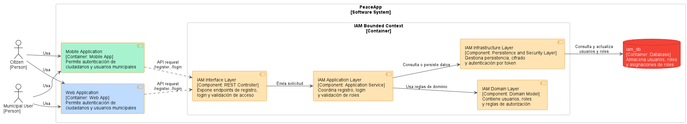

#### WebApp

El diagrama de componentes de la **Web App** dentro del **IAM Bounded Context** representa los elementos encargados de permitir que ciudadanos y usuarios municipales puedan autenticarse desde la aplicación web. La validación de permisos no depende del cliente, sino del rol asignado al usuario en el backend.

El componente principal es el **Web Auth Component**, encargado de presentar las interfaces de registro e inicio de sesión. Este componente utiliza el **Web Auth Service**, que coordina la lógica de autenticación desde el cliente web y envía las credenciales a la API RESTful. El **Auth Assembler** transforma los datos del formulario web en DTOs compatibles con el backend IAM.

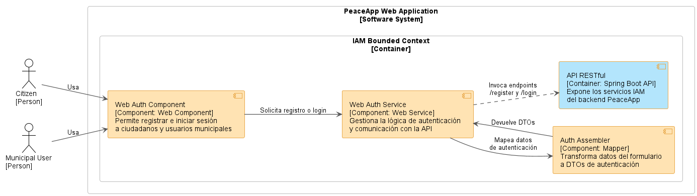

#### MobileApp

El diagrama de componentes de la **Mobile App** dentro del **IAM Bounded Context** representa los componentes encargados de permitir que ciudadanos y usuarios municipales puedan registrarse o iniciar sesión desde la aplicación móvil. La autorización se determina según los roles asociados a cada usuario en el backend.

El **Mobile Auth Component** permite al usuario interactuar con las interfaces de registro e inicio de sesión. Este componente utiliza el **Mobile Auth Service**, que centraliza la lógica de autenticación del cliente móvil y envía los datos hacia la API RESTful. El **Auth Assembler** transforma los datos ingresados por el usuario en estructuras compatibles con los DTOs requeridos por el backend IAM.

---

### 5.1.6. Bounded Context Software Architecture Code Level Diagrams

Esta sección presenta los diagramas de nivel de código correspondientes al bounded context **IAM**. Los diagramas se enfocan únicamente en los elementos existentes en el backend actual: usuarios, roles y asignaciones de roles.

---

#### 5.1.6.1. Bounded Context Domain Layer Class Diagrams

El diagrama de clases del dominio representa los principales elementos conceptuales del bounded context IAM. En este nivel se consideran las entidades `User`, `Role` y `UserRole`, además de los value objects relacionados con el nombre de usuario, contraseña cifrada y nombre del rol.

Asimismo, se incluyen los servicios de dominio responsables de las reglas de autenticación y autorización. Estos servicios permiten validar las credenciales del usuario y verificar si cuenta con el rol requerido para acceder a una funcionalidad protegida.

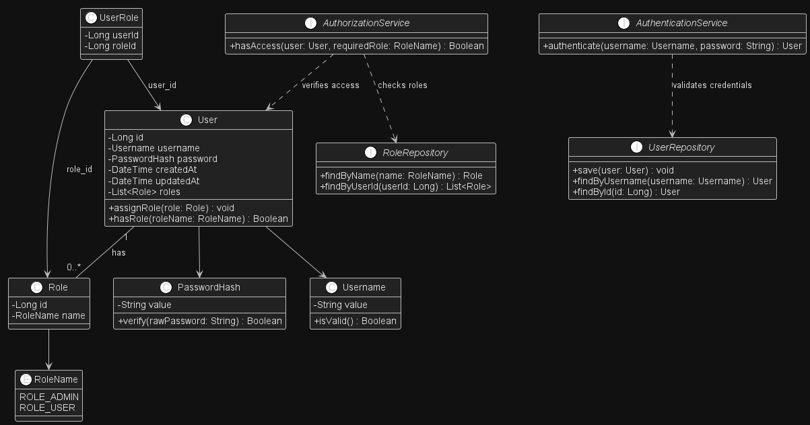

---

#### 5.1.6.2. Bounded Context Database Design Diagram

El diagrama de base de datos del bounded context **IAM** representa la estructura persistente utilizada para gestionar usuarios y roles dentro del sistema. La tabla `iam_users` almacena los datos principales del usuario, la tabla `role` contiene los roles disponibles y la tabla `user_roles` permite asociar uno o más roles a cada usuario.

Esta estructura permite diferenciar el acceso entre usuarios ciudadanos y usuarios municipales o administrativos, manteniendo una relación clara entre cuentas registradas y permisos asignados.

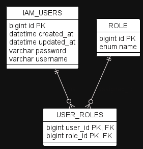

## 5.2. Bounded Context: Profile

El Bounded Context de **Profile** es responsable de la gestión de perfiles de los usuarios que interactúan con el sistema PeaceApp. En particular, maneja los perfiles de **Ciudadanos (Citizens)** y **Municipalidades (Municipalities)**. Este contexto permite registrar nuevos perfiles y obtener información de los mismos mediante su userId. Las entidades principales son Citizen y Municipality, y su estructura está diseñada para asegurar la unicidad de identificadores clave como DNI, correo electrónico institucional y número de teléfono.

### 5.2.1. Domain Layer

La capa de dominio encapsula las entidades centrales del sistema de perfiles y contiene la lógica de validación de atributos mediante objetos de valor. Las entidades principales son Citizen y Municipality, las cuales heredan de un agregado raíz auditable. Se utilizan objetos de valor como Phone, Dni y InstitutionalEmail para encapsular lógica específica y validación.

**Aggregate:** Citizen

**Descripción:** Representa el perfil de un ciudadano registrado en PeaceApp.

|**Atributo**|**Descripción**|**Tipo**|
| :-: | :-: | :-: |
|fullName|Nombre completo del ciudadano|String|
|city|Ciudad de residencia|String|
|district|Distrito de residencia|String|
|userId|ID del usuario (referencia a IAM)|Long|
|dni|Documento nacional de identidad|Dni|
|phone|Número de teléfono del ciudadano|Phone|

**Método**

|**Método**|**Descripción**|
| :-: | :-: |
|Citizen(CreateCitizenCommand command, Long userId)|Constructor que crea un perfil de ciudadano.|
|String getDni()|Devuelve el número de DNI del ciudadano.|
|String getPhone()|Devuelve el número telefónico del ciudadano.|

**Aggregate:** Municipality

**Descripción:** Representa el perfil de una municipalidad registrada en PeaceApp.

|**Atributo**|**Descripción**|**Tipo**|
| :-: | :-: | :-: |
|municipalityName|Nombre de la municipalidad|String|
|city|Ciudad donde opera la municipalidad|String|
|district|Distrito de operación|String|
|institutionalEmail|Correo institucional de la municipalidad|InstitutionalEmail|
|userId|ID del usuario (referencia a IAM)|Long|
|phone|Número telefónico institucional|Phone|

**Método**

|**Clase**|**Método**|**Descripción**|
| :-: | :-: | :-: |
|Municipality|Municipality(CreateMunicipalityCommand command, Long userId)|Constructor que crea un perfil de municipalidad.|
|Municipality|String getPhone()|Devuelve el número telefónico institucional.|
|Municipality|String getInstitutionalEmail()|Devuelve el correo institucional de la municipalidad.|

**Value Objects**

**Dni**

**Descripción:**
Representa el Documento Nacional de Identidad (DNI) de un ciudadano. Asegura que el valor sea un número positivo de exactamente 8 dígitos.

**Atributos:**

|**Nombre**|**Tipo**|**Descripción**|
| :- | :- | :- |
|dni|String|Número de DNI con exactamente 8 dígitos|

**Métodos:**

|**Nombre**|**Descripción**|
| :- | :- |
|Dni(String dni)|Constructor que valida que el valor tenga exactamente 8 dígitos.|
|Dni()|Constructor por defecto que asigna "00000000".|

**Phone**

**Descripción:**
Representa un número de teléfono válido, de exactamente 9 dígitos.

**Atributos:**

|**Nombre**|**Tipo**|**Descripción**|
| :- | :- | :- |
|phone|String|Número telefónico con exactamente 9 dígitos|

**Métodos:**

|**Nombre**|**Descripción**|
| :- | :- |
|Phone(String phone)|Constructor que valida que el valor tenga exactamente 9 dígitos.|
|Phone()|Constructor por defecto que asigna "000000000".|

**InstitutionalEmail**

**Descripción:**
Representa un correo electrónico institucional válido perteneciente a una municipalidad.

**Atributos:**

|**Nombre**|**Tipo**|**Descripción**|
| :- | :- | :- |
|email|String|Correo institucional válido de la municipalidad|

**Métodos:**

|**Nombre**|**Descripción**|
| :- | :- |
|InstitutionalEmail(String email)|Constructor que valida el formato correcto del correo institucional.|
|InstitutionalEmail()|Constructor por defecto que asigna "municipality@peaceapp.com".|

**Domain Services**

Los Domain Services en este contexto son interfaces que definen operaciones de negocio relacionadas con los aggregates Citizen y Municipality. Permiten separar las reglas de negocio que no pertenecen directamente a una entidad o value object.

**CitizenCommandService**

**Descripción:**
Interfaz que define operaciones de negocio relacionadas con la creación de un Citizen.

**Métodos:**

|**Nombre**|**Descripción**|
| :- | :- |
|Optional<Citizen> handle(CreateCitizenCommand command, Long userId)|Procesa el comando de creación de un ciudadano, asociándolo a un User existente mediante su userId.|

**CitizenQueryService**

**Descripción:**
Interfaz que permite consultar información relacionada con un Citizen.

**Métodos:**

|**Nombre**|**Descripción**|
| :- | :- |
|Optional<Citizen> handle(GetCitizenByUserIdQuery query)|Obtiene un Citizen asociado a un User mediante su userId.|

**MunicipalityCommandService**

**Descripción:**
Interfaz que define operaciones de negocio relacionadas con la creación de una Municipality.

**Métodos:**

|**Nombre**|**Descripción**|
| :- | :- |
|Optional<Municipality> handle(CreateMunicipalityCommand command, Long userId)|Procesa el comando de creación de una municipalidad, asociándola a un User existente mediante su userId.|

**MunicipalityQueryService**

**Descripción:**
Interfaz que permite consultar información relacionada con una Municipality.

**Métodos:**

|**Nombre**|**Descripción**|
| :- | :- |
|Optional<Municipality> handle(GetMunicipalityByUserIdQuery query)|Obtiene una Municipality asociada a un User mediante su userId.|

### 5.2.2. Interface Layer

Esta capa actúa como punto de entrada para consultas externas relacionadas con los perfiles. A través de los controladores REST, los clientes pueden consultar el perfil de un ciudadano o una municipalidad por su userId.

**Controlador: ProfilesController**

**Descripción:** Gestiona las consultas de perfiles de usuarios.

|**Método**|**Descripción**|**HTTP**|**Respuesta**|
| :-: | :-: | :-: | :-: |
|getCitizenProfile(Long userId)|Devuelve el perfil de un ciudadano por su userId|GET /profiles/citizen/{userId}|Recurso del ciudadano|
|getMunicipalityProfile(Long userId)|Devuelve el perfil de una municipalidad por su userId|GET /profiles/municipality/{userId}|Recurso de la municipalidad|

### 5.2.3. Application Layer

Esta capa contiene la lógica de aplicación, incluyendo la validación de unicidad para campos clave y el manejo de comandos y consultas. Coordina la creación y recuperación de perfiles utilizando servicios específicos para cada tipo de usuario.

**Clase: CitizenCommandServiceImpl**

**Descripción:** Gestiona los comandos para la creación de ciudadanos.

|**Método**|**Descripción**|
| :-: | :-: |
|handle(CreateCitizenCommand)|Crea un nuevo perfil de ciudadano, validando unicidad de dni, phone y userId.|

**Clase: MunicipalityCommandServiceImpl**

**Descripción:** Gestiona los comandos para la creación de municipalidades.

|**Método**|**Descripción**|
| :-: | :-: |
|handle(CreateMunicipalityCommand)|Crea un nuevo perfil de municipalidad, validando institutionalEmail, phone y userId.|

**Clase: CitizenQueryServiceImpl**

**Descripción:** Gestiona consultas sobre ciudadanos.

|**Método**|**Descripción**|
| :-: | :-: |
|handle(GetCitizenByUserIdQuery)|Recupera un ciudadano a partir de su userId.|

**Clase: MunicipalityQueryServiceImpl**

**Descripción:** Gestiona consultas sobre municipalidades.

|**Método**|**Descripción**|
| :-: | :-: |
|handle(GetMunicipalityByUserIdQuery)|Recupera una municipalidad por su userId.|

### 5.2.4. Infrastructure Layer

La capa de infraestructura proporciona la implementación de persistencia para los perfiles, permitiendo operaciones CRUD y búsquedas específicas. Los repositorios se basan en Spring Data JPA.

**Repositorio: CitizenRepository**

**Descripción:** Administra la persistencia de la entidad Citizen.

|**Método**|**Descripción**|
| :-: | :-: |
|findCitizenByUserId(Long)|Recupera un ciudadano por su userId.|
|existsByDni_Dni(String)|Verifica si existe un ciudadano con un DNI dado.|
|existsByPhone_Phone(String)|Verifica si existe un ciudadano con un teléfono dado.|
|existsByUserId(Long)|Verifica si existe un ciudadano con un userId dado.|

**Repositorio: MunicipalityRepository**

**Descripción:** Administra la persistencia de la entidad Municipality.

|**Método**|**Descripción**|
| :-: | :-: |
|findMunicipalityByUserId(Long)|Recupera una municipalidad por su userId.|
|existsByInstitutionalEmail_Email(String)|Verifica si existe una municipalidad con un correo institucional dado.|
|existsByPhone_Phone(String)|Verifica si existe una municipalidad con un teléfono dado.|
|existsByUserId(Long)|Verifica si existe una municipalidad con un userId dado.|

### 5.2.5. Bounded Context Software Architecture Component Level Diagrams
**Backend**

El Profile Bounded Context centraliza la gestión de la información de perfil de los usuarios, incluyendo su estructura de dominio, lógica de aplicación, almacenamiento persistente e interfaces expuestas vía HTTP. Su arquitectura facilita tanto el acceso directo desde aplicaciones cliente como la colaboración con otros contextos a través de su fachada de contexto, permitiendo así la reutilización controlada de funciones relacionadas con los perfiles sin romper la encapsulación.

**WebApp**

El diagrama de componentes del Profile Bounded Context describe la estructura de componentes dedicados a la gestión de perfiles de ciudadanos y municipalidades dentro de PeaceApp. En este contexto, el Citizen Profile Component permite a los ciudadanos visualizar y editar su información personal, mientras que el Municipality Profile Component permite a las municipalidades gestionar su información institucional. Ambos componentes se apoyan en los servicios Citizen Profile Service y Municipality Profile Service, encargados de coordinar las operaciones de negocio y la comunicación con la API RESTful. Asimismo, el componente Profile Assembler se encarga de transformar y mapear los datos entre los modelos del frontend y los DTOs utilizados por la API, estableciendo una arquitectura desacoplada, mantenible y escalable que facilita la evolución de las funcionalidades relacionadas con la gestión de perfiles.

**MobileApp**

El diagrama de componentes del bounded context Profile muestra los componentes encargados de la gestión de perfiles de ciudadanos y municipalidades dentro de la aplicación móvil PeaceApp. El contexto incluye los componentes Citizen Profile Widget y Municipality Profile Widget, responsables de permitir la visualización y edición de la información personal e institucional de los usuarios desde la aplicación móvil. Asimismo, los servicios Citizen Profile Service y Municipality Profile Service centralizan la lógica de negocio relacionada con la gestión de perfiles, coordinando las operaciones de validación, recuperación y actualización de datos. El componente Profile Assembler se encarga de transformar y adaptar los datos entre las estructuras provenientes del backend y los modelos utilizados en la aplicación móvil. El flujo principal inicia desde los widgets de perfil hacia los servicios correspondientes, los cuales utilizan el ensamblador para procesar la información y gestionar las solicitudes hacia la API RESTful, permitiendo una administración de perfiles eficiente, desacoplada y mantenible.

### 5.2.6. Bounded Context Software Architecture Code Level Diagrams

#### 5.2.6.1. Bounded Context Domain Layer Class Diagrams

El diagrama de clases muestra la relación entre las entidades Citizen y Municipality, así como los objetos de valor asociados a ellas.

#### 5.2.6.2. Bounded Context Database Design Diagram

El diagrama de base muestra las tablas citizens y municipalities, así como la relación entre estas.

## 5.3. Bounded Context: Location
El bounded context **Location** pertenece al sistema PeaceApp y se encarga de gestionar las ubicaciones relacionadas con los reportes. Su función principal es registrar la latitud y longitud de los reportes aprobados, listar las ubicaciones guardadas, detectar zonas peligrosas y eliminar ubicaciones cuando un reporte es rechazado o eliminado.

### 5.3.1. Domain Layer
La capa de dominio contiene la lógica central del bounded context Location. En este caso, el aggregate principal es Location, el cual representa una coordenada geográfica asociada a un reporte. Esta entidad hereda de AuditableAbstractAggregateRoot, por lo que también cuenta con atributos comunes como id, createdAt y updatedAt.

**Aggregate:** Location
**Descripciòn:** Representa una ubicación geográfica almacenada por el sistema.

| Atributo  | Descripcion                                                                            | Tipo   |
|-----------|----------------------------------------------------------------------------------------|--------|
| id        | Identificador único de la ubicación. Es heredado desde AuditableAbstractAggregateRoot. | Long   |
| latitude  | Latitud de la ubicación registrada.                                                    | String |
| longitude | Longitud de la ubicación registrada.                                                   | String |
| idReport  | Identificador del reporte asociado a la ubicación.                                     | Long   |
| createdAt | Fecha de creación del registro. Es heredado desde la clase auditable.                  | Date   |
| updatedAt | Fecha de última modificación del registro. Es heredado desde la clase auditable.       | Date   |

| Atributo                                                     | Descripcion                                                                                   |
|--------------------------------------------------------------|-----------------------------------------------------------------------------------------------|
| Location()                                                   | Constructor vacío requerido por JPA para crear instancias de la entidad.                      |
| Location(String aLatitude, String aLongitude, Long idReport) | Constructor que permite crear una ubicación con latitud, longitud e identificador de reporte. |
| Location(String aLatitude, String aLongitude, Long idReport) | Constructor vacío requerido por JPA para crear instancias de la entidad.                      |
| getLatitude()                                                | Obtiene la latitud registrada.                                                                |
| setLatitude(String latitude)                                 | Actualiza la latitud de la ubicación.                                                         |
| getLongitude()                                               | Obtiene la longitud registrada.                                                               |
| setLongitude(String longitude)                               | Actualiza la longitud de la ubicación.                                                        |
| getIdReport()                                                | Obtiene el identificador del reporte asociado.                                                |
| setIdReport(Long idReport)                                   | Actualiza el identificador del reporte asociado .                                             |
| getId()                                                      | Obtiene el identificador único heredado.                                                      |
| setId(Long id)                                               | Asigna el identificador único heredado.                                                       |

---
**Domain Services**

**Commands**
Los comandos representan intenciones de cambio dentro del bounded context. En este caso, se usan para crear ubicaciones y eliminar ubicaciones asociadas a un reporte.

### CreateLocationCommand

| Atributo  | Descripción                            | Tipo   |
|-----------|----------------------------------------|--------|
| latitude  | Latitud de la ubicación a registrar.   | String |
| longitude | Longitud de la ubicación a registrar.  | String |
| idReport  | Identificador del reporte relacionado. | Long   |

| Método                | Descripción                                          |
|-----------------------|------------------------------------------------------|
| CreateLocationCommand | Valida que `latitude` no sea nula o vacía.           |
| CreateLocationCommand | Valida que `longitude` no sea nula o vacía.          |
| CreateLocationCommand | Valida que `idReport` no sea nulo y sea mayor que 0. |

### DeleteAllLocationsByIdReportCommand

| Atributo | Descripción                                                   | Tipo |
|----------|---------------------------------------------------------------|------|
| idReport | Identificador del reporte cuyas ubicaciones serán eliminadas. | Long |

| Método                              | Descripción                                          |
|-------------------------------------|------------------------------------------------------|
| DeleteAllLocationsByIdReportCommand | Valida que `idReport` no sea nulo y sea mayor que 0. |

---

## Queries

Las queries representan solicitudes de lectura de información dentro del bounded context.

### GetAllLocationsQuery

| Query                | Descripción                                                          |
|----------------------|----------------------------------------------------------------------|
| GetAllLocationsQuery | Solicita la lista completa de ubicaciones almacenadas en el sistema. |

### GetDangerousLocationsQuery

| Atributo   | Descripción                                                               | Tipo   |
|------------|---------------------------------------------------------------------------|--------|
| minReports | Cantidad mínima de reportes para considerar una ubicación como peligrosa. | int    |

| Método                     | Descripción                                    |
|----------------------------|------------------------------------------------|
| GetDangerousLocationsQuery | Valida que `minReports` sea mayor o igual a 1. |

**Observación:** En el código actual, el parámetro `minReports` se valida en la query, pero no se utiliza directamente en el método del repositorio. Actualmente, el repositorio agrupa las ubicaciones por latitud y longitud y las ordena por cantidad de reportes, pero no aplica un filtro mínimo.

---

## Value Objects

En el código fuente revisado no se identifican Value Objects implementados explícitamente. Actualmente, la latitud y longitud se manejan como atributos `String` dentro del aggregate `Location`.

Sin embargo, a nivel de diseño táctico, se podría considerar el siguiente Value Object para mejorar la expresividad del dominio.

**Nombre:** `Coordinates`

**Descripción:** Representa las coordenadas geográficas de una ubicación. Este Value Object permitiría agrupar la latitud y longitud en un solo concepto del dominio, evitando que se manejen como valores separados sin semántica propia.

| Nombre    | Tipo   | Descripción               |
|-----------|--------|---------------------------|
| latitude  | String | Latitud de la ubicación.  |
| longitude | String | Longitud de la ubicación. |

| Nombre                                         | Descripción                                             |
|------------------------------------------------|---------------------------------------------------------|
| Coordinates(String latitude, String longitude) | Constructor que valida y crea un objeto de coordenadas. |
| latitude()                                     | Retorna la latitud.                                     |
| longitude()                                    | Retorna la longitud.                                    |

---

## Domain Services

Los servicios de dominio definen las operaciones principales del bounded context. En el proyecto se identifican dos interfaces principales: `LocationCommandService` y `LocationQueryService`.

### LocationCommandService

**Descripción:** Servicio de dominio encargado de definir las operaciones de escritura para las ubicaciones.

| Método                                              | Descripción                                                             |
|-----------------------------------------------------|-------------------------------------------------------------------------|
| handle(CreateLocationCommand command)               | Procesa la creación de una nueva ubicación a partir de un comando.      |
| handle(DeleteAllLocationsByIdReportCommand command) | Procesa la eliminación de todas las ubicaciones asociadas a un reporte. |

### LocationQueryService

**Descripción:** Servicio de dominio encargado de definir las operaciones de consulta sobre las ubicaciones.

| Método                                   | Descripción                                                                       |
|------------------------------------------|-----------------------------------------------------------------------------------|
| handle(GetAllLocationsQuery query)       | Obtiene todas las ubicaciones registradas.                                        |
| handle(GetDangerousLocationsQuery query) | Obtiene las ubicaciones agrupadas y ordenadas por cantidad de reportes asociados. |

---

### 5.3.2. Interface Layer

La capa de interfaz expone los endpoints REST del bounded context **Location**. Esta capa recibe solicitudes HTTP, transforma los recursos recibidos en comandos o queries y delega la lógica a los servicios correspondientes.

## Controller: LocationController

**Descripción:** El controlador `LocationController` expone las operaciones REST para crear, consultar y eliminar ubicaciones. Se encuentra bajo la ruta base:

| Método | Descripción | HTTP | Respuesta |
|--------|-------------|------|-----------|
| create(CreateLocationResource body) | Crea una nueva ubicación asociada a un reporte. | POST `/api/v1/locations` | 201 Created con `LocationResource` o 400 Bad Request |
| getAll() | Obtiene todas las ubicaciones registradas. | GET `/api/v1/locations` | 200 OK con lista de ubicaciones o 204 No Content |
| getDangerousLocations(int quantityReports) | Obtiene ubicaciones consideradas peligrosas según la cantidad de reportes. | GET `/api/v1/locations/dangerous?quantityReports=5` | 200 OK con lista de ubicaciones o 204 No Content |
| deleteAllByReportId(Long reportId) | Elimina todas las ubicaciones asociadas a un reporte específico. | DELETE `/api/v1/locations/report/{reportId}` | 200 OK, 400 Bad Request o 500 Internal Server Error |

---

## Resources

### CreateLocationResource

**Descripción:** Recurso utilizado para recibir los datos necesarios al crear una ubicación.

| Atributo   | Tipo   | Descripción                         |
|------------|--------|-------------------------------------|
| latitude   | String | Latitud de la ubicación.            |
| longitude  | String | Longitud de la ubicación.           |
| idReport   | Long   | Identificador del reporte asociado. |

### LocationResource

**Descripción:** Recurso utilizado para devolver información de una ubicación al cliente.

| Atributo   | Tipo   | Descripción                         |
|------------|--------|-------------------------------------|
| id         | Long   | Identificador de la ubicación.      |
| latitude   | String | Latitud registrada.                 |
| longitude  | String | Longitud registrada.                |
| idReport   | Long   | Identificador del reporte asociado. |

---

## Assemblers

| Clase                                      | Descripción                                                          |
|--------------------------------------------|----------------------------------------------------------------------|
| CreateLocationCommandFromResourceAssembler | Convierte un `CreateLocationResource` en un `CreateLocationCommand`. |
| LocationResourceFromEntityAssembler        | Convierte una entidad `Location` en un `LocationResource`.           |

---

### 5.3.3. Application Layer

La capa de aplicación contiene la lógica de aplicación del bounded context. En este caso, coordina el uso de repositorios, comandos, consultas y servicios externos. También se encarga de ejecutar operaciones transaccionales y conectar la lógica de dominio con la infraestructura.

## Command Services Implementation

### Clase: LocationCommandServiceImpl

**Descripción:** Implementa las operaciones de escritura definidas por `LocationCommandService`. Utiliza `LocationRepository` para persistir nuevas ubicaciones o eliminar ubicaciones asociadas a un reporte.

| Método                                              | Descripción                                                                                                                                                                 |
|-----------------------------------------------------|-----------------------------------------------------------------------------------------------------------------------------------------------------------------------------|
| handle(CreateLocationCommand command)               | Crea una nueva instancia de `Location` usando la latitud, longitud e `idReport` recibidos en el comando. Luego la guarda en la base de datos mediante `LocationRepository`. |
| handle(DeleteAllLocationsByIdReportCommand command) | Elimina todas las ubicaciones asociadas al `idReport` recibido en el comando.                                                                                               |

---

## Query Services Implementation

### Clase: LocationQueryServiceImpl

**Descripción:** Implementa las operaciones de lectura definidas por `LocationQueryService`. Utiliza el repositorio para consultar ubicaciones y transformar resultados agrupados en objetos `Location`.

| Método                                   | Descripción                                                                                                                                               |
|------------------------------------------|-----------------------------------------------------------------------------------------------------------------------------------------------------------|
| handle(GetAllLocationsQuery query)       | Retorna todas las ubicaciones almacenadas usando `locationRepository.findAll()`.                                                                          |
| handle(GetDangerousLocationsQuery query) | Obtiene ubicaciones agrupadas por latitud y longitud, ordenadas por cantidad de reportes. Luego transforma cada resultado en una instancia de `Location`. |

---

## Outbound Service

### Clase: ExternalReportService

**Descripción:** Servicio de aplicación encargado de comunicarse con el bounded context de Reports mediante `ReportServiceClient`. Se utiliza principalmente cuando el microservicio recibe un evento de reporte aprobado y necesita consultar los datos completos del reporte.

| Método                    | Descripción                                                                         |
|---------------------------|-------------------------------------------------------------------------------------|
| existsById(Long reportId) | Verifica si existe un reporte con el identificador indicado.                        |
| fetchById(Long reportId)  | Obtiene la información completa de un reporte desde el servicio externo de Reports. |

---

## Event Listeners

El bounded context **Location** también consume eventos mediante RabbitMQ. Esto permite que reaccione de forma asíncrona ante cambios ocurridos en el bounded context de Reports.

| Listener                    | Evento              | Descripción                                                                                                                              |
|-----------------------------|---------------------|------------------------------------------------------------------------------------------------------------------------------------------|
| ReportApprovedEventListener | ReportApprovedEvent | Cuando un reporte es aprobado, consulta el reporte mediante `ExternalReportService` y crea una ubicación si existen coordenadas válidas. |
| ReportDeletedEventListener  | ReportDeletedEvent  | Cuando un reporte es eliminado, elimina todas las ubicaciones asociadas a ese reporte.                                                   |
| ReportRejectedEventListener | ReportRejectedEvent | Cuando un reporte es rechazado, elimina todas las ubicaciones asociadas a ese reporte.                                                   |

---

### 5.3.4. Infrastructure Layer

La capa de infraestructura proporciona la implementación de persistencia y comunicación externa. En este bounded context, se utiliza **Spring Data JPA** para la persistencia de ubicaciones en MySQL, **OpenFeign** para la comunicación con Reports y **RabbitMQ** para la recepción de eventos.

## Repositorio: LocationRepository

**Descripción:** Repositorio basado en Spring Data JPA encargado de realizar operaciones CRUD sobre la entidad `Location`. Extiende de `JpaRepository<Location, Long>`, por lo que hereda métodos como `save`, `findAll`, `findById`, `deleteById`, entre otros.

| Método                             | Descripción                                                                                                                 |
|------------------------------------|-----------------------------------------------------------------------------------------------------------------------------|
| save(Location location)            | Guarda una nueva ubicación o actualiza una existente. Método heredado de `JpaRepository`.                                   |
| findAll()                          | Obtiene todas las ubicaciones almacenadas. Método heredado de `JpaRepository`.                                              |
| findById(Long id)                  | Busca una ubicación por su identificador. Método heredado de `JpaRepository`.                                               |
| deleteById(Long id)                | Elimina una ubicación por su identificador. Método heredado de `JpaRepository`.                                             |
| findDangerousLocations()           | Agrupa ubicaciones por latitud y longitud, cuenta la cantidad de reportes asociados y ordena el resultado de mayor a menor. |
| deleteAllByIdReport(Long idReport) | Elimina todas las ubicaciones asociadas a un reporte específico.                                                            |

---

## External Client: ReportServiceClient

**Descripción:** Cliente Feign utilizado para comunicarse con el bounded context de Reports. Permite consultar la existencia de un reporte y obtener sus datos.

| Método                       | Descripción                                              |
|------------------------------|----------------------------------------------------------|
| reportExists(Long reportId)  | Verifica si un reporte existe en el servicio de Reports. |
| getReportById(Long reportId) | Obtiene la información de un reporte específico.         |

---

## Fallback: ReportServiceClientFallback

**Descripción:** Clase de respaldo usada cuando el servicio de Reports no está disponible. Permite evitar fallos directos en la comunicación entre microservicios.

| Método                       | Descripción                                                                               |
|------------------------------|-------------------------------------------------------------------------------------------|
| reportExists(Long reportId)  | Retorna una respuesta alternativa cuando no se puede verificar la existencia del reporte. |
| getReportById(Long reportId) | Retorna una respuesta alternativa cuando no se puede obtener el reporte.                  |

### 5.3.5. Bounded Context Software Architecture Component Level Diagrams

**Backend**

Este diagrama muestra la arquitectura interna del microservicio Location Service. Se observa cómo el controlador REST recibe solicitudes, cómo los listeners consumen eventos desde RabbitMQ, cómo los servicios de aplicación coordinan comandos y consultas, y cómo el repositorio persiste información en la base de datos MySQL.

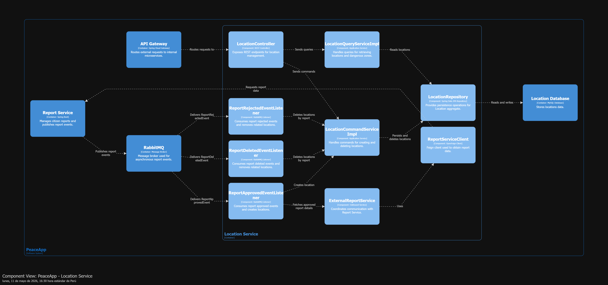

**Web App**
Este diagrama representa cómo una aplicación web consume las funcionalidades del bounded context Location. La Web App no accede directamente a la base de datos, sino que utiliza el API Gateway para consultar ubicaciones o zonas peligrosas expuestas por el microservicio Location.

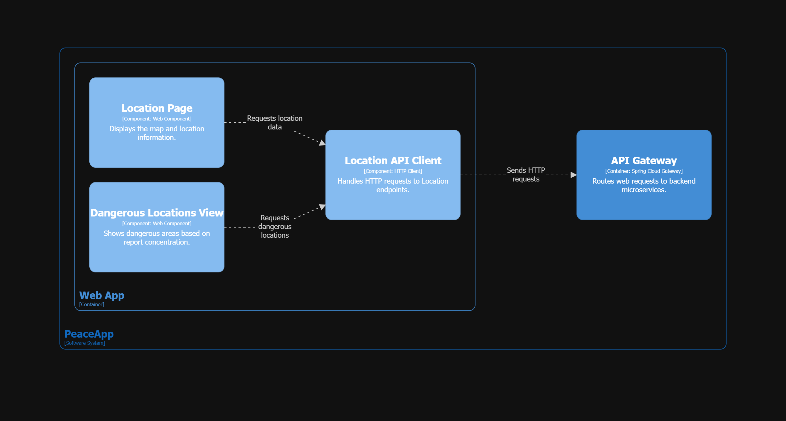

**Mobile App**
Este diagrama muestra cómo una aplicación móvil consume el bounded context Location. La Mobile App puede mostrar ubicaciones en un mapa y consultar zonas peligrosas mediante peticiones HTTP hacia el API Gateway.

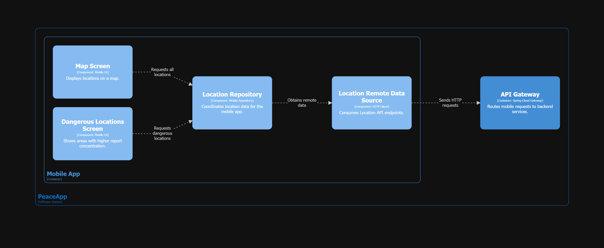

### 5.3.6. Bounded Context Software Architecture Code Level Diagrams

#### 5.3.6.1. Bounded Context Domain Layer Class Diagrams
El siguiente diagrama representa las clases principales de la capa de dominio del bounded context Location. Se muestra el aggregate Location, los comandos, las queries y los servicios de dominio que definen las operaciones de escritura y lectura.

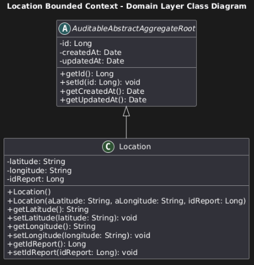
#### 5.3.6.2. Bounded Context Database Design Diagram
El bounded context Location utiliza una tabla principal llamada locations. Esta tabla almacena las coordenadas geográficas asociadas a reportes. Además, incluye campos de auditoría heredados desde **AuditableAbstractAggregateRoot**.

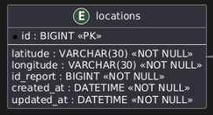

## 5.4. Bounded Context: Report

El Bounded Context de **Report** es el núcleo principal del negocio en PeaceApp, ya que gestiona la información ingresada por los ciudadanos al reportar incidentes. Este contexto contiene los datos clave del sistema, como el tipo de reporte, descripción, evidencia, ubicación, estado y usuario asociado. Además, otros contextos dependen de él: **Location** utiliza sus coordenadas para mostrar reportes en el mapa, mientras que **Alert** genera avisos a partir de reportes cercanos. Por ello, Report es la fuente principal de información operativa del sistema.

### 5.4.1. Domain Layer

La capa de dominio del bounded context Report encapsula la lógica principal del negocio relacionada con la gestión de reportes de incidentes. La entidad principal es Report, la cual representa la información registrada por un ciudadano, incluyendo su descripción, tipo, ubicación, evidencia y estado dentro del flujo de revisión.

**Aggregate:** Report

**Descripción:** Representa un reporte de incidente creado por un usuario dentro de PeaceApp.

|**Atributo**|**Descripción**|**Tipo**|
| :-: | :-: | :-: |
|id|Identificador único del reporte|Long|
|title|Título breve del reporte|String|
|description|Descripción detallada del incidente|String|
|location|Descripción textual de la ubicación del incidente|String|
|type|Tipo de incidente reportado|ReportType|
|userId|ID del usuario que creó el reporte|Long|
|imageUrl|URL de la imagen o evidencia asociada al reporte|String|
|latitude|Latitud donde ocurrió el incidente|String|
|longitude|Longitud donde ocurrió el incidente|String|
|state|Estado actual del reporte|ReportState|
|rejectionReason|Motivo de rechazo del reporte, en caso corresponda|String|

**Método**

|**Método**|**Descripción**|
| :-: | :-: |
|Report(String title, String description, String location, ReportType type, Long userId, String imageUrl, String latitude, String longitude)|Constructor que crea un nuevo reporte e inicializa su estado como PENDING.|
|void markInReview()|Cambia el estado del reporte de PENDING a IN_REVIEW.|
|void approve()|Aprueba un reporte que se encuentra en revisión y cambia su estado a APPROVED.|
|void reject(String reason)|Rechaza un reporte que se encuentra en revisión y registra el motivo del rechazo.|

**Value Objects**

**ReportState**

**Descripción:**
Representa el estado actual de un reporte dentro del proceso de revisión.

|**Valor**|**Descripción**|
| :- | :- |
|PENDING|El reporte fue creado y está pendiente de revisión.|
|IN_REVIEW|El reporte está siendo revisado.|
|APPROVED|El reporte fue aprobado y puede ser utilizado por otros contextos del sistema.|
|REJECTED|El reporte fue rechazado y no será considerado como válido.|

**ReportType**

**Descripción:**  
Representa el tipo de incidente registrado en el reporte.

|**Valor**|**Descripción**|
| :- | :- |
|ROBBERY|Reporte relacionado con robo o intento de robo.|
|ACCIDENT|Reporte relacionado con un accidente.|
|DARK_AREA|Reporte relacionado con una zona oscura o con baja iluminación.|
|HARASSMENT|Reporte relacionado con acoso.|
|OTHER|Reporte relacionado con otro tipo de incidente.|

**Domain Services**

Los Domain Services en este contexto son interfaces que definen operaciones de negocio relacionadas con el aggregate **Report**. Permiten separar las operaciones de comando y consulta, manteniendo organizada la lógica del bounded context.

**ReportCommandService**

**Descripción:**  
Interfaz que define las operaciones de escritura relacionadas con la gestión de reportes.

**Métodos:**

|**Nombre**|**Descripción**|
| :- | :- |
|Optional<Report> handle(CreateReportCommand command)|Procesa la creación de un nuevo reporte.|
|void handle(DeleteReportByIdCommand command)|Procesa la eliminación de un reporte mediante su identificador.|
|void handle(MarkReportInReviewCommand command)|Cambia el estado de un reporte a IN_REVIEW.|
|void handle(ApproveReportCommand command)|Aprueba un reporte que se encuentra en revisión.|
|void handle(RejectReportCommand command)|Rechaza un reporte y registra el motivo correspondiente.|

**ReportQueryService**

**Descripción:**  
Interfaz que define las operaciones de lectura relacionadas con los reportes.

**Métodos:**

|**Nombre**|**Descripción**|
| :- | :- |
|Optional<Report> handle(GetReportByIdQuery query)|Obtiene un reporte mediante su identificador.|
|List<Report> handle(GetReportsByUserIdQuery query)|Obtiene los reportes asociados a un usuario específico.|
|List<Report> handle(GetAllReportsQuery query)|Obtiene todos los reportes registrados en el sistema.|
|List<Report> handle(GetPublicReportsQuery query)|Obtiene los reportes públicos disponibles para consulta.|

**Domain Events**

Los eventos de dominio permiten comunicar cambios importantes ocurridos en el bounded context **Report** hacia otros contextos del sistema, como **Location** y **Alert**.

|**Evento**|**Descripción**|
| :- | :- |
|ReportCreatedEvent|Se genera cuando un nuevo reporte es creado.|
|ReportApprovedEvent|Se genera cuando un reporte es aprobado.|
|ReportRejectedEvent|Se genera cuando un reporte es rechazado.|
|ReportDeletedEvent|Se genera cuando un reporte es eliminado.|

### 5.4.2. Interface Layer

Esta capa actúa como punto de entrada para las operaciones externas relacionadas con los reportes de incidentes. A través del controlador REST, los clientes pueden crear reportes, consultar reportes existentes, cambiar su estado dentro del flujo de revisión y eliminar reportes cuando corresponda.

**Controlador: ReportController**

**Descripción:** Gestiona las operaciones REST relacionadas con la creación, consulta, revisión, aprobación, rechazo y eliminación de reportes.

|**Método**|**Descripción**|**HTTP**|**Respuesta**|
| :-: | :-: | :-: | :-: |
|reportExists(Long id)|Verifica si existe un reporte mediante su identificador.|GET /api/v1/reports/{id}/exists|Boolean|
|getPublicReports()|Devuelve los reportes públicos aprobados.|GET /api/v1/reports/public|Lista de ReportResource o 204 No Content|
|createReport(CreateReportResource resource)|Crea un nuevo reporte de incidente.|POST /api/v1/reports|201 Created con ReportResource o error|
|getReportById(Long id)|Devuelve un reporte específico mediante su identificador.|GET /api/v1/reports/{id}|ReportResource o 404 Not Found|
|markReportInReview(Long id)|Cambia el estado de un reporte a IN_REVIEW.|PUT /api/v1/reports/{id}/review|ReportResource actualizado o error|
|approveReport(Long id)|Aprueba un reporte que se encuentra en revisión.|PUT /api/v1/reports/{id}/approve|ReportResource actualizado o error|
|rejectReport(Long id, RejectReportResource resource)|Rechaza un reporte e incluye el motivo del rechazo.|PUT /api/v1/reports/{id}/reject|ReportResource actualizado o error|
|getReportsByUserId(Long userId)|Devuelve los reportes creados por un usuario específico.|GET /api/v1/reports/user/{userId}|Lista de ReportResource o 404 Not Found|
|getAllReports()|Devuelve todos los reportes registrados en el sistema.|GET /api/v1/reports|Lista de ReportResource o 204 No Content|
|deleteReportById(Long id)|Elimina un reporte mediante su identificador.|DELETE /api/v1/reports/{id}|Mensaje de confirmación o error|

### 5.4.3. Application Layer

Esta capa contiene la lógica de aplicación del bounded context **Report**. Se encarga de coordinar la creación, consulta, eliminación y actualización de estados de los reportes, utilizando los repositorios, servicios externos y publicación de eventos hacia otros bounded contexts del sistema.

**Clase: ReportCommandServiceImpl**

**Descripción:** Gestiona los comandos relacionados con la creación, eliminación y cambio de estado de los reportes. Además, valida la existencia del usuario antes de crear un reporte y publica eventos cuando ocurren cambios importantes.

|**Método**|**Descripción**|
| :-: | :-: |
|handle(CreateReportCommand)|Crea un nuevo reporte, valida que el usuario exista, inicializa el estado como PENDING, guarda el reporte y publica un ReportCreatedEvent.|
|handle(DeleteReportByIdCommand)|Elimina un reporte mediante su identificador y publica un ReportDeletedEvent.|
|handle(MarkReportInReviewCommand)|Cambia el estado de un reporte de PENDING a IN_REVIEW.|
|handle(ApproveReportCommand)|Actualiza el estado de un reporte a APPROVED y publica un ReportApprovedEvent.|
|handle(RejectReportCommand)|Rechaza un reporte, registra el motivo del rechazo y publica un ReportRejectedEvent.|

**Clase: ReportQueryServiceImpl**

**Descripción:** Gestiona las consultas relacionadas con los reportes registrados en el sistema.

|**Método**|**Descripción**|
| :-: | :-: |
|handle(GetReportByIdQuery)|Recupera un reporte mediante su identificador.|
|handle(GetReportsByUserIdQuery)|Recupera todos los reportes asociados a un usuario específico.|
|handle(GetAllReportsQuery)|Recupera todos los reportes registrados en el sistema.|
|handle(GetPublicReportsQuery)|Recupera los reportes públicos aprobados, filtrando aquellos con estado APPROVED.|

**Clase: ExternalUserService**

**Descripción:** Servicio de aplicación encargado de comunicarse con el bounded context de IAM para validar y obtener información de usuarios antes de crear reportes.

|**Método**|**Descripción**|
| :-: | :-: |
|existsById(Long userId)|Verifica si existe un usuario con el identificador indicado.|
|fetchById(Long userId)|Obtiene la información de un usuario específico desde el servicio externo de usuarios.|

### 5.4.4. Infrastructure Layer

La capa de infraestructura proporciona la implementación de persistencia, comunicación externa y mensajería para el bounded context **Report**. En este contexto se utiliza Spring Data JPA para la gestión de reportes, OpenFeign para la comunicación con el servicio de usuarios y RabbitMQ para la publicación de eventos hacia otros bounded contexts.

**Repositorio: ReportRepository**

**Descripción:** Administra la persistencia de la entidad Report.

|**Método**|**Descripción**|
| :-: | :-: |
|findAllByUserId(Long userId)|Recupera todos los reportes creados por un usuario específico.|
|findById(long reportId)|Recupera un reporte mediante su identificador.|
|findAllByState(ReportState state)|Recupera todos los reportes que coinciden con un estado determinado.|

**External Client: UserServiceClient**

**Descripción:** Cliente Feign utilizado para comunicarse con el bounded context de IAM. Permite validar la existencia de un usuario y obtener su información antes de crear un reporte.

|**Método**|**Descripción**|
| :-: | :-: |
|getUserById(Long id)|Obtiene la información de un usuario mediante su identificador.|
|userExists(Long id)|Verifica si existe un usuario con el identificador indicado.|

**DTO: UserDto**

**Descripción:** Representa la información recibida desde el servicio externo de usuarios.

|**Atributo**|**Descripción**|**Tipo**|
| :-: | :-: | :-: |
|id|Identificador del usuario|Long|
|name|Nombre del usuario|String|
|lastname|Apellido del usuario|String|
|email|Correo electrónico del usuario|String|
|phonenumber|Número telefónico del usuario|String|
|userId|Identificador adicional del usuario|String|
|profileImage|Imagen de perfil del usuario|String|

**Fallback: UserServiceClientFallback**

**Descripción:** Clase de respaldo utilizada cuando el servicio de usuarios no se encuentra disponible. Permite evitar fallos directos en la comunicación entre microservicios.

|**Método**|**Descripción**|
| :-: | :-: |
|getUserById(Long id)|Retorna información por defecto cuando no se puede obtener el usuario.|
|userExists(Long id)|Retorna false cuando no se puede verificar la existencia del usuario.|

**Messaging: ReportEventPublisher**

**Descripción:** Servicio encargado de publicar eventos relacionados con los reportes mediante RabbitMQ. Estos eventos permiten que otros bounded contexts reaccionen ante la creación, aprobación, rechazo o eliminación de reportes.

|**Método**|**Descripción**|
| :-: | :-: |
|publishReportCreated(ReportCreatedEvent event)|Publica un evento cuando un reporte es creado.|
|publishReportApproved(ReportApprovedEvent event)|Publica un evento cuando un reporte es aprobado.|
|publishReportRejected(ReportRejectedEvent event)|Publica un evento cuando un reporte es rechazado.|
|publishReportDeleted(ReportDeletedEvent event)|Publica un evento cuando un reporte es eliminado.|

### 5.4.5. Bounded Context Software Architecture Component Level Diagrams

**Backend**

El Report Bounded Context centraliza la gestión de los reportes de incidentes dentro de PeaceApp, incluyendo su creación, consulta, revisión, aprobación, rechazo y eliminación. Este contexto contiene la información principal del negocio, ya que los reportes generados por los ciudadanos sirven como base para otros bounded contexts. Su arquitectura separa las responsabilidades entre la capa de interfaz, aplicación, dominio e infraestructura, permitiendo una gestión ordenada de la lógica de negocio y la persistencia de datos. Además, mediante el Report Event Publisher, este contexto publica eventos en RabbitMQ para que otros contextos, como Location y Alert, puedan reaccionar ante cambios importantes en los reportes.

**WebApp**

El diagrama de componentes del Report Bounded Context en la WebApp muestra los componentes encargados de la visualización y gestión de reportes desde la aplicación web de PeaceApp. El Report Management Component permite listar y administrar los reportes registrados, mientras que el Report Detail Component permite revisar la información detallada de un incidente, incluyendo su ubicación, evidencia, estado y motivo de rechazo si corresponde. Asimismo, el Report Review Component permite realizar acciones de revisión, aprobación o rechazo de reportes. Estos componentes se apoyan en el Report Service, encargado de coordinar la comunicación con la API RESTful, y en el Report Assembler, responsable de transformar los datos entre los modelos del frontend y los DTOs del backend.

**MobileApp**

El diagrama de componentes del Report Bounded Context en la MobileApp muestra los componentes utilizados por los ciudadanos para interactuar con los reportes desde la aplicación móvil. El Create Report Widget permite registrar nuevos incidentes mediante un formulario con información como título, descripción, tipo de reporte, evidencia y ubicación. El Report List Widget y el Report Detail Widget permiten visualizar los reportes creados por el usuario y consultar su estado dentro del flujo de revisión. Además, el Public Reports Widget permite visualizar reportes aprobados disponibles para la comunidad. Todos estos componentes se comunican con el Report Service, el cual gestiona las operaciones de reporte y utiliza el Report Assembler para transformar los datos recibidos o enviados hacia la API RESTful.

### 5.4.6. Bounded Context Software Architecture Code Level Diagrams

#### 5.4.6.1. Bounded Context Domain Layer Class Diagrams

El siguiente diagrama representa las clases principales de la capa de dominio del bounded context **Report**. Se muestra el aggregate **Report**, el cual hereda de **AuditableAbstractAggregateRoot** e incorpora los atributos y comportamientos necesarios para la gestión de reportes de incidentes. Asimismo, se incluyen las enumeraciones **ReportState** y **ReportType**, que permiten modelar el estado del reporte y la clasificación del incidente dentro del dominio.

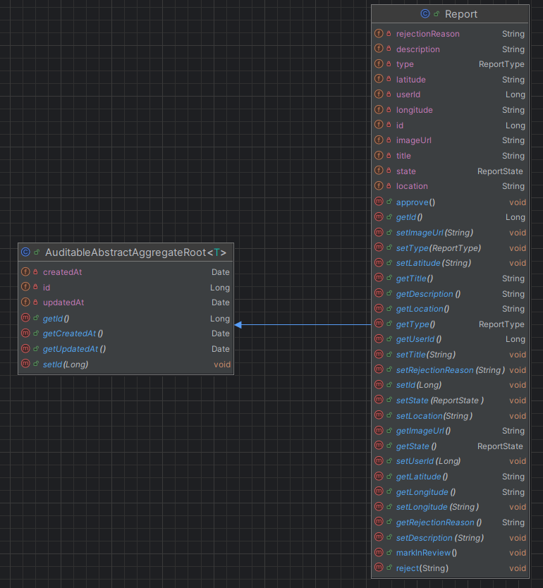

#### 5.4.6.2. Bounded Context Database Design Diagram

El bounded context **Report** utiliza una tabla principal llamada **reports**. Esta tabla almacena la información central de los reportes de incidentes, incluyendo título, descripción, tipo, ubicación, coordenadas, evidencia, estado y motivo de rechazo. Además, incluye campos de auditoría como **created_at** y **updated_at**. El campo **id_user** representa una referencia lógica al usuario que creó el reporte, perteneciente a otro bounded context del sistema.

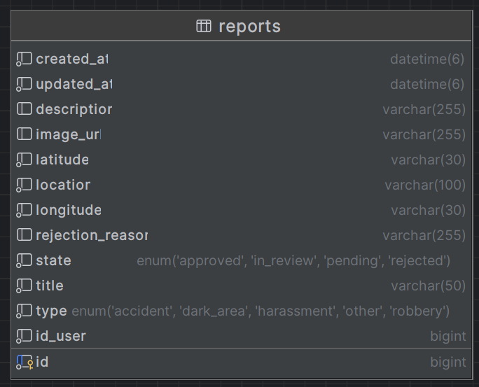

## 5.5. Bounded Context: Alert

### 5.5.1. Domain Layer
La capa de dominio encapsula la lógica central relacionada con la gestión de advertencias preventivas y señales de auxilio dentro de PeaceApp. La entidad principal es el aggregate `Alert`, que representa tanto las notificaciones generadas por el sistema (cuando un ciudadano entra a una zona de riesgo) como las emergencias emitidas voluntariamente por los usuarios a través del botón de pánico. Se utilizan enumeraciones (Value Objects) como `AlertType` y `AlertState` para definir la naturaleza y el ciclo de vida de la alerta.

**Aggregate:** Alert

**Descripción:** Representa una alerta preventiva o de emergencia registrada en el sistema.

|**Atributo**|**Descripción**|**Tipo**|
| :-: | :-: | :-: |
|id|Identificador único de la alerta|Long|
|type|Clasificación de la alerta (preventiva o emergencia)|AlertType|
|description|Descripción contextual de la alerta o emergencia|String|
|latitude|Latitud de la ubicación del usuario al momento de la alerta|String|
|longitude|Longitud de la ubicación del usuario al momento de la alerta|String|
|state|Estado actual de la atención de la alerta|AlertState|
|userId|ID del usuario ciudadano involucrado (referencia a IAM)|Long|
|reportId|ID del reporte asociado que originó la alerta (opcional, solo para preventivas)|Long|

**Método**

|**Método**|**Descripción**|
| :-: | :-: |
|Alert(AlertType type, String description, String latitude, String longitude, Long userId, Long reportId)|Constructor para inicializar una nueva alerta, estableciendo su estado inicial en ACTIVE.|
|void markAsAttended()|Cambia el estado de la alerta de ACTIVE a ATTENDED cuando la municipalidad toma el caso.|
|void markAsResolved()|Actualiza el estado a RESOLVED una vez que la situación de riesgo o emergencia ha concluido.|

**Value Objects**

**AlertState**

**Descripción:**
Representa el estado actual de la alerta dentro del flujo de atención de la municipalidad.

|**Valor**|**Descripción**|
| :- | :- |
|ACTIVE|La alerta ha sido generada y requiere atención o visibilidad inmediata.|
|ATTENDED|Un operador de la municipalidad ha visto la emergencia y está en proceso de gestionarla.|
|RESOLVED|La situación de emergencia o riesgo ha sido neutralizada o el evento ha concluido.|

**AlertType**

**Descripción:** Clasifica la naturaleza de la alerta generada en el sistema.

|**Valor**|**Descripción**|
| :- | :- |
|PREVENTIVE|Alerta generada automáticamente por el sistema cuando un usuario se acerca a un reporte peligroso.|
|EMERGENCY|Señal de auxilio enviada explícitamente por el ciudadano mediante el botón de emergencia.|

**Domain Services**

Los Domain Services en este contexto definen las operaciones de negocio que no pertenecen estrictamente a una sola entidad, dividiendo claramente la escritura (Commands) y la lectura (Queries) del sistema de alertas.

**AlertCommandService**

**Descripción:** Interfaz que define las operaciones de escritura relacionadas con la generación y gestión del ciclo de vida de las alertas.

**Métodos:**

|**Nombre**|**Descripción**|
| :- | :- |
|Optional<Alert> handle(CreatePreventiveAlertCommand command)|Procesa la creación de una advertencia automática por proximidad a una zona de riesgo.|
|Optional<Alert> handle(CreateEmergencyAlertCommand command)|Procesa la recepción de una señal de auxilio emitida por el botón de pánico de un ciudadano.|
|void handle(MarkAlertAsAttendedCommand command)|Actualiza el estado de una alerta a ATTENDED por parte de la municipalidad.|
|void handle(MarkAlertAsResolvedCommand command)|Finaliza el ciclo de vida de la alerta cambiándola a RESOLVED.|

**AlertQueryService**

**Descripción:** Interfaz que define las operaciones de lectura para consultar el historial o el estado en vivo de las alertas.

**Métodos:**

|**Nombre**|**Descripción**|
| :- | :- |
|Optional<Alert> handle(GetAlertByIdQuery query)|Recupera los detalles de una alerta específica mediante su identificador.|
|List<Alert> handle(GetAlertsByUserIdQuery query)|Obtiene el historial de alertas asociadas a un ciudadano específico.|
|List<Alert> handle(GetActiveEmergenciesQuery query)|Recupera todas las emergencias activas para mostrarlas en el dashboard municipal en tiempo real.|

**Domain Events**

Eventos clave que permiten al Bounded Context de Alert comunicar acciones relevantes a otros componentes de la arquitectura de PeaceApp de forma asíncrona.

|**Evento**|**Descripción**|
| :- | :- |
|EmergencyTriggeredEvent|Se emite cuando un ciudadano utiliza el botón de emergencia. Puede ser escuchado por el Notification Gateway para enviar SMS/WhatsApp.|
|AlertStateChangedEvent|Se genera cuando una municipalidad actualiza el estado de una alerta (ej. de ACTIVE a ATTENDED).|

### 5.5.2. Interface Layer

Esta capa actúa como el punto de entrada para las operaciones externas relacionadas con la seguridad preventiva y la respuesta ante emergencias. A través del controlador REST, los ciudadanos pueden emitir señales de auxilio desde la aplicación móvil, mientras que los operadores municipales pueden monitorear emergencias activas y gestionar su estado de atención en tiempo real.

**Controlador: AlertController**

**Descripción:** Gestiona las operaciones REST relacionadas con la creación, consulta y actualización del estado de alertas y emergencias.

|**Método**|**Descripción**|**HTTP**|**Respuesta**|
| :-: | :-: | :-: | :-: |
|createEmergencyAlert(CreateEmergencyAlertResource resource)|Registra una señal de auxilio inmediata enviada por un ciudadano.|POST /api/v1/alerts/emergency|201 Created con AlertResource|
|createPreventiveAlert(CreatePreventiveAlertResource resource)|Registra una alerta preventiva generada por el sistema ante una zona de riesgo.|POST /api/v1/alerts/preventive|201 Created con AlertResource|
|getAlertById(Long id)|Devuelve los detalles de una alerta específica mediante su identificador.|GET /api/v1/alerts/{id}|AlertResource o 404 Not Found|
|getAlertsByUserId(Long userId)|Devuelve el historial de alertas recibidas o generadas por un usuario específico.|GET /api/v1/alerts/user/{userId}|Lista de AlertResource o 204 No Content|
|getActiveEmergencies()|Devuelve todas las emergencias que requieren atención municipal inmediata.|GET /api/v1/alerts/emergencies/active|Lista de AlertResource o 204 No Content|
|markAlertAsAttended(Long id)|Actualiza el estado de una emergencia a ATTENDED.|PATCH /api/v1/alerts/{id}/attended|AlertResource actualizado|
|markAlertAsResolved(Long id)|Actualiza el estado de una emergencia a RESOLVED.|PATCH /api/v1/alerts/{id}/resolved|AlertResource actualizado|

**Resources**

**CreateEmergencyAlertResource**

**Descripción:** Recurso utilizado para recibir los datos de una señal de auxilio desde el botón de pánico móvil.

|**Atributo**|**Tipo**|**Descripción**|
| :- | :- | :- |
|userId|Long|Identificador del usuario que solicita ayuda.|
|latitude|String|Latitud de la ubicación de la emergencia.|
|longitude|String|Longitud de la ubicación de la emergencia.|
|description|String|Breve descripción opcional del suceso.|

**AlertResource**

**Descripción:** Recurso utilizado para devolver la información detallada de una alerta al cliente.

|**Atributo**|**Tipo**|**Descripción**|
| :- | :- | :- |
|id|Long|Identificador único de la alerta.|
|type|String|Tipo de alerta (EMERGENCY o PREVENTIVE).|
|description|String|Descripción de la situación de riesgo.|
|latitude|String|Latitud registrada.|
|longitude|String|Longitud registrada.|
|state|String|Estado de la alerta (ACTIVE, ATTENDED, RESOLVED).|
|userId|Long|Identificador del usuario asociado.|
|reportId|Long|ID del reporte relacionado (si aplica).|

**Assemblers**

|**Clase**|**Descripción**|
| :- | :- |
|CreateEmergencyAlertCommandFromResourceAssembler|Convierte un `CreateEmergencyAlertResource` en un `CreateEmergencyAlertCommand`.|
|CreatePreventiveAlertCommandFromResourceAssembler|Convierte un `CreatePreventiveAlertResource` en un `CreatePreventiveAlertCommand`.|
|AlertResourceFromEntityAssembler|Convierte la entidad de dominio `Alert` en un `AlertResource` para la respuesta API.|

### 5.5.3. Application Layer

Esta capa contiene la lógica de aplicación del bounded context **Alert**. Su función principal es coordinar la ejecución de comandos y consultas, orquestando la comunicación con los repositorios, los servicios externos (Locations y Reports) y la pasarela de notificaciones (SMS/WhatsApp). Además, maneja la recepción de eventos asíncronos para generar alertas preventivas automatizadas.

**Command Services Implementation**

**Clase: AlertCommandServiceImpl**

**Descripción:** Implementa las operaciones de escritura. Se encarga de procesar las señales de auxilio, coordinar la evaluación de zonas de riesgo y despachar notificaciones al exterior.

|**Método**|**Descripción**|
| :-: | :-: |
|handle(CreatePreventiveAlertCommand)|Crea una alerta de tipo PREVENTIVE y utiliza el `NotificationGateway` para advertir al ciudadano. Se activa usualmente mediante la escucha de eventos.|
|handle(CreateEmergencyAlertCommand)|Crea una alerta de tipo EMERGENCY (estado ACTIVE), la persiste en la base de datos y despacha la señal a la municipalidad y contactos de emergencia.|
|handle(MarkAlertAsAttendedCommand)|Cambia el estado de una emergencia a ATTENDED cuando un operador municipal comienza a gestionarla.|
|handle(MarkAlertAsResolvedCommand)|Cambia el estado de una emergencia a RESOLVED una vez finalizada la atención.|

**Query Services Implementation**

**Clase: AlertQueryServiceImpl**

**Descripción:** Implementa las operaciones de lectura, recuperando la información de las alertas y emergencias desde la base de datos.

|**Método**|**Descripción**|
| :-: | :-: |
|handle(GetAlertByIdQuery)|Retorna los detalles de una alerta específica mediante su identificador utilizando el repositorio.|
|handle(GetAlertsByUserIdQuery)|Obtiene el historial completo de alertas preventivas y emergencias vinculadas a un usuario en particular.|
|handle(GetActiveEmergenciesQuery)|Recupera todas las alertas de tipo EMERGENCY que se encuentren en estado ACTIVE, priorizando la visualización en el dashboard municipal.|

**Outbound Services (Anti-Corruption Layers & Coordinators)**

Dado que el Bounded Context de Alert depende de información externa para funcionar correctamente, la capa de aplicación implementa servicios que actúan como fachada para comunicarse con otros contextos o APIs de terceros.

**Clase: ExternalReportService**

**Descripción:** Servicio encargado de comunicarse con el bounded context de **Reports**. Se utiliza para validar si el incidente que detona una alerta preventiva sigue activo.

|**Método**|**Descripción**|
| :-: | :-: |
|fetchReportDetails(Long reportId)|Obtiene la información relevante de un reporte específico utilizando el `ReportServiceClient`.|

**Clase: ExternalLocationService**

**Descripción:** Servicio que interactúa con el bounded context de **Location** para validar la proximidad de los usuarios respecto a las zonas de riesgo.

|**Método**|**Descripción**|
| :-: | :-: |
|validateUserProximity(Long userId, String latitude, String longitude)|Verifica si las coordenadas actuales del usuario se cruzan con el radio de peligro de un incidente reportado.|

**Clase: NotificationGatewayImpl**

**Descripción:** Implementación de la capa anticorrupción (ACL) encargada de orquestar el envío de mensajes hacia los sistemas externos de mensajería (WhatsApp y SMS). Aísla la lógica de las APIs de terceros del dominio de la aplicación.

|**Método**|**Descripción**|
| :-: | :-: |
|dispatchEmergencyNotification(Alert alert)|Formatea y envía la señal de auxilio a los contactos de emergencia del ciudadano vía WhatsApp API y SMS Gateway.|
|dispatchPreventiveNotification(Alert alert)|Envía una notificación preventiva (push notification o mensaje) al usuario indicando que ha ingresado a una zona de riesgo.|

**Event Listeners**

El Bounded Context **Alert** debe reaccionar en tiempo real a los sucesos del sistema para poder cumplir su objetivo preventivo.

|**Listener**|**Evento**|**Descripción**|
| :- | :- | :- |
|ReportApprovedEventListener|ReportApprovedEvent|Cuando se aprueba un nuevo reporte, este listener evalúa qué usuarios se encuentran en las proximidades y desencadena la creación de alertas preventivas.|

### 5.5.4. Infrastructure Layer

La capa de infraestructura proporciona las implementaciones necesarias para la persistencia de datos, la comunicación síncrona entre microservicios y la integración con servicios de mensajería externos. En este contexto, se utiliza **Spring Data JPA** para la gestión de alertas, **OpenFeign** para interactuar con los contextos de Reports y Locations, y **RabbitMQ** para la recepción de eventos que disparan alertas preventivas.

**Repositorio: AlertRepository**

**Descripción:** Repositorio basado en Spring Data JPA encargado de realizar las operaciones CRUD sobre la entidad `Alert`. Permite gestionar el historial de avisos preventivos y el estado de las emergencias municipales.

|**Método**|**Descripción**|
| :-: | :-: |
|save(Alert alert)|Guarda una nueva alerta o actualiza el estado de una existente.|
|findById(Long id)|Busca una alerta específica por su identificador único.|
|findAllByUserId(Long userId)|Recupera todas las alertas y emergencias vinculadas a un ciudadano.|
|findAllByTypeAndState(AlertType, AlertState)|Busca emergencias activas para el monitoreo municipal.|

**External Clients: Feign Clients**

Para asegurar la integridad de la información y la validación de proximidad, el servicio de alertas consume datos de otros microservicios de la plataforma.

**ReportServiceClient**

**Descripción:** Cliente utilizado para obtener información detallada sobre los incidentes reportados en el sistema.

|**Método**|**Descripción**|
| :-: | :-: |
|getReportById(Long id)|Recupera los datos de un incidente para generar el contexto de una alerta preventiva.|

**LocationServiceClient**

**Descripción:** Cliente encargado de interactuar con el microservicio de Location para obtener o validar coordenadas.

|**Método**|**Descripción**|
| :-: | :-: |
|getUserCoordinates(Long userId)|Obtiene la última ubicación conocida de un ciudadano para evaluar riesgos por proximidad.|

**Messaging & Events: RabbitMQ Infrastructure**

El sistema de alertas es reactivo y depende de los eventos generados por otros contextos para funcionar de manera preventiva sin intervención humana directa.

**AlertEventListener**

**Descripción:** Componente encargado de escuchar los mensajes publicados en el exchange de reportes.

|**Evento escuchado**|**Acción realizada**|
| :-: | :-: |
|ReportApprovedEvent|Al recibir este evento, el servicio activa el proceso de evaluación de proximidad para notificar a los ciudadanos cercanos al nuevo punto de riesgo.|

**Resiliency & Fallbacks**

Para garantizar que el sistema no falle ante caídas de servicios externos, se implementan clases de respaldo para los clientes Feign.

|**Clase**|**Descripción**|
| :-: | :-: |
|ReportServiceFallback|Retorna una respuesta segura o cacheada cuando el servicio de reportes no está disponible.|
|LocationServiceFallback|Proporciona una respuesta por defecto si no se puede validar la ubicación del usuario en tiempo real.|

**API Integration: Notification Adapters**

Implementación técnica de la capa anticorrupción (ACL) para servicios de terceros.

|**Componente**|**Descripción**|
| :-: | :-: |
|WhatsAppApiAdapter|Encapsula la lógica de autenticación y envío de plantillas de mensajes a través de la API oficial de WhatsApp.|
|SmsGatewayAdapter|Gestiona la conexión con el proveedor de SMS para el envío de alertas de emergencia críticas sin dependencia de datos móviles.|

### 5.5.5. Bounded Context Software Architecture Component Level Diagrams

**Backend**

Es el motor transaccional y analítico de las alertas. Se encarga de procesar las señales de auxilio, evaluar reglas de negocio (como calcular la proximidad del usuario a zonas de riesgo apoyándose en el servicio de Locations y Reports), y gestionar los cambios de estado de las emergencias. Además, actúa como orquestador para despachar notificaciones hacia el exterior mediante pasarelas como WhatsApp y SMS.

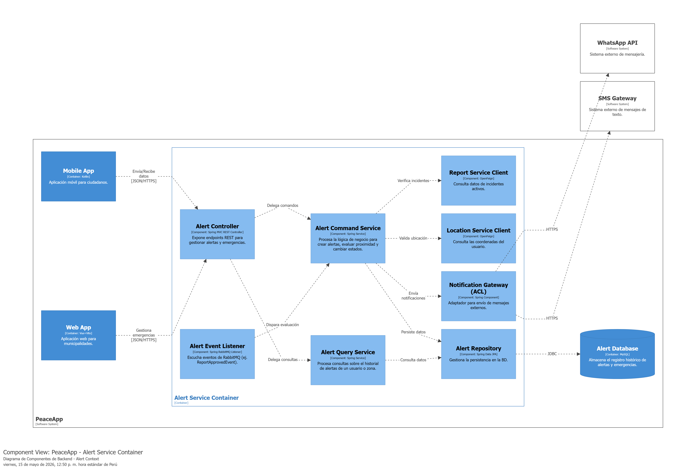

**WebApp**

Proporciona a los gestores de seguridad municipal un dashboard interactivo donde pueden monitorear las emergencias activas sobre un mapa en tiempo real. Desde aquí, las autoridades pueden gestionar el ciclo de vida de cada alerta (por ejemplo, marcarla como "en proceso" o "atendida"), asegurando un seguimiento adecuado.

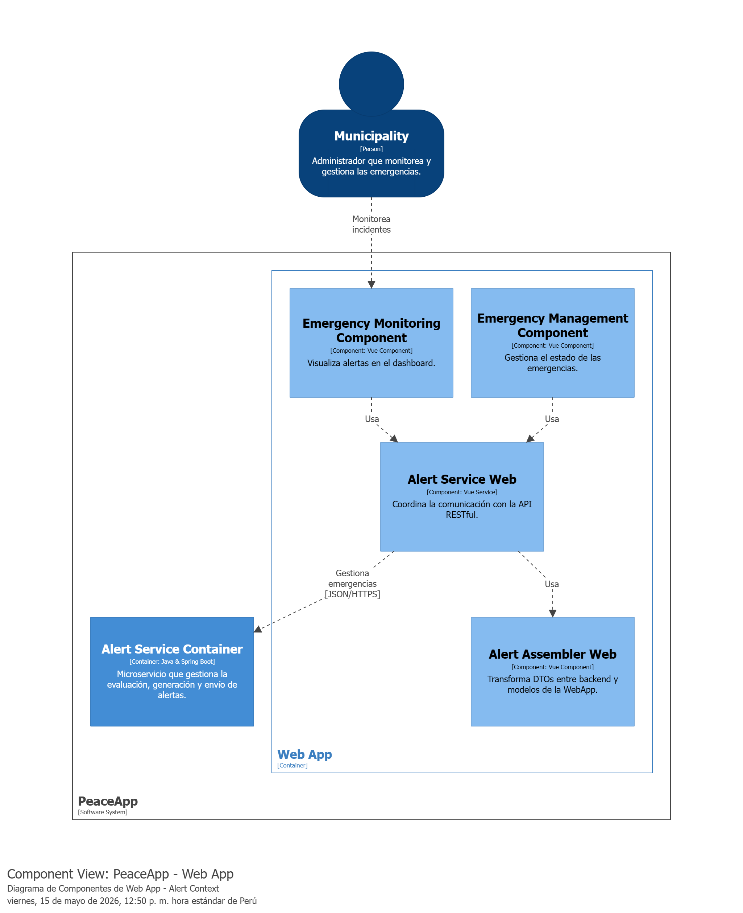

**MobileApp**
Su objetivo principal es brindar al ciudadano una interfaz rápida y accesible para enviar alertas de emergencia inmediatas junto con su geolocalización. Adicionalmente, funciona como un receptor activo que muestra notificaciones preventivas en tiempo real cuando el usuario ingresa a una zona catalogada como peligrosa.
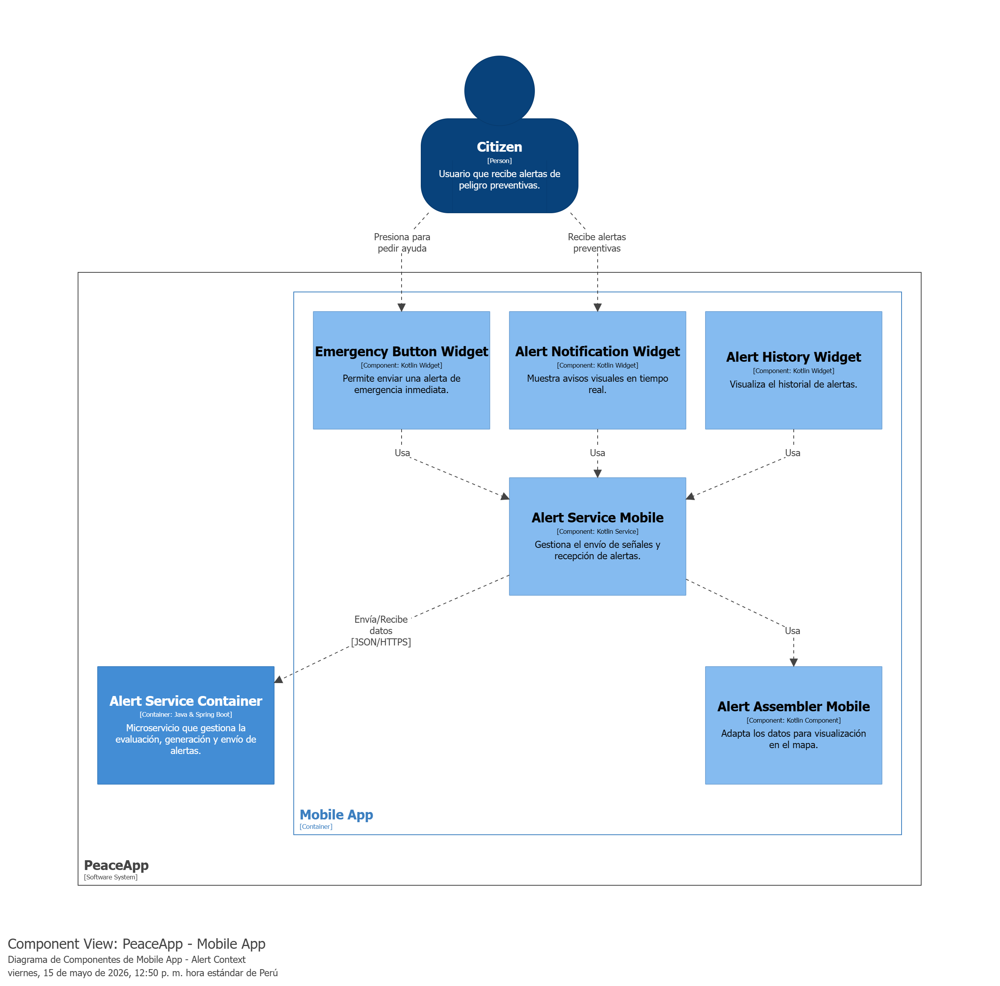

### 5.5.6. Bounded Context Software Architecture Code Level Diagrams

#### 5.5.6.1. Bounded Context Domain Layer Class Diagrams

El siguiente diagrama representa las clases principales de la capa de dominio del bounded context **Alert**. La entidad principal es el aggregate `Alert`, el cual hereda de `AuditableAbstractAggregateRoot` para incorporar automáticamente los atributos de auditoría (`createdAt` y `updatedAt`). 

La clase encapsula la información de la alerta, incluyendo su descripción, ubicación (location), la URL de la evidencia visual (`imageUrl`), el identificador del reporte que la originó (`idReport`), y el usuario asociado (`idUser`). Asimismo, incluye la enumeración `AlertType`, la cual categoriza la alerta según el tipo de riesgo detectado o reportado (ACCIDENT, DARK_AREA, HARASSMENT, OTHER, ROBBERY).

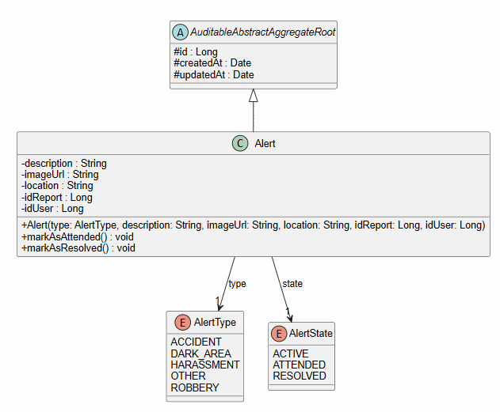

#### 5.5.6.2. Bounded Context Database Design Diagram

El bounded context **Alert** utiliza una base de datos independiente llamada `alerts_db`, asegurando el desacoplamiento dictado por la arquitectura de microservicios. Dentro de esta, la información se almacena en la tabla principal `alerts`. 

Esta tabla contiene los registros históricos y activos de las advertencias generadas en el sistema. Los campos `id_user` e `id_report` actúan como referencias lógicas hacia los bounded contexts de IAM y Reports, respectivamente, sin crear restricciones de clave foránea duras, lo que favorece la resiliencia del sistema. El campo `type` está restringido mediante un ENUM a nivel de base de datos para garantizar la integridad del tipo de incidente.

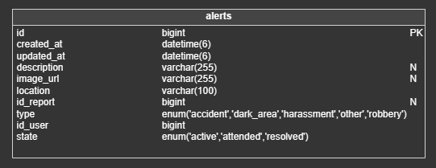

---

# Capítulo VI: Solution UX Design

## 6.1. Style Guidelines

En esta sección se definen las normas de estilo que servirán como base para el desarrollo del
producto desde cero. Estas directrices establecerán un marco común para la elección de tipografías,
tamaños y la paleta de colores, facilitando así el diseño de PeaceApp desde las primeras etapas
del prototipado. Serán una herramienta clave para todo el equipo, ya que proporcionarán una guía
clara sobre cómo aplicar los distintos componentes del diseño en cada área y sección de la
plataforma. Esto permitirá optimizar el tiempo de trabajo y asegurar una imagen visual coherente
en todo PeaceApp.

### 6.1.1. General Style Guidelines

**Branding:** Nuestro logo refleja de manera sencilla y memorable el
espíritu de PeaceApp. Con el nombre de la aplicación acompañado por un
símbolo que evoca un camino seguro y la inicial de \"PeaceApp\",
buscamos que los usuarios asocien rápidamente nuestra marca con su
propósito: guiarlos hacia un entorno más seguro. Queremos que nuestro
logo sea fácil de recordar, al igual que la seguridad que ofrecemos en
cada trayecto.

**Tipografía:** Nuestro logotipo posee la fuente "Lora", el cual refleja
un estilo simple y moderno. Buscando promover un ambiente innovador e
interactivo de nuestra aplicación. En adición, y con respecto a nuestra
aplicación tanto la palabra "Peace" como "App", gozan de las mismas
características de formato. Se usa Poppins en el resto de la aplicación.

**Colores:** Continuando con el objetivo de brindar una imagen que
influya principalmente la confianza y seguridad. Hemos decidido optar
por una paleta de colores que transmiten calma, seguridad, estabilidad y
profesionalismo. Por lo que serán tonos de azules hasta llegar a blanco.
Esta combinación no solo manifiesta el objetivo de nuestro proyecto,
sino también una atmosfera de serenidad y sofisticación. A continuación,
se muestra la paleta de colores que se usarán para desarrollar nuestra
aplicación.

### 6.1.2. Web, Mobile & Devices Style Guidelines

Para la versión web, se sigue un enfoque de diseño responsivo, adoptando el patrón visual en forma de “Z” para guiar la atención del usuario. Se prioriza la simplicidad, con fondos de color único y uso puntual de imágenes representativas por sección. Los botones utilizan tonos contrastantes dentro de la paleta azul para diferenciar acciones clave. Las pantallas emergentes oscurecen el fondo y emplean variantes de azul con mayor intensidad para destacar acciones importantes y asegurar la atención del usuario antes de continuar con la navegación.

Para dispositivos Android, adoptamos las recomendaciones de Material Design de Google. Este enfoque promueve una interfaz adaptable y visualmente clara, con especial énfasis en la jerarquía de elementos, animaciones suaves y uso eficiente del color. Se implementan componentes nativos como floating action buttons, snackbars y cards para asegurar familiaridad y coherencia. También se aprovechan las capacidades del sistema como servicios de ubicación, notificaciones push y navegación por gestos, garantizando una experiencia moderna, consistente y funcional en toda la plataforma.

Para dispositivos iOS, seguimos las recomendaciones de la Human Interface Guidelines (HIG) de Apple. El diseño se enfoca en la simplicidad, la legibilidad y la eficiencia del espacio. Se prioriza el uso de componentes nativos como tab bars, modals y gestos multitáctiles, garantizando una experiencia fluida y coherente con el ecosistema Apple. Además, se cuida el uso del safe area para asegurar una visualización óptima en dispositivos con diferentes tamaños de pantalla y elementos como el notch. Se promueve una navegación intuitiva, con transiciones suaves y retroalimentación clara para cada acción.

## 6.2. Information Architecture

### 6.2.1. Organization Systems

El sistema de organización se centrará en proporcionar la mejor experiencia al usuario en cuanto a la navegación y uso de las funcionalidades de seguridad. Nuestra plataforma está diseñada para que los usuarios puedan navegar, reportar incidentes y monitorear la seguridad de manera segura y cómoda.

> **Categorización de la Información:**

- Mapa de Seguridad: Categorizado por niveles de seguridad (alto, medio, bajo) y tipos de incidentes (robos, agresiones, etc.).

- Denuncias y Reportes: Categorizado por tipo de crimen y nivel de urgencia para facilitar la gestión y respuesta rápida.

> **Filtros y Búsqueda:**

- Filtros en el Mapa: Permiten a los usuarios filtrar incidentes por tipo de crimen, fecha y hora, y nivel de riesgo.

- Búsqueda Avanzada: Opción de búsqueda avanzada en el mapa y en los reportes para encontrar información específica o zonas críticas.

> **Interfaz de Usuario Intuitiva:**

- Menú Principal: Navegación clara con acceso rápido a las secciones principales como Mapa, Denuncia, Registro, y Contacto.

- Submenús Contextuales: Dentro de las secciones principales, submenús contextuales que guían a los usuarios a funcionalidades específicas, como diferentes tipos de incidentes en el Mapa o herramientas de denuncia.

> **Funcionalidades Específicas:**

- Información Detallada de Incidentes: Páginas individuales de incidentes que muestran descripciones completas, ubicación precisa y opciones de seguimiento.

### 6.2.2. Labeling Systems

Consideramos que la mejor opción para el desarrollo de nuestra plataforma será a través de un sistema de etiquetado. Utilizaremos etiquetas claras para describir cada funcionalidad y característica.

Ejemplos de etiquetas incluirán:

- Mapa de calor (Interactivo y a tiempo real)

- Denunciar (Denuncias a crímenes o incidentes)

- Información de Incidentes

- Registro de Usuarios

- Compartir Ubicación en Tiempo Real

### 6.2.3. Searching Systems

El sistema de búsqueda permitirá a los usuarios encontrar y filtrar información relevante sobre incidentes de seguridad en sus áreas de interés. Emplearemos diferentes formas de búsqueda:

> **Búsqueda por Incidente:**

- Los usuarios pueden buscar incidentes específicos como \"robos en Miraflores\" o \"agresiones en San Isidro\".

- Se proporcionan opciones de búsqueda avanzada para filtrar por fecha, hora, tipo de crimen, y nivel de riesgo.

> **Búsqueda por Ubicación:**

- Los usuarios pueden buscar incidentes por ubicación específica, como \"incidentes en el centro de Lima\".

- Se ofrecen filtros para seleccionar múltiples ubicaciones y tipos de incidentes a la vez. (esto lo quitan si quieren, son ideas q yo saque)

> **Búsqueda por Nivel de Seguridad:**

- Los usuarios pueden buscar zonas según su nivel de seguridad, como \"zonas de alto riesgo\" o \"áreas seguras en Lima\".

- La plataforma sugiere las zonas más seguras y permite explorar áreas con diferentes niveles de riesgo.

> **Búsqueda Avanzada:**

- Se ofrece una búsqueda avanzada que permite a los usuarios combinar múltiples criterios de búsqueda, como \"robos en Miraflores durante la noche\".

- Los resultados de la búsqueda avanzada se presentan en una lista organizada por relevancia y se pueden refinar aún más utilizando filtros adicionales.

> **Búsqueda por Fecha y Hora:**

- Los usuarios pueden buscar incidentes dentro de un rango de fechas y horas específicas.

- Se muestra información sobre la frecuencia de incidentes en determinados horarios, facilitando la toma de decisiones informadas.

### 6.2.4. SEO Tags and Meta Tags

Nuestros SEO Tags y Meta Tags, o, dicho de otra forma, las etiquetas clave que representarán el contenido de nuestra aplicación presentado tanto en nuestra aplicación web como en aplicación móvil serán:

> Landing Page:

- Title: PeaceApp

- Description: PeaceApp - Oficial Landing Page

- Keywords: Seguridad, Accidentes, Incidentes, Policía.

- Authors: PeaceApp Team

> Web application:

- Title: PeaceApp

- Description: PeaceApp - Oficial Web Site

- Keywords: Seguridad, Accidentes, Incidentes, Policía.

- Authors: PeaceApp Team

### 6.2.5. Navigation Systems

El sistema de navegación de PeaceApp debe proporcionar una experiencia fluida y fácil de usar para los usuarios, permitiéndoles encontrar rápidamente la información que buscan. Se describe de la siguiente forma:

> **Menú Principal:**

- Un menú principal ubicado en la parte superior izquierda (tanto con el logo como con solo el icono del logo), de cada página que incluye enlaces a las secciones clave como Mapa, Denuncia, Registro y Contacto.

- Cada elemento del menú principal está etiquetado de manera clara y concisa para facilitar la navegación.

> **Navegación Contextual:**

- Dentro de cada sección principal, se proporciona una navegación contextual que muestra submenús o enlaces relacionados con la sección actual, como diferentes categorías en el Mapa o herramientas de denuncia en la sección de Denuncia.

> **Botones de Acción Destacados:**

- En las páginas de Inicio y Mapa, se destacan botones de acción para dirigir a los usuarios a las funcionalidades principales de la plataforma.

- Estos botones de acción tienen un diseño llamativo y están estratégicamente ubicados para captar la atención de los usuarios.

> **Búsqueda y Filtros Visibles:**

- La barra de búsqueda y los filtros de navegación son visibles en todas las páginas para que los usuarios puedan buscar información específica o filtrar resultados según sus preferencias.

- Los filtros se presentan de manera clara y se pueden ajustar fácilmente para refinar los resultados de búsqueda.

> **Flujo de Navegación Intuitivo:**

- Se establece un flujo de navegación intuitivo y lógico que guía a los usuarios a través de las diferentes funcionalidades, desde la exploración del mapa hasta la denuncia de crímenes y el monitoreo de seguridad.

- Se utilizan llamadas a la acción claras y señales visuales para indicar el progreso y las acciones que los usuarios deben realizar en  cada paso del proceso de navegación.

## 6.3. Landing Page UI Design

### 6.3.1. Landing Page Wireframe

Utilizando la herramienta de diseño Figma, creamos la estructura base de la Landing Page.

Enlace al Landing Page Wireframe: <https://tinyurl.com/ybtsb4c6>

### 6.3.2. Landing Page Mock-up

Teniendo el wireframe, realizamos una representación más realista de la Landing Page.

Enlace al Landing Page Mock-up: <https://tinyurl.com/ymunn2vn>

> 

## 6.4. Applications UX/UI Design

### 6.4.1. Applications Wireframes

Los wireframes de las aplicaciones, tanto para la versión web como móvil, son diagramas
estructurales que muestran la disposición de los elementos de interfaz y funcionalidades
clave. Esta etapa temprana del diseño UX permite evaluar la organización de la
información, los puntos de interacción del usuario y la lógica de navegación dentro del
sistema.

#### 6.4.1.1 Web Application Wireframes

Creamos la estructura de la aplicación web de PeaceApp utilizando Figma.

Enlace a los Web Applications Wireframes:
<https://www.figma.com/design/KFB2co2shH7aJF2UIXTOrL/Untitled--Copy-?node-id=0-1&t=k2uYPScq5bHnEsDH-1>

#### 6.4.1.2 Mobile Application Wireframes

Creamos la estructura de PeaceApp utilizando Figma.

Enlace a los Mobile Applications Wireframes:
<https://www.figma.com/design/qDvXC6SO5sIKnEyGcgiHhe/Peace-App-Web-Applications-UX%2FUI-Design?node-id=0-1&node-type=canvas&t=8M5eo45jFkAsIaiW-0>

IOS Application Wireframes:

### 6.4.2. Applications Wireflow Diagrams

#### 6.4.2.1 Web Applications Wireflow Diagrams

**User Flow**: User Goal: Iniciar sesión en la aplicación web como usuario registrado. Para este objetivo, el usuario ingresa directamente desde la página principal de la web, donde encuentra el formulario de inicio de sesión. Completa su correo y contraseña y presiona el botón "Ingresar". Si los datos son correctos, será redirigido al mapa. En caso contrario, se le avisará que hay campos vacíos o que los datos ingresados son incorrectos. US07

> 

**User Flow**: User Goal: Registrarse en la aplicación web como nuevo usuario. El usuario selecciona el botón "Registro", que lo redirige a un formulario donde debe ingresar su nombre, apellido, número de teléfono, correo electrónico y contraseña. Si completa todo correctamente, la cuenta se crea exitosamente. En caso de errores de formato, campos vacíos o datos inválidos, se le notificará y no se registrará. US06

> 

**User Flow**: User Goal: Generar un reporte de incidente en la aplicación web. El usuario accede a la sección "Reportes" y selecciona la opción para crear un nuevo reporte. Redacta el tipo de incidente libremente y selecciona la ubicación en el mapa arrastrando un marcador. Adjuntar evidencia es opcional. Si decide cancelar, podrá eliminar el reporte. Si completa correctamente los datos requeridos, el reporte se publica. Si hay errores o campos vacíos, no se enviará. US08

> 

**User Flow:** User Goal: Visualizar reportes en la aplicación web. Desde la sección "Reportes", el usuario podrá ver una lista general de todos los reportes. Si no existen reportes, se mostrará la vista vacía. Actualmente, no hay visualización de alertas, íconos en el mapa ni opción para ver detalles de reportes individuales. US11

> 

**User Flow:** User Goal: Editar la información del perfil en la aplicación web. Al ingresar, el usuario puede acceder al ícono de perfil y desde ahí editar sus datos personales. Si todos los campos obligatorios se completan, los cambios se guardan correctamente. Si deja algún campo vacío, se le notificará. US15

> 

**User Flow**: User Goal: Visualizar rutas seguras dentro del mapa en la aplicación web. El usuario accede a la sección "Mapa" e ingresa la ubicación a la que desea llegar. Si deja el campo vacío o ingresa una dirección inválida, no se mostrará nada. Si la dirección es válida, se generará una ruta segura en el mapa desde su ubicación actual hasta el destino ingresado. US10

> 

#### 6.4.2.2 Mobile Applications Wireflow Diagrams 

**Wire Flow**: User Goal: Ingresar a la aplicación móvil como usuario registrado. Para este objetivo, el usuario accede a la pantalla inicial, selecciona el botón “Iniciar sesión” e ingresa su correo y contraseña. Si los datos ingresados son correctos, se redirige automáticamente al mapa de la aplicación. En caso de error (credenciales incorrectas o campos vacíos), se muestra un mensaje de advertencia solicitando revisar la información. US07

> 

**Wire Flow**: User Goal: Registrarse en la aplicación móvil como nuevo usuario. Para lograr este objetivo, el usuario presiona el botón “Comenzar ahora” en la pantalla inicial y accede al formulario de registro. Allí deberá ingresar su nombre, apellido, número de teléfono, correo electrónico y contraseña. Si toda la información es válida, se muestra un mensaje confirmando la creación exitosa de la cuenta. Si hay errores en el formato del correo, la contraseña es demasiado corta o el número es inválido, se informará al usuario y no se completará el registro. US06

> 

**Wire Flow**: User Goal: Visualizar los reportes disponibles en la aplicación. Una vez dentro de la app, el usuario puede acceder a la sección “Alertas” para ver los reportes en su zona. Si no existen alertas, no se mostrará contenido. Desde el mapa también puede acceder directamente al detalle de un reporte tocando un ícono. En la pestaña “Reportes”, puede revisar tanto los reportes generales como los propios. Si aún no se han generado reportes, esas secciones estarán vacías. US11

> 

**Wire Flow:** User Goal: Editar la información del perfil del usuario. Al ingresar a la aplicación, el usuario puede acceder a su perfil mediante el ícono correspondiente. Desde allí puede modificar sus datos personales. Si todos los campos requeridos son completados correctamente, la información se actualiza exitosamente. Si algún campo queda vacío, se notificará al usuario para que complete todos los datos. US15

> 

**Wire Flow:** Acceder al mapa de calor desde cualquier sección de la app. Al iniciar sesión correctamente, la aplicación redirige automáticamente al mapa donde se visualizan los reportes. Adicionalmente, desde cualquier otra sección, el usuario puede acceder al mapa mediante el ícono de navegación inferior. US17

> 

**Wire Flow**: Generar un nuevo reporte de incidente y adjuntar evidencia. Para cumplir este objetivo, el usuario accede a la sección “Mis reportes” y selecciona el botón para crear uno nuevo. Luego elige el tipo de incidente (robo, accidente, etc.) y completa el formulario incluyendo una descripción y la evidencia correspondiente. Puede cancelar el proceso, lo que le permitirá eliminar el reporte. Si completa correctamente todos los campos y adjunta evidencia, el reporte se publica exitosamente y se visualizará en el mapa de calor. Si hay errores o campos vacíos, el reporte no será enviado. US08 y US09

> 

**Wire Flow**: Recibir notificaciones sobre reportes y alertas de riesgo. Al abrir la aplicación, el usuario puede seleccionar el ícono de alertas para ver los reportes cercanos. Si no existen alertas en la zona, se muestra una vista vacía. Si hay reportes disponibles, el usuario podrá ver los detalles tocando alguno de ellos. US13 y US12

**Wire Flow**: Compartir ubicación con contactos. El usuario accede a la sección “Compartir ubicación” desde el ícono correspondiente en la parte inferior de la app. Desde ahí puede ver una lista de contactos y seleccionar a quién desea enviar su ubicación. Al presionar el botón “Guardar cambios”, la ubicación será compartida con los contactos elegidos. US14

### 6.4.3. Applications Mock-ups

#### 6.4.3.1 Web Applications Mock-ups 

Creamos un boceto más realista de cómo se verá PeaceApp en la aplicación Web.

Enlace a los Web Application Mock-ups: <https://www.figma.com/design/4ddpaCLGMU2orrZG7Y3GyH/Sin-t%C3%ADtulo?node-id=0-1&t=k2uYPScq5bHnEsDH-1>

**Sección log in y sign up:**

**Sección del mapa:**

**Sección de Reportes y alerta:**

**Sección perfil:**

#### 6.4.3.2 Mobile Applications Mock-ups

Creamos un boceto más realista de cómo se verá PeaceApp.

Enlace a los Mobile Application Mock-ups: <https://tinyurl.com/dyb2ex8u>

**Sección log in y sign up:**

**Sección del mapa, alerta y reportes:**

**Sección compartir ubicación:**

**Sección perfil:**

### 6.4.4. Applications User Flow Diagrams

#### 6.4.4.1 Web Applications User Flow Diagrams 

**User Flow**: User Goal: Iniciar sesión en la aplicación web como usuario registrado. Para este objetivo, el usuario ingresa directamente desde la página principal de la web, donde encuentra el formulario de inicio de sesión. Completa su correo y contraseña y presiona el botón "Ingresar". Si los datos son correctos, será redirigido al mapa. En caso contrario, se le avisará que hay campos vacíos o que los datos ingresados son incorrectos. US07

> 

**User Flow**: User Goal: Registrarse en la aplicación web como nuevo usuario. El usuario selecciona el botón "Registro", que lo redirige a un formulario donde debe ingresar su nombre, apellido, número de teléfono, correo electrónico y contraseña. Si completa todo correctamente, la cuenta se crea exitosamente. En caso de errores de formato, campos vacíos o datos inválidos, se le notificará y no se registrará. US06

> 

**User Flow**: User Goal: Generar un reporte de incidente en la aplicación web. El usuario accede a la sección "Reportes" y selecciona la opción para crear un nuevo reporte. Redacta el tipo de incidente libremente y selecciona la ubicación en el mapa arrastrando un marcador. Adjuntar evidencia es opcional. Si decide cancelar, podrá eliminar el reporte. Si completa correctamente los datos requeridos, el reporte se publica. Si hay errores o campos vacíos, no se enviará. US08

> 

**User Flow:** User Goal: Visualizar reportes en la aplicación web. Desde la sección "Reportes", el usuario podrá ver una lista general de todos los reportes. Si no existen reportes, se mostrará la vista vacía. Actualmente, no hay visualización de alertas, íconos en el mapa ni opción para ver detalles de reportes individuales. US11

> 

**User Flow:** User Goal: Editar la información del perfil en la aplicación web. Al ingresar, el usuario puede acceder al ícono de perfil y desde ahí editar sus datos personales. Si todos los campos obligatorios se completan, los cambios se guardan correctamente. Si deja algún campo vacío, se le notificará. US15

> 

**User Flow**: User Goal: Visualizar rutas seguras dentro del mapa en la aplicación web. El usuario accede a la sección "Mapa" e ingresa la ubicación a la que desea llegar. Si deja el campo vacío o ingresa una dirección inválida, no se mostrará nada. Si la dirección es válida, se generará una ruta segura en el mapa desde su ubicación actual hasta el destino ingresado. US10

> 

#### 6.4.4.2 Mobile Applications User Flow Diagrams

**User Flow**: User Goal: Ingresar a la aplicación móvil como usuario registrado. Para este objetivo, el usuario accede a la pantalla inicial, selecciona el botón “Iniciar sesión” e ingresa su correo y contraseña. Si los datos ingresados son correctos, se redirige automáticamente al mapa de la aplicación. En caso de error (credenciales incorrectas o campos vacíos), se muestra un mensaje de advertencia solicitando revisar la información. US07

> 

**User Flow**: User Goal: Registrarse en la aplicación móvil como nuevo usuario. Para lograr este objetivo, el usuario presiona el botón “Comenzar ahora” en la pantalla inicial y accede al formulario de registro. Allí deberá ingresar su nombre, apellido, número de teléfono, correo electrónico y contraseña. Si toda la información es válida, se muestra un mensaje confirmando la creación exitosa de la cuenta. Si hay errores en el formato del correo, la contraseña es demasiado corta o el número es inválido, se informará al usuario y no se completará el registro. US06

> 

**User Flow**: User Goal: Visualizar los reportes disponibles en la aplicación. Una vez dentro de la app, el usuario puede acceder a la sección “Alertas” para ver los reportes en su zona. Si no existen alertas, no se mostrará contenido. Desde el mapa también puede acceder directamente al detalle de un reporte tocando un ícono. En la pestaña “Reportes”, puede revisar tanto los reportes generales como los propios. Si aún no se han generado reportes, esas secciones estarán vacías. US11

> 

**User Flow:** User Goal: Editar la información del perfil del usuario. Al ingresar a la aplicación, el usuario puede acceder a su perfil mediante el ícono correspondiente. Desde allí puede modificar sus datos personales. Si todos los campos requeridos son completados correctamente, la información se actualiza exitosamente. Si algún campo queda vacío, se notificará al usuario para que complete todos los datos. US15

> 

**User Flow:** Acceder al mapa de calor desde cualquier sección de la app. Al iniciar sesión correctamente, la aplicación redirige automáticamente al mapa donde se visualizan los reportes. Adicionalmente, desde cualquier otra sección, el usuario puede acceder al mapa mediante el ícono de navegación inferior. US17

> 

**User Flow**: Generar un nuevo reporte de incidente y adjuntar evidencia. Para cumplir este objetivo, el usuario accede a la sección “Mis reportes” y selecciona el botón para crear uno nuevo. Luego elige el tipo de incidente (robo, accidente, etc.) y completa el formulario incluyendo una descripción y la evidencia correspondiente. Puede cancelar el proceso, lo que le permitirá eliminar el reporte. Si completa correctamente todos los campos y adjunta evidencia, el reporte se publica exitosamente y se visualizará en el mapa de calor. Si hay errores o campos vacíos, el reporte no será enviado. US08 y US09

> 

**User Flow**: Recibir notificaciones sobre reportes y alertas de riesgo. Al abrir la aplicación, el usuario puede seleccionar el ícono de alertas para ver los reportes cercanos. Si no existen alertas en la zona, se muestra una vista vacía. Si hay reportes disponibles, el usuario podrá ver los detalles tocando alguno de ellos. US13 y US12

**User Flow**: Compartir ubicación con contactos. El usuario accede a la sección “Compartir ubicación” desde el ícono correspondiente en la parte inferior de la app. Desde ahí puede ver una lista de contactos y seleccionar a quién desea enviar su ubicación. Al presionar el botón “Guardar cambios”, la ubicación será compartida con los contactos elegidos. US14

## 6.5. Applications Prototyping'

### 6.5.1 Web Applications Prototyping

Habiendo realizado los mock-ups, creamos un prototipo de la aplicación web en Figma.
 
Enlace al prototipo: https://www.figma.com/proto/g2UjaaatgDwqOfmLg1rFFW/PeaceApp-Prototype?node-id=2-2&p=f&t=xMFwVGxiDoS4zFvU-1&scaling=scale-down&content-scaling=fixed&page-id=0%3A1&starting-point-node-id=2%3A2
 

### 6.5.2 Mobile Applications Prototyping

Habiendo realizado los mock-ups, creamos un prototipo de la app en Figma similar a el prototyping de Android.

Enlace al prototipo: <https://tinyurl.com/zm8788jn>

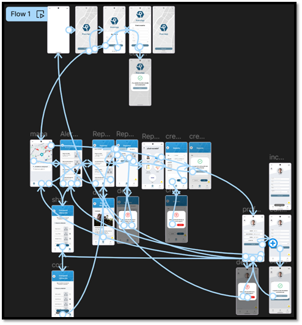

# Capítulo VII: Product Implementation, Validation & Deployment

## 7.1. Software Configuration Management.
En esta sección se resume toda la información recopilada, analizando que pasos que se realizaran y como se siente.

### 7.1.1. Software Development Environment Configuration.
En la siguiente sección se describe la ruta de referencia de cada uno de los productos de software para que cualquier miembro del equipo pueda desarrollar cada punto del trabajo:

**Figma:** Herramienta colaborativa que nos permitirá desarrollar wireframes y mockups.

**Vertabelo:** Plataforma colaborativa que nos permitirá crear nuestro diagrama de base de datos.

**GitHub:** Repositorio colaborativo en la nube

**IntelliJ:** es un entorno de desarrollo para trabajar con Java y otros lenguajes que se ejecutan en JVM, como Kotlin.

### 7.1.2. Source Code Management.
Trabajamos con 3 ramas principales:

**Main:** nuestra rama principal donde presentaremos nuestras publicaciones oficiales.

**Development:** Es nuestra rama de desarrollo, en donde probaremos e integraremos las funcionalidades trabajadas.

**Feature:** Se descompone en ramas por cada feature trabajado.

### 7.1.3. Source Code Style Guide & Conventions.
Para desarrollar nuestro proyecto hemos requerido de algunas nomenclaturas, referencias y lenguajes para esta solución.

Tecnologías: Utilizamos algunas de estas tecnologías para el desarrollo de nuestra aplicación como: HTML5, CSS, JS, Java.

Herramientas: Nos apoyamos de las tecnologías más utilizadas y recomendadas para el desarrollo de nuestra aplicación como: GitHub, Figma, IntelliJ

Convenciones de idioma: Uso del idioma inglés para elaborar nuestro código

### 7.1.4. Software Deployment Configuration.
Para desplegar nuestra landing page en la plataforma de GitHub, seguimos los siguientes pasos:

**Creación del Repositorio Remoto en GitHub:**

- Creamos un nuevo repositorio en GitHub de nuestro proyecto, el cual se utilizará para el desarrollo y deployment.

**Inicialización del Repositorio:**

- Se utiliza el comando git init para inicializar el repositorio.

**Subida de Archivos al Repositorio Remoto:**

- Añadimos los archivos de nuestra landing page al repositorio local.

- Subimos los archivos al repositorio de GitHub con el comando git push -u origin master o utilizando GitHub Desktop.

**Configuración de Netlify:**

- Nos dirigimos a Netlify y creamos una nueva cuenta o iniciamos sesión.

- En Netlify, seleccionamos la opción de importar el proyecto desde GitHub.

- Autorizamos a Netlify para acceder a nuestro repositorio de GitHub.

- Elegimos el repositorio que contiene nuestra landing page y configuramos las opciones de despliegue.

**Despliegue:**

- Netlify se encargará de desplegar automáticamente nuestra landing page.

- Accedemos a la URL proporcionada por Vercel para verificar que nuestra landing page se haya desplegado correctamente.

De este modo, nuestra landing page estará disponible utilizando Vercel y podrá ser visible para cualquier usuario que tenga el enlace. 

**Enlace del landing page:** <https://peaceapp-landingpage.netlify.app/>

## 7.2. Solution Implementation.

### 7.2.1. Sprint 1

#### 7.2.1.1. Sprint Planning 1.

El Sprint Planning 1 definió el alcance inicial de PeaceApp para sentar las bases del ecosistema web, móvil y de microservicios. En esta reunión se priorizaron las historias orientadas al acceso seguro por roles, la asistencia conversacional inicial para el ciudadano y la configuración de la infraestructura mínima para soportar autenticación, descubrimiento de servicios e integración del chatbot.

| Sprint # | Sprint 1 |
| :--- | :--- |
| Sprint Planning Background | Reunión de arranque del primer sprint para alinear el MVP, distribuir responsabilidades y asegurar que el trabajo cubra las funciones base del sistema PeaceApp. |
| Date | 13/05/2026 |
| Time | 12:00 AM |
| Location | Discord (Reunión virtual) |
| Prepared By | Equipo de desarrollo de PeaceApp |
| Attendees (to planning meeting) | Noriega Suschenko Anatoly, Arroyo Ormeño André, Reyes Trujillano Fabian, Santillan Alvarado Melina, Guia Carrasco Pedro |
| Sprint Goal & User Stories | Entregar la base funcional del MVP con acceso diferenciado por rol, chatbot de apoyo al ciudadano e infraestructura backend lista para integrar los servicios del sistema.   Historias priorizadas: registro de usuarios, inicio de sesión, consulta de seguridad mediante chatbot, asistencia para crear reportes, acceso al soporte externo, autenticación JWT, alta de usuarios, control de roles, microservicio NLP y orquestación en el API Gateway. |
| Sprint 1 Goal | Construir una primera versión operativa de PeaceApp que permita registrar y autenticar usuarios, separar correctamente los flujos web y móvil, e integrar la capa inicial de asistencia inteligente para consultas y creación guiada de reportes. |
| Sprint 1 Velocity | Pendiente de medir |
| Sum of Story Points | 49 |

#### 7.2.1.2. Sprint Backlog 1

Durante este sprint, se trabajó en las funcionalidades base de acceso al ecosistema, la capa de infraestructura distribuida y en el módulo de asistencia inteligente del MVP. Específicamente, se segmentó el flujo de registro de identidades de modo que en la aplicación web solo se permita la creación de cuentas para municipalidades y en la aplicación móvil se limite exclusivamente a ciudadanos. Asimismo, se desarrolló y desplegó el microservicio de chatbot con procesamiento de lenguaje natural (NLP) integrado en la aplicación móvil, y se consolidaron los servicios core de enrutamiento, mapas analíticos, reportes comunitarios y flujos síncronos de emergencia SOS.

**Tabla de control de estado del Sprint**

| Sprint # | **Sprint 1** | | | | | | |
| :--- | :--- | :--- | :--- | :--- | :--- | :--- | :--- |
| **User Story** | | **Work-Item / Task** | | | | | |
| **Id** | **Title** | **Id** | **Title** | **Description** | **Est. (h)** | **Assigned To** | **Status** |
| **US04** | Registro de Usuarios | US04-MO-01 | Form registro ciudadano | UI en Flutter/Mobile; captura de datos personales obligatorios y DNI civil. | 4 | **Noriega Suschenko Anatoly** | Done |
| | | US04-FE-01 | Form registro municipio | UI en React/Web; campos de distrito, provincia y teléfono de contacto. | 5 | **Noriega Suschenko Anatoly** | Done |
| **US05** | Iniciar Sesión | US05-MO-01 | Login móvil ciudadano | Pantalla de inicio de sesión en Flutter; manejo de estados y persistencia local. | 3 | **Arroyo Ormeño André** | Done |
| | | US05-FE-01 | Login web municipal | Pantalla de inicio de sesión en React para autoridades; redirección al Dashboard. | 3 | **Reyes Trujillano Fabian** | Done |
| **US11** | Editar Información de Perfil | US11-MO-01 | Formulario editar perfil ciudadano | UI móvil para modificar datos telefónicos y residencia; validación en cliente. | 3 | **Guia Carrasco Pedro** | Done |
| | | US11-FE-01 | Gestión perfil municipalidad | Vista web interactiva para auditar y actualizar datos institucionales del serenazgo. | 3 | **Reyes Trujillano Fabian** | Done |
| **US12** | Recuperar Contraseña | US12-FE-01 | Interfaz recuperación email | Pantalla web para solicitar el enlace mediante el ingreso de correo electrónico. | 3 | **Arroyo Ormeño André** | Done |
| | | US12-FE-02 | Formulario nueva contraseña | Vista web transaccional para definir y confirmar la clave de acceso de forma segura. | 3 | **Arroyo Ormeño André** | Done |
| **US13** | Acceder a Mapa con Reportes | US13-FE-01 | Lienzo cartográfico central web | Integración del mapa de calor interactivo basado en Mapbox en el dashboard. | 5 | **Reyes Trujillano Fabian** | Done |
| **US14** | Acceder al Perfil de Usuario | US14-MO-01 | Vista de cuenta móvil | Renderizado de datos del ciudadano autenticado y acciones de personalización. | 2 | **Guia Carrasco Pedro** | Done|
| **US15** | Filtrar Reportes | US15-FE-01 | Controles de filtrado web | Componentes UI en consola web para clasificar incidentes por tipo, fecha y estado. | 3 | **Reyes Trujillano Fabian** | Done |
| **US16** | Buscar Ubicación en el Mapa | US16-FE-01 | Buscador predictivo web | Caja de geocodificación en el mapa web para localizar direcciones y avenidas. | 3 | **Reyes Trujillano Fabian** | Done |
| **US18** | Notificación de Éxito al Reportar | US18-MO-01 | Modal confirmación reporte | Cuadro de diálogo ilustrativo en Flutter tras registrar un incidente comunitario. | 2 | **Santillan Alvarado Melina** | Done |
| **US21** | Estado Vacío en “Mis Reportes” | US21-MO-01 | UI empty state reportes | Vista condicional y amigable si el ciudadano aún no ha aportado incidentes. | 2 | **Guia Carrasco Pedro** | Done |
| **US25** | Ver Detalles Rápidos en Mapa | US25-FE-01 | Popups informativos web | Tooltips contextuales sobre los marcadores del mapa web para ver un resumen. | 3 | **Arroyo Ormeño André** | Done |
| **US31** | Acceso como Municipalidad | US31-FE-01 | Enrutamiento Dashboard web | Restricción y renderizado de la consola web limitado a la sesión del municipio. | 4 | **Noriega Suschenko Anatoly** | Done |
| **US32** | Visualizar Reportes en Dashboard | US32-FE-01 | Gráficos analíticos web | Distribución de componentes visuales de incidencias tabuladas por distrito. | 4 | **Reyes Trujillano Fabian** | Done |
| **US35** | Ver Detalle Completo del Reporte | US35-FE-01 | Modal expandido incidente | Interfaz web que muestra la descripción, evidencias y autoría completa. | 3 | **Arroyo Ormeño André** | Done |
| **US38** | Enviar Alerta de Emergencia | US38-MO-01 | SOS Pánico síncrono móvil | Botón crítico en app móvil para gatillar el envío inmediato de coordenadas. | 4 | **Guia Carrasco Pedro** | Done |
| | | US38-MO-02 | Pantalla SOS fuera cobertura | Interfaz adaptativa ante fallo de red móvil para derivar emergencias vía SMS. | 3 | **Guia Carrasco Pedro** | Done |
| **US39** | Confirmación de Envío de Emergencia | US39-MO-01 | UI de confirmación SOS | Pantalla transaccional móvil de envío exitoso de auxilio hacia serenazgo. | 2 | **Guia Carrasco Pedro** | Done |
| **US42** | Consultar Nivel de Seguridad mediante Chatbot | US42-MO-01 | Interfaz de chat móvil | Componente de chat síncrono embebido en Flutter para la interacción ciudadana. | 4 | **Santillan Alvarado Melina** | Done |
| **US43** | Asistencia del Chatbot para Crear Reportes | US43-MO-01 | Workflow de asistencia móvil | Lógica conversacional en app móvil para recolectar datos y armar el borrador. | 4 | **Santillan Alvarado Melina** | Done |
| **US48** | Acceder al Soporte Externo de PeaceApp | US48-MO-01 | Enrutamiento de soporte | Menú interactivo móvil para desviar consultas técnico-operativas al bot. | 2 | **Santillan Alvarado Melina** | Done |
| **TS01** | Autenticación JWT mediante RESTful API | TS01-BE-01 | Configuración Spring Security | Filtros de seguridad, validación asimétrica y protección de endpoints privados. | 5 | **Reyes Trujillano Fabian** | Done |
| **TS02** | Crear Nuevo Usuario mediante RESTful API | TS02-BE-01 | Sign-up REST Endpoints | Implementación de `POST /api/v1/auth/register` en `IAMService` segregado por rol. | 4 | **Noriega Suschenko Anatoly** | Done |
| **TS03** | Editar Perfil de Usuario mediante RESTful API | TS03-BE-01 | Endpoint update profile | Desarrollo de controladores Spring PATCH en `UserService` para mutar perfiles. | 3 | **Noriega Suschenko Anatoly** | Done |
| **TS04** | Crear Reporte de Incidente mediante RESTful API | TS04-BE-01 | Endpoint creación reportes | Endpoints en `ReportService` para registrar incidentes ciudadanos en estado pendiente. | 4 | **Arroyo Ormeño André** | Done |
| **TS05** | Obtener Lista de Reportes mediante RESTful API | TS05-BE-01 | GET list endpoints reportes | Lógica de negocio para servir colecciones de incidentes filtradas por rol. | 4 | **Arroyo Ormeño André** | Done |
| **TS06** | Obtener Reporte por ID mediante RESTful API | TS06-BE-01 | GET report by ID endpoint | Implementación de búsquedas controladas y seguras de un incidente específico. | 3 | **Arroyo Ormeño André** | Done |
| **TS07** | Crear Coordenadas de Ubicación al Generar un Reporte | TS07-BE-01 | Persistencia espacial inicial | Lógica en `LocationService` para acoplar latitud y longitud a los agregados. | 3 | **Guia Carrasco Pedro** | Done |
| **TS08** | Obtener Ubicaciones para Renderizar Reportes en el Mapa | TS08-BE-01 | Endpoint JSON marcadores | Servicio web encargado de retornar las coordenadas para el renderizado del mapa. | 3 | **Guia Carrasco Pedro** | Done |
| **TS09** | Crear Alerta al Acercarse a una Zona de Peligro | TS09-BE-01 | Lógica proximidad de alertas | Componentes en `AlertService` para inicializar alarmas ante cruce de perímetros. | 4 | **Guia Carrasco Pedro** | Done |
| **TS10** | Obtener Alertas por Usuario | TS10-BE-01 | GET alerts endpoint | Endpoint para servir las notificaciones históricas de peligro de una identidad. | 3 | **Guia Carrasco Pedro** | Done |
| **TS11** | Eliminar Alertas al Recargar el Mapa | TS11-BE-01 | Limpieza caché de alertas | Lógica backend para prevenir el envío de elementos duplicados o desactualizados. | 3 | **Guia Carrasco Pedro** | Done |
| **TS12** | Obtener Detalles de Alerta por ID | TS12-BE-01 | GET alert details API | Consulta atómica de infraestructura para recuperar el detalle de una alerta. | 3 | **Guia Carrasco Pedro** | Done |
| **TS13** | Obtener Datos de Usuario por Email | TS13-BE-01 | Query filter by email | Método optimizado en `UserService` para validar identidades durante la autenticación. | 3 | **Noriega Suschenko Anatoly** | Done |
| **TS14** | Manejo de Roles de Usuario | TS14-BE-01 | Interceptor de Autorización | Lógica en `IAMService` (HTTP 403) para bloquear accesos y registros cruzados. | 3 | **Noriega Suschenko Anatoly** | Done |
| **TS15** | Crear Alerta de Emergencia mediante RESTful API | TS15-BE-01 | POST emergency endpoint | API en `AlertService` para registrar la señal inmediata de pánico ciudadana. | 4 | **Guia Carrasco Pedro** | Done |
| **TS16** | Obtener Lista de Emergencias mediante RESTful API | TS16-BE-01 | GET emergencies list | Servicio web para recuperar incidentes activos prioritarios para el municipio. | 3 | **Guia Carrasco Pedro** | Done |
| **TS17** | Actualizar Estado de Emergencia mediante RESTful API | TS17-BE-01 | PATCH status emergency | Endpoint transaccional para actualizar el ciclo de vida de la alerta (`ATTENDED`). | 3 | **Guia Carrasco Pedro** | Done |
| **TS18** | Envío de Notificaciones de Emergencia | TS18-BE-01 | Orquestador eventos SOS | Despachador encargado de derivar las emergencias registradas en tiempo real. | 3 | **Guia Carrasco Pedro** | Done |
| **TS20** | Implementar Microservicio de Chatbot mediante NLP | TS20-BE-01 | Despliegue de servicio NLP | Microservicio independiente en `AIService` para procesar y clasificar texto conversacional. | 6 | **Santillan Alvarado Melina** | Done |
| **TS23** | Orquestación de Servicios de IA en el API Gateway | TS23-BE-01 | Enrutamiento proxy Gateway | Configuración en `GatewayService` para redirigir tráfico de IA aplicando filtros JWT. | 3 | **Guia Carrasco Pedro** | Done |

#### 7.2.1.3. Development Evidence for Sprint Review.
Los avances específicos son:

- **Web Application / Mobile Application:**
  - Segmentación y despliegue del formulario de registro móvil exclusivo para el rol de ciudadanos.
  - Implementación de la interfaz web adaptada para la creación de cuentas de entidades municipales.
  - Integración de la ventana de chat conversacional del asistente en la aplicación móvil.
  - Maquetación inicial de los componentes del Frontend Web corporativo y resolución de estilos responsive.

- **Web Services (Microservices & Infrastructure):**
  - **IAMService & UserService:** Configuración de Spring Security, aprovisionamiento de endpoints para el ciclo de vida de cuentas y control estricto de roles mediante interceptores (JWT).
  - **AIService:** Creación y despliegue del microservicio inteligente de asistencia basado en procesamiento de lenguaje natural (NLP) con soporte e integración oficial de OpenAI.
  - **GatewayService & EurekaServer:** Implementación del servidor de descubrimiento Eureka y configuración de rutas e interceptación en el API Gateway para orquestar la comunicación del ecosistema distribuido.
  - **ReportService, AlertService, LocationService & MessageBroker:** Cimentación de la base de datos estructural del dominio y configuraciones iniciales para soportar el flujo reactivo de mensajería, localización e incidentes.

| Repository | Branch | Commit Id | Commit Message | Commit Message Body | Commited on (Date) |
| :---: | :---: | :---: | :--- | :--- | :---: |
| AIService | main | da5b1020d10030922d0e47a686deaa0e276b2cbf | chore: remove target folder | | 20/06/2026 |
| AIService | main | b39aac09b46e2735b9603466d5b3be5e86390f4d | chore: add gitignore file | | 20/06/2026 |
| AIService | main | 5d04966bdc90fa6a9c5c48c93257aad3541914a5 | feat: integrate OpenAI support in AI service | | 20/06/2026 |
| AIService | main | 8d9e678763c389436838684dc5e8b6a51a276b88 | Initial commit | | 20/06/2026 |
| PeaceApp-Web | main | c8ba68a4f958ef77babf250014ec83e0bc57735c | refactor: fix things | | 20/06/2026 |
| PeaceApp-Web | main | 5ff76ff97746676ef5f56747ec794027fbc01f54 | feat: add web additions | | 16/06/2026 |
| PeaceApp-Web | main | 578932264c740759a651659246541e5eb5948017 | feat: add initial web app implementation | | 13/05/2026 |
| GatewayService | main | 6ef70bbdae10479cd610d12ff08bccc7a5b68896 | refactor: add missing lines | | 20/06/2026 |
| GatewayService | main | 8471388581798deb6242752ad290aec88435fb29 | feat: add gateway additions | | 16/06/2026 |
| GatewayService | main | d4c30a83f746424514060dacfe8010ed49d97831 | feat: add initial service implementation | | 13/05/2026 |
| UserService | main | c7b84b080862c3fa58099f3230e0c7a8a9fbf92d | feat: add users additions | | 16/06/2026 |
| UserService | main | cf2a207d7149a181b2a100054ee32c0ac1ab3b67 | feat: add initial service implementation | | 13/05/2026 |
| ReportService | main | 01a44a4e8f3b1e12a21926c3156e300364281430 | feat: add report additions | | 16/06/2026 |
| ReportService | main | 7abeb6690f97eea0292bdb352f1f4cdc903a1670 | feat: add initial service implementation | | 13/05/2026 |
| IAMService | main | 834c538a10b5418f24b394de15f81576bb205290 | feat: add iam additions | | 16/06/2026 |
| IAMService | main | 48a0801518770bf6c3d5da1620764ccd76312490 | feat: add initial service implementation | | 13/05/2026 |
| AlertService | main | 618b4d2acb6a73f1bc72386d0b2d242cbe9fde79 | feat: add alert service additions | | 16/06/2026 |
| AlertService | main | 847ec1a00e0e506c9948dfb59126a831fc3b056c | feat: add initial service implementation | | 13/05/2026 |
| MessageBroker | main | 1bc5a7dbb7983e71af4ca865a41aaf54a8b9478c | feat: add initial service implementation | | 13/05/2026 |
| LocationService | main | 441016116577520acfcde7e291ef7b6356e83620 | feat: add initial service implementation | | 13/05/2026 |
| EurekaServer | main | a48415bb921918604d8733857689fddeea973def | feat: add initial service implementation | | 13/05/2026 |

#### 7.2.1.4. Testing Suite Evidence for Sprint Review.
Para esta sección del proyecto se hizo uso de la herramienta Visual Studio Code empleando el lenguaje Gherkin.
Se mostrarán a continuación los Acceptance Test según el enfoque de DDD (Domain Driven Desgin)

- Registro de Usuarios

- Iniciar Sesión

- Generar Reporte de Incidentes

- Subir Evidencia Multimedia

- Visualización de Reportes

- Monitoreo de Proximidad a Zonas de Riesgo

- Notificación de Alerta de Riesgo

- Selección de Contactos de Monitoreo

- Compartición de Ubicación en Tiempo Real

- Editar Perfil

- Recuperar Contraseña

- Acceder a Mapa con Reportes

- Acceder al Perfil

- Filtrar Reportes

- Buscar Ubicación en el Mapa

- Formulario de Reporte

- Validación y errores

- Actualización del mapa/heatmap

- Footer Informativo

#### 7.2.1.5. Execution Evidence for Sprint Review.
Se trabajó en el despliegue del núcleo transaccional, los servicios distribuidos y las interfaces interactivas para este primer sprint. En la aplicación web se completó la maquetación y lógica de los formularios de registro municipal, inicio de sesión, recuperación de contraseña, componentes cartográficos y el dashboard analítico de control distrital. Por su parte, la aplicación móvil consolidó la experiencia del ciudadano común, integrando el asistente chatbot, el sistema de reportes comunitarios con IA, la gestión de alertas, la sincronización de contactos de confianza y los flujos críticos de emergencia SOS. Finalmente, la infraestructura de backend validó de forma exitosa el registro y descubrimiento de los microservicios mediante Eureka Server, garantizando una operación integral y conectada de todo el ecosistema distribuido.

**Web Application:**

- **Crear Cuenta Municipalidad:** Formulario estructurado para el alta e inscripción de gobiernos locales en la plataforma web, solicitando datos de contacto institucionales, el distrito de operaciones de serenazgo y los identificadores requeridos para su correcta asignación jurisdiccional.

- **Inicio de Sesión (Login):** Pantalla de acceso seguro al sistema web mediante el ingreso de correo electrónico y contraseña corporativa, protegida con interceptores de seguridad basados en roles.

- **Recuperar Cuenta (Email):** Primer paso del flujo de recuperación de contraseña en la web, donde el usuario ingresa su correo electrónico registrado para solicitar el envío del token o enlace de validación.

- **Recuperar Cuenta (Nueva Contraseña):** Formulario final del flujo de recuperación que permite al usuario establecer y confirmar su nueva clave de acceso de forma segura.

- **Dashboard Municipal:** Panel principal de analítica visual que recopila gráficos estadísticos, métricas e indicadores clave de rendimiento sobre los incidentes reportados en el distrito para optimizar la toma de decisiones del serenazgo.

- **Mapa con Reportes:** Interfaz cartográfica interactiva central que renderiza en tiempo real los marcadores geolocalizados de los incidentes ciudadanos y las zonas identificadas con gradientes de peligro dentro del distrito.

- **Buscador en el Mapa:** Barra de herramientas de geocodificación que permite a los operadores municipales realizar búsquedas directas de direcciones o intersecciones específicas para centrar el lienzo del mapa de forma ágil.

- **Detalle de Reporte:** Modal informativo desplegable que presenta la descripción minuciosa del delito, los datos del usuario emisor, la fecha exacta del suceso y el estado actual del ciclo de vida del reporte.

- **Reporte de Emergencia:** Consola integrada para la visualización y alerta de señales síncronas de auxilio de alta prioridad despachadas de forma asíncrona hacia la central de serenazgo distrital.

- **Perfil Municipalidad:** Sección dedicada a la gestión de datos institucionales de la municipalidad federada, permitiendo auditar y actualizar los teléfonos de contacto de las unidades de campo.

- **Términos y Condiciones:** Vista informativa legal integrada en la plataforma web que detalla las políticas de privacidad y el tratamiento de datos alineado estrictamente a la legislación peruana vigente.

- **Preguntas Frecuentes:** Módulo de autoayuda dinámico con respuestas estructuradas orientadas a facilitar la inducción y el manejo operativo inicial de la consola web por parte de los operadores.

**Mobile Application:**

- **Perfil Ciudadano:** Interfaz donde el usuario civil puede visualizar sus datos personales de cuenta, credenciales de contacto y gestionar la personalización o cierre de su sesión móvil actual.

- **Editar Perfil Ciudadano:** Pantalla interna de edición que faculta al ciudadano a modificar y poner al día sus datos de contacto (teléfono, distrito, residencia), validando en el cliente campos obligatorios vacíos.

- **Chatbot - Indicaciones de Reporte:** Pantalla inicial de bienvenida del asistente inteligente interactivo, ofreciendo pautas de orientación contextuales al ciudadano sobre el estado de la seguridad.

- **Chatbot - Apoyo para Crear Reporte:** Interfaz del flujo conversacional guiado donde el chatbot asiste activamente al ciudadano recopilando la descripción del incidente para estructurar un borrador de reporte de forma rápida.

- **Indicar Dirección en Reporte:** Componente interactivo que asiste al ciudadano en la captura y geolocalización exacta del incidente mediante un cuadro de texto predictivo de direcciones.

- **Formulario de Reporte:** Pantalla estructurada para registrar incidentes manuales, permitiendo al ciudadano ingresar el título del suceso, la descripción contextual y adjuntar las evidencias requeridas.

- **Autocompletado de Tipo por IA:** Pantalla del flujo de creación de reportes donde el microservicio de IA analiza la descripción de los hechos para sugerir y autocompletar de forma predictiva la categoría del delito (ej. Hurto).

- **Notificación de Éxito al Reportar:** Cuadro de diálogo modal e ilustrativo que confirma al ciudadano que el reporte de incidente fue registrado en las bases de datos de forma satisfactoria.

- **Visualización de Reporte Creado:** Pantalla de auditoría individual que permite al ciudadano revisar los datos finales estructurados de su reporte antes o después de la aprobación de la jurisdicción.

- **Mis Reportes:** Sección personalizada que compila de forma tabular e individual el historial histórico de todos los incidentes que el propio usuario ha aportado a la comunidad.

- **Todos los Reportes de Usuarios:** Vista de exploración comunitaria en formato de lista secuencial cronológica que permite al ciudadano revisar los incidentes generales alertados por otros usuarios de la plataforma.

- **Todas las Alertas de Zona:** Interfaz dedicada que compila las alertas preventivas vigentes de su entorno actual de acuerdo con el radio de proximidad geoespacial.

- **Alerta Detectada:** Pantalla de aviso inmediato que irrumpe en la pantalla de la aplicación móvil para advertir de forma visual que el ciudadano se encuentra dentro del radio de influencia de un incidente de peligro.

- **Compartir Ubicación con Contactos:** Interfaz dedicada para enlazar, encender o apagar la transmisión geoespacial síncrona con los contactos de confianza agregados a la libreta personal.

- **SOS - Alerta de Emergencia Enviada:** Pantalla interactiva crítica que confirma al ciudadano el envío y recepción exitosa de su señal de auxilio geoespacial hacia la central de serenazgo (Escenario exitoso de la US39).

- **SOS - Fuera de Cobertura de Datos:** Interfaz de resiliencia del sistema de pánico que se activa de forma automática ante la ausencia de internet móvil, desplegando el mecanismo alternativo para enrutar el auxilio mediante llamadas directas y pasarelas SMS (Capa de Infraestructura ACL).

**Web Services & Infrastructure:**

- **Servidor de Descubrimiento Eureka:** Consola de administración de Netflix Eureka Server que evidencia el registro exitoso, el estado de salud (UP) y el mapeo dinámico de red de las instancias de los microservicios core del sistema distribuido.

#### 7.2.1.6. Services Documentation Evidence for Sprint Review.

- **Links de repositorios (Ecosistema Microservicios):**
  - **AIService:** https://github.com/PeaceApp-Emergentes/AIService
  - **UserService:** https://github.com/PeaceApp-Emergentes/UserService
  - **ReportService:** https://github.com/PeaceApp-Emergentes/ReportService
  - **IAMService:** https://github.com/PeaceApp-Emergentes/IAMService
  - **AlertService:** https://github.com/PeaceApp-Emergentes/AlertService
  - **LocationService:** https://github.com/PeaceApp-Emergentes/LocationService

| Endpoint | Details |
| :---: | :--- |
| **IAM** | Registro de nuevos usuarios y aprovisionamiento del ciclo de inicio de sesión con emisión de tokens JWT. |
| **Profiles (Municipalities)** | Administración de la información detallada e imágenes de perfil institucionales para los municipios distritales. |
| **Users** | Gestión CRUD básica y verificación de existencia de los datos de cuentas asociadas a ciudadanos y personal operativo. |
| **Reports** | Creación, gestión del estado de revisión (Aprobado, Atendido, Rechazado) e historial de incidentes distritales. |
| **Locations** | Gestión y persistencia geográfica de ubicaciones y coordenadas ligadas a reportes de zonas peligrosas. |
| **Alerts** | Generación y consulta de avisos preventivos geolocalizados y señales críticas SOS por usuario o reporte. |
| **AI** | Características de asistencia inteligente que integran la clasificación automática de incidentes, análisis conversacional del chatbot y validación de evidencias. |

| Endpoint | Operaciones | Parámetros | URL |
| :--- | :---: | :--- | :--- |
| **Authentication: Change Password** | PUT | body: `username`, `password` | `/api/v1/authentication/change-password` |
| **Authentication: Sign Up** | POST | body: `username`, `password`, `roles` (List<String>) | `/api/v1/authentication/sign-up` |
| **Authentication: Sign In** | POST | body: `username`, `password` | `/api/v1/authentication/sign-in` |
| **Profiles: Update municipality profile** | PUT | `id` (path), body: `municipalityName`, `city`, `district`, `institutionalEmail`, `phone`, `userId`, `profileImage` | `/api/v1/profiles/municipalities/{id}` |
| **Profiles: Create municipality profile** | POST | body: `municipalityName`, `city`, `district`, `institutionalEmail`, `phone`, `userId`, `profileImage` | `/api/v1/profiles/municipalities` |
| **Profiles: Get municipality by user ID** | GET | `userId` (path) | `/api/v1/profiles/municipalities/{userId}` |
| **Profiles: Check if municipality profile exists** | GET | `userId` (path) | `/api/v1/profiles/municipalities/{userId}/exists` |
| **Profiles: Get municipalities by district** | GET | `district` (path) | `/api/v1/profiles/municipalities/district/{district}` |
| **Users: Get user by ID** | GET | `id` (path) | `/api/v1/users/{id}` |
| **Users: Update user data** | PUT | `id` (path), body: `name`, `lastname`, `email`, `phonenumber`, `userId`, `profileImage` | `/api/v1/users/{id}` |
| **Users: Delete user by ID** | DELETE | `id` (path) | `/api/v1/users/{id}` |
| **Users: Create a new user account** | POST | body: `name`, `email`, `lastname`, `phonenumber`, `userId`, `profileImage` | `/api/v1/users` |
| **Users: Check if user exists** | GET | `id` (path) | `/api/v1/users/{id}/exists` |
| **Users: Get user data by email** | GET | `email` (path) | `/api/v1/users/email/{email}` |
| **Reports: Mark as In Review** | PUT | `id` (path) | `/api/v1/reports/{id}/review` |
| **Reports: Reject a report** | PUT | `id` (path), body: `reason` | `/api/v1/reports/{id}/reject` |
| **Reports: Flag as emergency** | PUT | `id` (path), body: `isEmergency` (boolean) | `/api/v1/reports/{id}/emergency` |
| **Reports: Mark as attended** | PUT | `id` (path) | `/api/v1/reports/{id}/attend` |
| **Reports: Approve a report** | PUT | `id` (path) | `/api/v1/reports/{id}/approve` |
| **Reports: Get all reports** | GET | – | `/api/v1/reports` |
| **Reports: Create a new report** | POST | body: `title`, `description`, `location`, `district`, `type`, `userId`, `imageUrl`, `videoUrl`, `audioUrl`, `latitude`, `longitude`, `isEmergency` | `/api/v1/reports` |
| **Reports: Get report by ID** | GET | `id` (path) | `/api/v1/reports/{id}` |
| **Reports: Delete report by ID** | DELETE | `id` (path) | `/api/v1/reports/{id}` |
| **Reports: Check if report exists** | GET | `id` (path) | `/api/v1/reports/{id}/exists` |
| **Reports: Get reports by user ID** | GET | `userId` (path) | `/api/v1/reports/user/{userId}` |
| **Reports: Get all public reports** | GET | – | `/api/v1/reports/public` |
| **Reports: Get reports by district** | GET | `district` (path) | `/api/v1/reports/district/{district}` |
| **Locations: Get all locations** | GET | – | `/api/v1/locations` |
| **Locations: Create a new location** | POST | body: `latitude`, `longitude`, `idReport` | `/api/v1/locations` |
| **Locations: Get dangerous locations** | GET | query: `quantityReports` (default: 5) | `/api/v1/locations/dangerous` |
| **Locations: Delete locations by report ID** | DELETE | `reportId` (path) | `/api/v1/locations/report/{reportId}` |
| **Alerts: Get all alerts** | GET | – | `/api/v1/alerts` |
| **Alerts: Create a new alert** | POST | body: `location`, `district`, `type`, `description`, `userId`, `imageUrl`, `reportId` | `/api/v1/alerts` |
| **Alerts: Get alert by ID** | GET | `id` (path) | `/api/v1/alerts/{id}` |
| **Alerts: Get alerts by user ID** | GET | `userId` (path) | `/api/v1/alerts/user/{userId}` |
| **Alerts: Delete alerts by user ID** | DELETE | `userId` (path) | `/api/v1/alerts/user/{userId}` |
| **Alerts: Delete alerts by report ID** | DELETE | `reportId` (path) | `/api/v1/alerts/report/{reportId}` |
| **AI: Classify incident report** | POST | body: `description`, `location`, `district` | `/api/v1/ai/classify-incident` |
| **AI: Chatbot safety assistance** | POST | body: `message`, `context`, `userId` | `/api/v1/ai/chatbot` |
| **AI: Analyze evidence metadata** | POST | body: `evidenceUrl`, `evidenceType`, `description` | `/api/v1/ai/analyze-evidence` |

#### 7.2.1.7. Software Deployment Evidence for Sprint Review

**Landing Page:**

- Ingresamos a la plataforma de [Netlify](https://www.netlify.com/), seleccionamos la opción de importar un proyecto existente y vinculamos el repositorio oficial donde se encuentra alojada la Landing Page institucional de PeaceApp.
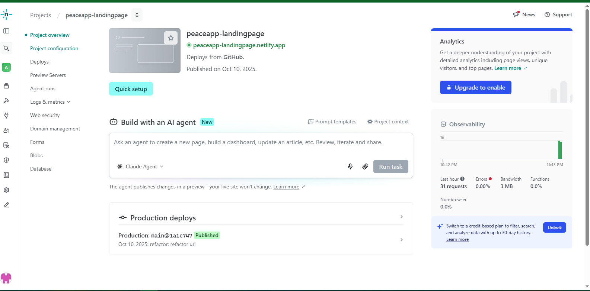

**Web Services (Microservicios):**

- Los microservicios del ecosistema distribuido junto con los componentes de infraestructura compartidos fueron empaquetados en imágenes independientes y desplegados de forma exitosa mediante contenedores Docker, garantizando el aislamiento de contextos, alta disponibilidad y la correcta orquestación de red en el clúster local y de nube.
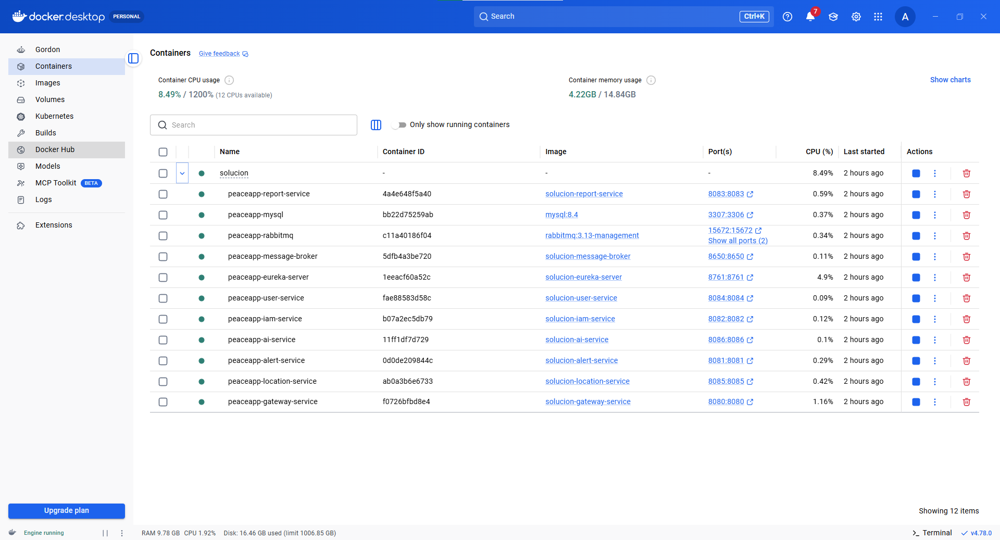

#### 7.2.1.8. Team Collaboration Insights during Sprint.

## 7.3. Validation Interviews.

### 7.3.1. Diseño de Entrevistas.

### 7.3.2. Registro de Entrevistas.

### 7.3.3. Evaluaciones según heurísticas.

## 7.4. Video About-the-Product.

**Duración:** 55 s  **Formato:** MP4

Se presenta de manera concisa la propuesta de valor y las principales funcionalidades logradas para el MVP de **PeaceApp**. El video expone las interfaces interactivas de la aplicación web destinadas al control y visualización de incidentes por parte de las municipalidades, así como el flujo en la aplicación móvil que permite a los ciudadanos interactuar de forma intuitiva con el chatbot de asistencia inteligente y las alertas de seguridad distritales.

**Enlaces:** https://www.youtube.com/watch?v=oqUSiRLa8lI