

**Universida Peruana de Ciencias Aplicadas**  

**Ingeniería de Software**  

**2026-01**  
 

**1ASI0728 - Arquitectura de Software Emergentes**  
 

**Sección:** 11806

**Profesor:** De Los Rios Fernandez, Christian Luis
 

### Informe de Trabajo Final
 

**Startup:**

**Producto:**
 

<table>
  <tr>
    <th>Integrante</th>
    <th>Código</th>
  </tr>
  <tr>
    <td>Arroyo Ormeño, André Alonso</td>
    <td>U202114714</td>
  </tr>
  <tr>
    <td>Guia Carrasco, Pedro Andre</td>
    <td>U202212010</td>
  </tr>
  <tr>
    <td>Noriega Suschenko, Anatoly Andrey</td>
    <td>U202211813</td>
  </tr>
  <tr>
    <td>Reyes Trujillano, Fabian Alonso</td>
    <td>U202218233</td>
  </tr>
  <tr>
    <td>Santillan Alvarado, Melina Liz</td>
    <td>U202216058</td>
  </tr>
</table>
 

**Abril del 2026**  

---

# Registro de Versiones del Informe

| Versión | Fecha      | Autor                           | Descripción de modificación                     |
|---------|------------|---------------------------------|-------------------------------------------------| 
| 1.1     | 11/04/2026 | Guia Carrasco, Pedro André      | Creacion de la organizacion **PeaceApp-Mobile** |
| 1.2     | 14/04/2026 | Santillan Alvarado, Melina Liz  | Creacion del repositorio **final-report**       |
| 1.3     | 14/04/2026 | Santillan Alvarado, Melina Liz  | Creacion del branch **develop**                 |
| 1.4     | 16/04/2026 | Reyes Trujillano, Fabian Alonso    | Actualizacion de los user personas y empathy mapping **feature/capitulo2**                 |
| 1.5     | 16/04/2026 | Arroyo Ormeño, André Alonso     | Actualizacion de user stories y product backlog **feature/capitulo3**                 |
| 1.6     | 26/04/2026 | Noriega Suschenko, Anatoly Andrey     | Actualizacion de to-be scenario e impact mapping **feature/capitulo3**                 |
| 1.7     | 26/04/2026 | Guia Carrasco, Pedro André, Noriega Suschenko, Anatoly Andrey, Santillan Alvarado, Melina Liz, Reyes Trujillano, Fabian Alonso y Arroyo Ormeño, André Alonso   | Creación del Event Storming **feature/capitulo4**                 |

---

# Project Report Collaboration Insights

---

# Contenido

### [Capítulo I: Introducción](#capítulo-i-introducción)

- [1.1. Startup Profile](#11-startup-profile)
    - [1.1.1. Descripción de la Startup](#111-descripción-de-la-startup)
    - [1.1.2. Perfiles de integrantes del equipo](#112-perfiles-de-integrantes-del-equipo)

- [1.2. Solution Profile](#12-solution-profile)
    - [1.2.1. Antecedentes y problemática](#121-antecedentes-y-problemática)
    - [1.2.2. Lean UX Process](#122-lean-ux-process)
        - [1.2.2.1. Lean UX Problem Statements](#1221-lean-ux-problem-statements)
        - [1.2.2.2. Lean UX Assumptions](#1222-lean-ux-assumptions)
        - [1.2.2.3. Lean UX Hypothesis Statements](#1223-lean-ux-hypothesis-statements)
        - [1.2.2.4. Lean UX Canvas](#1224-lean-ux-canvas)

- [1.3. Segmentos Objetivo](#13-segmentos-objetivo)

### [Capítulo II: Requirements Elicitation & Analysis](#capítulo-ii-requirements-elicitation--analysis)

- [2.1. Competidores](#21-competidores)
    - [2.1.1. Análisis Competitivo](#211-análisis-competitivo)
    - [2.1.2. Estrategias y tácticas frente a competidores](#212-estrategias-y-tácticas-frente-a-competidores)

- [2.2. Entrevistas](#22-entrevistas)
    - [2.2.1. Diseño de entrevistas](#221-diseño-de-entrevistas)
    - [2.2.2. Registro de entrevistas](#222-registro-de-entrevistas)
    - [2.2.3. Análisis de entrevistas](#223-análisis-de-entrevistas)

- [2.3. Needfinding](#23-needfinding)
    - [2.3.1. User Personas](#231-user-personas)
    - [2.3.2. User Task Matrix](#232-user-task-matrix)
    - [2.3.3. Empathy Mapping](#233-empathy-mapping)
    - [2.3.4. As-is Scenario Mapping](#234-as-is-scenario-mapping)

- [2.4. Ubiquitous Language](#24-ubiquitous-language)

### [Capítulo III: Requirements Specification](#capítulo-iii-requirements-specification)

- [3.1. To-be Scenario Mapping](#31-to-be-scenario-mapping)
- [3.2. User Stories](#32-user-stories)
- [3.3. Impact Mapping](#33-impact-mapping)
- [3.4. Product Backlog](#34-product-backlog)

### [Capítulo IV: Strategic-Level Software Design](#capítulo-iv-strategic-level-software-design)

- [4.1. Strategic-Level Attribute-Driven Design](#41-strategic-level-attribute-driven-design)
    - [4.1.1. Design Purpose](#411-design-purpose)
    - [4.1.2. Attribute-Driven Design Inputs](#412-attribute-driven-design-inputs)
        - [4.1.2.1. Primary Functionality (Primary User Stories)](#4121-primary-functionality-primary-user-stories)
        - [4.1.2.2. Quality Attribute Scenarios](#4122-quality-attribute-scenarios)
        - [4.1.2.3. Constraints](#4123-constraints)
    - [4.1.3. Architectural Drivers Backlog](#413-architectural-drivers-backlog)
    - [4.1.4. Architectural Design Decisions](#414-architectural-design-decisions)
    - [4.1.5. Quality Attribute Scenario Refinements](#415-quality-attribute-scenario-refinements)

- [4.2. Strategic-Level Domain-Driven Design](#42-strategic-level-domain-driven-design)
    - [4.2.1. EventStorming](#421-eventstorming)
    - [4.2.2. Candidate Context Discovery](#422-candidate-context-discovery)
    - [4.2.3. Domain Message Flows Modeling](#423-domain-message-flows-modeling)
    - [4.2.4. Bounded Context Canvases](#424-bounded-context-canvases)
    - [4.2.5. Context Mapping](#425-context-mapping)

- [4.3. Software Architecture](#43-software-architecture)
    - [4.3.1. Software Architecture System Landscape Diagram](#431-software-architecture-system-landscape-diagram)
    - [4.3.2. Software Architecture Context Level Diagrams](#432-software-architecture-context-level-diagrams)
    - [4.3.3. Software Architecture Container Level Diagrams](#433-software-architecture-container-level-diagrams)
    - [4.3.4. Software Architecture System Deployment Diagram](#434-software-architecture-system-deployment-diagram)

# Student Outcome

ABET - EAC - Student Outcome 3

Se refiere a la capacidad de comunicarse efectivamente con un rango de audiencias.
En el siguiente cuadro se describe las acciones realizadas y enunciados de
conclusiones por parte del grupo, que permiten sustentar el haber alcanzado el logro
del ABET – EAC - Student Outcome 3.

| Criterio específico                                                     | Acciones realizadas                                                                                                                                                                                                                                                                                                                                                                                                                                                                                                                                                                                                                                                                                                                                                                                                                                                                                                                                                                                                                                                           | Conclusiones                                                                                                                                                                                                                                                                                                                               |
|-------------------------------------------------------------------------|-------------------------------------------------------------------------------------------------------------------------------------------------------------------------------------------------------------------------------------------------------------------------------------------------------------------------------------------------------------------------------------------------------------------------------------------------------------------------------------------------------------------------------------------------------------------------------------------------------------------------------------------------------------------------------------------------------------------------------------------------------------------------------------------------------------------------------------------------------------------------------------------------------------------------------------------------------------------------------------------------------------------------------------------------------------------------------|--------------------------------------------------------------------------------------------------------------------------------------------------------------------------------------------------------------------------------------------------------------------------------------------------------------------------------------------|
| Comunica oralmente con efectividad a diferentes rangos de audiencia.    | **TB1:**    **Arroyo, Andre:** Lideró la organización de reuniones del equipo, moderando las intervenciones y asegurando que todos los integrantes pudieran expresar sus ideas de forma clara. Facilitó la comunicación adaptando el nivel técnico según el contexto de la discusión.    **Guia, Pedro:** Participó activamente en las reuniones virtuales, explicando conceptos técnicos del proyecto y proponiendo mejoras en la estructura de las ideas para que sean entendidas por todo el equipo.    **Noriega, Anatoly:** Aportó claridad técnica durante las discusiones, asegurando que los conceptos fueran correctamente interpretados y comunicados entre los miembros del equipo.    **Reyes, Fabian:** Contribuyó con ejemplos prácticos durante las reuniones, facilitando la comprensión de ideas complejas y apoyando la comunicación efectiva.    **Santillan, Melina:** Brindó retroalimentación constante a sus compañeros, ayudando a mejorar la fluidez, coherencia y claridad en la comunicación oral del equipo.   | TB1: Como equipo, logramos adaptar nuestra comunicación oral según el tipo de audiencia, utilizando un lenguaje claro y preciso durante las reuniones. La participación activa de todos los integrantes permitió fortalecer la comprensión de los temas y mejorar la transmisión de ideas, fomentando un ambiente colaborativo y efectivo. |
| Comunica por escrito con efectividad a diferentes rangos de audiencia   | **TB1:**    **Arroyo, Andre:** Se encargó de estructurar el documento, organizando las secciones principales para asegurar una correcta presentación de la información.    **Guia, Pedro:** Redactó partes clave del informe, cuidando la claridad, coherencia y adaptación del lenguaje para distintos tipos de lectores.    **Noriega, Anatoly:** Revisó la precisión técnica del contenido, asegurando que la información presentada sea correcta y consistente.    **Reyes, Fabian:** Apoyó en la mejora de la redacción y en la inclusión de ejemplos que faciliten la comprensión del contenido.    **Santillan, Melina:** Realizó la revisión final del documento, corrigiendo aspectos ortográficos, gramaticales y asegurando un lenguaje formal adecuado.                                                                                                                                                                                                                                                                        | TB1: El equipo logró elaborar un documento claro, estructurado y comprensible, adaptando el lenguaje según el público objetivo. La colaboración en la redacción y revisión permitió mantener coherencia, precisión y calidad en el informe final, cumpliendo con los estándares académicos requeridos.                                     |

---

# Capítulo I: Introducción

## 1.1 Startup Profile

### 1.1.1 Descripción de la Startup

En respuesta a la creciente inseguridad ciudadana en Perú, PeaceApp nace como una solución innovadora para mejorar la seguridad en las calles. En Lima Metropolitana, el 89,9% de la población percibe su entorno como inseguro (INEI, 2024), una cifra alarmante que no podemos ignorar.

**Misión:** Nuestra misión es garantizar la seguridad de nuestros usuarios, para que puedan transitar sin miedo alguno por las distintas calles del Perú.

**Visión:** Vemos el mundo en constante cambio y buscamos ser parte de ello. Creemos que todas las personas deben poder sentirse seguras de vivir y transitar en su propio país, y que los gobiernos deben encargarse de ello. Por eso, aspiramos a ser reconocidos como líderes en el mercado de seguridad, gracias a nuestra labor en beneficio de todos nuestros usuarios.

*¿Cómo lo logramos?* PeaceApp se presenta como una herramienta esencial para cualquier ciudadano preocupado por su seguridad. Con nuestra aplicación, los usuarios pueden acceder a un mapa interactivo que muestra los niveles de seguridad en diferentes zonas, permitiendo tomar decisiones más informadas. Además, ofrecemos la posibilidad de denunciar crímenes de forma rápida y sencilla, adjuntando fotos, audios o videos, ya sea de manera pública o anónima.

Sin embargo, PeaceApp va más allá: permite a los usuarios compartir su ubicación en tiempo real con sus contactos de confianza para que puedan monitorear su trayecto, brindando tranquilidad en sus desplazamientos. Además, contamos con un sistema de marcación rápida que facilita el envío de alertas de emergencia a la Policía Nacional del Perú (PNP) y a los bomberos en situaciones críticas.

Con PeaceApp, construimos un Perú más seguro, paso a paso.

### 1.1.2. Perfiles de integrantes del equipo

| Nombres y apellidos               | Descripcion                                                                                                                                                                                                                                                                                                                                                                                | Foto                                   |
|-----------------------------------|--------------------------------------------------------------------------------------------------------------------------------------------------------------------------------------------------------------------------------------------------------------------------------------------------------------------------------------------------------------------------------------------|----------------------------------------|
| Arroyo Ormeño, André Alonso       | Soy estudiante de la carrera de Ingeniería de Software en la UPC. Me considero una persona responsable, estudioso y disciplinado. Desde pequeño siempre he tenido ese interés por la tecnología y dicha curiosidad me ha llevado a elegir esta carrera. Espero en el futuro adquirir los conocimientos necesarios de esta carrera para poder vivir de lo que me gusta                      |        |
| Guia Carrasco, Pedro Andre        | Mi nombre es Pedro Guia y soy estudiante de Ingeniería de Software, voy en mi septimo ciclo y cuento con experiencia en frontend y backend. Manejo de framework como Angular y Vue, y tengo conocimientos en bases de datos como MySQL y MongoDB. Algunos de los lenguajes de programcion que utilice son C++, Java, Python, C#, HTML, JavaScript, TypeScript, CSS, Flutter y entre otros. |          |
| Noriega Suschenko, Anatoly Andrey | Mi nombre es Anatoly Andrey Noriega Suschenko y soy muy apasionado a los videojuegos y a la programación en general. Actualmente tengo 21 años y estoy cursando el octavo ciclo de mi carrera. Tengo cierto conocimiento y habilidad con los frameworks de Angular, Kotlin y Vue. Domino lenguajes como C++, Python, Java, C#, HTML, CSS, GML, Javascript, entre otros.                    |    |
| Reyes Trujillano, Fabian Alonso   | Me llamo Fabian tengo 21 años. Soy estudiante de la carrera de ingenieria de software. Soy una persona segura de sí misma, capaz de tomar decisiones importantes y brindar ideas rápidas para solucionar un problema. Tengo conocimientos intermedios en C++, Python, HTML y Java.                                                                                                         |      |
| Santillan Alvarado, Melina Liz    | Mi nombre es Melina y tengo 22 años, soy estudiante de la carrera de Ingeniería de Software en la UPC. Me considero una persona responsable y me gusta trabajar en equipo. Tengo conocimiento en diversos lenguajes de programación.                                                                                                                                                       |      |

## 1.2. Solution Profile

### 1.2.1. Antecedentes y problemática

**What (Qué):** PeaceApp es una aplicación móvil diseñada para empoderar a los usuarios en su vida diaria, ayudándolos a navegar de manera más segura por las calles de Lima Metropolitana. Al crear una comunidad entre ciudadanos y autoridades, PeaceApp garantiza el acceso a información detallada y confiable sobre la seguridad en tiempo real, fomentando una red de colaboración que beneficia a todos.

**When (Cuándo):** PeaceApp estará disponible las 24 horas del día, los 7 días de la semana, ofreciendo asistencia continua y actualizada en cualquier momento que los usuarios lo necesiten.

**Where (Dónde):** PeaceApp puede ser utilizada en cualquier lugar y momento, siempre que el usuario cuente con una conexión a internet. La aplicación se adapta automáticamente a la ubicación del usuario, actualizando la información de seguridad local en tiempo real para brindar datos precisos y relevantes.

**Who (Quién):** PeaceApp está dirigida a los ciudadanos que transitan por las calles de Lima Metropolitana. Los usuarios no solo podrán beneficiarse de la información proporcionada, sino que también tendrán la capacidad de contribuir al bienestar de la comunidad al reportar incidentes y situaciones de riesgo, ayudando a mantener la plataforma actualizada y confiable para todos.

**Why (Por qué):** PeaceApp surge como respuesta al preocupante aumento de la delincuencia en Lima y en todo el país. Nuestro objetivo es proporcionar a los ciudadanos una herramienta que les permita estar informados sobre los sucesos más recientes en su entorno, incrementando su seguridad personal y ayudando a otros transeúntes a evitar situaciones peligrosas.

**How (Cómo):** PeaceApp se mantiene actualizada gracias al constante aporte de los usuarios, quienes reportan incidentes y colaboran con la comunidad. Además, la aplicación utiliza tecnología avanzada de geolocalización y análisis de datos para ofrecer información precisa en tiempo real.

**How Much (Cuánto):** PeaceApp estará disponible de forma gratuita para todos los usuarios. Sin embargo, para sostener el desarrollo y mantenimiento de la plataforma, la aplicación incluirá anuncios integrados.

### 1.2.2. Lean UX Process

#### 1.2.2.1. Lean UX Problem Statements

El propósito de nuestro servicio es empoderar a los ciudadanos ayudándolos a moverse de manera segura por su entorno. Con nuestra aplicación, los usuarios acceden a un mapa de calor que muestra la peligrosidad de las diferentes zonas de Lima Metropolitana, actualizado en tiempo real según los reportes enviados por otros usuarios. Hemos identificado una creciente insatisfacción en la población respecto a la seguridad en las calles, ya que los hurtos y delitos son una preocupación constante. Según el último resultado de la ENAPRES para el semestre móvil Ene-Jun 2024, publicado por el INEI, el 27.7% de la población mayor de 15 años en Perú ha sido víctima de algún hecho delictivo.

Ante ello, ¿cómo podemos transformar la percepción de inseguridad en Lima y ofrecer a los ciudadanos una herramienta que realmente impacte en su día a día?

#### 1.2.2.2. Lean UX Assumptions

Ahora que hemos analizado la problemática y contamos con una visión clara de cómo abordar la solución, es crucial identificar qué empresas comparten características similares a las nuestras y cómo han evolucionado con el tiempo. Esto nos permitirá aprender de su experiencia y adaptarnos mejor al mercado.

**Assumptions:**

1. **Los ciudadanos de Lima necesitan una aplicación que les ofrezca rutas seguras para moverse por la ciudad.** Con el aumento de la delincuencia, es esencial que los usuarios puedan planificar sus trayectos de manera informada y evitar zonas peligrosas.
2. **Los ciudadanos valoran sentirse parte de una comunidad que les permita reportar incidentes y ver esos reportes reflejados en un mapa interactivo.** La posibilidad de contribuir a la seguridad de su entorno genera un sentido de pertenencia y confianza en la aplicación.
3. **Actualmente, no existe una competencia relevante en el mercado que ofrezca una solución integral como la nuestra.** Esto nos posiciona como pioneros y líderes potenciales en el sector de la seguridad ciudadana en Lima.
4. **Las entidades que utilicen nuestra aplicación obtendrán datos valiosos que les ayudarán a combatir la criminalidad de manera más efectiva.** Al tener acceso a información en tiempo real sobre las zonas más conflictivas, podrán tomar decisiones informadas.
5. **Los ciudadanos comunes estarán interesados en nuestra aplicación, ya que les proporciona una herramienta práctica para mejorar su seguridad diaria.** La simplicidad y utilidad de la aplicación atraerán a un público amplio.
6. **Las entidades públicas de Perú necesitan este tipo de soluciones tecnológicas para mejorar su capacidad de respuesta ante la criminalidad.** Nuestra aplicación les permitirá actuar de manera más proactiva y estratégica.

**Business Outcomes:**

- Generar ingresos sostenibles a través de la venta de la aplicación a entidades públicas y privadas.
- Mejorar la calidad de vida de los ciudadanos del Perú al reducir su exposición a riesgos en las calles.
- Contribuir a la disminución de la delincuencia en el país al facilitar la detección de zonas peligrosas y la respuesta oportuna.

**User Outcomes:**

1. **¿Quién es el usuario?** Cualquier ciudadano que viva o trabaje en zonas donde las entidades están asociadas con nuestra plataforma.
2. **¿Dónde encaja nuestro producto en su vida diaria?** Nuestra aplicación se convierte en una herramienta indispensable para planificar trayectos seguros y reportar incidentes, brindando tranquilidad en su rutina diaria.
3. **¿Qué desafíos enfrenta nuestro producto?** Un desafío importante es que nuestra generación de ingresos depende de la capacidad de atraer y mantener asociaciones con entidades públicas y privadas.
4. **¿Cuándo y cómo es usado nuestro producto?** Los usuarios utilizan la aplicación al desplazarse por áreas desconocidas o al desear reportar incidentes para proteger a otros. La aplicación se convierte en una herramienta diaria para asegurar trayectos más seguros.
5. **¿Qué características son importantes?** La aplicación debe ser intuitiva y fácil de usar, con acceso rápido a la información relevante y una navegación clara. La actualización en tiempo real es fundamental para su efectividad.
6. **¿Cómo debe verse y comportarse nuestro producto?** La aplicación debe ser visualmente atractiva, con una paleta de colores que sea agradable y fácil de leer. El proceso de registro debe ser simple y accesible para todos los usuarios, maximizando la usabilidad.

**User Benefits:**

1. Evitar robos y otros incidentes peligrosos al moverse por la ciudad, gracias a la información proporcionada en tiempo real.
2. Acceso a un mapa de calor que muestra zonas peligrosas y rutas seguras, ayudando a los usuarios a tomar decisiones informadas.
3. Sentirse parte de una comunidad que contribuye a la seguridad colectiva, fortaleciendo el sentido de pertenencia y confianza.

#### 1.2.2.3. Lean UX Hypothesis Statements

- **Hypothesis Statement 01:**

**Creemos que** la aplicación logrará formar una comunidad activa y comprometida con la seguridad ciudadana.

**Sabremos que** hemos tenido éxito cuando se observe un aumento constante en la cantidad de usuarios registrados diariamente y estos participen en la aplicación realizando reportes.

- **Hypothesis Statement 02:**

**Creemos que** los ciudadanos valorarán la posibilidad de reportar incidentes y recibir información en tiempo real sobre la seguridad de su entorno.

**Sabremos que** hemos tenido éxito cuando veamos un alto porcentaje de usuarios activos que reporten incidentes con regularidad y utilicen la aplicación para consultar el mapa de calor antes de desplazarse.

- **Hypothesis Statement 03:**

**Creemos que** nuestra aplicación será capaz de reducir la percepción de inseguridad en las zonas donde se implemente.

**Sabremos que** hemos tenido éxito cuando encuestas de percepción de seguridad reflejen una disminución del miedo al crimen en las áreas donde los usuarios utilizan PeaceApp activamente.

- **Hypothesis Statement 04:**

**Creemos que** la implementación de anuncios en la versión gratuita de la aplicación no afectará negativamente la experiencia del usuario.

**Sabremos que** hemos tenido éxito cuando mantengamos un alto índice de retención de usuarios en la versión gratuita y obtengamos ingresos sostenibles a través de la publicidad.

- **Hypothesis Statement 05:**

**Creemos que** la aplicación será intuitiva y fácil de usar para personas de todas las edades y niveles de experiencia tecnológica.

**Sabremos que** hemos tenido éxito cuando las pruebas de usabilidad muestren que la mayoría de los usuarios completan tareas clave en la aplicación sin dificultad.

- **Hypothesis Statement 06:**

**Creemos que** el uso de geolocalización en tiempo real mejorará la precisión y relevancia de los datos de seguridad proporcionados a los usuarios.

**Sabremos que** hemos tenido éxito cuando los usuarios confíen en la información del mapa de calor y se apoyen en ella para tomar decisiones sobre sus rutas diarias.

- **Hypothesis Statement 07:**

**Creemos que** la posibilidad de compartir la ubicación en tiempo real con contactos de confianza aumentará la sensación de seguridad entre los usuarios.

**Sabremos que** hemos tenido éxito cuando una cantidad significativa de usuarios utilicen esta función regularmente.

#### 1.2.2.4. Lean UX Canvas

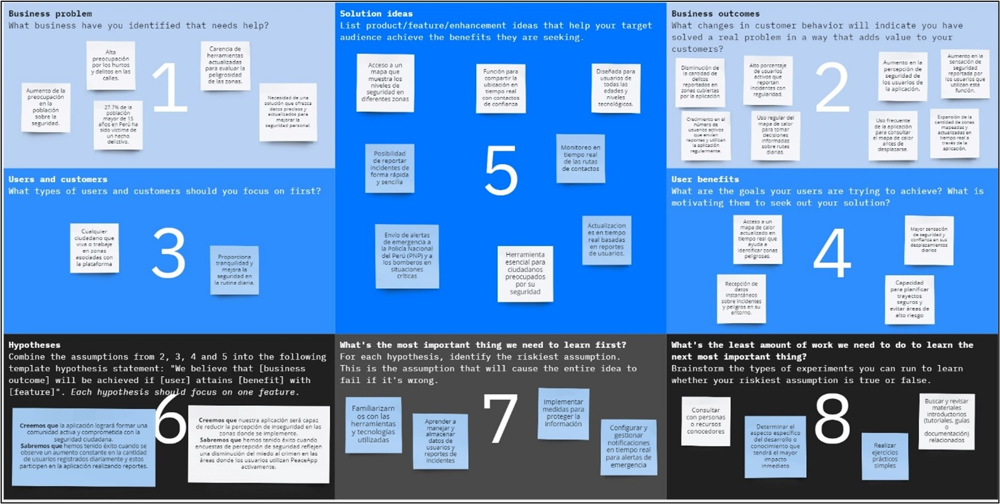

Enlace al esquema hecho en Miro: <https://tinyurl.com/ymmmjj7t>

## 1.3. Segmentos Objetivo

| **Variables** | **Ciudadanos preocupados por su seguridad en espacios públicos** | **Municipalidades enfocadas en la seguridad ciudadana**                                                                                                                                                                                                                                                                   |
|--------------|------------------------------------------------------------------|---------------------------------------------------------------------------------------------------------------------------------------------------------------------------------------------------------------------------------------------------------------------------------------------------------------------------|
| **Geográfica** | - Ubicación: Lima Metropolitana, con especial enfoque en zonas con altos índices de delincuencia y tráfico peatonal. - Alcance: Barrios y distritos urbanos dentro de Lima Metropolitana. | - Ubicacion: Distritos de Lima Metropolitana, especialmente aquellos con alta intensidad poblacion y problemas de seguridad. - Alcance: Jurisdicción distrital como zonas urbanas, parques, avenidas principales y espacios públicos.                                                                                  |
| **Demográfica** | - Edad: Adultos jóvenes y mayores (18-65 años). - Género: Hombres y mujeres. - Nivel socioeconómico: C1, C2 y C3, quienes suelen transitar por las calles de Lima para trabajo, estudio o actividades personales. - Ocupación: Estudiantes, profesionales, trabajadores informales, y amas de casa. | - Entidad: Gobiernos locales - Tamaño: Municipalidades con recursos limitados a moderados, dependiendo del distrito. - Personal clave: Gerentes de seguridad ciudadana, alcaldes, jefes de serenazgo y equipos técnicos.                                                                                            |
| **Psicológica** | - Actitudes y valores: Personas preocupadas por su seguridad personal y la de sus seres queridos, con alta sensibilidad a temas de delincuencia y seguridad. - Motivaciones: Buscan tranquilidad al transitar por la ciudad, desean estar informados sobre situaciones de riesgo y prefieren tomar decisiones basadas en información confiable. - Estilo de vida: Ciudadanos activos que suelen desplazarse frecuentemente por la ciudad. | - Actitudes y valores: Enfoque en mejorar la seguridad la seguridad, reducir la percepcion de inseguridad y optimizar la gestión pública.  - Motivaciones: Reducir incidentes delictivos, mejorar indicadores de gestión y fortalecer la confianza ciudadana.                                                          |
| **Función de comportamiento** | - Necesidades: Acceso a información en tiempo real sobre la seguridad en su entorno inmediato. - Comportamiento de compra/uso: Uso frecuente de aplicaciones móviles para obtener información y comunicación, propensos a adoptar nuevas tecnologías que mejoren su seguridad. - Lealtad: Usuarios que buscan plataformas confiables y colaborativas que les permitan contribuir a la seguridad comunitaria. | - Necesidades: Herramientas para monitoreo en tiempo real, gestión de incidentes, análisis de datos y toma de decisiones estratégicas.  - Comportamiento de adopción: valuación formal de soluciones tecnológicas, procesos de contratación pública y validación por áreas técnicas y administrativas.  - Lealtad: Preferencia por soluciones confiables, escalables y con soporte técnico continuo, que demuestren impacto medible en la seguridad ciudadana. |

---

# Capítulo II: Requirements Elicitation & Analysis

## 2.1. Competidores
En esta sección se identifican los principales competidores, tanto directos como indirectos, con modelos de negocio digitales similares o parcialmente comparables. Se han seleccionado tres referentes relevantes en el ámbito de aplicaciones de seguridad ciudadana y participación comunitaria.

| **Competidor** | **Modelo y características principales** | **Diferencias con PeaceApp** | **Limitaciones** |
|----------------|------------------------------------------|-------------------------------|-------------------|
| 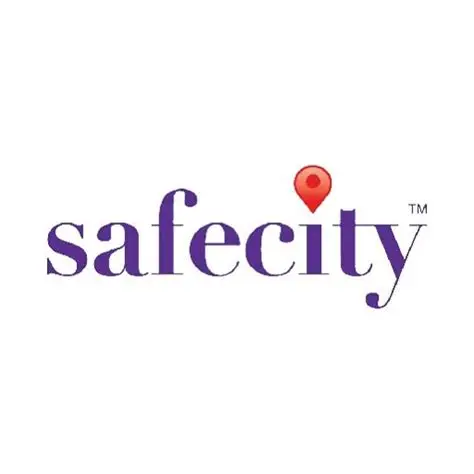   **SafeCity** | Plataforma digital enfocada en reportes anónimos de acoso. Usa los datos para generar mapas de seguridad e impulsa campañas con ONG. | Especialización en acoso; análisis de datos más profundo para educación y políticas públicas. | Enfoque específico que reduce utilidad general; cobertura restringida a pocas ciudades. |
|    **Nextdoor** | Red social de vecindarios con foros comunitarios, alertas de seguridad y grupos privados por ubicación. | Mayor enfoque en interacción social y comunitaria; presencia internacional amplia. | No es una app exclusiva de seguridad; riesgos de privacidad por su carácter social. |
|    **Waze** | Aplicación de navegación que permite reportar accidentes, peligros y tráfico en tiempo real. Gran base de usuarios. | Orientada a conductores y movilidad; no diseñada para prevención del delito ni seguridad personal. | Reportes poco detallados para seguridad ciudadana; no cubre incidentes fuera de la vía pública. |

### 2.1.1. Análisis Competitivo

<table>
<thead>
<tr>
<th colspan="6"><strong>Competitive Analysis Landscape</strong></th>
</tr>
</thead>
<tbody>
<tr>
<td colspan="6"><em>¿Por qué llevar a cabo este análisis?</em> Para conocer a nuestros competidores, sus estrategias y aprender de ellos para fortalecer la propuesta de PeaceApp.</td>
</tr>
<tr>
<td colspan="2">Empresas (Aplicación)</td>
<td> <strong>SafeCity</strong></td>
<td> <strong>Nextdoor</strong></td>
<td> <strong>Waze</strong></td>
<td> <strong>PeaceApp</strong></td>
</tr>

<!-- PERFIL -->
<tr>
<td rowspan="2"><strong>Perfil</strong></td>
<td>Overview</td>
<td>Aplicación para reportar incidentes de acoso y violencia. Genera mapas de calor y colabora con ONG para concienciación.</td>
<td>Red social privada de vecindarios. Permite discutir temas locales, reportar incidentes y organizar eventos.</td>
<td>Aplicación de navegación GPS con reportes en tiempo real de tráfico, accidentes y peligros.</td>
<td>Aplicación móvil enfocada en la seguridad ciudadana en Lima Metropolitana, con reportes en tiempo real de incidentes.</td>
</tr>
<tr>
<td>Ventaja competitiva / ¿Qué valor ofrece?</td>
<td>Reportes anónimos, seguridad y prevención. Empodera a víctimas al darles una voz en un entorno seguro.</td>
<td>Conexión comunitaria y recursos locales. Refuerza la interacción vecinal.</td>
<td>Eficiencia en desplazamientos y seguridad al conducir. Comunidad activa de conductores.</td>
<td>Seguridad en tiempo real, colaboración ciudadana, accesibilidad y empoderamiento comunitario.</td>
</tr>

<!-- PERFIL DE MARKETING -->
<tr>
<td rowspan="2"><strong>Perfil de Marketing</strong></td>
<td>Mercado objetivo</td>
<td>Mujeres en áreas urbanas donde el acoso es más prevalente.</td>
<td>Adultos propietarios y residentes de vecindarios urbanos/suburbanos.</td>
<td>Conductores en ciudades grandes con problemas de tráfico.</td>
<td>Ciudadanos de Lima Metropolitana preocupados por su seguridad personal.</td>
</tr>
<tr>
<td>Estrategias de marketing</td>
<td>Campañas de concienciación con ONG y publicidad digital.</td>
<td>Publicidad en redes sociales y colaboraciones con asociaciones vecinales.</td>
<td>Alianzas con empresas automotrices y publicidad geolocalizada.</td>
<td>Campañas de sensibilización, publicidad digital y colaboración con comunidades locales.</td>
</tr>

<!-- PERFIL DE PRODUCTO -->
<tr>
<td rowspan="3"><strong>Perfil de Producto</strong></td>
<td>Productos & Servicios</td>
<td>App móvil de reportes de acoso + plataforma de datos para ONG y gobiernos.</td>
<td>Red social vecinal con foros, anuncios y alertas de seguridad.</td>
<td>App GPS con navegación, reportes de tráfico y alertas de carretera.</td>
<td>App móvil y web con reportes ciudadanos, alertas de seguridad y mapas interactivos.</td>
</tr>
<tr>
<td>Precios & Costos</td>
<td>Modelo freemium. Gratis para usuarios; servicios premium para ONG/gobiernos.</td>
<td>Gratuito para usuarios. Ingresos por publicidad de negocios locales.</td>
<td>Gratis para usuarios. Ingresos por publicidad geolocalizada.</td>
<td>Modelo freemium: gratis para usuarios; premium con análisis avanzados y reportes para organizaciones.</td>
</tr>
<tr>
<td>Canales de distribución</td>
<td>App móvil (iOS/Android) + plataforma web.</td>
<td>App móvil (iOS/Android) + web.</td>
<td>App móvil (iOS/Android) + web.</td>
<td>App móvil (iOS/Android) + web con mapas interactivos.</td>
</tr>

<!-- SWOT -->
<tr>
<td rowspan="4"><strong>Análisis SWOT</strong></td>
<td>Fortalezas</td>
<td>Reportes anónimos, impacto social y alianzas con ONG.</td>
<td>Red social hiperlocal, gran base de usuarios y diversidad de servicios.</td>
<td>Navegación en tiempo real, comunidad activa e integración con servicios externos.</td>
<td>Enfoque en seguridad urbana de Lima, colaboración ciudadana y facilidad de uso.</td>
</tr>
<tr>
<td>Debilidades</td>
<td>Dependencia del usuario y cobertura limitada.</td>
<td>Problemas de privacidad y alto nivel de competencia con otras apps.</td>
<td>Dependencia de usuarios, consumo alto de datos y monetización limitada.</td>
<td>Cobertura inicial solo en Lima y dependencia de participación ciudadana.</td>
</tr>
<tr>
<td>Oportunidades</td>
<td>Expansión geográfica y mayor integración con otras plataformas.</td>
<td>Creciente demanda de comunidades locales y alianzas con negocios.</td>
<td>Integración con gobiernos y mayor personalización de rutas.</td>
<td>Expansión a otras ciudades, alianzas con gobiernos y ONGs, creciente demanda de apps de seguridad.</td>
</tr>
<tr>
<td>Amenazas</td>
<td>Competencia creciente y cambios en regulaciones de datos.</td>
<td>Cambios en privacidad y saturación de mercado.</td>
<td>Competencia de Google Maps/Apple Maps y problemas de privacidad.</td>
<td>Competencia de apps similares y cambios regulatorios en datos.</td>
</tr>
</tbody>
</table>

### 2.1.2. Estrategias y tácticas frente a competidores
En base al análisis competitivo (SWOT) realizado, se definen las siguientes estrategias y tácticas que permitirán a PeaceApp diferenciarse, aprovechar las oportunidades del mercado y enfrentar las amenazas de la competencia:

1. **Diferenciación por Especialización Local**  
   - **Estrategia:** Aprovechar la debilidad de SafeCity y Nextdoor en cuanto a cobertura geográfica y focalizar a PeaceApp en Lima Metropolitana, ofreciendo un conocimiento profundo de la dinámica local de seguridad.  
   - **Táctica:** Desarrollar campañas de comunicación que resalten el enfoque exclusivo en Lima y establecer alianzas con autoridades municipales y juntas vecinales.  

2. **Fomento de la Participación Ciudadana**  
   - **Estrategia:** Contrarrestar la dependencia de competidores como Waze y SafeCity en el volumen de usuarios, incentivando la participación activa en la plataforma.  
   - **Táctica:** Implementar un sistema de recompensas (insignias digitales, beneficios o reconocimientos) para usuarios frecuentes que reporten incidentes o validen información.  

3. **Alianzas Estratégicas para Credibilidad**  
   - **Estrategia:** Responder a las fortalezas de SafeCity (ONGs) y Nextdoor (comunidad) estableciendo convenios con ONGs, organizaciones locales y fuerzas del orden que refuercen la confianza en la app.  
   - **Táctica:** Integrar PeaceApp en programas de seguridad ciudadana y firmar acuerdos que garanticen flujo de datos bidireccional con autoridades y comunidades.  

4. **Expansión Geográfica Controlada**  
   - **Estrategia:** Frente a la amenaza de apps internacionales (Waze, Nextdoor), planificar una expansión progresiva hacia ciudades peruanas con mayor incidencia delictiva, consolidando primero el éxito en Lima.  
   - **Táctica:** Realizar estudios de mercado por ciudad, priorizando aquellas con altos índices de criminalidad, y adaptar la estrategia de marketing a su realidad local.  

5. **Innovación en Funcionalidades Diferenciadas**  
   - **Estrategia:** Superar la falta de enfoque en seguridad de Waze y Nextdoor incorporando funciones exclusivas que aumenten el valor para los usuarios.  
   - **Táctica:** Desarrollar características como alertas personalizadas, integración con transporte público, mapas predictivos de riesgo y un botón de pánico conectado directamente con las autoridades.  
## 2.2. Entrevistas

El objetivo realizar las entrevistas es para poder comprender las preocupaciones, necesidades y expectativas de nuestro segmento objetivo, en este caso los ciudadanos preocupados por su seguridad en espacios públicos, en relación con su seguridad en espacios públicos. La información recolectada guiará el desarrollo de funcionalidades clave en la aplicación móvil, buscando mejorar la seguridad y tranquilidad de los usuarios en su entorno.

### 2.2.1. Diseño de entrevistas

Para la primera parte necesitaremos algunos de sus datos personales:
Nombres y Apellidos, edad, pasatiempos y ocupación

**Segmento Objetivo: Ciudadanos preocupados por su seguridad en espacios
públicos**

1.  ¿Puede describir alguna situación reciente en un espacio público donde se haya sentido inseguro o preocupado por su seguridad?

Objetivo: Captar experiencias personales y contextos específicos que
generan inseguridad.

2.  ¿Qué medidas toma actualmente para sentirse más seguro cuando se encuentra en espacios públicos?

Objetivo: Conocer las prácticas o herramientas que ya utilizan para protegerse.

3.  ¿Qué aspectos de los espacios públicos (iluminación, vigilancia, presencia policial, etc.) le generan mayor preocupación en términos de seguridad?

Objetivo: Identificar factores específicos que afectan la percepción de seguridad.

4.  ¿Cómo reaccionaría si fuera testigo o víctima de una situación peligrosa en un espacio público?

Objetivo: Comprender las respuestas típicas de los ciudadanos ante situaciones de inseguridad.

5.  ¿Qué tipo de información o alertas le gustaría recibir a través de una aplicación móvil para mejorar su seguridad en espacios públicos?

Objetivo: Definir las funcionalidades más valiosas para los usuarios.

6.  ¿Qué tan cómodo se siente utilizando aplicaciones móviles para reportar incidentes de seguridad o recibir alertas?

Objetivo: Evaluar el nivel de comodidad y experiencia con tecnologías de seguridad.

7.  ¿Ha utilizado alguna vez una aplicación móvil enfocada en la seguridad ciudadana? Si es así, ¿qué le gustó o no le gustó de esa experiencia?

Objetivo: Identificar experiencias previas y posibles mejoras.

8.  ¿Considera útil la posibilidad de compartir su ubicación en tiempo real con familiares o amigos cuando se encuentra en un espacio público?

Objetivo: Evaluar el interés en funciones de seguridad basadas en la ubicación.

9.  ¿Qué otras características o herramientas le gustarían que una aplicación móvil incluyera para ayudarle a sentirse más seguro en espacios públicos?

Objetivo: Recopilar ideas adicionales para funcionalidades en la aplicación.

10. ¿Qué aspectos de una aplicación móvil de seguridad le harían sentir más confiado en su uso regular? (Ej.: facilidad de uso, protección de datos, confiabilidad, etc.)

Objetivo: Identificar los requisitos esenciales para que la aplicación sea adoptada ampliamente.

**Segmento Objetivo: Gestores y Operadores de Seguridad Municipal**

1. ¿Cómo es el proceso actual que sigue la municipalidad desde que un ciudadano reporta una emergencia hasta que se despliega una unidad de serenazgo al lugar?

Objetivo: Mapear el flujo operativo actual e identificar cuellos de botella o demoras en la cadena de respuesta a incidentes.

2. ¿Qué herramientas tecnológicas, software o sistemas de comunicación utilizan actualmente en su central de monitoreo para gestionar la seguridad del distrito?

Objetivo: Conocer la infraestructura tecnológica existente para evaluar el nivel de digitalización y posibles necesidades de integración.

3. ¿De qué manera gestionan o filtran actualmente las llamadas falsas o reportes inexactos, y qué impacto económico u operativo tienen en sus recursos?
 
Objetivo: Identificar el costo y la frustración que generan las falsas alarmas para justificar la implementación de filtros inteligentes o validación mediante evidencias.

4. ¿Qué tan valioso sería para su equipo de operaciones recibir reportes ciudadanos que incluyan evidencia multimedia (fotos, videos o audios) de manera estructurada y en tiempo real?
Objetivo: Validar la necesidad y utilidad de la carga de archivos multimedia en la plataforma para agilizar la toma de decisiones y priorización del riesgo.

5. ¿Cómo elaboran y con qué frecuencia actualizan actualmente los mapas del delito, mapas de calor o zonas de riesgo de su distrito?

Objetivo: Descubrir cómo manejan la analítica táctica hoy en día y justificar el valor de un "Dashboard" con mapas predictivos e interactivos en tiempo real.

6. ¿Cómo se comunican o comparten información táctica sobre incidentes con la Policía Nacional (PNP) o con las municipalidades de distritos colindantes?

Objetivo: Evaluar el nivel de interoperabilidad actual y la necesidad de una plataforma centralizada que permita compartir reportes y alertas entre entidades.

7. Si la municipalidad evaluara contratar una nueva plataforma tecnológica de seguridad ciudadana, ¿qué métricas, reportes o indicadores clave (KPIs) necesitaría que el sistema le genere automáticamente?

Objetivo: Definir los requisitos funcionales de los reportes administrativos para asegurar que la plataforma demuestre su valor y justifique la inversión (ROI).

8. ¿Cómo informan actualmente a los vecinos de manera rápida sobre alertas de peligro inminente, cierre de calles por accidentes o resultados de operativos exitosos?

Objetivo: Explorar la viabilidad de utilizar la plataforma como un canal de comunicación oficial y bidireccional entre la municipalidad y la comunidad.

9. ¿Cuáles considera que serían las principales barreras (técnicas, de edad, o de costumbre) para que el personal de monitoreo y los serenos en calle aprendan a usar un nuevo sistema informático?

Objetivo: Identificar los retos de adopción y capacitación para diseñar una interfaz de usuario (UI/UX) lo más intuitiva y simplificada posible.

10. ¿Qué requerimientos de privacidad, seguridad de datos y aislamiento de información (multitenancy) son indispensables para que la municipalidad apruebe el uso de un software en la nube?

Objetivo: Conocer las restricciones legales y técnicas obligatorias en el sector público para el manejo de datos de ciudadanos y reportes de seguridad.

### 2.2.2. Registro de entrevistas

**Segmento: Ciudadano**

**URL de las entrevistas:** https://drive.google.com/drive/folders/1FgvKursJUJVBZ7pQd1PT35ZcSaMzPoaR?usp=sharing

**Entrevista N°1:**

**Timing:** 

**Nombre:** Mauricio Rojas

**Edad:** 22 años

**Pasatiempos:** Salir con amigos y con mascotas.

**Ocupación:** Estudiante Universitario (Ingeniería de Software)

Mauricio se siente inseguro en zonas congestionadas cerca de su universidad, especialmente después de presenciar un robo que generó tensión entre los transeúntes. Para protegerse, se mantiene cauteloso y evita zonas peligrosas cuando es posible, prestando atención a su
entorno. La falta de iluminación y vigilancia en las calles aumenta su sensación de inseguridad. Ante un incidente, su reacción sería grabarlo y difundirlo para garantizar que se realice una denuncia. Aunque no ha usado aplicaciones de seguridad ciudadana, le ustaría recibir alertas sobre zonas peligrosas y se siente cómodo usando tecnología para mantenerse informado. Considera útil compartir su ubicación en zonas desconocidas y valora la inclusión de foros en una app donde los usuarios puedan compartir experiencias. También le interesa que la aplicación sea confiable, especialmente en la protección de  datos y en la actualización de información basada en los reportes de los usuarios.

**Entrevista N° 2:**

**Timing:**

Nombre: Edson Sanchez

Edad: 20 años

Pasatiempos: Salir con amigos y jugar fútbol.

Ocupación: Estudiante Universitario (Psicología)

El entrevistado se siente inseguro en espacios públicos, especialmente cerca de su casa a altas horas de la noche, que a pesar de que no le haya ocurrido nada siente algo de miedo. Le preocupa la falta de vigilancia y la iluminación deficiente en estos lugares. Ante situaciones peligrosas, prefiere evitar problemas para salvaguardar su seguridad. Valora recibir alertas sobre robos o zonas peligrosas a través de una aplicación móvil, aunque no ha usado una app de seguridad antes, conoce su potencial y está interesado en funciones como alarmas y mapas de riesgo. Además, considera útil compartir su ubicación en tiempo real en caso de riesgo o llamar a las autoridades.

**Entrevista N° 3:**

**Timing:** 13:46

**Nombre**: Maria Paula Rojas

**Edad:** 19 años

**Pasatiempos:** Dibujar, ver series animadas, cantar, estudiar educacion especial.

**Ocupación:** Estudiante universitaria (Educacion Infantil)

Maria Paula Rojas, una joven de 19 años que estudia Educación Infantil y disfruta de dibujar, ver series animadas, cantar y aprender sobre educación especial, participó en una conversación centrada en la seguridad y el uso de aplicaciones móviles. Durante la entrevista, se discutió la importancia de implementar herramientas tecnológicas para mejorar la seguridad en espacios públicos, incluyendo el desarrollo de una app que permita reportar y rastrear incidentes. También se habló sobre el potencial uso de tecnología para detectar y localizar robots, y se compararon algunas funciones con las que ofrecen dispositivos como los de Apple. La charla reflejó un claro interés en crear soluciones innovadoras que contribuyan a la protección de las personas en su entorno cotidiano.

**Segmento: Municipalidad**

**Entrevista N°1:**

**Timing:** 7:42

**Nombre:** Mauricio Paucar

**Edad:** 27 años

**Pasatiempos:** Salir con amigos y con mascotas.

**Ocupación:** Coordinador de Operaciones de Seguridad Ciudadana Municipal

Mauricio trabaja como Coordinador de Operaciones de Seguridad Ciudadana Municipal. Actualmente, la gestión de emergencias en la municipalidad depende de llamadas telefónicas, WhatsApp, radios y registros manuales, lo que genera retrasos cuando la información llega incompleta o poco clara. Utilizan cámaras CCTV, teléfonos y grupos de comunicación, pero los sistemas no están integrados ni automatizados. Uno de los principales problemas son las falsas alarmas, ya que no cuentan con mecanismos automáticos de validación, ocasionando pérdida de recursos y tiempo operativo. Considera muy útil una plataforma que permita recibir evidencia multimedia en tiempo real para validar incidentes y priorizar emergencias. Los mapas del delito se elaboran manualmente y la coordinación con la PNP y municipalidades vecinas se realiza principalmente mediante llamadas y WhatsApp. Considera importante que un nuevo sistema genere KPIs automáticos, mapas de calor y reportes operativos en tiempo real. También cree que la plataforma podría servir para informar rápidamente a los vecinos mediante alertas segmentadas. Identifica como principales barreras la resistencia al cambio y el bajo nivel de experiencia tecnológica de algunos operadores, por lo que el sistema debería ser intuitivo, rápido y fácil de usar. Además, considera indispensable garantizar privacidad, cifrado y control de accesos en la información de los ciudadanos.

### 2.2.3. Análisis de entrevistas

En base a las cinco entrevistas realizadas (N=5), se identificaron características objetivas y subjetivas comunes en los segmentos analizados. El perfil principal corresponde a **estudiantes universitarios jóvenes (20-22 años)** de Lima Metropolitana, con experiencias directas o indirectas de inseguridad ciudadana y alta disposición a usar tecnología para mejorar su seguridad.

#### Características Objetivas
- **Edad:** El 100% tiene entre 20 y 22 años.  
- **Ocupación:** El 100% son estudiantes universitarios; el 20% combina estudios con trabajo formal.  
- **Pasatiempos:** El 80% disfruta actividades recreativas como salir con amigos, jugar videojuegos, practicar deporte o pasear con mascotas. El 20% mencionó la lectura como actividad principal.  

#### Características Subjetivas
- **Percepción de inseguridad:** El 100% manifestó sentirse inseguro en zonas con poca iluminación o sin vigilancia.  
- **Experiencias relacionadas:**  
  - 60% ha presenciado robos o situaciones de riesgo (Mauricio, Marcia, Fernanda).  
  - 40% no ha sido víctima ni testigo directo, pero perciben alto riesgo en su entorno (Edson, Jefferson).  
- **Reacciones ante incidentes:**  
  - 60% ayudaría a la víctima (auxilio, prestar celular, bloquear dispositivos).  
  - 20% grabaría o difundiría el hecho.  
  - 20% evitaría involucrarse y priorizaría su seguridad.  
- **Uso de tecnología y disposición a apps:** El 100% no ha usado aplicaciones de seguridad ciudadana, pero el 100% estaría dispuesto a utilizarlas si son intuitivas y confiables.  
- **Funcionalidades valoradas:**  
  - 100% valora recibir **alertas sobre zonas peligrosas**.  
  - 100% considera útil **compartir ubicación en tiempo real**.  
  - 60% destacó la importancia de un **botón de emergencia o contacto directo con autoridades**.  
  - 40% valoró la inclusión de **foros o espacios comunitarios**.  
- **Confianza y datos:** El 100% enfatizó la necesidad de protección de datos personales y actualización constante de la información.  

#### Conclusión
El segmento entrevistado muestra un patrón homogéneo: **jóvenes universitarios urbanos, conscientes de la inseguridad en espacios públicos, especialmente en zonas mal iluminadas, con experiencias cercanas de riesgo y una clara disposición a usar soluciones tecnológicas**. Para ellos, PeaceApp debe priorizar **alertas en tiempo real, ubicación compartida, contacto con autoridades y seguridad en el manejo de datos**. Estas características son la base para construir arquetipos de usuario sólidos y orientar las decisiones de diseño, usabilidad y marketing de la aplicación.

## 2.3. Needfinding

### 2.3.1. User Personas

En esta sección se presenta el User Persona que representa el segmento del proyecto. Este perfil permite comprender en profundidad las necesidades, motivaciones, frustraciones y comportamientos del usuario potencial del sistema, el cual busca mejorar la seguridad en la vía pública del país.

Usuario
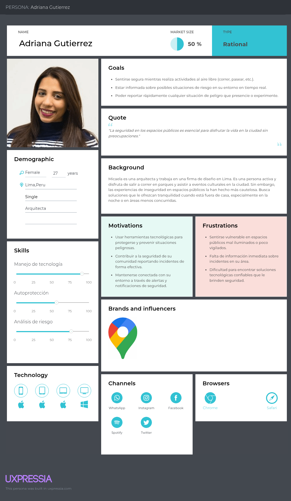
Usuario-Municipalidad
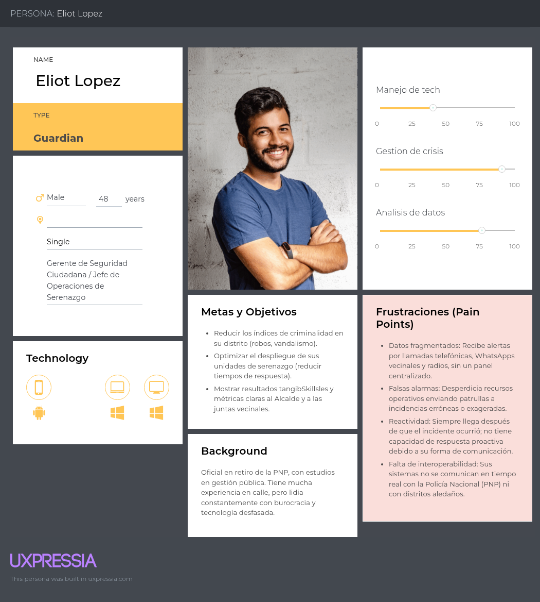
### 2.3.2. User Task Matrix

**Ciudadanos preocupados por su seguridad en espacios públicos**  
¿
| **Tarea** | **Frecuencia / Importancia** |
|-----------|-------------------------------|
| Consultar a familiares o amigos sobre la seguridad de una zona antes de visitarla | Siempre / Alta |
| Buscar en Internet o en redes sociales noticias sobre incidentes en su área | A veces / Media |
| Evitar salir en horarios o lugares que son conocidos como peligrosos | Siempre / Alta |
| Llamar a la policía o a servicios de emergencia en caso de sentirse en peligro | Casi nunca / Alta |
| Organizarse con vecinos para mejorar la seguridad en la comunidad | Nunca / Media |
| Usar aplicaciones de mapas para evitar zonas peligrosas conocidas | Nunca / Media |
| Llevar consigo objetos de autodefensa personal | Nunca / Media |

---

## Análisis  

Adriana centra sus actividades en **mantenerse informada y protegida en espacios públicos**.  
La consulta constante con familiares, redes sociales e Internet, así como la decisión de evitar salir en horarios peligrosos, son sus **acciones prioritarias**, ya que le permiten anticipar riesgos y tomar decisiones seguras.  

Aunque **llamar a la policía o servicios de emergencia** es una acción poco frecuente, tiene una **alta importancia** por su carácter crítico en situaciones de peligro real.  
 
En resumen, la experiencia de Adriana está fuertemente orientada hacia la **prevención informada y la anticipación de riesgos**, lo que evidencia la necesidad de soluciones que le brinden **alertas confiables, comunicación ágil y herramientas tecnológicas de protección personal**.

### 2.3.3. Empathy Mapping
Sector Ciudadano

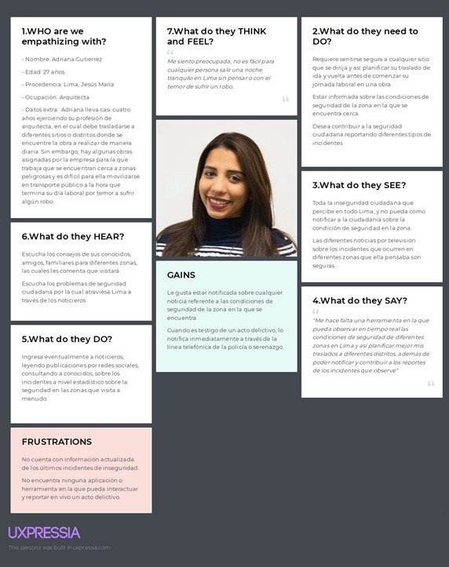

Sector Municipalidad

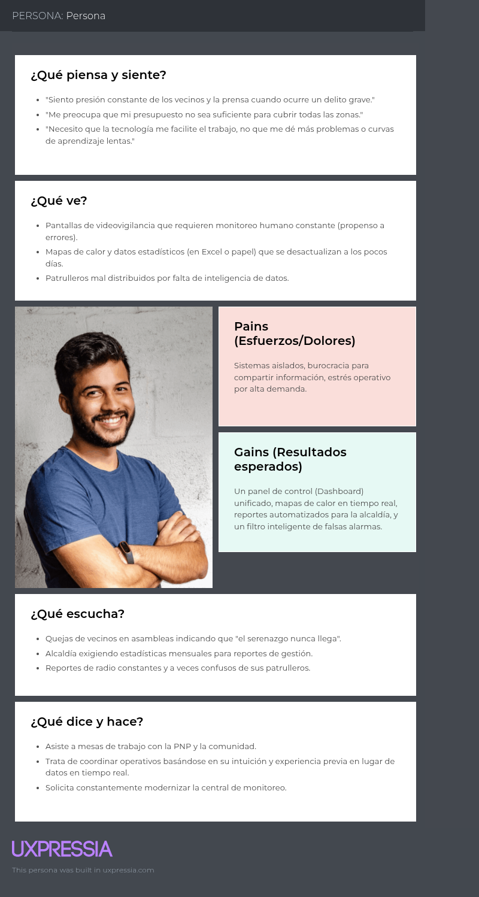

#### 2.3.4. As-is Scenario Mapping
Sector Ciudadano

Sector Municipalidad

Identificación de oportunidades

Pain Points (aspectos negativos)
1. Información fragmentada y no centralizada  
2. Falta de datos en tiempo real  
3. Procesos manuales y lentos  
4. Baja interacción directa con ciudadanos  
5. Decisiones reactivas, no predictivas  

Áreas positivas
1. Existencia de equipos de serenazgo y monitoreo  
2. Voluntad institucional de mejorar la seguridad  
3. Uso básico de tecnología (cámaras, reportes)  

Blank Areas (oportunidades de aprendizaje)
1. ¿Qué tan rápido responde la PNP ante alertas municipales?  
2. ¿Qué sistemas usan actualmente (software interno)?  
3. ¿Qué nivel de interoperabilidad tienen con otras entidades?  
4. ¿Cómo miden realmente el impacto de sus acciones?  

#### 2.4. Ubiquitous Language 
1. **Zone (Zona)**  
Área geográfica específica dentro de una ciudad donde se evalúa la seguridad en función de los incidentes reportados.

2. **Risk Level (Nivel de Riesgo)**  
Nivel de peligrosidad asignado a una zona según la frecuencia y gravedad de los incidentes registrados.

3. **Incident (Incidente)**  
Evento relacionado con la seguridad ciudadana que ocurre en una zona y afecta a uno o más ciudadanos.

4. **Report (Reporte)**  
Registro de un incidente realizado por un usuario, que puede incluir una descripción detallada y evidencia.

5. **Evidence (Evidencia)**  
Contenido que respalda un reporte, como imágenes, audios o videos.

6. **Alert (Alerta)**  
Notificación generada ante la ocurrencia o posible riesgo de un incidente en una zona.

7. **Emergency Alert (Alerta de Emergencia)**  
Notificación emitida ante una situación de peligro inmediato que requiere atención urgente.

8. **Safe Route (Ruta Segura)**  
Trayecto recomendado que minimiza la exposición a zonas con alto nivel de riesgo.

9. **Community (Comunidad)**  
Conjunto de usuarios que colaboran reportando incidentes y compartiendo información sobre seguridad.

10. **Administrator or Municipality (Administrador o Municipalidad)**  
Entidad responsable de validar los reportes y supervisar la información del sistema.

11. **Coverage Area (Área de Cobertura)**  
Región geográfica donde se gestionan y monitorean los incidentes.

---

# Capítulo III: Requirements Specification
## 3.1. To-be Scenario Mapping

### Segmento 1: Ciudadano

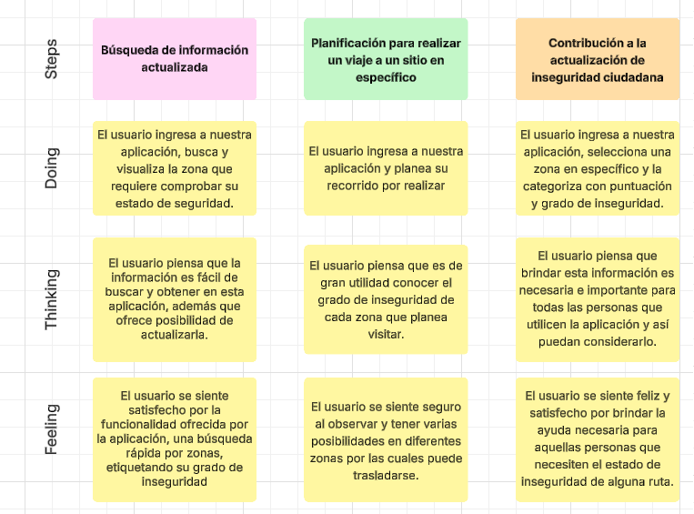

### Segmento 2: Municipalidad

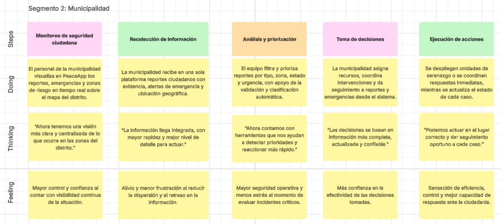

Enlace del To-Be Scenario Mapping: https://lucid.app/lucidchart/9c2329c4-fd90-4760-9ce3-d2e30cbe1b86/edit?viewport_loc=-433%2C56%2C1791%2C836%2C0_0&invitationId=inv_3a88d771-9c52-4f43-8aef-2c234eea78d6

## 3.2. User Stories
| User/Technical Story ID | Título | Descripción | Criterios de Aceptación | Relacionado con (Epic ID) |
|-------------------------|--------|-------------|--------------------------|----------------------------|
| EP01 | Interfaz de Usuario y Navegación | Como usuario, quiero interactuar con una interfaz clara y fácil de navegar, para acceder a las funciones de la aplicación sin complicaciones. | No corresponde. | No corresponde. |
| EP02 | Registro, Inicio de Sesión y Perfil | Como usuario, quiero poder registrarme, iniciar sesión y personalizar mi perfil, para gestionar mi cuenta y preferencias dentro de la aplicación. | No corresponde. | No corresponde. |
| EP03 | Mapa Interactivo y Reportes | Como usuario, quiero acceder a un mapa interactivo que muestre rutas seguras y zonas peligrosas, y poder enviar reportes de incidentes, para contribuir a la seguridad de mi comunidad. | No corresponde. | No corresponde. |
| EP04 | Diseño y Accesibilidad de la Landing Page | Como visitante de la landing page, quiero acceder a una página bien diseñada y fácil de navegar, para obtener rápidamente información sobre PeaceApp y cómo descargarla. | No corresponde. | No corresponde. |
| EP05 | Información y Contacto | Como visitante de la landing page, quiero encontrar información clara sobre los servicios y beneficios de la aplicación y tener la opción de contactar al equipo, para resolver cualquier duda o preocupación que tenga. | No corresponde. | No corresponde. |
| EP06 | Gestión Municipal de Incidentes | Como usuario municipal, quiero acceder a un sistema de gestión de reportes ciudadanos, para monitorear, priorizar y actuar ante incidentes de seguridad. | No corresponde. | No corresponde. |
| EP07 | Sistema de Emergencias en Tiempo Real | Como usuario, quiero poder enviar y recibir alertas de emergencia en tiempo real, para actuar rápidamente ante situaciones críticas. | No corresponde. | No corresponde. |
| EP08 | Asistencia Inteligente y Validación con IA | Como usuario, quiero contar con funcionalidades basadas en inteligencia artificial que me ayuden a consultar información de seguridad, crear reportes más fácilmente y validar evidencias, para mejorar la rapidez, confiabilidad y precisión del sistema. | No corresponde. | No corresponde. |
| US01 | Contactar con la Startup | Como visitante de la Landing Page, quiero encontrar un formulario de contacto funcional y accesible, para poder comunicarme con el startup. | Escenario 1: Enviar un mensaje a los desarrolladores Dado que el visitante tiene una consulta o comentario relacionado con la aplicación, Cuando redacte un mensaje para contactar a los desarrolladores, Entonces el sistema enviará el mensaje a la dirección de correo electrónico del startup. | EP05 |
| US02 | Navegar en la Landing Page | Como visitante de la Landing Page, quiero encontrar las secciones bien definidas para comprender fácilmente la información mostrada. | Escenario 1: Visualizar información Dado que el visitante está recorriendo la landing page, Cuando acceda a una sección de la landing page, Entonces podrá comprender la información, ya que, cada sección estará organizada.  Escenario 2: Navegación a través del menú principal Dado que el visitante está en la landing page, Cuando hace clic en una opción del menú principal (como "About Us", "Services", entre otros), Entonces es redirigido a la sección correspondiente y la información se muestra claramente. | EP04 |
| US03 | Diseño Responsivo | Como usuario, quiero que la aplicación se adapte bien a diferentes tamaños de pantalla, para poder usarla cómodamente en cualquier dispositivo, ya sea móvil, tablet o escritorio. | Escenario 1: Adaptación a dispositivos móviles Dado que el usuario accede a la aplicación desde un smartphone, Cuando la aplicación se carga en el dispositivo, Entonces la interfaz se ajusta automáticamente para proporcionar una experiencia de uso óptima en una pantalla pequeña.  Escenario 2: Adaptación a tablets Dado que el usuario accede a la aplicación desde una tablet, Cuando la aplicación se carga en el dispositivo, Entonces la interfaz muestra un diseño responsivo adecuado para la pantalla más grande, utilizando el espacio de manera eficiente. | EP01 |
| US04 | Registro de Usuarios | Como usuario, quiero poder registrarme en la aplicación, para acceder a las funcionalidades de PeaceApp. | Escenario 1: Registro exitoso Dado que el usuario ha completado todos los campos del formulario de registro, Cuando hace clic en "Crear cuenta", Entonces la cuenta se crea y el usuario accede a la aplicación.  Escenario 2: Registro incompleto Dado que el usuario intenta registrarse sin completar todos los campos obligatorios, Cuando hace clic en "Crear cuenta", Entonces el sistema muestra un mensaje de error indicando qué campos faltan por completar.  Escenario 3: Registro con credenciales ya utilizadas Dado que el usuario intenta registrarse utilizando un correo electrónico ya registrado en la base de datos, Cuando hace clic en "Crear cuenta", Entonces el sistema muestra un mensaje de error indicando que el correo electrónico ya está en uso y sugiere recuperar la contraseña. | EP02 |
| US05 | Iniciar Sesión | Como usuario registrado, quiero poder iniciar sesión con mi correo y contraseña, para acceder a mi cuenta. | Escenario 1: Inicio de sesión exitoso Dado que el usuario ha ingresado su correo y contraseña correctamente, Cuando hace clic en "Iniciar sesión", Entonces el usuario accede a su cuenta en la aplicación.  Escenario 2: Inicio de sesión con credenciales incorrectas Dado que el usuario ingresa un correo electrónico o contraseña incorrectos, Cuando hace clic en "Iniciar sesión", Entonces el sistema muestra un mensaje de error indicando que las credenciales son incorrectas. | EP02 |
| US06 | Generar Reporte de Incidentes | Como ciudadano, quiero generar reportes de incidentes de seguridad, para contribuir a la actualización del mapa de calor. | Escenario 1: Reporte exitoso Dado que el usuario ha presenciado un incidente, Cuando completa el formulario de reporte en la aplicación, Entonces el incidente se registra y el mapa de calor se actualiza.  Escenario 2: Reporte con datos incompletos Dado que el usuario intenta enviar un reporte sin completar toda la información requerida, Cuando hace clic en "Enviar reporte", Entonces el sistema muestra un mensaje de error indicando los campos faltantes.  Escenario 3: Cancelación del reporte Dado que el usuario ha comenzado a llenar un reporte de incidente, Cuando decide cancelar el envío antes de completar el formulario, Entonces el sistema le pregunta si está seguro de que desea cancelar y descartar los datos ingresados. | EP03 |
| US07 | Adjuntar Evidencia al Reporte | Como usuario, quiero poder adjuntar fotos o videos al reporte, para dar mayor credibilidad y detalle al incidente reportado. | Escenario 1: Adjuntar evidencia Dado que el usuario está completando un reporte, Cuando adjunta una foto o video desde su dispositivo, Entonces el reporte se envía con la evidencia adjunta.  Escenario 2: Error al subir evidencia Dado que el usuario intenta subir una imagen o video de gran tamaño que excede el límite permitido, Cuando hace clic en "Subir evidencia", Entonces el sistema muestra un mensaje de error indicando que el archivo es demasiado grande. | EP03 |
| US08 | Visualización de Reportes | Como ciudadano, quiero ver los reportes de otros usuarios sobre incidentes ocurridos en la zona, para estar al tanto de los eventos de seguridad. | Escenario 1: Visualización de reportes recientes Dado que el ciudadano está navegando por la aplicación, Cuando accede a la opción de "Ver reportes", Entonces la aplicación muestra los reportes más recientes en la zona del ciudadano.  Escenario 2: Visualización de reportes en el mapa Dado que el ciudadano está utilizando el mapa interactivo en la aplicación, Cuando activa la opción de mostrar reportes en el mapa, Entonces la aplicación superpone los reportes relevantes en el mapa, mostrando la ubicación exacta de cada incidente. | EP03 |
| US09 | Recibir Alertas de Zonas de Riesgo | Como ciudadano, quiero recibir alertas al acceso a una zona de alto riesgo, para tomar las precauciones necesarias. | Escenario 1: Alerta de riesgo mientras está en una zona peligrosa Dado que el ciudadano está caminando en una zona peligrosa según la aplicación, Cuando la aplicación detecta que el ciudadano está en esa zona, Entonces la aplicación envía una alerta al ciudadano. | EP03 |
| US10 | Compartir Ubicación con Contactos | Como usuario de la aplicación móvil, quiero poder compartir mi ubicación con mis contactos cercanos, para que puedan monitorear mi trayecto y estar alertas ante cualquier peligro. | Escenario 1: Compartir ubicación con éxito Dado que un usuario desea compartir su ubicación desde la aplicación móvil, Cuando activa la opción de compartir ubicación, Entonces los contactos seleccionados reciben la ubicación en tiempo real.  Escenario 2: Error al compartir ubicación Dado que un usuario intenta compartir su ubicación con sus contactos cercanos desde la aplicación móvil, Cuando la misma no puede acceder a la ubicación del usuario, Entonces se muestra un mensaje de error indicando que no se puede compartir la ubicación. | EP03 |
| US11 | Editar Información de Perfil | Como usuario, quiero poder editar mi información de perfil, para corregir o actualizar mis datos personales. | Escenario 1: Editar información de perfil exitosa Dado que el usuario está en la pantalla de edición de su perfil, Cuando el usuario actualiza su información personal y hace clic en el botón "Guardar cambios", Entonces la información actualizada debe guardarse correctamente y mostrarse en el perfil del usuario, con un mensaje de confirmación indicando que los cambios se realizaron con éxito.  Escenario 2: Error al guardar información de perfil Dado que el usuario está en la pantalla de edición de su perfil, Cuando el usuario intenta guardar los cambios con un campo obligatorio vacío o con un formato incorrecto, Entonces el sistema debe mostrar un mensaje de error indicando que la información no es válida, resaltando los campos que necesitan corrección y no debe guardar los cambios hasta que toda la información esté correctamente completada. | EP02 |
| US12 | Recuperar Contraseña | Como usuario, quiero poder recuperar mi contraseña si la olvido, para poder acceder nuevamente a mi cuenta. | Escenario 1: Edición exitosa Dado que el usuario accede a la configuración de su perfil, Cuando cambia la información deseada, Entonces la información se actualiza correctamente.  Escenario 2: Fallo en la edición de perfil Dado que el usuario intenta guardar los cambios en su perfil, Cuando hay un problema de conectividad o error del servidor, Entonces el sistema muestra un mensaje de error indicando que los cambios no se han podido guardar. | EP02 |
| US13 | Acceder a Mapa con Reportes | Como ciudadano, quiero poder ver un mapa interactivo con los reportes de incidentes en mi área, para tomar decisiones informadas sobre mi seguridad. | Escenario 1: Acceso al mapa con reportes Dado que el usuario está en la página principal de la aplicación, Cuando selecciona el mapa, Entonces se muestra un mapa interactivo con marcadores que representan los reportes de incidentes según su ubicación.  Escenario 2: Mapa sin reportes disponibles Dado que el usuario está en una zona sin reportes registrados, Cuando accede al mapa desde la aplicación, Entonces el sistema muestra el mapa sin marcadores y con un mensaje indicando que no hay reportes disponibles en la zona seleccionada. | EP03 |
| US14 | Acceder al Perfil de Usuario | Como usuario, quiero acceder a mi perfil desde el menú principal, para visualizar mi información personal y configuraciones. | Escenario 1: Usuario sin imagen de perfil Dado que el usuario ha iniciado sesión y accede a la sección "Perfil", Cuando no tiene una imagen de perfil configurada, Entonces el sistema muestra una imagen por defecto y la opción de subir una. Y puede visualizar su información ingresada en el sistema.  Escenario 2: Usuario con imagen de perfil Dado que el usuario ha iniciado sesión y accede a la sección "Perfil", Cuando ya tiene una imagen de perfil configurada, Entonces el sistema muestra la foto de perfil y le permite visualizar su información ingresada en el sistema. | EP02 |
| US15 | Filtrar Reportes | Como ciudadano, quiero poder filtrar los reportes para ver todos los reportes o solo los que yo he creado, para gestionar mejor la información relevante según mis intereses. | Escenario 1: Ver solo mis reportes Dado que el usuario está en la sección de reportes, Cuando selecciona la opción "Mis reportes", Entonces el sistema muestra únicamente los reportes generados por ese usuario.  Escenario 2: Ver todos los reportes Dado que el usuario está en la sección de reportes, Cuando selecciona la opción "Todos los reportes", Entonces el sistema muestra la lista completa de reportes disponibles en la base de datos. | EP03 |
| US16 | Buscar Ubicación en el Mapa | Como ciudadano, quiero poder explorar reportes de seguridad en diferentes zonas del mapa, para tomar decisiones informadas sobre mis desplazamientos. | Escenario 1: Buscar ubicación por dirección Dado que el usuario está en la sección de mapa, Cuando ingresa una dirección en el buscador, Entonces el mapa se centra en esa ubicación y muestra los reportes disponibles en esa zona.  Escenario 2: Mover el mapa manualmente Dado que el usuario está navegando el mapa, Cuando arrastra o aleja el mapa hacia otra zona, Entonces los reportes visibles se actualizan automáticamente según la nueva área mostrada. | EP03 |
| US17 | Cambiar Foto de Perfil | Como usuario, quiero poder subir y cambiar mi foto de perfil, para personalizar mi cuenta. | Escenario 1: Éxito al cambiar foto. Dado que el usuario está en "Editar Perfil", Cuando selecciona "Cambiar foto" y elige una imagen válida (JPG, PNG), Entonces la imagen se sube y se actualiza en el perfil y el menú de navegación.  Escenario 2: Archivo inválido. Dado que el usuario sube un archivo no compatible (ej. un PDF) o muy pesado (> 5MB), Entonces se muestra el mensaje "Formato de archivo no válido" o "Archivo demasiado grande". | EP02 |
| US18 | Notificación de Éxito al Reportar | Como usuario, quiero recibir una confirmación visual (mensaje "toast"), para saber que mi reporte se envió correctamente. | Escenario 1: Ver notificación. Dado que el usuario presiona "Enviar" en un formulario de reporte válido, Entonces el sistema oculta el formulario y muestra un mensaje "Reporte enviado con éxito" por 3 segundos. | EP03 |
| US19 | Manejo de Permisos de Ubicación | Como usuario, quiero que la app me pida permiso para usar mi ubicación, para entender por qué lo necesita. | Escenario 1: Aceptar permisos. Dado que el usuario abre el mapa por primera vez, Cuando la app solicita permisos de ubicación y el usuario acepta, Entonces el mapa se centra en su ubicación actual.  Escenario 2: Denegar permisos. Dado que el usuario deniega los permisos de ubicación, Entonces el mapa se muestra en una ubicación predeterminada con un mensaje indicando que la geolocalización está desactivada. | EP03 |
| US20 | Visualización de Contraseña | Como usuario, quiero un ícono de "mostrar/ocultar" contraseña, para verificar que la escribí bien al registrarme o iniciar sesión. | Escenario 1: Mostrar contraseña. Dado que el usuario escribe en el campo de contraseña, Cuando presiona el ícono "mostrar", Entonces los caracteres se vuelven visibles.  Escenario 2: Ocultar contraseña. Dado que la contraseña es visible, Cuando presiona el ícono "ocultar", Entonces los caracteres vuelven a enmascararse. | EP02 |
| US21 | Estado Vacío en "Mis Reportes" | Como usuario, si no he creado reportes, quiero ver un mensaje que me lo indique, para no ver una pantalla en blanco. | Escenario 1: Ver mensaje de estado vacío. Dado que el usuario ha iniciado sesión y navega a "Mis Reportes", Cuando no tiene reportes creados, Entonces el sistema muestra un mensaje "Aún no has creado reportes. ¡Anímate a reportar!". | EP03 |
| US22 | Notificación de Pérdida de Conexión | Como usuario, quiero ver un aviso si pierdo la conexión a internet, para saber por qué la app no funciona. | Escenario 1: Detectar pérdida de conexión. Dado que el usuario pierde conexión, Entonces se muestra un banner "Sin conexión. Reintentando...".  Escenario 2: Recuperar conexión. Dado que la conexión se restablece, Entonces el banner desaparece automáticamente. | EP01 |
| US23 | Centrar Mapa en mi Ubicación | Como usuario, quiero un botón para centrar el mapa en mi ubicación actual con un solo toque, para orientarme rápidamente. | Escenario 1: Centrar mapa. Dado que el usuario está navegando el mapa y presiona el botón "Mi Ubicación" (y los permisos están concedidos), Entonces el mapa se anima y centra la vista en su posición actual. | EP03 |
| US24 | Persistencia de Sesión | Como usuario registrado, quiero que mi sesión se mantenga iniciada en la app, para no tener que ingresar mis datos cada vez que la abro. | Escenario 1: Sesión persistente. Dado que el usuario inició sesión y cierra la aplicación, Cuando vuelve a abrirla, Entonces ya se encuentra en la pantalla principal (Home) con su sesión activa.  Escenario 2: Cerrar sesión manual. Dado que el usuario decide cerrar sesión, Cuando presiona "Cerrar Sesión", Entonces la sesión se cierra correctamente y se redirige al login. | EP02 |
| US25 | Ver Detalles Rápidos en Mapa | Como usuario, quiero tocar un pin en el mapa y ver un resumen del reporte, para decidir si quiero ver el detalle completo. | Escenario 1: Ver pop-up de reporte. Dado que el usuario está en el mapa, Cuando toca un marcador (pin) de incidente, Entonces se abre una pequeña tarjeta (pop-up) que muestra el título, tipo de incidente y un botón "Ver más". | EP03 |
| US26 | Compatibilidad Lector de Pantalla | Como usuario con discapacidad visual, quiero que la app sea compatible con lectores de pantalla (TalkBack/VoiceOver), para poder usarla. | Escenario 1: Navegación por voz. Dado que el usuario activa TalkBack/VoiceOver, Cuando toca botones, íconos y textos, Entonces el lector de pantalla anuncia la descripción y función de cada elemento (ej. "Botón, Reportar Incidente"). | EP01 |
| US27 | Texto y Contraste Legibles | Como usuario, quiero que el texto y los contrastes cumplan con estándares de accesibilidad, para leer sin dificultad. | Escenario 1: Contraste adecuado. Todos los textos sobre fondos tienen un ratio de contraste mínimo de 4.5:1.  Escenario 2: Texto escalable. Dado que el usuario aumenta el tamaño de fuente en su dispositivo, Entonces el texto en la app se ajusta sin romperse. | EP01 |
| US28 | CTA Claros en Landing Page | Como visitante de la Landing Page, quiero que los botones de descarga sean evidentes, para instalar la app. | Escenario 1: Visualizar botones de tienda. Dado que el visitante está en la Landing Page, Cuando carga la página, Entonces los botones "Descargar en App Store" y "Descargar en Google Play" son prominentes y fáciles de identificar en la sección principal. | EP04 |
| US29 | Indicadores de Carga (Loading) | Como usuario, quiero ver indicadores de carga (spinners/skeletons) al cargar el mapa o reportes, para saber que la app está trabajando. | Escenario 1: Carga de reportes. Dado que el usuario entra a la lista de reportes, Cuando los datos se están obteniendo del servidor, Entonces se muestran "tarjetas esqueleto" (placeholders).  Escenario 2: Carga del mapa. Dado que el usuario abre el mapa, Cuando los pines de incidentes se están cargando, Entonces se muestra un indicador de carga (spinner) en el centro. | EP01 |
| US30 | Mensaje Error de Formato de Archivo | Como usuario, al adjuntar evidencia, si el archivo es inválido, quiero un error claro, para saber qué corregir. | Escenario 1: Subir archivo no soportado. Dado que el usuario intenta adjuntar un archivo .zip al reporte, Cuando selecciona el archivo, Entonces el sistema muestra el mensaje "Error: Solo se permiten imágenes (JPG, PNG) o videos (MP4)". | EP03 |
| US31 | Acceso como Municipalidad | Como usuario municipal, quiero iniciar sesión con permisos diferenciados, para acceder a un panel administrativo. | Escenario 1: Inicio de sesión exitoso. Dado que el usuario municipal ingresa credenciales válidas, Cuando hace clic en "Iniciar sesión", Entonces accede al dashboard municipal.  Escenario 2: Acceso denegado. Dado que el usuario no tiene permisos municipales, Cuando intenta iniciar sesión, Entonces el sistema muestra un mensaje de error indicando acceso restringido. | EP06 |
| US32 | Visualizar Reportes en Dashboard | Como usuario municipal, quiero visualizar reportes en un dashboard con herramientas de gestión, para monitorear incidentes. | Escenario 1: Visualización de reportes. Dado que existen reportes en el sistema, Cuando el usuario accede al dashboard, Entonces se muestran en una lista y en el mapa.  Escenario 2: Sin reportes disponibles. Dado que no hay reportes registrados, Cuando el usuario accede al dashboard, Entonces se muestra un mensaje indicando que no hay reportes disponibles. | EP06 |
| US33 | Filtrar y Priorizar Reportes | Como usuario municipal, quiero filtrar reportes por tipo, zona, estado o prioridad, para gestionar mejor los incidentes. | Escenario 1: Filtrar por tipo. Dado que el usuario está en el dashboard, Cuando selecciona un tipo de incidente, Entonces el sistema muestra solo los reportes correspondientes.  Escenario 2: Filtrar por estado. Dado que el usuario selecciona un estado (pendiente, en proceso, resuelto), Cuando aplica el filtro, Entonces se actualiza la lista de reportes según el criterio seleccionado. | EP06 |
| US34 | Gestionar Estado de Reportes | Como usuario municipal, quiero cambiar el estado de un reporte (pendiente, en proceso, resuelto), para llevar control de atención. | Escenario 1: Cambio de estado exitoso. Dado que el usuario selecciona un reporte, Cuando cambia su estado, Entonces el sistema guarda el cambio correctamente.  Escenario 2: Error al actualizar. Dado que ocurre un problema en el sistema, Cuando el usuario intenta cambiar el estado, Entonces se muestra un mensaje de error y no se guarda el cambio. | EP06 |
| US35 | Ver Detalle Completo del Reporte | Como usuario municipal, quiero ver toda la información del reporte, incluyendo evidencia, para tomar decisiones informadas. | Escenario 1: Visualizar detalle completo. Dado que el usuario selecciona un reporte, Cuando accede a su detalle, Entonces se muestra la descripción, ubicación y evidencia adjunta.  Escenario 2: Reporte sin evidencia. Dado que el reporte no contiene archivos adjuntos, Cuando el usuario accede al detalle, Entonces el sistema muestra un mensaje indicando que no hay evidencia disponible. | EP06 |
| US36 | Recibir Emergencias en Tiempo Real | Como usuario municipal, quiero recibir y visualizar alertas de emergencia en tiempo real, para actuar rápidamente. | Escenario 1: Recepción de emergencia. Dado que un ciudadano envía una alerta de emergencia, Cuando el sistema la recibe, Entonces se muestra inmediatamente en el dashboard.  Escenario 2: Sin emergencias activas. Dado que no existen alertas activas, Cuando el usuario accede al sistema, Entonces no se muestran emergencias en pantalla. | EP07 |
| US37 | Botón de Emergencia | Como ciudadano, quiero tener un botón de emergencia visible y accesible en todo momento, para poder solicitar ayuda inmediata en situaciones críticas. | Escenario 1: Visualización del botón. Dado que el usuario está dentro de la aplicación, Cuando navega por cualquier sección principal, Entonces el botón de emergencia se muestra visible y accesible.  Escenario 2: Accesibilidad del botón. Dado que el usuario necesita ayuda urgente, Cuando presiona el botón de emergencia, Entonces el sistema responde inmediatamente sin retrasos. | EP07 |
| US38 | Enviar Alerta de Emergencia | Como ciudadano, quiero que al presionar el botón de emergencia se envíe automáticamente mi ubicación, para recibir ayuda de la municipalidad. | Escenario 1: Envío exitoso. Dado que el usuario presiona el botón de emergencia, Cuando el sistema obtiene la ubicación del usuario, Entonces se envía la alerta con coordenadas, usuario y fecha.  Escenario 2: Error de ubicación. Dado que el sistema no puede acceder a la ubicación, Cuando el usuario presiona el botón, Entonces se muestra un mensaje indicando que no se pudo enviar la ubicación. | EP07 |
| US39 | Confirmación de Envío de Emergencia | Como ciudadano, quiero recibir una confirmación visual al enviar una alerta de emergencia, para saber que mi solicitud fue procesada. | Escenario 1: Confirmación exitosa. Dado que la alerta fue enviada correctamente, Cuando el sistema procesa la solicitud, Entonces se muestra un mensaje como "Alerta enviada con éxito".  Escenario 2: Error en el envío. Dado que ocurre un fallo en el envío, Cuando el sistema no logra procesar la alerta, Entonces se muestra un mensaje de error indicando el problema. | EP07 |
| US40 | Ver Emergencias en Mapa | Como usuario municipal, quiero ver emergencias en el mapa con ubicación exacta, para ubicar rápidamente el incidente. | Escenario 1: Visualización en el mapa. Dado que existe una emergencia activa, Cuando el usuario visualiza el mapa, Entonces se muestra un marcador con la ubicación exacta.  Escenario 2: Emergencia sin ubicación. Dado que la alerta no tiene coordenadas válidas, Cuando se intenta mostrar en el mapa, Entonces no se renderiza el marcador. | EP07 |
| US41 | Gestionar Emergencias | Como usuario municipal, quiero marcar emergencias como atendidas, para llevar control de respuesta. | Escenario 1: Marcar emergencia como atendida. Dado que el usuario selecciona una emergencia, Cuando cambia su estado a "atendida", Entonces el sistema guarda el cambio correctamente.  Escenario 2: Error al actualizar estado. Dado que ocurre un fallo en el sistema, Cuando el usuario intenta actualizar la emergencia, Entonces se muestra un mensaje de error. | EP07 |
| US42 | Consultar nivel de seguridad mediante Chatbot | Como ciudadano, quiero preguntarle al chatbot en lenguaje natural sobre la seguridad de una zona específica, para obtener un resumen rápido de los incidentes recientes sin tener que buscar manualmente en el mapa. | Escenario 1: Consulta exitosa sobre una zona Dado que el usuario se encuentra dentro de la aplicación Y existe información reciente de incidentes en una zona registrada, Cuando el usuario escribe al chatbot una consulta sobre la seguridad de una zona específica, Entonces el sistema procesa la consulta y muestra un resumen con el nivel de seguridad de la zona y los incidentes recientes asociados.  Escenario 2: Zona sin información disponible Dado que el usuario consulta una zona para la cual no existen reportes recientes, Cuando el chatbot procesa la solicitud, Entonces el sistema muestra un mensaje indicando que no hay suficiente información reciente para evaluar esa zona.  Escenario 3: Consulta ambigua Dado que el usuario ingresa una consulta incompleta o ambigua, Cuando el chatbot no logra identificar la zona solicitada, Entonces el sistema solicita al usuario más detalle para completar la consulta. | EP08 |
| US43 | Asistencia del Chatbot para crear reportes | Como usuario en situación de estrés, quiero dictarle o escribirle al chatbot lo que acaba de pasar, para que el sistema llene el formulario de reporte de incidente automáticamente por mí. | Escenario 1: Generación automática de reporte desde texto Dado que el usuario se encuentra en la sección de reportes, Cuando escribe o dicta al chatbot una descripción de lo ocurrido, Entonces el sistema interpreta la información ingresada y autocompleta los campos principales del formulario, como tipo de incidente, descripción y ubicación aproximada si está disponible.  Escenario 2: Información insuficiente para completar el reporte Dado que el usuario ingresa una descripción incompleta, Cuando el chatbot procesa el mensaje, Entonces el sistema completa solo los campos que puede inferir con seguridad y solicita al usuario los datos faltantes antes de enviar el reporte.  Escenario 3: Confirmación antes del envío Dado que el sistema generó automáticamente un borrador del reporte, Cuando el usuario revisa la información sugerida, Entonces puede editarla, confirmarla o cancelarla antes de enviarla. | EP08 |
| US44 | Autocompletado de tipo de incidente por IA | Como usuario, quiero que la aplicación sugiera automáticamente el tipo de incidente (robo, accidente, etc.) al momento de subir la foto de evidencia, para agilizar el proceso de reporte. | Escenario 1: Sugerencia automática exitosa Dado que el usuario sube una imagen como evidencia, Cuando el sistema analiza la foto mediante el servicio de IA, Entonces se muestra una sugerencia automática del tipo de incidente detectado.  Escenario 2: Baja confianza en la clasificación Dado que la imagen no permite una clasificación clara, Cuando el sistema obtiene un puntaje de confianza bajo, Entonces muestra una sugerencia tentativa y solicita al usuario seleccionar manualmente el tipo de incidente.  Escenario 3: Confirmación o cambio de categoría sugerida Dado que el sistema propone un tipo de incidente, Cuando el usuario revisa la sugerencia, Entonces puede aceptarla o cambiarla antes de enviar el reporte. | EP08 |
| US45 | Validación de evidencia fotográfica | Como ciudadano, quiero que la comunidad esté protegida de reportes falsos, por lo que espero que el sistema analice y valide automáticamente si las fotos subidas contienen contenido inapropiado o no relacionado con seguridad. | Escenario 1: Evidencia válida Dado que el usuario sube una imagen al sistema, Cuando la IA analiza el contenido de la evidencia, Entonces el sistema determina que la imagen es apta y permite continuar con el proceso de reporte.  Escenario 2: Evidencia no relacionada con seguridad Dado que el usuario sube una imagen que no guarda relación con incidentes de seguridad, Cuando el sistema analiza la fotografía, Entonces muestra una alerta indicando que la evidencia podría no ser válida y solicita al usuario reemplazarla o confirmar manualmente el envío.  Escenario 3: Contenido inapropiado o restringido Dado que la imagen contiene contenido inapropiado o no permitido, Cuando el sistema la analiza, Entonces bloquea su uso como evidencia y muestra un mensaje explicando que no cumple con las políticas del sistema.  Escenario 4: Validación incierta Dado que la IA no puede determinar con suficiente certeza si la imagen es válida, Cuando finaliza el análisis, Entonces el sistema marca la evidencia para revisión adicional y permite continuar bajo validación posterior, según la política del sistema. | EP08 |
| TS01 | Autenticación JWT mediante RESTful API | Como desarrollador, quiero autenticar a los usuarios a través de un token JWT para que puedan acceder a la plataforma de manera segura. | Escenario 1: Inicio de sesión exitoso Dado que el endpoint /api/v1/login está disponible, Cuando se envía un POST request con nombre de usuario y contraseña correctos, Entonces se recibe un response con un status 200 Y un token JWT es generado y enviado en el body del response.  Escenario 2: Fallo en inicio de sesión Dado que el endpoint /api/v1/login está disponible, Cuando se envía un POST request con credenciales incorrectas, Entonces se recibe un response con un status 401 Y un mensaje en el body dice "Credenciales incorrectas." | No corresponde |
| TS02 | Crear nuevo usuario mediante RESTful API | Como desarrollador, quiero permitir la creación de nuevos usuarios para que puedan acceder al sistema. | Escenario 1: Crear usuario con datos válidos Dado que el endpoint /api/v1/users está disponible, Cuando se envía un POST request con nombre, correo y contraseña, Entonces se recibe un response con un status 201 Y el usuario es creado, y se devuelve un body con el ID del usuario y los datos ingresados.  Escenario 2: Crear usuario con correo duplicado Dado que el endpoint /api/v1/users está disponible, Cuando se envía un POST request con un correo que ya existe, Entonces se recibe un response con un status 400 Y un mensaje en el body del response dice "El correo ya está en uso." | No corresponde |
| TS03 | Editar perfil de usuario mediante RESTful API | Como desarrollador, quiero que los usuarios puedan actualizar su información personal para mantener sus perfiles al día. | Escenario 1: Actualizar nombre y correo del perfil Dado que el endpoint /api/v1/users/{id} está disponible, Cuando se envía un PUT request con datos actualizados, Entonces se recibe un response con un status 200 Y la información del perfil es actualizada en el sistema. | No corresponde |
| TS04 | Crear reporte de incidente mediante RESTful API | Como desarrollador, quiero crear reportes de incidentes para compartir información sobre zonas peligrosas. | Escenario 1: Crear reporte de incidente válido Dado que el endpoint /api/v1/reports está disponible, Cuando se envía un POST request con los detalles del incidente (ubicación, descripción, tipo), Entonces se recibe un response con un status 201 Y el reporte es creado y registrado en el sistema.  Escenario 2: Intentar crear reporte con datos faltantes Dado que el endpoint /api/v1/reports está disponible, Cuando se envía un POST request sin todos los detalles necesarios (como la ubicación), Entonces se recibe un response con un status 400 Y un mensaje en el body dice "Datos insuficientes para crear el reporte." | No corresponde |
| TS05 | Obtener lista de reportes mediante RESTful API | Como desarrollador, quiero que los usuarios puedan obtener una lista de reportes para ver incidentes recientes en su área. | Escenario 1: Obtener reportes existentes Dado que el endpoint /api/v1/reports está disponible, Cuando se envía un GET request, Entonces se recibe un response con un status 200 Y una lista de reportes es devuelta en el body del response.  Escenario 2: No hay reportes disponibles Dado que el endpoint /api/v1/reports está disponible, Cuando se envía un GET request, Entonces se recibe un response con un status 200 Y un mensaje en el body dice "No hay reportes disponibles." | No corresponde |
| TS06 | Obtener reporte por ID mediante RESTful API | Como desarrollador, quiero que los usuarios puedan obtener los detalles de un solo reporte para consultar información específica sobre un incidente. | Escenario 1: Obtener reporte existente por ID Dado que el endpoint /api/v1/reports/{id} está disponible, Cuando se envía un GET request con un ID válido, Entonces se recibe un response con un status 200 Y los detalles del reporte son devueltos en el body del response.  Escenario 2: Intentar obtener reporte con un ID inexistente Dado que el endpoint /api/v1/reports/{id} está disponible, Cuando se envía un GET request con un ID inexistente, Entonces se recibe un response con un status 404 Y un mensaje en el body del response dice "Reporte no encontrado." | No corresponde |
| TS07 | Crear coordenadas de ubicación al generar un reporte | Como desarrollador, quiero registrar las coordenadas de una ubicación mediante un POST, para asociarlas al reporte de un incidente. | Escenario 1: Creación exitosa Dado que el endpoint /api/v1/locations/ está disponible, Cuando se envía un POST con latitude, longitude y idReport válidos, Entonces se recibe un status 200 y la ubicación queda registrada en el sistema.  Escenario 2: Faltan datos obligatorios Dado que el desarrollador omite un campo obligatorio (ej. latitude), Cuando se envía el POST, Entonces el sistema responde con un status 400 indicando "Parámetros inválidos".  Escenario 3: ID de reporte no válido Dado que se envía un idReport inexistente, Cuando se realiza la solicitud, Entonces el sistema responde con un status 404 o 400 con mensaje "Reporte no encontrado". | No corresponde |
| TS08 | Obtener ubicaciones para renderizar reportes en el mapa | Como desarrollador, quiero obtener las coordenadas mediante un GET, para mostrar los íconos de los reportes en el mapa. | Escenario 1: Obtención exitosa Dado que el endpoint /api/v1/locations/ está disponible, Cuando se envía un GET, Entonces se recibe un status 200 con la lista de ubicaciones.  Escenario 2: No hay ubicaciones registradas Dado que no existen ubicaciones en la base de datos, Cuando se hace la petición GET, Entonces el sistema responde con status 200 y una lista vacía. | No corresponde |
| TS09 | Crear alerta al acercarse a una zona de peligro | Como desarrollador, quiero crear una alerta mediante POST para notificar que un usuario está dentro del rango de un incidente. | Escenario 1: Creación exitosa Dado que el endpoint /api/v1/alerts/ está disponible, Cuando se envía un POST con location, type, description, idUser, imageUrl y idReport válidos, Entonces se recibe un status 200 y la alerta queda registrada.  Escenario 2: Faltan campos obligatorios Dado que se omite location o idUser, Cuando se realiza la solicitud, Entonces el sistema devuelve status 400 con mensaje de error.  Escenario 3: ID de usuario inválido Dado que se envía un idUser no existente, Cuando se realiza la solicitud, Entonces el sistema devuelve status 404 o 400 indicando "Usuario no encontrado". | No corresponde |
| TS10 | Obtener alertas por usuario | Como desarrollador, quiero obtener las alertas específicas de un usuario mediante GET. | Escenario 1: Obtención exitosa Dado que el endpoint /api/v1/alerts/{userId} está disponible, Cuando se envía un GET con un userId válido, Entonces se recibe un status 200 con la lista de alertas del usuario.  Escenario 2: Usuario sin alertas Dado que el usuario no ha generado alertas, Cuando se realiza la solicitud GET, Entonces el sistema responde con status 200 y una lista vacía.  Escenario 3: ID de usuario inválido Dado que se consulta un userId que no existe, Cuando se realiza la solicitud GET, Entonces se recibe un status 404. | No corresponde |
| TS11 | Eliminar alertas al recargar el mapa | Como desarrollador, quiero eliminar todas las alertas del usuario al recargar el mapa para evitar duplicaciones. | Escenario 1: Eliminación exitosa Dado que se requiere reiniciar las alertas al recargar el mapa, Cuando se envía un DELETE al endpoint /api/v1/alerts/, Entonces se recibe un status 200 confirmando que todas las alertas fueron eliminadas.  Escenario 2: No hay alertas activas Dado que no hay alertas en el sistema, Cuando se realiza la solicitud DELETE, Entonces se devuelve igualmente un status 200 o 204 indicando que no había nada que eliminar. | No corresponde |
| TS12 | Obtener detalles de alerta por ID | Como desarrollador, quiero consultar una alerta específica por su ID. | Escenario 1: Consulta exitosa Dado que se accede al endpoint /api/v1/alerts/{alertId} con un ID válido, Cuando se realiza un GET, Entonces se recibe un status 200 con los datos de la alerta.  Escenario 2: ID de alerta no encontrado Dado que se utiliza un ID que no corresponde a ninguna alerta, Cuando se realiza la solicitud, Entonces se recibe un status 404 con mensaje "Alerta no encontrada". | No corresponde |
| TS13 | Obtener datos de usuario por email | Como desarrollador, quiero obtener datos de un usuario mediante su email para fines de autenticación. | Escenario 1: Usuario encontrado Dado que el email existe, Cuando se hace un GET a /api/v1/users/{email}, Entonces se recibe un status 200 con los datos del usuario.  Escenario 2: Email no registrado Dado que el email no está en la base de datos, Cuando se realiza la solicitud GET, Entonces se recibe un status 404 con mensaje "Usuario no encontrado". | No corresponde |
| TS14 | Manejo de roles de usuario | Como desarrollador, quiero diferenciar roles de usuario (ciudadano y municipalidad), para controlar el acceso a funcionalidades específicas. | Escenario 1: Acceso con rol municipal. Dado que el endpoint /api/v1/login está disponible, Cuando el usuario inicia sesión con credenciales válidas de tipo municipal, Entonces se recibe un status 200 y el token incluye el rol "municipalidad".  Escenario 2: Acceso restringido. Dado que un usuario ciudadano intenta acceder a un endpoint administrativo, Cuando realiza la solicitud, Entonces se recibe un status 403 con mensaje "Acceso denegado". | No corresponde |
| TS15 | Crear alerta de emergencia mediante RESTful API | Como desarrollador, quiero registrar alertas de emergencia enviadas por ciudadanos, para notificar a la municipalidad. | Escenario 1: Crear emergencia válida. Dado que el endpoint /api/v1/emergencies está disponible, Cuando se envía un POST con location, idUser y timestamp válidos, Entonces se recibe un response con status 201 y la alerta es registrada.  Escenario 2: Datos incompletos. Dado que faltan campos obligatorios, Cuando se envía el POST, Entonces se recibe un status 400 con mensaje "Datos insuficientes". | No corresponde |
| TS16 | Obtener lista de emergencias mediante RESTful API | Como desarrollador, quiero obtener las alertas de emergencia registradas, para mostrarlas en el sistema municipal. | Escenario 1: Obtener emergencias existentes. Dado que el endpoint /api/v1/emergencies está disponible, Cuando se envía un GET request, Entonces se recibe un status 200 con la lista de emergencias.  Escenario 2: No hay emergencias. Dado que no existen registros, Cuando se realiza el GET, Entonces se recibe un status 200 con una lista vacía. | No corresponde |
| TS17 | Actualizar estado de emergencia mediante RESTful API | Como desarrollador, quiero actualizar el estado de una emergencia, para reflejar su atención. | Escenario 1: Actualización exitosa. Dado que el endpoint /api/v1/emergencies/{id} está disponible, Cuando se envía un PUT con un estado válido, Entonces se recibe un status 200 y la emergencia es actualizada.  Escenario 2: ID inválido. Dado que el ID no existe, Cuando se realiza la solicitud, Entonces se recibe un status 404 con mensaje "Emergencia no encontrada". | No corresponde |
| TS18 | Envío de notificaciones de emergencia | Como desarrollador, quiero enviar notificaciones en tiempo real cuando se registra una emergencia, para alertar a la municipalidad. | Escenario 1: Notificación exitosa. Dado que se crea una nueva emergencia en el sistema, Cuando el backend procesa la alerta, Entonces se envía una notificación al sistema municipal.  Escenario 2: Error en notificación. Dado que ocurre un fallo en el servicio de notificaciones, Cuando se intenta enviar la alerta, Entonces el sistema registra el error y reintenta el envío. | No corresponde |
| TS19 | Protección de endpoints mediante JWT | Como desarrollador, quiero asegurar los endpoints mediante autenticación JWT, para proteger los datos del sistema. | Escenario 1: Acceso autorizado. Dado que el endpoint requiere autenticación, Cuando se envía un request con token válido, Entonces se recibe un status 200 y acceso permitido.  Escenario 2: Token inválido o ausente. Dado que el request no contiene un token válido, Cuando se realiza la solicitud, Entonces se recibe un status 401 con mensaje "No autorizado". | No corresponde |
| TS20 | Implementar Microservicio de Chatbot mediante NLP | Como desarrollador, quiero crear un microservicio de chatbot que procese consultas en lenguaje natural, consulte la información de reportes y ubicaciones, y devuelva respuestas útiles al usuario. | Escenario 1: Consulta exitosa al chatbot Dado que el endpoint /api/v1/chatbot está disponible, Cuando se envía un POST request con una consulta válida en lenguaje natural sobre una zona, Entonces se recibe un response con un status 200 Y el body contiene una respuesta generada a partir de la información de reportes y ubicaciones.  Escenario 2: Consulta sin información suficiente Dado que el endpoint /api/v1/chatbot está disponible, Cuando se envía un POST request sobre una zona sin reportes registrados, Entonces se recibe un response con un status 200 Y un mensaje en el body indica "No hay información suficiente para esta zona".  Escenario 3: Error en la consulta Dado que el endpoint /api/v1/chatbot está disponible, Cuando se envía un POST request con un body inválido o vacío, Entonces se recibe un response con un status 400 Y un mensaje en el body dice "Consulta inválida". | No corresponde |
| TS21 | Clasificación de imágenes mediante microservicio de IA | Como desarrollador, quiero desplegar un microservicio de clasificación de imágenes para analizar evidencia fotográfica de incidentes urbanos. | Escenario 1: Predicción exitosa de imagen Dado que el endpoint /api/v1/image-classifier/predict está disponible, Cuando se envía un POST request con una imagen válida, Entonces se recibe un response con un status 200 Y el body contiene la etiqueta predicha y un puntaje de confianza.  Escenario 2: Imagen no válida o no enviada Dado que el endpoint /api/v1/image-classifier/predict está disponible, Cuando se envía un POST request sin imagen o con un formato no permitido, Entonces se recibe un response con un status 400 Y un mensaje en el body dice "Imagen inválida o no proporcionada".  Escenario 3: Error al procesar la imagen Dado que el endpoint /api/v1/image-classifier/predict está disponible, Cuando ocurre un fallo durante la inferencia del modelo, Entonces se recibe un response con un status 500 Y un mensaje en el body dice "Error al procesar la imagen". | No corresponde |
| TS22 | Integrar reconocimiento de imágenes al servicio de reportes | Como desarrollador, quiero integrar el servicio de reconocimiento de imágenes al flujo de creación de reportes, para obtener una clasificación sugerida y un puntaje de confianza antes de registrar la evidencia. | Escenario 1: Crear reporte con clasificación automática exitosa Dado que el endpoint /api/v1/reports está disponible, Cuando se envía un POST request con los datos del incidente y una imagen válida, Entonces se recibe un response con un status 201 Y el reporte es creado con una clasificación sugerida por IA y su puntaje de confianza asociado.  Escenario 2: Crear reporte con clasificador no disponible Dado que el endpoint /api/v1/reports está disponible, Cuando se envía un POST request con imagen válida y el microservicio de clasificación no responde, Entonces se recibe un response con un status 201 o 202 según la política del sistema Y el reporte se registra con estado de validación pendiente.  Escenario 3: Crear reporte con imagen inválida Dado que el endpoint /api/v1/reports está disponible, Cuando se envía un POST request con una imagen dañada o no compatible, Entonces se recibe un response con un status 400 Y un mensaje en el body dice "No se pudo procesar la evidencia". | No corresponde |
| TS23 | Orquestación de servicios de IA en el API Gateway | Como desarrollador, quiero configurar rutas seguras en el API Gateway para dirigir el tráfico hacia los microservicios de chatbot y reconocimiento de imágenes, aplicando autenticación JWT cuando corresponda. | Escenario 1: Acceso autorizado a rutas de IA Dado que las rutas /api/v1/chatbot y /api/v1/image-classifier están configuradas en el API Gateway, Cuando se envía un request con un token JWT válido, Entonces el API Gateway redirige la solicitud al microservicio correspondiente Y se recibe un response con un status 200 o el status devuelto por el servicio de destino.  Escenario 2: Acceso no autorizado a rutas protegidas de IA Dado que las rutas de IA requieren autenticación, Cuando se envía un request sin token o con un token inválido, Entonces se recibe un response con un status 401 Y un mensaje en el body dice "No autorizado".  Escenario 3: Servicio de IA no disponible Dado que el API Gateway intenta redirigir la solicitud a un microservicio de IA no disponible, Cuando se realiza la petición, Entonces se recibe un response con un status 503 Y un mensaje en el body dice "Servicio no disponible". | No corresponde |

## 3.3. Impact Mapping

### Segmento 1: Ciudadano

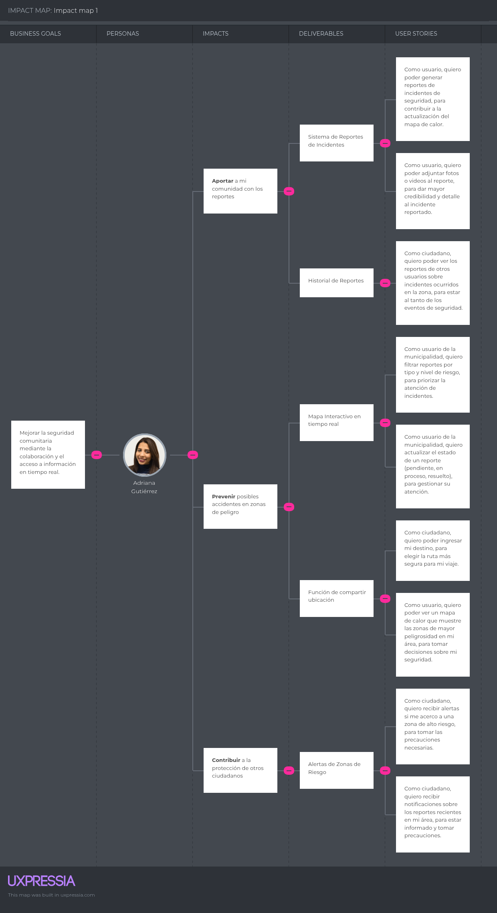

### Segmento 2: Municipalidad

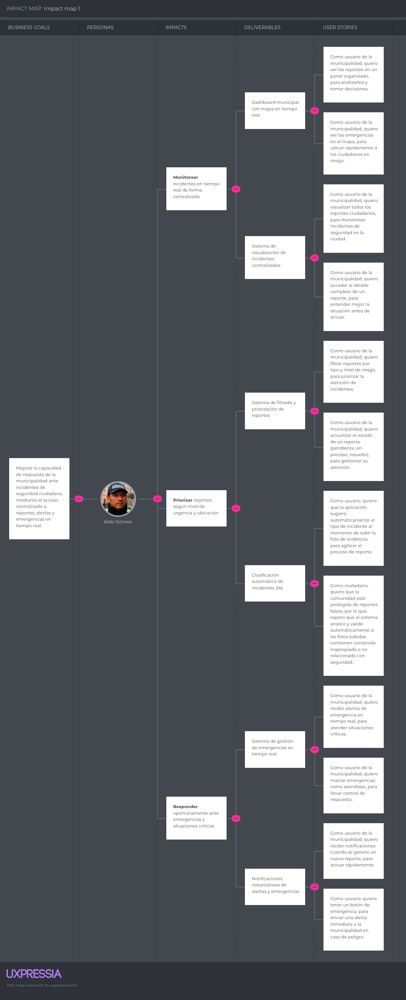

## 3.4. Product Backlog

Se implementa el siguiente producto backlog a partir de las historias de
usuario elaboradas, evaluándolas en un rango de 1,2,3,5,8 (serie
Fibonacci), significando el mayor número como el más importante y
relevante.

| **ID** | **User Story / Technical Story Id** | **Título** | **Descripción** | **Story Points (1/2/3/5/8)** |
|--------|-------------------------------------|------------|-----------------|------------------------------|
| 1 | **US02** | Navegar en la Landing Page | Como visitante de la Landing Page, quiero encontrar las secciones bien definidas para comprender fácilmente la información mostrada. | 1 |
| 2 | **US01** | Contactar con la Startup | Como visitante de la Landing Page, quiero encontrar un formulario de contacto funcional y accesible, para poder comunicarme con el startup. | 1 |
| 3 | **US06** | Generar Reporte de Incidentes | Como usuario, quiero poder generar reportes de incidentes de seguridad, para contribuir a la actualización del mapa de calor. | 3 |
| 4 | **US07** | Adjuntar Evidencia al Reporte | Como usuario, quiero poder adjuntar fotos o videos al reporte, para dar mayor credibilidad y detalle al incidente reportado. | 5 |
| 5 | **US08** | Visualización de Reportes | Como ciudadano, quiero poder ver los reportes de otros usuarios sobre incidentes ocurridos en la zona, para estar al tanto de los eventos de seguridad. | 3 |
| 6 | **US13** | Acceder a Mapa con Reportes | Como usuario, quiero poder ver un mapa interactivo con los reportes de incidentes en mi área, para tomar decisiones informadas sobre mi seguridad. | 8 |
| 7 | **US16** | Buscar Ubicación en el Mapa | Como usuario, quiero poder explorar reportes de seguridad en diferentes zonas del mapa, para tomar decisiones informadas sobre mis desplazamientos. | 3 |
| 8 | **US15** | Filtrar Reportes | Como usuario, quiero poder filtrar los reportes para ver todos los reportes o solo los que yo he creado, para gestionar mejor la información. | 2 |
| 9 | **US09** | Recibir Alertas de Zonas de Riesgo | Como ciudadano, quiero recibir alertas si me acerco a una zona de alto riesgo, para tomar las precauciones necesarias. | 5 |
| 10 | **US10** | Compartir Ubicación con Contactos en la Aplicación Móvil | Como usuario de la aplicación móvil, quiero poder compartir mi ubicación con mis contactos cercanos, para que puedan monitorear mi trayecto ante cualquier peligro. | 5 |
| 11 | **US11** | Editar Información de Perfil | Como usuario, quiero poder editar mi información de perfil, para corregir o actualizar mis datos personales. | 2 |
| 12 | **US14** | Acceder al Perfil de Usuario | Como usuario, quiero acceder a mi perfil desde el menú principal, para visualizar mi información personal y configuraciones. | 2 |
| 13 | **US05** | Iniciar Sesión | Como usuario registrado, quiero poder iniciar sesión con mi correo y contraseña, para acceder a mi cuenta. | 8 |
| 14 | **US04** | Registro de Usuarios | Como usuario, quiero poder registrarme en la aplicación, para acceder a las funcionalidades de PeaceApp. | 8 |
| 15 | **US12** | Recuperar Contraseña | Como usuario, quiero poder recuperar mi contraseña si la olvido, para poder acceder nuevamente a mi cuenta. | 2 |
| 16 | **US03** | Diseño Responsivo | Como usuario, quiero que la aplicación se adapte a diferentes pantallas, para usarla cómodamente en móvil, tablet o escritorio. | 2 |
| 17 | **TS04** | Crear reporte de incidente mediante RESTful API | Como desarrollador, quiero que los usuarios puedan crear reportes de incidentes para compartir información sobre zonas peligrosas. | 5 |
| 18 | **TS07** | Crear coordenadas de ubicación al generar un reporte | Como desarrollador, quiero registrar las coordenadas de una ubicación mediante un POST, para asociarlas al reporte de un incidente. | 5 |
| 19 | **TS08** | Obtener ubicaciones para renderizar reportes en el mapa | Como desarrollador, quiero obtener las coordenadas mediante un GET, para mostrar los íconos de los reportes en el mapa. | 3 |
| 20 | **TS05** | Obtener lista de reportes mediante RESTful API | Como desarrollador, quiero que los usuarios puedan obtener una lista de reportes para ver incidentes recientes en su área. | 3 |
| 21 | **TS06** | Obtener reporte por ID mediante RESTful API | Como desarrollador, quiero que los usuarios puedan obtener los detalles de un solo reporte para consultar información específica sobre un incidente. | 3 |
| 22 | **TS09** | Crear alerta al acercarse a una zona de peligro | Como desarrollador, quiero crear una alerta mediante POST para notificar que un usuario está dentro del rango de un incidente. | 5 |
| 23 | **TS10** | Obtener alertas por usuario | Como desarrollador, quiero obtener las alertas específicas de un usuario mediante GET. | 3 |
| 24 | **TS11** | Eliminar alertas al recargar el mapa | Como desarrollador, quiero eliminar todas las alertas del usuario al recargar el mapa para evitar duplicaciones. | 2 |
| 25 | **TS12** | Obtener detalles de una alerta por ID | Como desarrollador, quiero consultar una alerta específica por su ID. | 2 |
| 26 | **TS03** | Editar perfil de usuario mediante RESTful API | Como desarrollador, quiero que los usuarios puedan actualizar su información personal para mantener sus perfiles al día. | 3 |
| 27 | **TS13** | Obtener datos de usuario por email | Como desarrollador, quiero obtener datos de un usuario mediante su email para fines de autenticación. | 2 |
| 28 | **TS01** | Autenticación JWT mediante RESTful API | Como desarrollador, quiero autenticar a los usuarios a través de un token JWT para que puedan acceder a la plataforma de manera segura. | 8 |
| 29 | **TS02** | Crear nuevo usuario mediante RESTful API | Como desarrollador, quiero permitir la creación de nuevos usuarios para que puedan acceder al sistema. | 8 |
| 30 | **US17** | Cambiar Foto de Perfil | Como usuario, quiero poder subir y cambiar mi foto de perfil, para personalizar mi cuenta. | 3 |
| 31 | **US18** | Notificación de Éxito al Reportar | Como usuario, quiero recibir una confirmación visual (mensaje "toast"), para saber que mi reporte se envió correctamente. | 1 |
| 32 | **US19** | Manejo de Permisos de Ubicación | Como usuario, quiero que la app me pida permiso para usar mi ubicación, para entender por qué lo necesita. | 3 |
| 33 | **US20** | Visualización de Contraseña | Como usuario, quiero un ícono de "mostrar/ocultar" contraseña, para verificar que la escribí bien. | 1 |
| 34 | **US21** | Estado Vacío en "Mis Reportes" | Como usuario, si no he creado reportes, quiero ver un mensaje que me lo indique, para no ver una pantalla en blanco. | 1 |
| 35 | **US22** | Notificación de Pérdida de Conexión | Como usuario, quiero ver un aviso si pierdo la conexión a internet, para saber por qué la app no funciona. | 3 |
| 36 | **US23** | Centrar Mapa en mi Ubicación | Como usuario, quiero un botón para centrar el mapa en mi ubicación actual con un solo toque, para orientarme rápidamente. | 1 |
| 37 | **US24** | Persistencia de Sesión | Como usuario registrado, quiero que mi sesión se mantenga iniciada, para no tener que ingresar mis datos cada vez que abro la app. | 2 |
| 38 | **US25** | Ver Detalles Rápidos en Mapa | Como usuario, quiero tocar un pin en el mapa y ver un resumen del reporte, para decidir si quiero ver el detalle completo. | 2 |
| 39 | **US26** | Compatibilidad Lector de Pantalla | Como usuario con discapacidad visual, quiero que la app sea compatible con lectores de pantalla (TalkBack/VoiceOver). | 5 |
| 40 | **US27** | Texto y Contraste Legibles | Como usuario, quiero que el texto y los contrastes cumplan con estándares de accesibilidad, para leer sin dificultad. | 3 |
| 41 | **US28** | CTA Claros en Landing Page | Como visitante de la Landing Page, quiero que los botones de descarga sean evidentes, para instalar la app. | 1 |
| 42 | **US29** | Indicadores de Carga (Loading) | Como usuario, quiero ver indicadores de carga (spinners/skeletons) al cargar datos, para saber que la app está trabajando. | 3 |
| 43 | **US30** | Mensaje Error de Formato de Archivo | Como usuario, al adjuntar evidencia, si el archivo es inválido, quiero un error claro, para saber qué corregir. | 2 |
| 44 | **US31** | Acceso Municipal a Reportes | Como usuario de la municipalidad, quiero visualizar todos los reportes ciudadanos, para monitorear incidentes de seguridad en la ciudad. | 5 |
| 45 | **US32** | Visualizar Reportes en Panel Administrativo | Como usuario de la municipalidad, quiero ver los reportes en un panel organizado, para analizarlos y tomar decisiones. | 5 |
| 46 | **US33** | Cambiar Estado de Reporte | Como usuario de la municipalidad, quiero actualizar el estado de un reporte (pendiente, en proceso, resuelto), para gestionar su atención. | 5 |
| 47 | **US34** | Filtrar Reportes por Prioridad y Tipo | Como usuario de la municipalidad, quiero filtrar reportes por tipo y nivel de riesgo, para priorizar la atención de incidentes. | 3 |
| 48 | **US35** | Ver Detalle Completo de Reporte | Como usuario de la municipalidad, quiero acceder al detalle completo de un reporte, para entender mejor la situación antes de actuar. | 3 |
| 49 | **US36** | Recibir Notificaciones de Nuevos Reportes | Como usuario de la municipalidad, quiero recibir notificaciones cuando se genere un nuevo reporte, para actuar rápidamente. | 5 |
| 50 | **US37** | Botón de Emergencia Ciudadano | Como usuario, quiero tener un botón de emergencia, para enviar una alerta inmediata a la municipalidad en caso de peligro. | 8 |
| 51 | **US38** | Confirmación de Envío de Emergencia | Como usuario, quiero recibir una confirmación visual cuando envío una alerta de emergencia, para saber que fue enviada correctamente. | 1 |
| 52 | **US39** | Recepción de Emergencias en Municipalidad | Como usuario de la municipalidad, quiero recibir alertas de emergencia en tiempo real, para atender situaciones críticas. | 8 |
| 53 | **US40** | Visualizar Emergencias en Mapa | Como usuario de la municipalidad, quiero ver las emergencias en el mapa, para ubicar rápidamente a los ciudadanos en riesgo. | 5 |
| 54 | **TS14** | Manejo de roles de usuario | Como desarrollador, quiero diferenciar roles de usuario (ciudadano y municipalidad), para controlar el acceso a funcionalidades específicas. | 5 |
| 55 | **TS15** | Crear alerta de emergencia mediante RESTful API | Como desarrollador, quiero registrar alertas de emergencia enviadas por ciudadanos, para notificar a la municipalidad. | 5 |
| 56 | **TS16** | Obtener lista de emergencias mediante RESTful API | Como desarrollador, quiero obtener las alertas de emergencia registradas, para mostrarlas en el sistema municipal. | 3 |
| 57 | **TS17** | Actualizar estado de emergencia mediante RESTful API | Como desarrollador, quiero actualizar el estado de una emergencia, para reflejar su atención. | 3 |
| 58 | **TS18** | Envío de notificaciones de emergencia | Como desarrollador, quiero enviar notificaciones en tiempo real cuando se registra una emergencia, para alertar a la municipalidad. | 5 |
| 59 | **TS19** | Protección de endpoints mediante JWT | Como desarrollador, quiero asegurar los endpoints mediante autenticación JWT, para proteger los datos del sistema. | 8 |
| 60 | **US41** | Gestionar Emergencias | Como usuario de la municipalidad, quiero marcar emergencias como atendidas, para llevar control de respuesta. | 3 |
| 61 | **US42** | Consultar nivel de seguridad mediante Chatbot | Como ciudadano, quiero preguntarle al chatbot en lenguaje natural sobre la seguridad de una zona específica, para obtener un resumen rápido de los incidentes recientes sin tener que buscar manualmente en el mapa. | 5 |
| 62 | **US43** | Asistencia del Chatbot para crear reportes | Como usuario en situación de estrés, quiero dictarle o escribirle al chatbot lo que acaba de pasar, para que el sistema llene el formulario de reporte de incidente automáticamente por mí. | 8 |
| 63 | **US44** | Autocompletado de tipo de incidente por IA | Como usuario, quiero que la aplicación sugiera automáticamente el tipo de incidente al momento de subir la foto de evidencia, para agilizar el proceso de reporte. | 5 |
| 64 | **US45** | Validación de evidencia fotográfica | Como ciudadano, quiero que la comunidad esté protegida de reportes falsos, por lo que espero que el sistema analice y valide automáticamente si las fotos subidas contienen contenido inapropiado o no relacionado con seguridad. | 8 |
| 65 | **TS20** | Implementar Microservicio de Chatbot mediante NLP | Como desarrollador, quiero crear un microservicio de chatbot que procese consultas en lenguaje natural, consulte la información de reportes y ubicaciones, y devuelva respuestas útiles al usuario. | 8 |
| 66 | **TS21** | Clasificación de imágenes mediante microservicio de IA | Como desarrollador, quiero desplegar un microservicio de clasificación de imágenes para analizar evidencia fotográfica de incidentes urbanos. | 8 |
| 67 | **TS22** | Integrar reconocimiento de imágenes al servicio de reportes | Como desarrollador, quiero integrar el servicio de reconocimiento de imágenes al flujo de creación de reportes, para obtener una clasificación sugerida y un puntaje de confianza antes de registrar la evidencia. | 5 |
| 68 | **TS23** | Orquestación de servicios de IA en el API Gateway | Como desarrollador, quiero configurar rutas seguras en el API Gateway para dirigir el tráfico hacia los microservicios de chatbot y reconocimiento de imágenes, aplicando autenticación JWT cuando corresponda. | 5 |

---

# Capítulo IV: Strategic-Level Software Design

## 4.1. Strategic-Level Attribute-Driven Design

### 4.1.1. Design Purpose
El propósito del diseño arquitectónico de PeaceApp es proporcionar una base estructurada, segura, escalable y mantenible que soporte de manera eficiente la gestión de reportes ciudadanos de incidentes en tiempo real. A través del uso de principios de diseño como la separación de responsabilidades, el uso de patrones arquitectónicos adecuados y la definición de capas claras, se busca facilitar la implementación coherente de funcionalidades esenciales orientadas a la seguridad ciudadana, garantizando un desarrollo modular y alineado con las necesidades reales del dominio urbano. Esta arquitectura permitirá al equipo de desarrollo incorporar nuevas características, escalar servicios críticos como notificaciones en tiempo real o geolocalización, integrar sistemas externos (por ejemplo, autoridades locales o servicios de emergencia), y mantener una alta calidad en la experiencia de usuario, incluso ante cambios en el entorno tecnológico o en los requerimientos sociales.

Para este proceso de diseño, nos basaremos en los siguientes objetivos y principios:

- Escalabilidad y Flexibilidad: La arquitectura debe adaptarse a cambios futuros, permitiendo la integración de nuevas funcionalidades y la expansión del sistema sin comprometer rendimiento o estabilidad.
- Modularidad y Reusabilidad: Fomentar un diseño modular que permita la reutilización de componentes y la incorporación de nuevas funcionalidades sin afectar el sistema existente.
- Desacoplamiento: Reducir dependencias entre componentes, facilitando actualizaciones, mantenimiento y resolución de problemas.
- Seguridad y Protección de Datos: Garantizar la protección de la información sensible de los usuarios mediante mecanismos de seguridad robustos y políticas de privacidad estrictas.
- Interoperabilidad: Asegurar que PeaceApp pueda interactuar con plataformas externas, dispositivos móviles y servicios de terceros, especialmente con autoridades y sistemas de emergencia.
- Mantenibilidad y Actualización Continua: Diseñar con visión a largo plazo para facilitar el mantenimiento y la evolución constante del sistema ante nuevas necesidades sociales o tecnológicas.
- Alta Disponibilidad y Confiabilidad: Garantizar que el sistema esté operativo de manera continua, incluso en contextos de alta demanda o emergencias.
- Experiencia de Usuario Óptima: Proporcionar una interacción fluida, intuitiva y confiable que incentive la participación ciudadana y eleve los niveles de confianza en la aplicación.

## 4.1.2. Attribute-Driven Design Inputs

### 4.1.2.1. Primary Functionality (Primary User Stories)
A continuación, se detallan las funciones esenciales (user stories) que influyen de manera directa en la organización del sistema y orientan las decisiones del diseño arquitectónico de PeaceApp.

| User Story ID | Título | Descripción |
|---------------|----------------------------------------------------|--------------------------------------------------------------------------------------------------------------------------------------------------------------------------------------------------------------------------|
| US04          | Registro de Usuarios | Como usuario, quiero poder registrarme en la aplicación, para acceder a las funcionalidades de PeaceApp.|
| US05          | Iniciar Sesión       | Como usuario registrado, quiero poder iniciar sesión con mi correo y contraseña, para acceder a mi cuenta.|
| US06          | Generar Reporte de Incidentes  | Como usuario, quiero poder generar reportes de incidentes de seguridad, para contribuir a la actualización del mapa de calor.|
| US07          | Adjuntar Evidencia al Reporte  | Como usuario, quiero poder adjuntar fotos o videos al reporte, para dar mayor credibilidad y detalle al incidente reportado.|
| US08          | Visualización de Reportes        | Como ciudadano, quiero poder ver los reportes de otros usuarios sobre incidentes ocurridos en la zona, para estar al tanto de los eventos de seguridad.|
| US09          | Recibir Alertas de Zonas de Riesgo | Como ciudadano, quiero recibir alertas si me acerco a una zona de alto riesgo, para tomar las precauciones necesarias.|
| US10          | Compartir Ubicación con Contactos en la Aplicación Móvil | Como usuario de la aplicación móvil, quiero poder compartir mi ubicación con mis contactos cercanos, para que puedan monitorear mi trayecto y estar alertas ante cualquier peligro.|
| US13          | Acceder a Mapa con Reportes          | Como usuario, quiero poder ver un mapa interactivo con los reportes de incidentes en mi área, para tomar decisiones informadas sobre mi seguridad.|
| US15          | Filtrar Reportes         | Como usuario, quiero poder filtrar los reportes para ver todos los reportes o solo los que yo he creado, para gestionar mejor la información relevante según mis intereses.|
| US16          | Buscar Ubicación en el Mapa         | Como usuario, quiero poder explorar reportes de seguridad en diferentes zonas del mapa, para tomar decisiones informadas sobre mis desplazamientos.|

### 4.1.2.2. Quality Attribute Scenarios
Los atributos de calidad determinados para PeaceApp son los que se detallan a continuación:

**a. Disponibilidad:**

Este atributo se trata de la capacidad del sistema para estar disponible y operativo cuando se necesita.
En nuestra solución, esto significa que los usuarios podrán acceder a la aplicación en cualquier momento para reportar incidentes de seguridad o recibir alertas en tiempo real.
La facilidad con la que se puede garantizar esta disponibilidad depende de una infraestructura confiable, redundante y con monitoreo constante.
Una alta disponibilidad transmite confianza al ciudadano, asegurando que la plataforma siempre esté lista para su uso sin interrupciones inesperadas, especialmente en situaciones críticas.

**b. Rendimiento:**

Este atributo se trata de la capacidad del sistema para responder con rapidez y eficiencia bajo distintas cargas de trabajo.
En nuestra solución, buscamos que los reportes de incidentes, el envío de alertas y las consultas de mapas se procesen en tiempo mínimo, evitando retrasos que puedan afectar la seguridad del usuario.
La facilidad con la que se mantiene un buen rendimiento se logra mediante una arquitectura optimizada, balanceo de carga y pruebas de estrés que validen la eficiencia del sistema.
Un alto rendimiento mejora la experiencia de los usuarios, reduciendo la frustración y asegurando que la información crítica llegue de forma oportuna.

**c. Escalabilidad:**

Este atributo se trata de la capacidad del sistema para crecer y adaptarse a un aumento de usuarios, datos o transacciones.
En nuestra solución, esto significa que la aplicación puede ampliarse fácilmente para atender a más distritos o ciudades, soportando un mayor volumen de alertas y usuarios sin perder eficiencia.
La facilidad con la que se logra esta escalabilidad proviene de una arquitectura modular y distribuida, diseñada desde el inicio para soportar crecimiento.
Un sistema escalable asegura la continuidad del servicio y la adopción masiva sin necesidad de rediseños costosos.

**d. Mantenibilidad:**

Este atributo se trata de la capacidad del sistema para ser modificado fácilmente cuando se necesitan cambios o mejoras.
En nuestra solución, el código será limpio, modular y bien documentado, lo cual facilita la detección y corrección de errores, así como la integración de nuevas funcionalidades (ejemplo: chat en tiempo real con autoridades).
La facilidad con la que se mantiene y mejora el sistema reduce los tiempos de desarrollo, evita errores nuevos y permite adaptarse a las necesidades cambiantes de la comunidad.
Una alta mantenibilidad asegura la evolución constante de PeaceApp con bajo riesgo y esfuerzo.

**e. Usabilidad:**

Este atributo se trata de la capacidad del sistema para ser entendido y utilizado con facilidad por los usuarios finales.
En nuestra solución, nos enfocamos en una interfaz clara, intuitiva y accesible, que permita a los ciudadanos reportar incidentes o consultar alertas de manera rápida incluso en momentos de emergencia.
La facilidad con la que un usuario interactúa con la aplicación depende de un diseño UX/UI bien estructurado, retroalimentación visual clara y soporte para accesibilidad.
Una alta usabilidad fomenta la adopción de la plataforma, reduce la curva de aprendizaje y genera confianza en los ciudadanos para seguir utilizándola.

**f. Seguridad:**

Este atributo se trata de la capacidad del sistema para proteger la confidencialidad, integridad y disponibilidad de la información.
En nuestra solución, esto implica implementar autenticación robusta, encriptación de datos y control de acceso según roles (usuario, autoridad, administrador).
La facilidad con la que se garantiza la seguridad depende de políticas claras de protección de datos y del uso de estándares internacionales (ejemplo: OWASP).
Una alta seguridad incrementa la confianza de los usuarios y asegura que la información sensible no sea vulnerada ni utilizada de forma indebida.

**a. Disponibilidad:**

| **Elemento**            | **Detalle**                                                                 |
|--------------------------|-----------------------------------------------------------------------------|
| **Escenario**           | Un ciudadano necesita reportar un incidente en la calle a través de la app. |
| **Fuente de Estímulo**  | Ciudadano que usa la app                                                    |
| **Estímulo**            | Intenta acceder a la app para reportar un incidente en la calle             |
| **Medioambiente**       | El sistema se encuentra bajo condiciones normales de operación              |
| **Artefacto**           | Servidor y frontend de PeaceApp                                             |
| **Respuesta**           | El sistema responde y permite el registro del incidente sin caída del servicio |
| **Medida de Respuesta** | Tiempo de disponibilidad ≥ 99.5% mensual                                    |

**b. Rendimiento:**

| **Elemento**            | **Detalle**                                                                 |
|--------------------------|-----------------------------------------------------------------------------|
| **Escenario**           | Un usuario envía un reporte con foto y geolocalización en horario concurrido. |
| **Fuente de Estímulo**  | Usuario enviando un reporte                                                 |
| **Estímulo**            | Envío de reporte de incidente con foto y geolocalización                    |
| **Medioambiente**       | Sistema con 1000 usuarios concurrentes                                      |
| **Artefacto**           | API de backend y base de datos                                              |
| **Respuesta**           | Procesa y guarda el reporte en la base de datos                             |
| **Medida de Respuesta** | Tiempo de respuesta ≤ 3 segundos                                            |

**c. Escalabilidad:**

| **Elemento**            | **Detalle**                                                                 |
|--------------------------|-----------------------------------------------------------------------------|
| **Escenario**           | El servicio se expande a nuevos distritos y la cantidad de usuarios se duplica. |
| **Fuente de Estímulo**  | Municipalidad que amplía la cobertura                                       |
| **Estímulo**            | Aumento de usuarios al extender el servicio a nuevos distritos              |
| **Medioambiente**       | Sistema en crecimiento exponencial de usuarios y transacciones              |
| **Artefacto**           | Arquitectura distribuida en la nube                                         |
| **Respuesta**           | Se despliegan nuevas instancias y balanceadores automáticamente             |
| **Medida de Respuesta** | El sistema soporta +10,000 usuarios sin degradación notable del rendimiento |

**d. Mantenibilidad:**

| **Elemento**            | **Detalle**                                                                 |
|--------------------------|-----------------------------------------------------------------------------|
| **Escenario**           | El equipo de desarrollo necesita agregar un módulo de comunicación con autoridades. |
| **Fuente de Estímulo**  | Equipo de desarrollo                                                        |
| **Estímulo**            | Necesidad de agregar un nuevo módulo de comunicación directa con autoridades |
| **Medioambiente**       | Sistema en operación con versiones previas estables                         |
| **Artefacto**           | Código fuente modular de PeaceApp                                           |
| **Respuesta**           | Se implementa el nuevo módulo sin afectar funcionalidades existentes        |
| **Medida de Respuesta** | Cambios implementados en ≤ 2 sprints sin errores críticos en producción     |

**e. Usabilidad:**

| **Elemento**            | **Detalle**                                                                 |
|--------------------------|-----------------------------------------------------------------------------|
| **Escenario**           | Un ciudadano bajo estrés necesita presionar el botón de emergencia.          |
| **Fuente de Estímulo**  | Ciudadano que reporta un incidente                                          |
| **Estímulo**            | Dificultad para ubicar el botón de “Emergencia”                             |
| **Medioambiente**       | App utilizada en situación de estrés (robo, accidente, etc.)                |
| **Artefacto**           | Interfaz gráfica del usuario (UI/UX)                                        |
| **Respuesta**           | Se muestra un botón visible y accesible en la pantalla principal            |
| **Medida de Respuesta** | 90% de usuarios logra reportar en ≤ 5 segundos durante pruebas de usabilidad |

**f. Seguridad:**

| **Elemento**            | **Detalle**                                                                 |
|--------------------------|-----------------------------------------------------------------------------|
| **Escenario**           | Un atacante intenta ingresar al sistema usando credenciales robadas.        |
| **Fuente de Estímulo**  | Atacante externo                                                            |
| **Estímulo**            | Intenta acceder a la base de datos con credenciales robadas                 |
| **Medioambiente**       | Bajo ataque de fuerza bruta en horario crítico                              |
| **Artefacto**           | Sistema de autenticación y base de datos                                    |
| **Respuesta**           | Bloquea el intento, activa alertas y mantiene la integridad de los datos    |
| **Medida de Respuesta** | 100% de accesos no autorizados bloqueados; logs generados y auditados en < 1min |

### 4.1.2.3. Constraints
La tabla a continuación muestra las limitaciones que deben considerarse dentro del desarrollo de PeaceApp.

| **ID**   | **Constraint** | **Restricción** | **Impacto** |
|----------|----------------|-----------------|-------------|
| **CON-01** | Conectividad Urbana Variable | En muchas zonas urbanas la conectividad móvil puede ser inestable o intermitente. | La aplicación debe permitir funcionamiento básico offline (ej. registro temporal de incidentes) y sincronización automática cuando haya conexión. |
| **CON-02** | Presupuesto y Recursos | El proyecto cuenta con recursos financieros y humanos limitados. | Se priorizará el uso de tecnologías open source y librerías con soporte comunitario/comercial, enfocándose en un MVP funcional antes de ampliar funcionalidades. |
| **CON-03** | Cumplimiento Normativo en Protección de Datos | PeaceApp debe cumplir con la Ley de Protección de Datos Personales en Perú (Ley N.° 29733) y normativas internacionales de privacidad. | Requiere incorporar cifrado de datos, autenticación segura, consentimiento explícito de usuarios y auditoría de accesos. |
| **CON-04** | Integración con Infraestructura Municipal y Policial | La aplicación busca colaborar con entidades municipales y policiales que tienen sus propios sistemas de información. | Es necesario desarrollar APIs estandarizadas y protocolos de intercambio de datos, garantizando compatibilidad e interoperabilidad. |
| **CON-05** | Diversidad de Dispositivos | Los usuarios utilizarán teléfonos móviles de diferentes gamas (alta, media, baja). | La aplicación debe ser ligera, optimizada en rendimiento y compatible con Android/iOS en versiones aún usadas en el mercado. |
| **CON-06** | Tiempo de Entrega | El proyecto debe contar con un prototipo funcional para ser validado en pruebas piloto en un plazo corto. | Se debe adoptar un enfoque ágil (Scrum/Lean UX), entregando un MVP con las funcionalidades críticas: alertas, geolocalización y mapa de incidentes. |
| **CON-07** | Sostenibilidad a Largo Plazo | La continuidad del sistema depende de su mantenimiento y financiamiento posterior. | Influirá en la elección de arquitecturas escalables y de bajo mantenimiento, así como en la búsqueda de convenios con municipalidades y ONGs. |

## 4.1.3. Architectural Drivers Backlog

| Driver ID | Título | Descripción | Importancia (Alta/Media/Baja) | Complejidad Técnica (Alta/Media/Baja) |
|----------|--------|-------------|-------------------------------|---------------------------------------|
| DR-01 | Escalabilidad | Capacidad del sistema para soportar el crecimiento de usuarios ciudadanos, usuarios municipales, reportes, emergencias y consultas concurrentes sin degradar significativamente el rendimiento. | Alta | Alta |
| DR-02 | Disponibilidad | Capacidad de la solución para mantenerse operativa en funcionalidades críticas como visualización de reportes, envío de emergencias y acceso al dashboard municipal, incluso ante fallos parciales. | Alta | Alta |
| DR-03 | Mantenibilidad | Facilidad para modificar, extender y corregir el sistema, incorporando nuevas funcionalidades como IA, validación de evidencia o nuevos módulos municipales sin afectar gravemente el resto de la solución. | Alta | Media |
| DR-04 | Despliegue continuo | Capacidad del sistema para permitir actualizaciones frecuentes y controladas de sus componentes, reduciendo el impacto de cambios en producción y facilitando pipelines de integración y entrega continua. | Media | Media |
| DR-05 | Alineación con DDD | Capacidad de estructurar la solución en bounded contexts claros, como Users, Reports, Alerts, Emergencies, Municipal Management e Intelligent Services, manteniendo cohesión de dominio y bajo acoplamiento. | Alta | Alta |
| DR-06 | Seguridad | Capacidad del sistema para proteger datos sensibles, gestionar autenticación y autorización mediante JWT y roles diferenciados, y asegurar el acceso controlado a reportes, evidencia y funciones municipales. | Alta | Alta |
| DR-07 | Experiencia de usuario | Capacidad de ofrecer una interacción rápida, clara y confiable tanto para ciudadanos como para usuarios municipales, especialmente en funciones críticas como reportes, alertas, chatbot y emergencias. | Alta | Media |
| DR-08 | Integración | Capacidad para interoperar con servicios externos y componentes especializados, como API Gateway, Mapbox, servicios de notificación, message broker y microservicios de IA para NLP y clasificación de imágenes. | Alta | Alta |
| DR-09 | Portabilidad | Capacidad de reutilizar la lógica de negocio y los servicios en distintos clientes, como aplicación web, aplicación móvil y dashboard municipal, manteniendo consistencia funcional. | Media | Media |
| DR-10 | Trazabilidad | Capacidad de registrar y rastrear eventos relevantes del sistema, como creación de reportes, cambios de estado, envío de emergencias, validaciones automáticas y acciones municipales, para auditoría y seguimiento. | Alta | Media |

## 4.1.4. Architectural Design Decisions

| Driver ID | Título | Monolito Modular (DDD) - Pro | Monolito Modular (DDD) - Con | Microservicios - Pro | Microservicios - Con |
|----------|--------|------------------------------|------------------------------|---------------------|---------------------|
| DR-01 | Escalabilidad | Permite escalar el sistema como una sola unidad y mantener simplicidad inicial. | Obliga a escalar todo el sistema aunque solo crezcan módulos específicos como reportes o emergencias. | Permite escalar de forma independiente módulos como Reports, Emergencies, Alerts o IA. | Incrementa la complejidad operativa y de infraestructura. |
| DR-02 | Disponibilidad | Un solo despliegue facilita administración y monitoreo centralizado. | Un fallo crítico puede comprometer toda la aplicación. | Aísla fallos entre servicios y reduce el impacto global de errores. | Requiere mecanismos adicionales de tolerancia a fallos y observabilidad distribuida. |
| DR-03 | Mantenibilidad | La modularización interna facilita ordenar el código en etapas tempranas. | A medida que el sistema crece, los cambios cruzados aumentan el acoplamiento. | Cada servicio puede evolucionar de forma independiente según su dominio. | Exige una gobernanza fuerte para mantener coherencia entre servicios. |
| DR-04 | Despliegue continuo | El pipeline es más simple al existir una sola unidad desplegable. | Un cambio menor obliga a desplegar todo el sistema. | Permite desplegar servicios específicos sin afectar el resto de la plataforma. | Hace más compleja la configuración de CI/CD y pruebas integradas. |
| DR-05 | Alineación con DDD | Permite representar bounded contexts como módulos internos. | Los límites de contexto pueden degradarse con el tiempo. | Cada microservicio puede representar un bounded context con mayor claridad. | Obliga a manejar coordinación entre contextos y consistencia eventual. |
| DR-06 | Seguridad | Facilita centralizar autenticación y control de acceso en una sola aplicación. | Una vulnerabilidad puede exponer una superficie mayor del sistema. | Permite aplicar aislamiento por servicio, roles y políticas específicas por dominio. | Requiere distribuir controles de seguridad, tokens y validaciones entre varios servicios. |
| DR-07 | Experiencia de usuario | Favorece una experiencia consistente al depender de una sola base backend. | Puede dificultar optimizar por separado funciones críticas como chatbot o emergencias. | Permite optimizar servicios críticos de manera independiente según el tipo de interacción. | Mayor latencia potencial por comunicación entre servicios. |
| DR-08 | Integración | Simplifica la exposición de APIs externas desde un solo backend. | La integración con múltiples servicios externos puede volver más rígida la arquitectura. | Facilita integrar componentes especializados como IA, mensajería, mapas y notificaciones. | Aumenta la cantidad de contratos, endpoints y dependencias a mantener. |
| DR-09 | Portabilidad | Backend central reutilizable para varios clientes con menor esfuerzo inicial. | Puede concentrar demasiadas responsabilidades y crecer de forma rígida. | Permite exponer servicios reutilizables para web, móvil y dashboard municipal. | Puede requerir coordinación adicional entre clientes y servicios. |
| DR-10 | Trazabilidad | Logging centralizado más simple de implementar al inicio. | Puede dificultar distinguir eventos por dominio cuando el sistema crece. | Permite trazabilidad detallada por servicio y por flujo de negocio. | Requiere herramientas adicionales para correlacionar eventos interservicio. |

La arquitectura de microservicios es la opción más adecuada para PeaceApp, debido a que:

- Permite escalar de manera independiente los módulos críticos del sistema, como reportes, emergencias, alertas, gestión municipal y servicios inteligentes basados en IA.
- Favorece una mejor alineación con DDD, representando bounded contexts claros y reduciendo el acoplamiento entre dominios.
- Facilita la integración con componentes externos y especializados, como Mapbox, servicios de notificación, message broker y microservicios de chatbot y clasificación de imágenes.
- Mejora la mantenibilidad y evolución del sistema, permitiendo incorporar nuevas funcionalidades sin afectar toda la solución.
- Se adapta mejor al crecimiento progresivo del producto, especialmente al considerar dos segmentos principales: ciudadanos y municipalidades.

## 4.1.5. Quality Attribute Scenario Refinements
Como resultado del proceso de definición de atributos de calidad para PeaceApp, se han identificado y priorizado escenarios críticos que impactan directamente en las decisiones arquitectónicas del sistema. Estos escenarios están alineados con los principales architectural drivers, tales como la gestión de reportes, la geolocalización, la generación de alertas y la autenticación segura.

Los escenarios refinados permiten vincular los atributos de calidad (disponibilidad, rendimiento, escalabilidad, seguridad, usabilidad y mantenibilidad) con los bounded contexts definidos (IAM, Profiles, Reports, Alerts y Locations), así como con las tácticas arquitectónicas adoptadas (microservicios, JWT, cacheo, balanceo de carga, entre otros).

A continuación, se presentan los escenarios refinados priorizados, los cuales guían las decisiones de diseño del sistema.

SCENARIO 1 – DISPONIBILIDAD
<table style="border-collapse: collapse; width: 100%; font-family: Arial, sans-serif;">
  <thead>
    <tr>
      <th colspan="3" style="border: 1px solid #ccc; padding: 10px; text-align: left;">
        Scenario Refinement for Scenario 1
      </th>
    </tr>
  </thead>
  <tbody>
    <tr>
      <td style="border: 1px solid #ccc; padding: 8px; font-weight: bold;">Scenario(s):</td>
      <td colspan="2" style="border: 1px solid #ccc; padding: 8px;">US06, US09, US13</td>
    </tr>
    <tr>
      <td style="border: 1px solid #ccc; padding: 8px; font-weight: bold;">Business Goals:</td>
      <td colspan="2" style="border: 1px solid #ccc; padding: 8px;">Garantizar que los ciudadanos puedan reportar incidentes y recibir alertas en cualquier momento.</td>
    </tr>
    <tr>
      <td style="border: 1px solid #ccc; padding: 8px; font-weight: bold;">Relevant Quality Attributes:</td>
      <td colspan="2" style="border: 1px solid #ccc; padding: 8px;">Disponibilidad, Confiabilidad</td>
    </tr>
    <!-- Scenario Components -->
    <tr>
      <td rowspan="5" style="border: 1px solid #ccc; padding: 8px; font-weight: bold; vertical-align: top;">
        Scenario Components
      </td>
      <td style="border: 1px solid #ccc; padding: 8px; font-weight: bold;">Stimulus:</td>
      <td style="border: 1px solid #ccc; padding: 8px;">Usuario intenta enviar un reporte o recibir una alerta</td>
    </tr>
    <tr>
      <td style="border: 1px solid #ccc; padding: 8px; font-weight: bold;">Stimulus Source:</td>
      <td style="border: 1px solid #ccc; padding: 8px;">Usuario</td>
    </tr>
    <tr>
      <td style="border: 1px solid #ccc; padding: 8px; font-weight: bold;">Artifact:</td>
      <td style="border: 1px solid #ccc; padding: 8px;">API Gateway, Reports Service, Alerts Service</td>
    </tr>
    <tr>
      <td style="border: 1px solid #ccc; padding: 8px; font-weight: bold;">Response:</td>
      <td style="border: 1px solid #ccc; padding: 8px;">El sistema procesa la solicitud sin interrupciones</td>
    </tr>
    <tr>
      <td style="border: 1px solid #ccc; padding: 8px; font-weight: bold;">Response Measure:</td>
      <td style="border: 1px solid #ccc; padding: 8px;">Disponibilidad ≥ 80.0%, sin caídas en operaciones críticas</td>
    </tr>
    <!-- Questions -->
    <tr>
      <td style="border: 1px solid #ccc; padding: 8px; font-weight: bold;">Questions & Issues</td>
      <td colspan="2" style="border: 1px solid #ccc; padding: 8px;">
        
¿Se implementará failover entre microservicios?

        
¿Cómo se manejará caída del API Gateway?

      </td>
    </tr>
  </tbody>
</table>

SCENARIO 2 – RENDIMIENTO
<table style="border-collapse: collapse; width: 100%; font-family: Arial, sans-serif;">
  <thead>
    <tr>
      <th colspan="3" style="border: 1px solid #ccc; padding: 10px; text-align: left;">
        Scenario Refinement for Scenario 2
      </th>
    </tr>
  </thead>
  <tbody>
    <tr>
      <td style="border: 1px solid #ccc; padding: 8px; font-weight: bold;">Scenario(s):</td>
      <td colspan="2" style="border: 1px solid #ccc; padding: 8px;">US06, US07, TS04</td>
    </tr>
    <tr>
      <td style="border: 1px solid #ccc; padding: 8px; font-weight: bold;">Business Goals:</td>
      <td colspan="2" style="border: 1px solid #ccc; padding: 8px;">Procesar reportes de incidentes de manera eficiente, garantizando tiempos de respuesta adecuados incluso bajo carga.</td>
    </tr>
    <tr>
      <td style="border: 1px solid #ccc; padding: 8px; font-weight: bold;">Relevant Quality Attributes:</td>
      <td colspan="2" style="border: 1px solid #ccc; padding: 8px;">Rendimiento</td>
    </tr>
    <!-- Scenario Components -->
    <tr>
      <td rowspan="5" style="border: 1px solid #ccc; padding: 8px; font-weight: bold; vertical-align: top;">
        Scenario Components
      </td>
      <td style="border: 1px solid #ccc; padding: 8px; font-weight: bold;">Stimulus:</td>
      <td style="border: 1px solid #ccc; padding: 8px;">Envío de reporte con imagen y geolocalización</td>
    </tr>
    <tr>
      <td style="border: 1px solid #ccc; padding: 8px; font-weight: bold;">Stimulus Source:</td>
      <td style="border: 1px solid #ccc; padding: 8px;">Usuario</td>
    </tr>
    <tr>
      <td style="border: 1px solid #ccc; padding: 8px; font-weight: bold;">Artifact:</td>
      <td style="border: 1px solid #ccc; padding: 8px;">Reports Service, Locations Service, Base de datos</td>
    </tr>
    <tr>
      <td style="border: 1px solid #ccc; padding: 8px; font-weight: bold;">Response:</td>
      <td style="border: 1px solid #ccc; padding: 8px;">El sistema procesa y almacena el reporte correctamente</td>
    </tr>
    <tr>
      <td style="border: 1px solid #ccc; padding: 8px; font-weight: bold;">Response Measure:</td>
      <td style="border: 1px solid #ccc; padding: 8px;">Tiempo de respuesta ≤ 5 segundos bajo carga moderada (≈1000 usuarios concurrentes)</td>
    </tr>
    <!-- Questions -->
    <tr>
      <td style="border: 1px solid #ccc; padding: 8px; font-weight: bold;">Questions & Issues</td>
      <td colspan="2" style="border: 1px solid #ccc; padding: 8px;">
        
¿Las imágenes se almacenan directamente o vía servicio externo (ej. cloud storage)?

        
¿Se requiere optimización de consultas para el mapa?

      </td>
    </tr>
  </tbody>
</table>

SCENARIO 3 – SEGURIDAD
<table style="border-collapse: collapse; width: 100%; font-family: Arial, sans-serif;">
  <thead>
    <tr>
      <th colspan="3" style="border: 1px solid #ccc; padding: 10px; text-align: left;">
        Scenario Refinement for Scenario 3
      </th>
    </tr>
  </thead>
  <tbody>
    <tr>
      <td style="border: 1px solid #ccc; padding: 8px; font-weight: bold;">Scenario(s):</td>
      <td colspan="2" style="border: 1px solid #ccc; padding: 8px;">US04, US05, TS01</td>
    </tr>
    <tr>
      <td style="border: 1px solid #ccc; padding: 8px; font-weight: bold;">Business Goals:</td>
      <td colspan="2" style="border: 1px solid #ccc; padding: 8px;">Proteger datos de usuarios y accesos</td>
    </tr>
    <tr>
      <td style="border: 1px solid #ccc; padding: 8px; font-weight: bold;">Relevant Quality Attributes:</td>
      <td colspan="2" style="border: 1px solid #ccc; padding: 8px;">Seguridad</td>
    </tr>
    <!-- Scenario Components -->
    <tr>
      <td rowspan="5" style="border: 1px solid #ccc; padding: 8px; font-weight: bold; vertical-align: top;">
        Scenario Components
      </td>
      <td style="border: 1px solid #ccc; padding: 8px; font-weight: bold;">Stimulus:</td>
      <td style="border: 1px solid #ccc; padding: 8px;">Intento de acceso con credenciales inválidas</td>
    </tr>
    <tr>
      <td style="border: 1px solid #ccc; padding: 8px; font-weight: bold;">Stimulus Source:</td>
      <td style="border: 1px solid #ccc; padding: 8px;">Atacante externo</td>
    </tr>
    <tr>
      <td style="border: 1px solid #ccc; padding: 8px; font-weight: bold;">Artifact:</td>
      <td style="border: 1px solid #ccc; padding: 8px;">IAM Service</td>
    </tr>
    <tr>
      <td style="border: 1px solid #ccc; padding: 8px; font-weight: bold;">Response:</td>
      <td style="border: 1px solid #ccc; padding: 8px;">Se bloquea acceso y se registra intento</td>
    </tr>
    <tr>
      <td style="border: 1px solid #ccc; padding: 8px; font-weight: bold;">Response Measure:</td>
      <td style="border: 1px solid #ccc; padding: 8px;">100% accesos no autorizados bloqueados</td>
    </tr>
    <!-- Questions -->
    <tr>
      <td style="border: 1px solid #ccc; padding: 8px; font-weight: bold;">Questions & Issues</td>
      <td colspan="2" style="border: 1px solid #ccc; padding: 8px;">
        
¿Se implementará rate limiting?

        
¿Se usará refresh token?

      </td>
    </tr>
  </tbody>
</table>

## 4.2. Strategic-Level Domain-Driven Design

### 4.2.1. EventStorming
La sesión de EventStorming se llevó a cabo con una duración aproximada de 4 horas, utilizando la herramienta **Miro** para visualizar de manera colaborativa todos los elementos involucrados. El objetivo fue modelar de forma exploratoria el dominio general del sistema de reporte de incidencias, localización y alertas, partiendo de una línea de tiempo horizontal organizada por bounded contexts.

Para estructurar el tablero se utilizaron etiquetas de colores según el tipo de elemento:

- **Domain Events** (naranja)
- **Commands** (azul)
- **Roles / Actors** (verde)
- **Read Models / Views** (celeste)
- **Policies** (lila)
- **External Systems** (rojo)

**Link de Miro:**
[https://miro.com/app/board/uXjVGhYm-w0=/?share_link_id=873283021495]

El equipo comenzó identificando eventos clave como “Solicitud de reporte iniciada”, “Tipo de reporte seleccionado”, “Dirección de la zona obtenida”, “Evidencia adjuntada”, “Reporte de zona publicado”, “Alerta emitida” y “Visualización de reportes en el mapa”. A partir de estos, se mapearon los comandos que los originan, las políticas de automatización, los agregados implicados, los actores y los sistemas externos colaboradores (Mapbox, pasarela de notificaciones WhatsApp/SMS).

La disposición en el tablero quedó organizada de la siguiente forma:

- **Contexto Reporte**: desde que el ciudadano inicia un reporte hasta que el administrador lo aprueba o rechaza. Incluye eventos como “Solicitud de reporte pendiente”, comandos como “Enviar solicitud”, y el agregado *Solicitud*.

- **Contexto Localización**: desde la consulta de mapa para obtener dirección hasta la actualización asíncrona del mapa cuando un reporte es publicado. Incluye el read model “Mapa interactivo”, la política “Al publicarse un reporte el mapa debe actualizarse”, y el comando “Actualizar mapa con nuevo reporte”.

- **Contexto Alertas**: desde la autorización de compartir ubicación hasta la emisión de alertas por proximidad a zonas peligrosas. Incluye “Evaluar generación de alerta”, “Emitir Alerta”, y la integración con sistemas externos como WhatsApp/SMS.

Cada sección incluye las relaciones visuales completas entre eventos, comandos, agregados, políticas, sistemas externos, vistas y actores, lo cual permitió identificar comunicaciones desacopladas mediante eventos (Reporte → Localización) y consultas síncronas a read models (Reporte ← Localización; Alertas ← Localización), fundamentales para la siguiente etapa de delimitación de contextos y diseño de la arquitectura.
### 4.2.2. Candidate Context Discovery

Para identificar los bounded contexts del sistema PeaceApp, se llevó a cabo una sesión de Candidate Context Discovery aplicando la técnica **Start-with-Value**. Esta técnica fue seleccionada debido a que permite priorizar aquellas capacidades de negocio que generan mayor valor para la propuesta de la startup y que constituyen el núcleo funcional de la solución.

El análisis inició a partir del Event Storming desarrollado en Miro, donde se modelaron los procesos principales relacionados con el reporte de incidencias, la geolocalización y la generación de alertas de seguridad. Durante la sesión, se analizaron los eventos de dominio, comandos, actores, políticas y sistemas externos, identificando las áreas funcionales que concentran la mayor parte de la lógica de negocio.

Como resultado de esta primera iteración, se delimitaron tres bounded contexts directamente derivados del Event Storming:

- **Reports**, responsable del registro, validación y publicación de incidencias reportadas por los ciudadanos.
- **Locations**, encargado de la geolocalización, consulta cartográfica y visualización de zonas de riesgo.
- **Alerts**, orientado a la evaluación, generación y envío de alertas preventivas y notificaciones de emergencia.

Posteriormente, durante el diseño estratégico del dominio, se identificaron dos capacidades adicionales necesarias para gestionar los distintos tipos de usuarios del sistema y sus respectivas funcionalidades:

- **IAM**, responsable de la autenticación, autorización y gestión de credenciales.
- **Profiles**, encargado de la administración de la información personal, preferencias y roles de los usuarios.

Estos dos contextos fueron incorporados posteriormente durante el diseño estratégico del dominio, ya que permiten gestionar la identidad, autenticación y la información de los distintos tipos de usuarios del sistema, incluyendo ciudadanos y representantes de municipalidades. Aunque no forman parte del flujo principal modelado en el Event Storming, resultan fundamentales para habilitar el acceso seguro, la personalización de la experiencia y la administración de funcionalidades específicas según el rol de cada usuario.

La aplicación de la técnica Start-with-Value permitió identificar a **Reports** como el Core Domain, dado que concentra la funcionalidad principal y genera el mayor valor para la solución. Asimismo, **Locations** y **Alerts** fueron clasificados como Supporting Domains, mientras que **IAM** y **Profiles** se categorizaron como Generic Domains.

### 4.2.3. Domain Message Flows Modeling

## Story 1: Generación de Alertas

Esta historia describe el proceso de generación de alertas dentro del sistema a partir del monitoreo de la ubicación del usuario.

El flujo inicia cuando el ciudadano ejecuta la acción de **autorizar compartir ubicación**, lo que permite que el sistema active el proceso de monitoreo. Como resultado, se genera el evento de **ubicación compartida autorizada**.

Luego, el sistema ejecuta la regla de negocio que indica que, cuando se autoriza compartir la ubicación del usuario, se debe comenzar a **monitorear su ubicación**.

Posteriormente, el sistema evalúa continuamente la ubicación del usuario mediante la acción de **evaluar generación de alerta**, aplicando reglas que analizan su proximidad a zonas peligrosas.

Cuando el usuario se encuentra cerca de una zona peligrosa, se activa la regla que indica la **emisión de alerta**, lo que desencadena el comando de **emitir alerta**.

Finalmente, el sistema genera el evento de **alerta emitida**, notificando al usuario sobre la situación detectada.

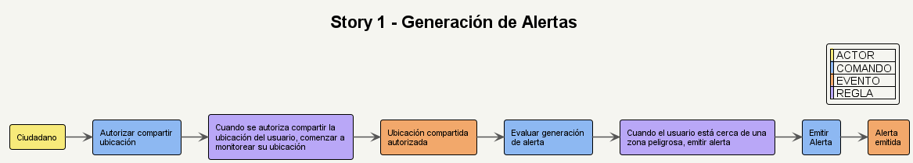

## Story 2: Registro de Solicitud de Reporte

Esta historia describe el proceso mediante el cual un **ciudadano** registra un **reporte de incidencia** en el sistema.

El flujo inicia cuando el ciudadano ejecuta la acción de **registrar un reporte**, lo que genera la creación de una **solicitud de reporte** dentro del sistema. A partir de ello, el ciudadano selecciona el **tipo de reporte** para clasificar correctamente la incidencia.

Luego, el sistema permite la captura de la **ubicación del evento**, apoyándose en la **visualización del mapa** para determinar la dirección exacta de la zona afectada. En este paso, el sistema obtiene y valida la **ubicación** correspondiente.

Posteriormente, el ciudadano adjunta **evidencia** relacionada con el caso, como imágenes o información adicional que respalde el reporte. Después, completa el **formulario de reporte** con los datos requeridos y envía la solicitud mediante la acción de **enviar reporte**.

Finalmente, el sistema registra el reporte en estado **pendiente**, quedando disponible para su revisión por parte del **administrador**.

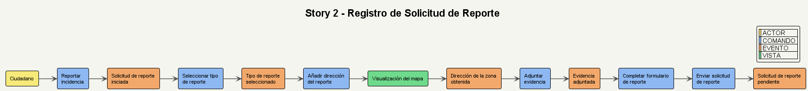

---

## Story 3: Revisión y Publicación de Reporte

Esta historia describe el proceso de revisión, validación y publicación de los **reportes registrados**, realizado por el **administrador** del sistema.

El proceso inicia cuando el administrador accede a las **solicitudes de reportes pendientes**. Al abrir una solicitud, esta pasa al estado de **revisión**, donde se analiza la información proporcionada por el ciudadano.

Luego, el administrador evalúa el reporte y decide si los datos son válidos. Si el reporte cumple con los criterios establecidos, se realiza la acción de **aprobar reporte**, generando el estado de **reporte aprobado**.

A continuación, el sistema ejecuta la regla de negocio de **publicación automática del reporte**, haciendo que este sea visible como un **reporte publicado** en la zona correspondiente.

En caso de que la solicitud no cumpla con los requisitos o contenga información inválida, el administrador ejecuta la acción de **rechazar reporte**, finalizando el flujo sin su publicación.

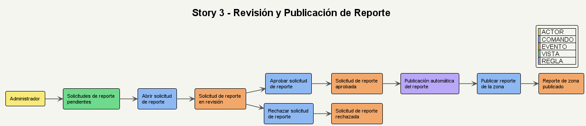

## Story 4: Compartir ubicación con contactos

Esta historia describe el proceso mediante el cual el usuario comparte su ubicación actual con sus contactos a través de servicios externos como WhatsApp o SMS.

El flujo inicia cuando el sistema obtiene la **ubicación actual del usuario**, generando la actualización de su posición. A partir de ello, el ciudadano expresa su intención de **compartir su ubicación**, lo que genera una solicitud de confirmación.

Luego, el sistema emite una **solicitud de confirmación**, la cual es respondida por el usuario. Si el usuario acepta, se ejecuta la acción de **compartir ubicación con contactos**. En caso contrario, se ejecuta la acción de **no compartir ubicación**, cancelando el proceso.

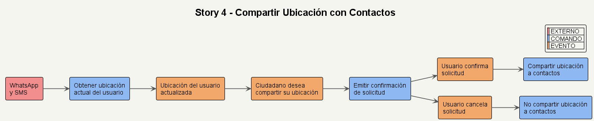

---

## Story 5: Monitoreo de proximidad

Esta historia describe el proceso de monitoreo continuo de la ubicación del usuario para evaluar su proximidad a zonas seguras o peligrosas.

El flujo inicia cuando el sistema activa el **monitoreo de la ubicación del usuario** mediante servicios de geolocalización como Mapbox. A partir de ello, la ubicación del usuario se actualiza constantemente.

Luego, cada vez que la ubicación es actualizada, el sistema ejecuta la regla de negocio que permite **evaluar la proximidad a zonas seguras o peligrosas**.

Como resultado de esta evaluación, el sistema determina si el usuario se encuentra cerca de una **zona peligrosa** o en una **zona segura**, generando los eventos correspondientes.

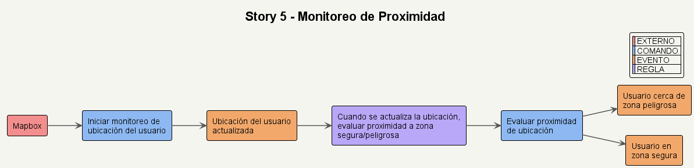

---

## Story 6: Actualizar mapa con nuevo reporte

Esta historia describe el proceso mediante el cual el sistema actualiza la información del mapa cuando se publica un nuevo reporte.

El flujo inicia cuando se produce la publicación de un nuevo reporte en el sistema. A partir de este evento, se activa una regla de negocio que determina que el mapa debe ser actualizado con la nueva información.

Luego, el sistema ejecuta la acción de **actualizar el mapa con el nuevo reporte**, integrando los datos correspondientes en la visualización geográfica.

Finalmente, se genera el evento de **mapa actualizado con reporte**, reflejando los cambios en el sistema.

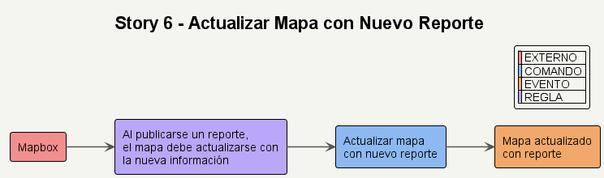

---

## Story 7: Visualización de reportes en el mapa

Esta historia describe el proceso mediante el cual el ciudadano visualiza los reportes disponibles directamente en el mapa del sistema.

El flujo inicia cuando el ciudadano ejecuta la acción de **mostrar el mapa** dentro de la aplicación. A partir de ello, el sistema genera la visualización base del mapa.

Posteriormente, el sistema carga los reportes asociados a la zona y los presenta dentro de la **visualización del mapa**.

Finalmente, el usuario observa la **visualización de reportes en el mapa**, permitiendo identificar los eventos registrados en su entorno.

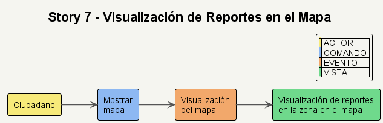

### 4.2.4. Bounded Context Canvases

#### Report Bounded Context:

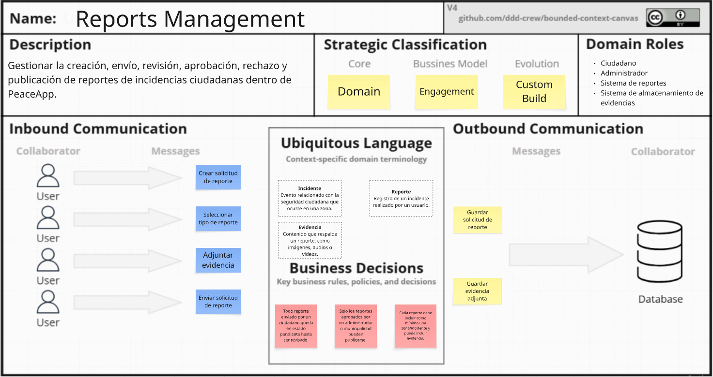

#### Location Bounded Context:

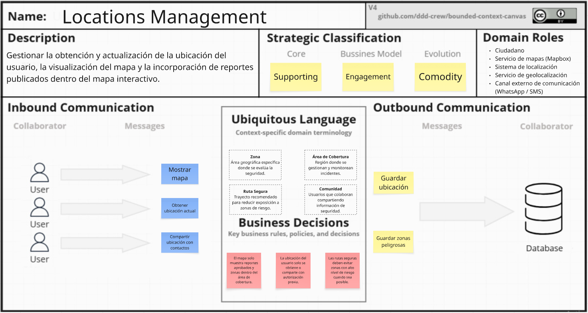

#### Alert Bounded Context:

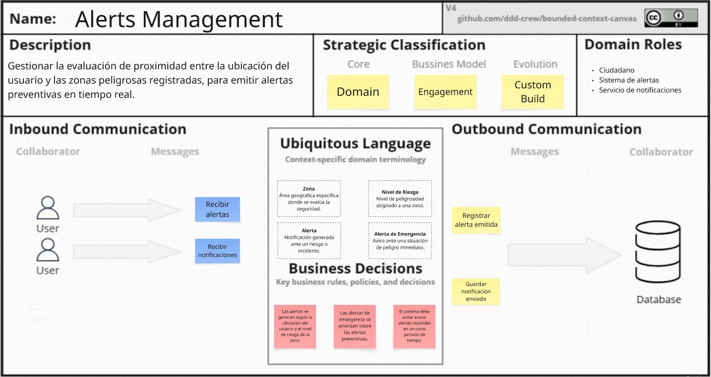

### 4.2.5. Context Mapping
El sistema PeaceApp se estructura en cinco bounded contexts principales: IAM, Profiles, Reports, Alerts y Locations, los cuales colaboran entre sí para cumplir los objetivos del dominio. A continuación, se describen sus relaciones y las decisiones de diseño adoptadas.

IAM ↔ Profiles (Customer/Supplier)

El bounded context IAM depende de Profiles para acceder a información del usuario, como datos personales o preferencias, necesarios durante procesos de autenticación y autorización. En este caso, se adopta el patrón Customer/Supplier, donde IAM actúa como cliente y Profiles como proveedor.

Este patrón se justifica porque IAM requiere que Profiles mantenga un contrato estable, ya que cualquier cambio en la estructura de datos del perfil podría afectar directamente los procesos de autenticación. Por tanto, Profiles debe garantizar cierta estabilidad y compatibilidad hacia IAM.

Reports ↔ Profiles (Conformist)

El bounded context Reports necesita acceder a información básica del usuario (por ejemplo, el autor de un reporte). Para ello, consume datos de Profiles utilizando el patrón Conformist.

Se eligió este patrón porque Reports no necesita controlar el modelo de Profiles ni traducirlo, ya que solo consume datos simples. Implementar una capa de anticorrupción (ACL) sería innecesario y aumentaría la complejidad sin aportar valor significativo.

Reports ↔ Locations (Conformist)

El bounded context Reports también depende de Locations para asociar coordenadas geográficas a los incidentes reportados. En este caso, se adopta nuevamente el patrón Conformist.

Esto se debe a que el modelo geoespacial definido por Locations es lo suficientemente estándar y estable, por lo que Reports puede adaptarse directamente sin necesidad de transformación. Además, introducir una ACL aquí generaría sobrecarga innecesaria.

Alerts ↔ Reports (Customer/Supplier)

El bounded context Alerts depende de Reports para generar notificaciones basadas en incidentes registrados. Se utiliza el patrón Customer/Supplier, donde Alerts es el cliente y Reports el proveedor.

Este patrón se justifica porque Alerts depende fuertemente del modelo de Reports, especialmente en la estructura de los incidentes. Por tanto, Reports debe garantizar estabilidad en su contrato para no afectar la generación de alertas.

Alerts ↔ Locations (Conformist)

El bounded context Alerts utiliza datos geográficos proporcionados por Locations para determinar si un usuario se encuentra en una zona de riesgo. Se adopta el patrón Conformist.

Esto se debe a que Alerts solo consume coordenadas y datos espaciales sin necesidad de lógica compleja, por lo que puede adaptarse directamente al modelo de Locations.

Alerts ↔ Profiles (Conformist)

El bounded context Alerts también consume información de usuario desde Profiles para personalizar las notificaciones. Se aplica el patrón Conformist.

La elección se debe a que los datos requeridos son simples y no justifican una capa de traducción, manteniendo así la arquitectura más ligera.

Locations ↔ Mapbox (Anti-Corruption Layer)

El bounded context Locations se integra con el sistema externo Mapbox para obtener datos geoespaciales y visualización de mapas. En este caso, se aplica el patrón Anti-Corruption Layer (ACL).

Este patrón es fundamental porque permite proteger el dominio interno de cambios o inconsistencias en la API externa. La ACL actúa como una capa de traducción que adapta los datos de Mapbox al modelo interno del sistema, evitando acoplamiento directo.

Alerts ↔ WhatsApp API / SMS Gateway (Anti-Corruption Layer)

El bounded context Alerts se comunica con sistemas externos como WhatsApp API y SMS Gateway para enviar notificaciones a los usuarios. Aquí también se aplica el patrón Anti-Corruption Layer (ACL).

Esto se debe a que estos servicios externos tienen interfaces y modelos propios, que no deben afectar el dominio interno. La ACL permite aislar estas dependencias y mantener la independencia del sistema.

Clasificación Estratégica de los Bounded Contexts

Siguiendo los principios de Domain-Driven Design, los bounded contexts se clasifican según su importancia en el negocio:

Core Domain: Reports

El bounded context Reports constituye el núcleo del sistema, ya que implementa la funcionalidad principal de la aplicación: el registro y gestión de incidentes de seguridad.

Este contexto aporta el mayor valor al negocio, dado que:

Permite generar información sobre zonas peligrosas
En el mapa se visualizan los reportes de las zonas
Es la base para la generación de alertas

Por ello, se considera el Core Domain, y debe recibir la mayor atención en términos de diseño y evolución.

Supporting Domains: Alerts y Locations

Los bounded contexts Alerts y Locations se clasifican como Supporting Domains, ya que complementan al dominio principal:

Alerts permite notificar a los usuarios sobre riesgos
Locations gestiona la información geoespacial

Si bien son importantes, no representan la esencia del negocio, sino que soportan la funcionalidad principal de Reports.

Generic Domains: IAM y Profiles

Los bounded contexts IAM y Profiles se clasifican como Generic Domains, ya que implementan funcionalidades comunes que no son específicas del negocio:

IAM gestiona autenticación y autorización
Profiles gestiona datos de usuario

Estos dominios:

Son reutilizables en múltiples sistemas
No diferencian a PeaceApp de otras aplicaciones

Por ello, no requieren un diseño altamente especializado.

## 4.3. Software Architecture

### 4.3.1. Software Architecture System Landscape Diagram

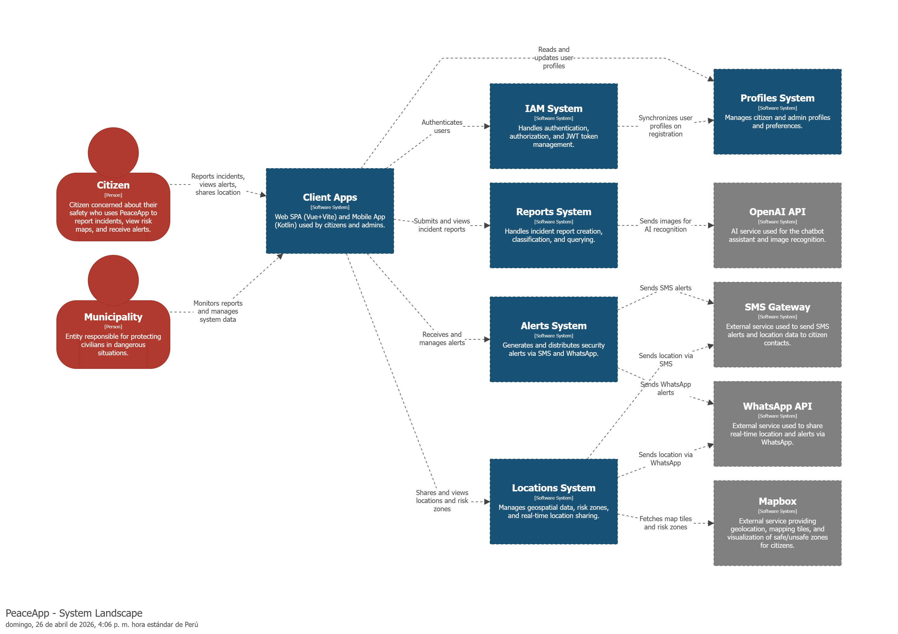

### 4.3.2. Software Architecture Context Level Diagrams

PeaceApp se organiza en seis sistemas internos —Client Apps, IAM, Profiles, Reports, Alerts y Locations— que interactúan entre sí y con dos actores: el Citizen, que reporta incidentes y comparte su ubicación, y el Municipality, que monitorea y gestiona el sistema. Externamente, integra Mapbox para mapas, SMS Gateway y WhatsApp API para envío de alertas y ubicaciones, y OpenAI API para el chatbot y reconocimiento de imágenes.

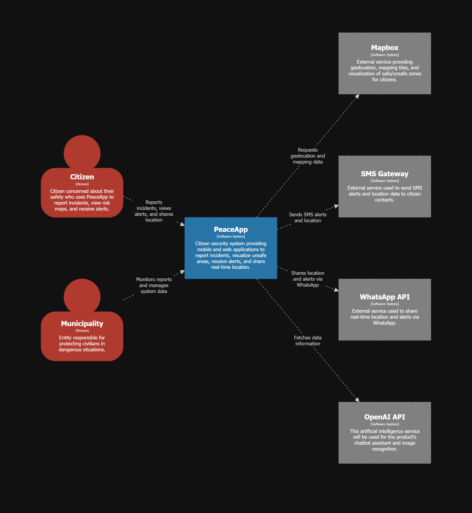

### 4.3.3. Software Architecture Container Level Diagrams

El diagrama de contenedores de PeaceApp ilustra cómo los usuarios del sistema, representados por los roles de Ciudadano y Administrador, interactúan con las diferentes interfaces y componentes de la solución. Los ciudadanos acceden a la Landing Page para obtener información general sobre la aplicación y utilizan tanto la Aplicación Web como la Aplicación Móvil y la Single Page Application (SPA) para gestionar reportes, recibir alertas y compartir su ubicación. Estas interfaces se comunican con un API Gateway RESTful, que centraliza las solicitudes y distribuye el tráfico hacia los distintos microservicios. En el backend se encuentran servicios especializados para la gestión de reportes, perfiles de usuario, autenticación, alertas, localización, además de nuevos servicios de inteligencia artificial como el ChatBot Service y el Image Recognizer Service. La información se almacena en una Base de Datos Relacional, mientras que para funciones críticas como la mensajería, geolocalización e inteligencia artificial se integran servicios externos como el SMS Gateway, la API de WhatsApp, un Map System y la OpenAI API.

# API Gateway RESTful
- Es el componente encargado de recibir todas las solicitudes provenientes de las aplicaciones cliente (Web, Móvil y SPA) y redirigirlas a los distintos microservicios. Implementado sobre JSON/HTTPS, el gateway administra rutas, seguridad y balance de peticiones, garantizando una capa de control centralizado.

# Bounded Contexts (Microservicios)

## Authentication Service
- Gestiona el inicio de sesión, registro de usuarios y autenticación mediante validación de credenciales.

## Profiles Service
- Maneja los datos personales y las preferencias de los usuarios, permitiendo consultar y actualizar información de perfil.

## Reports Service
- Administra la creación, edición, visualización y eliminación de reportes de incidentes, además de exponerlos en el mapa.

## Alerts Service
- Genera y distribuye notificaciones a los usuarios cuando se encuentran en zonas cercanas a reportes activos.

## Location Service
- Gestiona el registro y consulta de coordenadas de ubicación, permitiendo el envío de la ubicación en tiempo real y la integración con mapas.

## ChatBot Service
- Permite la interacción conversacional con los usuarios dentro de la aplicación, brindando asistencia, resolviendo dudas y guiando en el uso de funcionalidades mediante inteligencia artificial.

## Image Recognizer Service
- Procesa y analiza imágenes enviadas por los usuarios en los reportes, permitiendo identificar elementos relevantes (como incidentes, objetos o situaciones de riesgo) mediante técnicas de reconocimiento de imágenes.

Cada uno de estos microservicios expone su propia API y se comunica directamente con la base de datos relacional para almacenar y consultar información.

# Servicios Externos

## SMS Gateway
- Servicio externo para enviar mensajes de texto con alertas y notificaciones a los contactos registrados.

## WhatsApp API
- Servicio externo utilizado para compartir la ubicación en tiempo real mediante la plataforma de mensajería WhatsApp.

## Map System
- Proveedor externo de información geográfica que permite mostrar mapas, ubicar incidentes y destacar zonas críticas en la aplicación.

## OpenAI API
- Servicio externo utilizado por el ChatBot Service y el Image Recognizer Service para implementar capacidades de inteligencia artificial, como procesamiento de lenguaje natural y reconocimiento de imágenes.

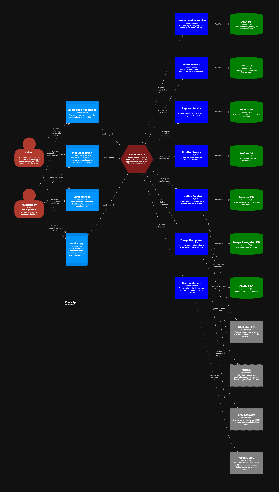

### 4.3.4. Software Architecture System Deployment Diagram

PeaceApp se despliega íntegramente en AWS. Los usuarios acceden desde dispositivos Android (app en Kotlin) o navegadores web (SPA en Vue+Vite). El Landing Page se sirve vía CloudFront + S3, los seis microservicios corren en pods Docker dentro de un clúster EKS (Kubernetes), y cada uno tiene su propia instancia MySQL en Amazon RDS para garantizar aislamiento de datos por bounded context.

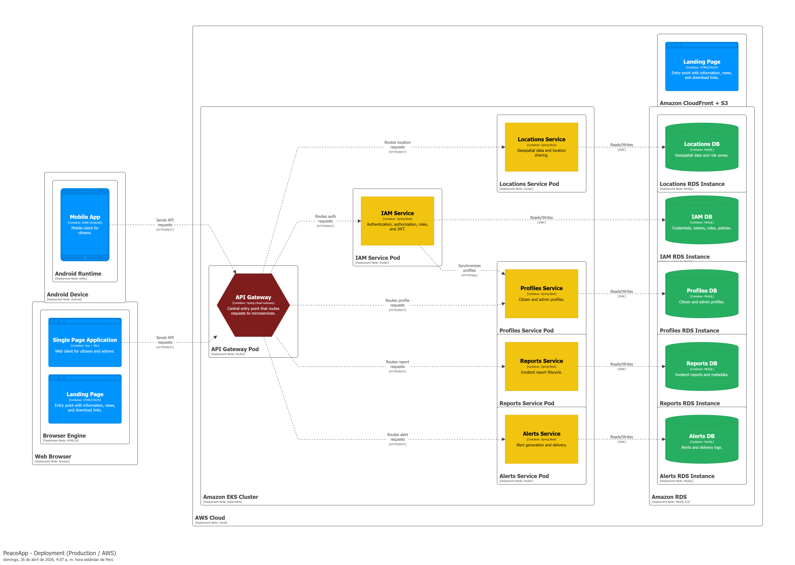
